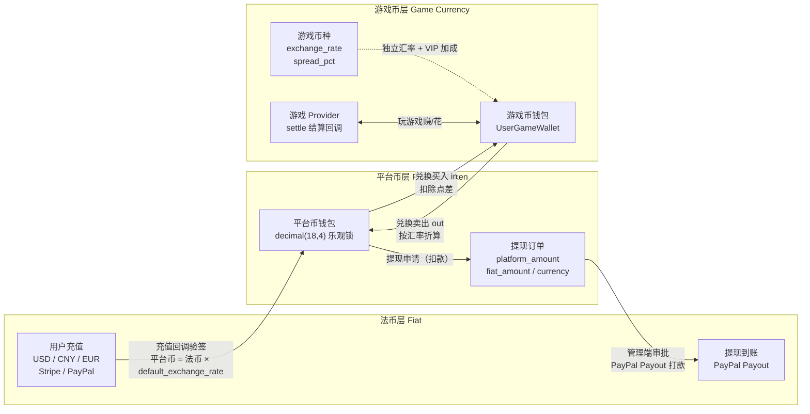
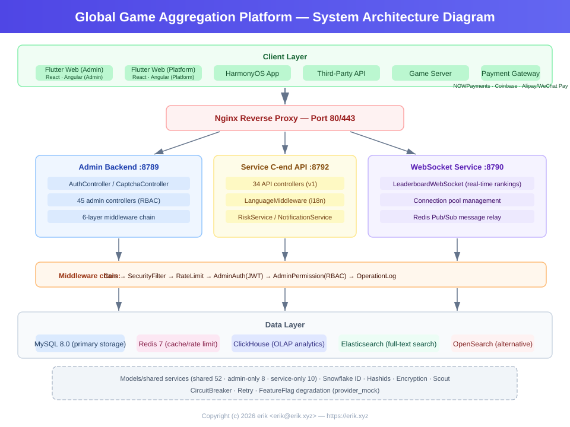
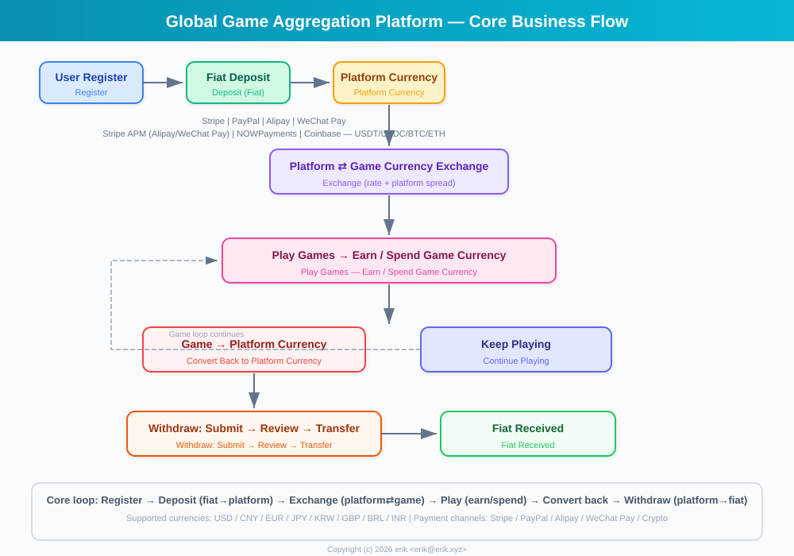
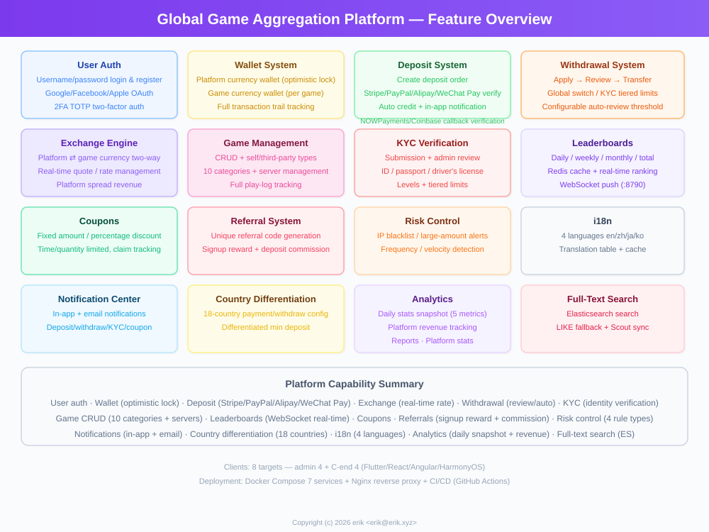
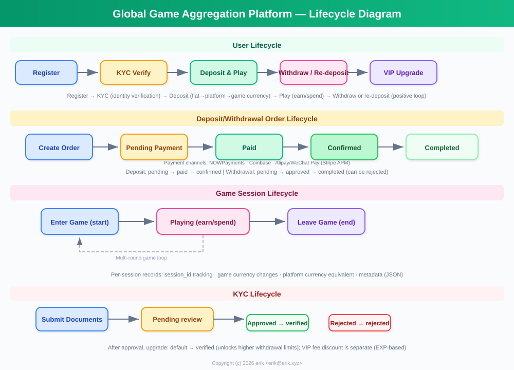
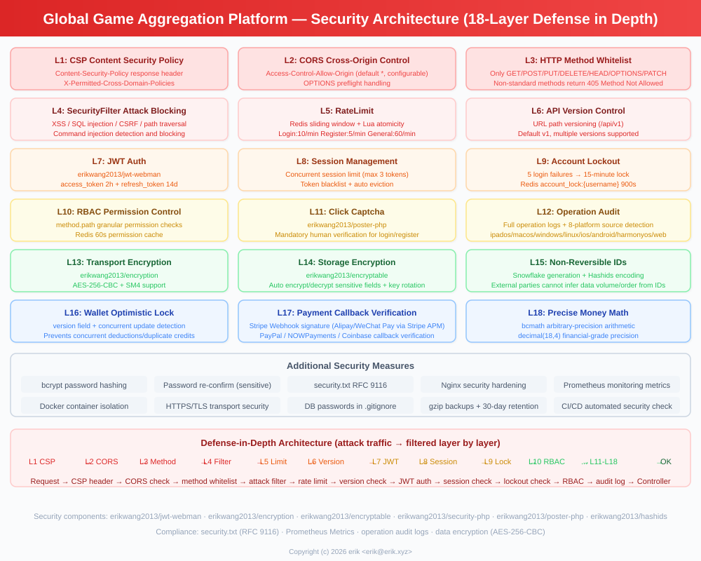
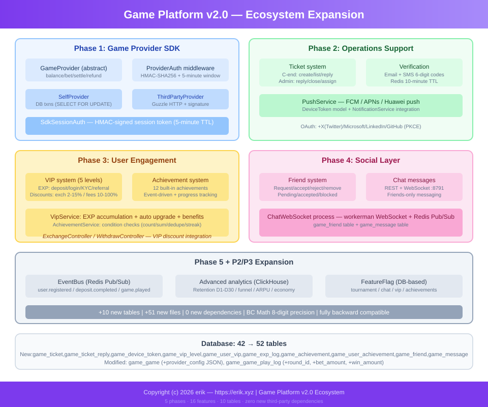
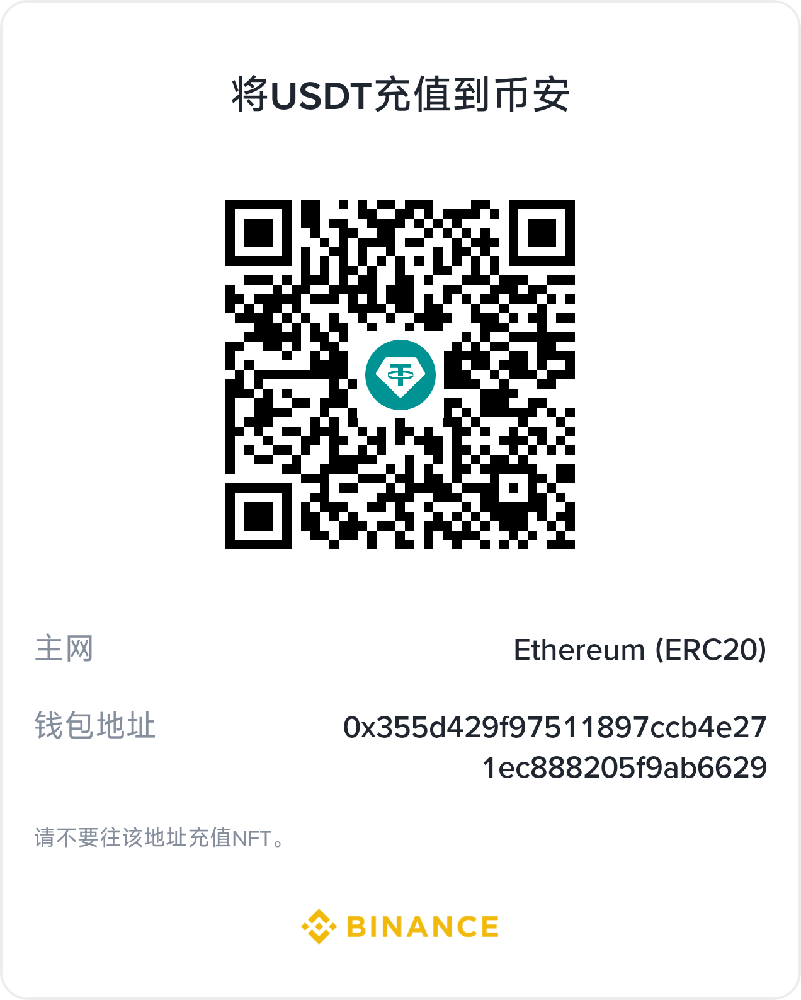
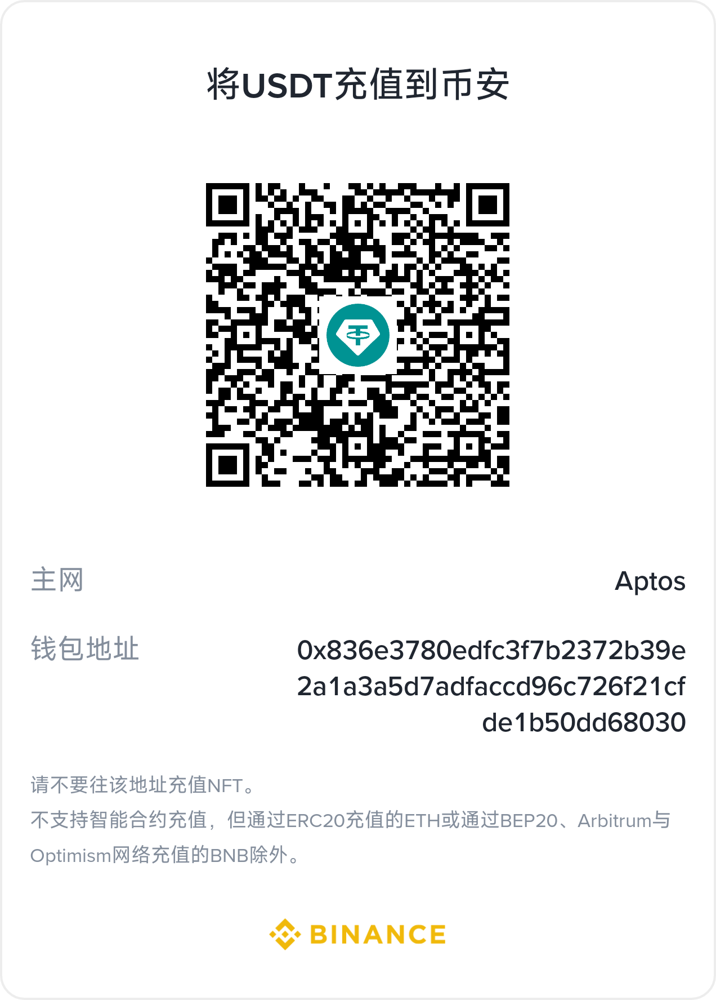

# Global Game Platform

## Project Mascot


**Dicey** — Platform mascot. The die represents games and probability-based gameplay, the coin represents the platform economy and multi-payment gateways, and the purple palette echoes the admin branding. SVG source: `docs/mascot.svg`, infinitely scalable for docs, logos and merchandise.
<!-- lang-nav -->

Languages: [中文](../../README.md) · **English** · [한국어](README.ko.md) · [Русский](README.ru.md) · [Deutsch](README.de.md) · [Français](README.fr.md) · [Español](README.es.md) · [Português](README.pt.md) · [हिन्दी](README.hi.md) · [العربية](README.ar.md) · [বাংলা](README.bn.md) · [Bahasa Indonesia](README.id.md) · [日本語](README.ja.md)

> Copyright (c) 2026 erik <erik@erik.xyz> — https://erik.xyz

A global, internationalized game aggregation platform. After registering, users deposit to exchange for platform coins, play games with platform coins to earn more game coins, and can convert game coins back to their wallet for withdrawal. The admin backend provides complete game management, withdrawal review, user management, and payment management. Supports multi-language switching (English/Chinese).

## Version Strategy

| Version | Goal | Status |
|------|------|------|
| Full Version | Complete edition: leaderboards, coupons, game categories, country config, ES search | Completed |
| Ecosystem Expansion | v2.0: game Provider integration, tickets, VIP, achievements, social, event bus | Completed |

## Tech Stack

### Backend
- PHP 8.3+, webman v2 (workerman/webman)
- MySQL 8.0+ (table prefix `game_`, BIGINT non-auto-increment primary keys)
- Redis (Session / Cache / Rate limiting)
- ClickHouse (OLAP analytics / probability calculations)
- Elasticsearch (full-text search)
- JWT authentication + RBAC permission control
- Data encryption: AES-256-CBC at the API transport layer + AES-128-ECB at the database storage layer

### Frontend
- Flutter 3.x (Web PC style)
- HarmonyOS ArkTS (mobile)
- Responsive layout (Phone / Tablet / Desktop)
- Internationalization (i18n): English / Simplified Chinese switching

### Core Components
- `erikwang2013/snowflake-php` — global unique BIGINT ID generation
- `erikwang2013/hashids` — API-layer ID encryption/decryption
- `erikwang2013/jwt-webman` — JWT authentication
- `erikwang2013/encryption` — API sensitive data encryption/decryption
- `erikwang2013/encryptable` — database sensitive field encryption/decryption
- `erikwang2013/webman-scout` — Elasticsearch sync and query
- `erikwang2013/season` — country flags
- `erikwang2013/security-php` — security tool detection
- `erikwang2013/poster-php` — random verification for sensitive operations
- `erikwang2013/clickhouse-php` — ClickHouse connection and probability calculation

## Project Structure

```
game-platform-php/
├── admin/                     # Admin backend (webman v2, port 8787)
│   ├── app/admin/controller/  #   Admin controllers
│   ├── app/middleware/        #   Middleware (Cors/Security/RateLimit/Auth/ProviderAuth)
│   ├── app/provider/          #   Game Provider layer
│   ├── app/event/             #   Event bus (EventBus Redis Pub/Sub) (Cors/Security/RateLimit/Auth/Permission/ProviderAuth)
│   ├── app/provider/          #   Game Provider layer (Self/ThirdParty/Factory)
│   ├── app/middleware/        #   Middleware (Cors/Security/RateLimit/Auth/ProviderAuth)
│   ├── app/provider/          #   Game Provider layer
│   ├── app/event/             #   Event bus (EventBus Redis Pub/Sub) (Cors/Security/RateLimit/Auth/Permission)
│   ├── config/                #   Config files
│   ├── install/   #   SQL migration files
│   └── apps/flutter/          #   Flutter Web PC admin backend
│
├── service/                   # C-end business service (webman v2, port 8788)
│   ├── app/api/v1/controller/ #   C-end API controllers
│   ├── app/middleware/        #   Middleware (Cors/Security/RateLimit/Auth/ProviderAuth)
│   ├── app/provider/          #   Game Provider layer
│   ├── app/event/             #   Event bus (EventBus Redis Pub/Sub)
│   └── config/                #   Config files
│
├── install/                   # One-click install wizard
│   ├── index.php              #   Installation entry
│   ├── Installer.php          #   Installation core logic
│   ├── install.sql            #   Merged install SQL (43 tables + seed data)
│   └── assets/                #   Static assets
│
├── admin/common/ 与 service/common/   # Shared services duplicated in each (DepositLogService etc., pending extraction into a shared layer)
│   └── service/               #   Shared services (incl. ClickHouse probability calculation)
│
├── apps/
│   └── flutter/platform/      # Flutter Web PC C-end user platform
│
├── docs/                      # Project documentation
│   ├── ARCHITECTURE.md        #   Architecture doc
│   ├── ARCHITECTURE-DESIGN.md #   Architecture design doc
│   ├── FEATURES.md            #   Features doc
│   ├── FEATURE-DESIGN.md      #   Feature design doc
│   └── API.md                 #   API doc
│
└── admin/docs/superpowers/    # Development standards and plans
    ├── specs/                 #   Design specs
    └── plans/                 #   Implementation plans
```

## Quick Start

### Environment Requirements
- PHP 8.1+
- MySQL 8.0+
- Redis 6.0+
- Composer 2.x
- Flutter SDK 3.x (frontend, optional)

### Option 1: One-Click Install Wizard (Recommended)

```bash
# 1. Start the install wizard
php -S 0.0.0.0:8888 -t install/

# 2. Open http://localhost:8888 in the browser
#    Follow the wizard: environment check → database config → admin account setup → auto install

# 3. Install dependencies
cd admin && composer install && cd ..
cd service && composer install && cd ..

# 4. Start the services
cd admin && php start.php start -d && cd ..
cd service && php start.php start -d && cd ..

# 5. Access the admin backend: http://localhost:8787
#    Log in with the admin account and password set during installation

# 6. Delete the install directory after installation (security)
rm -rf install/
```

The install wizard automatically:
- Checks the environment (PHP version, extensions, directory permissions)
- Creates the database and tables (merged SQL, 43 tables + seed data)
- Creates the super admin account (bcrypt encrypted)
- Auto-generates JWT/encryption keys and writes them to the .env file
- Generates install.lock to prevent re-installation

### Option 2: Manual Installation

<details>
<summary>Expand manual installation steps</summary>

#### 1. Database initialization

```bash
# Import the merged SQL in one go
mysql -u root -e "CREATE DATABASE IF NOT EXISTS game-platform CHARACTER SET utf8mb4 COLLATE utf8mb4_unicode_ci;"
mysql -u root game-platform < install/install.sql
```

#### 2. Configure environment variables

```bash
# Admin backend
cd admin
cp .env.example .env
# Edit the database connection info and keys in .env

# C-end business service
cd ../service
cp .env.example .env
# Edit the database connection info and keys in .env
```

#### 3. Start the backend

```bash
cd admin && composer install && php start.php start -d
cd ../service && composer install && php start.php start -d
```

#### 4. Create the admin

You need to manually insert the admin account into the database (password bcrypt-encrypted).

</details>

### Frontend Startup (Optional)

```bash
# Admin backend (Flutter Web PC)
cd admin/apps/flutter
flutter pub get
flutter run -d chrome

# C-end user platform (Flutter Web PC)
cd apps/flutter/platform
flutter pub get
flutter run -d chrome
```

### Verification

```bash
# Test the admin backend
curl http://localhost:8787/health

# Test the C-end business service
curl http://localhost:8788/health

# Test user registration
curl -X POST http://localhost:8788/api/auth/register \
  -H "Content-Type: application/json" \
  -d '{"username":"testuser","password":"123456"}'
```

## Security Features

- **18-layer defense in depth**: XSS/SQL injection/CSRF/path traversal/command injection detection and blocking
- **HTTP method whitelist**: only GET/POST/PUT/DELETE/OPTIONS/HEAD allowed
- **JWT authentication**: access_token 2h + refresh_token 14d, concurrent session limit
- **JWT key startup validation**: admin uses `ADMIN_JWT_SECRET_KEY`, service uses `SERVICE_JWT_SECRET_KEY` as independent keys; missing or still-default keys cause the service to refuse startup
- **Payment callback fail-closed**: provider whitelist (stripe/paypal only) + missing keys/verification failure/timestamp over-limit all rejected + bccomp amount check + transactional callback crediting
- **RBAC permissions**: method.path granularity permission control, Redis 60s cache
- **Click captcha**: mandatory human verification for login/registration
- **Password re-confirmation**: sensitive operations require password confirmation
- **Data encryption**: AES-256-CBC at transport layer + AES-128-ECB at storage layer
- **ID encryption**: Snowflake generation + Hashids encoding, not reversible externally
- **Wallet optimistic lock**: prevents concurrent deductions/duplicate credits
- **Operation audit**: full operation logs, automatic detection of 8 platform sources
- **Rate limiting**: Redis sliding window, Lua atomic
- **CSP header**: Content-Security-Policy against XSS
- **Account security**: 5 consecutive failed logins lock the account for 15 minutes

## Testing

```bash
cd admin
phpunit --bootstrap tests/bootstrap.php tests/
```

- PHPUnit 12.x, 116 test cases
- 56 business logic tests (PlatformTest) + 60 infrastructure tests
- Coverage: bcmath precision, exchange calculations, withdrawal fees, limits, risk control, coupons, KYC, i18n

## Platform Capability Overview

| Capability | Description |
|------|------|
| User authentication | Username/password + 7-platform OAuth (Google/Facebook/Apple/X(Twitter)/Microsoft/LinkedIn/GitHub) + 2FA TOTP |
| Wallet | Platform coin wallet (optimistic lock) + game coin wallet + transaction records |
| Deposit | Create order + Stripe/PayPal callback verification + automatic crediting |
| Exchange | Platform coins ⇄ game coins, real-time quotes, spread profit |
| Withdrawal | Apply → review → payout, global switch, KYC tiered limits + fees |
| KYC | Real-name verification submission + review, three-tier verification system |
| Games | CRUD + categories (10) + servers/regions + game record tracking |
| Search | Elasticsearch full-text search (with LIKE fallback) |
| Leaderboards | Daily/weekly/monthly/all-time, Redis cache, WebSocket real-time push (8789) |
| Coupons | Fixed amount + percentage discount, time/quantity limited, claim and usage tracking |
| Notifications | In-app messages + email, automatic notifications for deposits/withdrawals/KYC/coupons |
| Referrals | Referral codes, signup rewards, deposit commissions |
| Risk control | IP blacklist / large-amount alerts / frequency / speed detection |
| Internationalization | 4 languages (en-US/zh-CN/ja-JP/ko-KR), translation tables + cache |
| Country config | 8 countries with differentiated payment/withdrawal methods, minimum deposit amounts |
| Statistics | Daily statistics snapshots (5 metric types) + platform revenue tracking |
| Captcha | Click-based human verification (poster-php) |
| Game integration | Provider SDK (Self+ThirdParty) + HMAC-SHA256 signing + callback gateway |
| Tickets | C-end create/reply + admin handle/assign/close |
| VIP | 5 loyalty levels, XP accumulation, exchange discounts/withdrawal fee waivers/exchange rate bonuses |
| Achievements | 12 built-in achievements, event-driven detection, progress tracking |
| Social | Friend system + WebSocket real-time private messaging (port 8791), friends-only messaging |
| Tournaments | Championship system (FeatureFlag switch) + leaderboards + participant caps |
| Rebates | Two-tier referral profit sharing (configurable commission rates) |
| Coupons | Conditional restrictions (min_deposit/first_user/game_id) |
| Events | Redis Pub/Sub event bus + Webhook subscription delivery (7 event types) |
| Deployment | Docker Compose 8-service orchestration + Nginx reverse proxy |
| Clients | Flutter Admin (15 pages) + Platform (10 pages) + HarmonyOS (5 pages) |

## Business Model

```
Fiat currency (USD/CNY/EUR...)
  │  Deposit (Stripe/PayPal/Alipay/WeChat Pay)
  ▼
Platform coins (unified, precision decimal(18,4))
  │  Exchange (incl. exchange rate + platform spread)
  ▼
Game coins (per-game independent, independent exchange rates)
  │  Earn/spend by playing games
  ▼
Platform coins ← convert back → Withdraw (review/automatic)
```

## Multi-Currency Settlement

The platform uses a "fiat → platform coin → game coin" three-tier currency-isolated settlement system: supports multi-fiat deposits in USD/CNY/EUR, and each game has its own pricing currency; all amount calculations use bcmath high-precision arithmetic to eliminate floating-point errors.

### Three-Tier Currency Model

| Tier | Currency | Description |
|------|------|------|
| Fiat tier | USD / CNY / EUR | The actual payment currency for user deposits/withdrawals, handled by Stripe / PayPal |
| Platform coin tier | Platform coin (unified across the platform) | Internal unified settlement currency (decimal(18,4)), wallet optimistic lock against concurrent deductions/duplicate credits |
| Game coin tier | Per-game independent currency | Each game has its own `exchange_rate` and `spread_pct`, with an independent game coin wallet |

### Settlement Paths

- **Deposit settlement**: user pays in fiat (Stripe / PayPal callback verification, idempotent anti-duplicate) → converted to platform coins at `default_exchange_rate`, the deposit order records `amount + currency + platform_amount` at the same time
- **Exchange settlement**: platform coins ⇄ game coins quoted in real time at the game's exchange rate (quote), `spread_pct` deducted as platform spread profit, VIP gets exchange discounts and exchange rate bonuses
- **Game settlement**: game Provider increases/decreases user game coins via `/api/provider/settle` callback (HMAC-SHA256 signed), game sessions auto-settle on timeout
- **Withdrawal settlement**: platform coins deducted → withdrawal order created (recording `platform_amount / fiat_amount / currency`) → admin approval → PayPal Payout → batch status synced to completed

### Settlement Flow Diagram



## Architecture Diagram



## Core Business Flow



## Feature Overview



## Lifecycle



## Security Architecture



## Ecosystem Expansion (v2.0)



## Documentation Index

| Document | Description |
|------|------|
| [Version comparison](../VERSIONS.en.md) | Basic/Standard/Full version feature comparison |
| [Architecture design doc](../ARCHITECTURE-DESIGN.en.md) | Architecture selection rationale and design decisions |
| [Architecture doc](../ARCHITECTURE.en.md) | System topology, module architecture, data flows |
| [Feature design doc](../FEATURE-DESIGN.en.md) | Business models, feature specs, flow design |
| [Features doc](../FEATURES.en.md) | Feature list, module descriptions, user journeys |
| [API doc](../API.en.md) | Complete API reference (102 endpoints) |
| [Online docs](http://localhost:8788/apidoc/) | hg/apidoc interactive docs (C-end) |
| [Online docs](http://localhost:8787/apidoc/) | hg/apidoc interactive docs (admin backend) |
| [ClickHouse installation](../CLICKHOUSE_INSTALL.en.md) | ClickHouse install/config/migration/verification |
| [Provider SDK integration doc](../PROVIDER-SDK.en.md) | Third-party game integration guide (signing algorithm + PHP/Go/Python examples) |
| [ClickHouse usage](../CLICKHOUSE_USAGE.en.md) | The 4 ClickHouse service APIs and admin dashboards |
| [Deployment doc](../DEPLOYMENT.en.md) | Deployment guide (Docker + manual + Nginx + monitoring) |
| [Design spec](../../admin/docs/superpowers/specs/2026-05-22-game-platform-design.en.md) | Complete design spec |
| [Implementation plan](../../admin/docs/superpowers/plans/2026-05-22-game-platform-plan.en.md) | Detailed implementation plan |

---

## Support the Project

If this project helps you, feel free to buy the author a coffee ☕

<p align="center">
  <table align="center" border="0" cellspacing="0" cellpadding="0">
    <tr>
      <td align="center" width="200">
        <br>
        <b>WeChat Pay</b>
      </td>
      <td align="center" width="200">
        <br>
        <b>Alipay</b>
      </td>
    </tr>
  </table>
</p>

### Global Bank Transfer

**Recipient**

| Item | Content |
|----|------|
| Beneficiary Name | WANG KEXUN |
| Account Number | 881015918251 |

**Beneficiary Bank**

| Item | Content |
|----|------|
| SWIFT Code | AABLHKHHXXX |
| Bank Name | ZA Bank Limited |
| Bank Code | 387 |
| Bank Address | Core F, Cyberport 3, 100 Cyberport Road, Hong Kong |

**Correspondent Bank (if required)**

> Please note, this is the correspondent (intermediary) bank information, not the beneficiary bank information. Please ask your remitting bank whether correspondent bank details are required.

- **Citibank is the correspondent bank for HKD, CNY and USD remittances:**
  - Bank Name: Citibank N.A. Hong Kong
  - SWIFT Code: CITIHKHXXXX
  - Bank Code: 006
  - Branch Name: Hong Kong Branch
  - Branch Code: 391
  - Bank Address: Citibank Tower, Citibank Plaza, 3 Garden Road, Central, Hong Kong
- **BNY Mellon is the correspondent bank for other currencies:**
  - Bank Name: THE BANK OF NEW YORK MELLON
  - SWIFT Code: IRVTUS3NXXX
  - Bank Address: THE BANK OF NEW YORK MELLON, 240 GREENWICH STREET, NEW YORK, United States

### Crypto Donation

If this project helps you, scan the QR code to donate, thank you!

| Network | QR Code | Wallet Address |
|---|---|---|
| BNB Smart Chain (BEP20) | [](../coin/1.jpg) | `0x355d429f97511897ccb4e271ec888205f9ab6629` |
| Tron (TRC20) | [](../coin/2.jpg) | `TEdDHWLajt1XvqtPDWmQctdrJaC3pzZZzz` |
| Ethereum (ERC20) | [](../coin/3.jpg) | `0x355d429f97511897ccb4e271ec888205f9ab6629` |
| Aptos | [](../coin/4.jpg) | `0x836e3780edfc3f7b2372b39e2a1a3a5d7adfaccd96c726f21cfde1b50dd68030` |
| Plasma | [](../coin/5.jpg) | `0x355d429f97511897ccb4e271ec888205f9ab6629` |
| Polygon POS | [](../coin/6.jpg) | `0x355d429f97511897ccb4e271ec888205f9ab6629` |
| Solana | [](../coin/7.jpg) | `2hfhboHdmdrYsY25XfQSsEWxq5ip4EQsR7f4AzSRMUyr` |
| The Open Network (TON) | [](../coin/8.jpg) | `UQB9kFQohzmXUir9QSSZq01iwl9aQZIDdBpNmDklljRtCoGK` |
| Arbitrum One | [](../coin/9.jpg) | `0x355d429f97511897ccb4e271ec888205f9ab6629` |
| AVAX C-Chain | [](../coin/10.jpg) | `0x355d429f97511897ccb4e271ec888205f9ab6629` |

