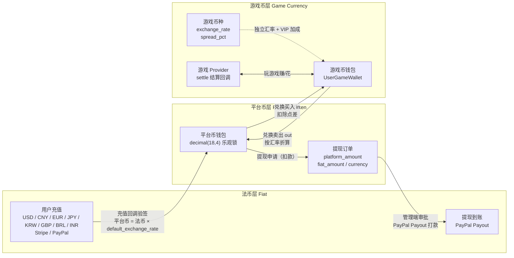

# Global Game Platform

## Project Mascot


**Dicey** — Platform mascot. The die represents games and probability-based gameplay, the coin represents the platform economy and multi-payment gateways, and the purple palette echoes the admin branding. SVG source: `docs/mascot.svg`, infinitely scalable for docs, logos and merchandise.
<!-- lang-nav -->

Languages: [中文](../../README.md) · **English** · [한국어](README.ko.md) · [Русский](README.ru.md) · [Deutsch](README.de.md) · [Français](README.fr.md) · [Español](README.es.md) · [Português](README.pt.md) · [हिन्दी](README.hi.md) · [العربية](README.ar.md) · [বাংলা](README.bn.md) · [Bahasa Indonesia](README.id.md) · [日本語](README.ja.md)

> Copyright (c) 2026 erik <erik@erik.xyz> — https://erik.xyz

A global, internationalized game aggregation platform. After registering, users deposit to exchange for platform coins, play games with platform coins to earn more game coins, and can convert game coins back to their wallet for withdrawal. The admin backend provides complete game management, withdrawal review, user management, and payment management. Supports multi-language switching (English/Chinese).

## Version Strategy

| Version | Goal | Status |
|------|------|------|
| Full Version | Complete edition: leaderboards, coupons, game categories, country config, ES search | Completed |
| Ecosystem Expansion | v2.0: game Provider integration, tickets, VIP, achievements, social, event bus | Completed |
| v1.3.15-22 (8 releases) | Reconciliation/settlement, risk-control depth, unified wallet, activity engine, anti-cheat, social growth, Adyen/GrabPay | Completed |

## Tech Stack

### Backend
- PHP 8.3+, webman v2 (workerman/webman)
- MySQL 8.0+ (table prefix `game_`, BIGINT non-auto-increment primary keys)
- Redis (Session / Cache / Rate limiting)
- ClickHouse (OLAP analytics / probability calculations)
- Elasticsearch (full-text search)
- JWT authentication + RBAC permission control
- Data encryption: AES-256-CBC at the API transport layer + AES-128-ECB at the database storage layer

### Frontend

There are two separate front-end directory trees, **each calling only its own side's backend**, with no cross-over:

| Directory tree | Role | Request prefix | Backend | Tech stack |
|--------|------|---------|---------|--------|
| `apps/*` | **C-end player platform** | `/api/v1/...` | service (default 8792) | Flutter Web / React 19 (Vite) / Angular 21 / HarmonyOS ArkTS |
| `admin/apps/*` | **Admin console** | `/admin/v1/...` | admin (default 8789) | Flutter Web / React 19 (Vite) / Angular 21 / HarmonyOS ArkTS |

- Responsive layout (Phone / Tablet / Desktop)
- Internationalization (i18n): English / Simplified Chinese switching

### Core Components
- `erikwang2013/snowflake-php` — global unique BIGINT ID generation
- `erikwang2013/hashids` — API-layer ID encryption/decryption
- `erikwang2013/jwt-webman` — JWT authentication
- `erikwang2013/encryption` — API sensitive data encryption/decryption
- `erikwang2013/encryptable` — database sensitive field encryption/decryption
- `erikwang2013/webman-scout` — Elasticsearch sync and query
- `erikwang2013/season` — country flags
- `erikwang2013/security-php` — security tool detection
- `erikwang2013/poster-php` — random verification for sensitive operations
- `erikwang2013/clickhouse-php` — ClickHouse connection and probability calculation

## Project Structure

```
game-platform-php/
├── admin/                     # Admin backend (webman v2, default port 8789, configurable via APP_PORT)
│   ├── app/admin/v1/controller/  #   Admin-side controllers
│   ├── app/middleware/        #   Middleware (Cors/SecurityFilter/RateLimit/AdminAuth/AdminPermission/OperationLog)
│   ├── app/model/             #   Admin-only models (8; the other 52 shared models live in packages/)
│   ├── app/service/           #   Admin-only services (WalletService/WalletScope/RiskSandboxService)
│   ├── app/process/           #   Resident processes (Http/Monitor/RiskIpCron)
│   ├── app/provider/          #   Game Provider layer (Self/ThirdParty/Factory)
│   ├── app/activity/          #   Activity engine (check-in/invite/daily tasks)
│   ├── app/event/             #   Event bus (EventBus Redis Pub/Sub)
│   ├── config/                #   Config files
│   └── apps/                  #   Admin front-ends (4 targets, call /admin/v1 → admin:8789)
│       ├── flutter/           #     Flutter Web PC admin backend
│       ├── react/             #     React 19 (Vite) admin console
│       ├── angular/           #     Angular 21 admin console
│       └── harmonyos/         #     HarmonyOS ArkTS admin console (.hap, bypasses nginx)
│
├── service/                   # C-end business service (webman v2, default port 8792, configurable via APP_PORT)
│   ├── app/api/v1/controller/ #   C-end API controllers
│   ├── app/middleware/        #   Middleware (TraceId/Cors/SecurityFilter/RateLimit/LanguageMiddleware/UserAuth/ProviderAuth/SdkSessionAuth)
│   ├── app/model/             #   Service-only models (10; the other 52 shared models live in packages/)
│   ├── app/service/           #   Service-only services (wallet/risk/compliance/reconciliation/push/achievements/anti-cheat etc.)
│   ├── app/payment/           #   18 payment gateway adapters (Stripe/PayPal/Adyen/NowPayments/Skrill…) + GatewayFactory
│   ├── app/cdn/               #   Five-vendor CDN adapters (Cloudflare/CloudFront/Alibaba/Tencent/Huawei) + CdnFactory
│   ├── app/process/           #   Resident processes (Http/Monitor/LeaderboardWS:8790/ChatWS:8791/EventConsumer/EventSubscriber/AntiCheatWorker/GroupSweepWorker/Health)
│   ├── app/provider/          #   Game Provider layer
│   ├── app/activity/          #   Activity engine
│   ├── app/event/             #   Event bus (EventBus Redis Pub/Sub)
│   └── config/                #   Config files
│
├── packages/platform-common/  # Shared layer: admin and service pull it in via a composer path repository, avoiding two copies
│   ├── src/model/             #   Shared Eloquent models (52, same source for both sides)
│   ├── src/service/           #   Shared services (DepositLogService / VipService etc., 11 in total, incl. ClickHouse probability calculation)
│   ├── src/BcMath.php         #   High-precision money/ratio arithmetic (bcmath wrapper), rounding, percentages
│   ├── src/EncryptionService.php  #   AES encryption/decryption and masking
│   ├── src/CircuitBreaker.php #   Circuit breaker (plus Retry.php for retries)
│   ├── src/HashidsService.php #   API-layer ID encode/decode
│   └── src/SnowflakeService.php   #   Globally unique BIGINT IDs
│
├── apps/                      # C-end player front-ends (4 targets, call /api/v1 → service:8792)
│   ├── flutter/platform/      #   Flutter Web PC C-end user platform
│   ├── react/                 #   React 19 (Vite) C-end
│   ├── angular/               #   Angular 21 C-end
│   └── harmonyos/             #   HarmonyOS ArkTS C-end (.hap, bypasses nginx)
│
├── game/xiaoxiaole/           # Built-in mini-game “Pastoral Match-3”: TypeScript + Vite + Vitest, src/domain game engine + four-level design + tests/, design docs in 13 languages
│
├── install/                   # One-click install wizard + database initialization SQL
│   ├── index.php              #   Installation entry
│   ├── Installer.php          #   Installation core logic
│   ├── install.sql            #   Merged install SQL (78 tables + seed data)
│   ├── clickhouse.sql         #   ClickHouse analytics DDL (separate engine, imported on its own)
│   ├── test-data.sql          #   Demo/test data
│   ├── migrations/            #   Incremental upgrade scripts for existing databases (*.sql)
│   ├── lang/ + lang.php       #   Install wizard UI translations (13 languages)
│   └── assets/                #   Static assets
│
├── docs/                      # Project documentation (all documents are in 13 languages: .md is the Chinese source, with .{lang}.md translations alongside)
│   ├── ARCHITECTURE.md        #   Architecture doc
│   ├── ARCHITECTURE-DESIGN.md #   Architecture design doc
│   ├── FEATURES.md            #   Features doc
│   ├── FEATURE-DESIGN.md      #   Feature design doc
│   ├── API.md                 #   API doc
│   ├── DEPLOYMENT.md          #   Deployment doc (Docker/manual/port config)
│   ├── PROVIDER-SDK.md        #   Third-party game integration guide (signature algorithm + PHP/Go/Python examples)
│   ├── CLICKHOUSE_INSTALL.md  #   ClickHouse install/config/migrate/verify
│   ├── CLICKHOUSE_USAGE.md    #   The 4 ClickHouse service APIs and the admin dashboard
│   ├── translations/          #   The 12 language translations of this README
│   ├── diagrams/              #   Architecture/flow/feature/lifecycle/security/ecosystem-expansion SVGs (13 languages each)
│   ├── test-reports/          #   Test reports (php-unit / api / resilience / ui / SUMMARY)
│   └── superpowers/           #   Design specs and implementation plans for this repo (historical record)
│
├── scripts/                   # Ops scripts (model drift check / apidoc annotation migration / exchange payout semantics migration / signature verification)
├── tests/api/                 # Automated API tests (run_all.sh)
├── runtime/                   # webman runtime directory (logs/pid, generated at runtime)
│
├── docker-compose.yml         # Docker Compose orchestration (default ports from root .env)
├── nginx.conf.template        # Nginx config template (upstream ports rendered via envsubst)
├── .env.example               # Root .env template (Docker port variables, cp to .env to use)
└── admin/docs/superpowers/    # Development standards and plans
    ├── specs/                 #   Design specs
    └── plans/                 #   Implementation plans
```

## Quick Start

### Environment Requirements
- PHP 8.1+
- MySQL 8.0+
- Redis 6.0+
- Composer 2.x
- Flutter SDK 3.x (frontend, optional)

### Option 1: One-Click Install Wizard (Recommended)

```bash
# 1. Start the install wizard
php -S 0.0.0.0:8888 -t install/

# 2. Open http://localhost:8888 in the browser
#    Follow the wizard: environment check → database config → admin account setup → auto install

# 3. Install dependencies
cd admin && composer install && cd ..
cd service && composer install && cd ..

# 4. Start the services (default ports: admin 8789 / service 8792, change APP_PORT in each .env)
cd admin && php start.php start -d && cd ..
cd service && php start.php start -d && cd ..

# 5. Access the admin backend: http://localhost:8789 (default port)
#    Log in with the admin account and password set during installation

# 6. Delete the install directory after installation (security)
rm -rf install/
```

The install wizard automatically:
- Checks the environment (PHP version, extensions, directory permissions)
- Creates the database and tables (merged SQL, 78 tables + seed data)
- Creates the super admin account (bcrypt encrypted)
- Auto-generates JWT/encryption keys and writes them to the .env file
- Generates install.lock to prevent re-installation

### Option 2: Manual Installation

<details>
<summary>Expand manual installation steps</summary>

#### 1. Database initialization

```bash
# Import the merged SQL in one go
mysql -u root -e "CREATE DATABASE IF NOT EXISTS game-platform CHARACTER SET utf8mb4 COLLATE utf8mb4_unicode_ci;"
mysql -u root game-platform < install/install.sql
```

#### 2. Configure environment variables

```bash
# Admin backend
cd admin
cp .env.example .env
# Edit the database connection info and keys in .env

# C-end business service
cd ../service
cp .env.example .env
# Edit the database connection info and keys in .env
```

#### 3. Start the backend

```bash
cd admin && composer install && php start.php start -d
cd ../service && composer install && php start.php start -d
```

#### 4. Create the admin

You need to manually insert the admin account into the database (password bcrypt-encrypted).

</details>

### Frontend Startup (Optional)

In development each front-end starts its own dev server; requests are proxied by the dev server to the matching backend (see `proxy.conf.json` / `vite.config.ts` in each directory):

```bash
# --- C-end player platform (/api/v1 → service:8792) ---
cd apps/react            && npm install && npm run dev      # http://localhost:5173
cd apps/angular          && npm install && npm start        # http://localhost:4200
cd apps/flutter/platform && flutter pub get && flutter run -d chrome

# --- Admin console (/admin/v1 → admin:8789) ---
cd admin/apps/react      && npm install && npm run dev      # http://localhost:5273
cd admin/apps/angular    && npm install && npm start        # http://localhost:4300
cd admin/apps/flutter    && flutter pub get && flutter run -d chrome
```

> Angular dev server ports: the admin console sets 4300 explicitly in `angular.json`, while the C-end keeps Angular's default 4200; to run both at once, add `--port` to one of them.
> The HarmonyOS targets (`apps/harmonyos`, `admin/apps/harmonyos`) are opened and built with DevEco Studio;
> an emulator reaches the host backend at `http://10.0.2.2:<port>` (see the constant at the top of each `ApiService.ets`).

### Frontend Deployment (Docker/Nginx)

The nginx service in `docker-compose.yml` mounts each frontend's build output read-only into the container, and `nginx.conf.template` serves it at the paths below.
When an artifact has not been built the directory is empty: a path request returns 404, a bare-directory request (e.g. `/app-react/`) returns 403.

| URL | Artifact mount point | Build command |
|-----|-----------|---------|
| `/` | `apps/flutter/platform/build/web` | `flutter build web` |
| `/app-react/` | `apps/react/dist` | `npm run build` (script includes `--base=/app-react/`) |
| `/app-angular/` | `apps/angular/dist/game-client-angular/browser` | `npm run build` (script includes `--base-href=/app-angular/`) |
| `/admin-panel/` | `admin/public` | Generic drop-in slot: copy any console build into `admin/public`; when absent it likewise returns 404 (bare directory 403). Note the build must use `--base=/admin-panel/` (`--base-href=/admin-panel/` for Flutter), otherwise its assets still point at the original prefix and 404. The slashless form 301-redirects here; `nginx.conf.template` sets `absolute_redirect off`, so the redirect is a relative Location and non-80-port deployments no longer lose the port |
| `/admin-react/` | `admin/apps/react/dist` | `npm run build` (script includes `--base=/admin-react/`) |
| `/admin-angular/` | `admin/apps/angular/dist/game-admin-angular/browser` | `npm run build` (script includes `--base-href=/admin-angular/`) |
| `/admin-flutter/` | `admin/apps/flutter/build/web` | `flutter build web --base-href=/admin-flutter/` |

`/admin/` (API) → admin container, `/api/` (API) → service container; the HarmonyOS build ships as a `.hap` package and does not go through nginx.

### Verification

```bash
# Test the admin backend (default port 8789)
curl http://localhost:8789/health

# Test the C-end business service (default port 8792)
curl http://localhost:8792/health

# Test user registration
curl -X POST http://localhost:8792/api/v1/auth/register \
  -H "Content-Type: application/json" \
  -d '{"username":"testuser","password":"Abcdef12"}'
```

## Security Features

- **18-layer defense in depth**: XSS/SQL injection/CSRF/path traversal/command injection detection and blocking
- **HTTP method whitelist**: only GET/POST/PUT/DELETE/OPTIONS/HEAD allowed
- **JWT authentication**: access_token 2h + refresh_token 14d, concurrent session limit
- **JWT key startup validation**: admin uses `ADMIN_JWT_SECRET_KEY`, service uses `SERVICE_JWT_SECRET_KEY` as independent keys; missing or still-default keys cause the service to refuse startup
- **Payment callback fail-closed**: provider whitelist (stripe/paypal only) + missing keys/verification failure/timestamp over-limit all rejected + bccomp amount check + transactional callback crediting
- **RBAC permissions**: method.path granularity permission control, Redis 60s cache
- **Click captcha**: mandatory human verification for login/registration
- **Password re-confirmation**: sensitive operations require password confirmation
- **Data encryption**: AES-256-CBC at transport layer + AES-128-ECB at storage layer
- **ID encryption**: Snowflake generation + Hashids encoding, not reversible externally
- **Wallet optimistic lock**: prevents concurrent deductions/duplicate credits
- **Operation audit**: full operation logs, automatic detection of 8 platform sources
- **Rate limiting**: Redis sliding window, Lua atomic
- **CSP header**: Content-Security-Policy against XSS
- **Account security**: 5 consecutive failed logins lock the account for 15 minutes

## Testing

Test reports (stored locally): [docs/test-reports/](../test-reports/)

| Test type | Cases/coverage | Result |
|---------|----------|------|
| PHP unit tests | measured now with `phpunit --list-tests`: admin 200 + service 273 cases (the report `docs/test-reports/php-unit.md` records the 09-22 rerun admin 190 + service 273 and the 08-27 snapshot admin 153 + service 45; the admin side is still being extended) | service all pass (701 assertions, 3 skipped, 2 warnings + 35 deprecations); admin 437 assertions, 3 skipped, 1 failure (`EnvConfigTest` checks the real `admin/.env` and finds `REDIS_CLUSTER_NODES` missing; adding it turns it green) |
| Stability mechanism tests | circuit breaker/retry/degradation switch, 15 cases (CircuitBreakerTest/RetryTest/ResilienceMockTest) | all pass |
| Automated API tests | 187 endpoints (source: `docs/test-reports/api.md`, 2026-08-27); route.php currently registers 261 endpoints | 171 pass / 50 fail / 4 skipped (every failure is a deterministic defect, see the report) |
| Flutter UI tests | 12 cases (login/dashboard/navigation/language switch) | all pass |
| Go/Rust | no Go/Rust code in the repository | skipped, recorded |

```bash
# PHP unit tests (export the JWT secret environment variables first)
cd admin && ADMIN_JWT_SECRET_KEY=test-jwt-secret-change-me php vendor/bin/phpunit
cd service && SERVICE_JWT_SECRET_KEY=test-jwt-secret-change-me php vendor/bin/phpunit
# Automated API tests (the services must be running, see tests/api/run_all.sh)
bash tests/api/run_all.sh
# Flutter UI tests
cd admin/apps/flutter && flutter test --timeout 300s
```

Detailed reports:
- [PHP unit test report](../test-reports/php-unit.md)
- [Stability mechanism tests report (circuit breaker/retry/degradation)](../test-reports/resilience.md)
- [Automated API tests report](../test-reports/api.md)
- [Flutter UI test report](../test-reports/ui.md)

## Platform Capability Overview

| Capability | Description |
|------|------|
| User authentication | Username/password + 7-platform OAuth (Google/Facebook/Apple/X(Twitter)/Microsoft/LinkedIn/GitHub) + 2FA TOTP |
| Wallet | Platform coin wallet (optimistic lock) + game coin wallet + transaction records |
| Deposit | Create order + Stripe/PayPal callback verification + automatic crediting |
| Exchange | Platform coins ⇄ game coins, real-time quotes, spread profit |
| Withdrawal | Apply → review → payout, global switch, KYC tiered limits + fees |
| KYC | Real-name verification submission + review, raises withdrawal limits once approved |
| Games | CRUD + categories (10) + servers/regions + game record tracking |
| Search | Elasticsearch full-text search (with LIKE fallback) |
| Leaderboards | Daily/weekly/monthly/all-time, Redis cache, WebSocket real-time push (default port 8790, configurable via LEADERBOARD_WS_PORT) |
| CDN | Five-provider integration (Cloudflare R2 / AWS S3 / Aliyun OSS / Tencent COS / Huawei OBS upload + purge + preload) + admin config/toggle/connectivity test |
| Coupons | Fixed amount + percentage discount, time/quantity limited, claim and usage tracking |
| Notifications | In-app messages + email, automatic notifications for deposits/withdrawals/KYC/coupons |
| Referrals | Referral codes, signup rewards, deposit commissions |
| Risk control | IP blacklist / large-amount alerts / frequency / speed detection |
| Risk-control depth | Device fingerprint / IP reputation / account-link graph + rule engine + risk dashboard + AML/KYC/trust score |
| Anti-cheat | Anti-cheat event collection + daily stats + manual review |
| Reconciliation/settlement | Daily reconciliation batches + diff details + statement reconciliation |
| Unified wallet | WalletScope unified wallet scoping |
| Activity engine | Activity create/join/rewards + check-in |
| Social growth | Groups + share-link tracking |
| Payment gateways | New Adyen / GrabPay gateways (L1) |
| Internationalization | 4 languages (en-US/zh-CN/ja-JP/ko-KR), translation tables + cache |
| Country config | 18 countries with differentiated payment/withdrawal methods, minimum deposit amounts |
| Statistics | Daily statistics snapshots (5 metric types) + platform revenue tracking |
| Captcha | Click-based human verification (poster-php) |
| Game integration | Provider SDK (Self+ThirdParty) + HMAC-SHA256 signing + callback gateway |
| Tickets | C-end create/reply + admin handle/assign/close |
| VIP | 5 loyalty levels, XP accumulation, exchange discounts/withdrawal fee waivers/exchange rate bonuses |
| Achievements | 12 built-in achievements, event-driven detection, progress tracking |
| Social | Friend system + WebSocket real-time private messaging (default port 8791, configurable via CHAT_WS_PORT), friends-only messaging |
| Tournaments | Championship system (FeatureFlag switch) + leaderboards + participant caps |
| Rebates | Two-tier referral profit sharing (configurable commission rates) |
| Coupons | Conditional restrictions (min_deposit/first_user/game_id) |
| Events | Redis Pub/Sub event bus + Webhook subscription delivery (7 event types) |
| Deployment | Docker Compose 7-service orchestration (ports configured in root .env) + Nginx reverse proxy |
| Clients | Admin 4 targets (Flutter/React/Angular/HarmonyOS) + C-end 4 targets (Flutter/React/Angular/HarmonyOS) |

## Business Model

```
Fiat currency (USD/CNY/EUR...)
  │  Deposit (Stripe/PayPal/Alipay/WeChat Pay)
  ▼
Platform coins (unified, precision decimal(18,4))
  │  Exchange (incl. exchange rate + platform spread)
  ▼
Game coins (per-game independent, independent exchange rates)
  │  Earn/spend by playing games
  ▼
Platform coins ← convert back → Withdraw (review/automatic)
```

## Multi-Currency Settlement

The platform uses a "fiat → platform coin → game coin" three-tier currency-isolated settlement system: supports multi-fiat deposits in USD/CNY/EUR/JPY/KRW/GBP/BRL/INR, and each game has its own pricing currency; all amount calculations use bcmath high-precision arithmetic to eliminate floating-point errors.

### Three-Tier Currency Model

| Tier | Currency | Description |
|------|------|------|
| Fiat tier | USD / CNY / EUR / JPY / KRW / GBP / BRL / INR | The actual payment currency for user deposits/withdrawals, handled by Stripe / PayPal |
| Platform coin tier | Platform coin (unified across the platform) | Internal unified settlement currency (decimal(18,4)), wallet optimistic lock against concurrent deductions/duplicate credits |
| Game coin tier | Per-game independent currency | Each game has its own `exchange_rate` and `spread_pct`, with an independent game coin wallet |

### Settlement Paths

- **Deposit settlement**: user pays in fiat (Stripe / PayPal callback verification, idempotent anti-duplicate) → converted to platform coins at `default_exchange_rate`, the deposit order records `amount + currency + platform_amount` at the same time
- **Exchange settlement**: platform coins ⇄ game coins quoted in real time at the game's exchange rate (quote), `spread_pct` deducted as platform spread profit, VIP gets exchange discounts and exchange rate bonuses
- **Game settlement**: game Provider increases/decreases user game coins via `/api/provider/settle` callback (HMAC-SHA256 signed), game sessions auto-settle on timeout
- **Withdrawal settlement**: platform coins deducted → withdrawal order created (recording `platform_amount / fiat_amount / currency`) → admin approval → PayPal Payout → batch status synced to completed

### Settlement Flow Diagram



## Architecture Diagram


## Core Business Flow


## Feature Overview


## Lifecycle


## Security Architecture


## Ecosystem Expansion (v2.0)


## Documentation Index

| Document | Description |
|------|------|
| [Version comparison](../VERSIONS.en.md) | Basic/Standard/Full version feature comparison |
| [Architecture design doc](../ARCHITECTURE-DESIGN.en.md) | Architecture selection rationale and design decisions |
| [Architecture doc](../ARCHITECTURE.en.md) | System topology, module architecture, data flows |
| [Feature design doc](../FEATURE-DESIGN.en.md) | Business models, feature specs, flow design |
| [Features doc](../FEATURES.en.md) | Feature list, module descriptions, user journeys |
| [API doc](../API.en.md) | Complete API reference (146 endpoints) |
| [Online docs](http://localhost:8792/apidoc/) | erikwang2013/apidoc-php interactive docs (C-end) |
| [Online docs](http://localhost:8789/apidoc/) | erikwang2013/apidoc-php interactive docs (admin backend) |
| [ClickHouse installation](../CLICKHOUSE_INSTALL.en.md) | ClickHouse install/config/migration/verification |
| [Provider SDK integration doc](../PROVIDER-SDK.en.md) | Third-party game integration guide (signing algorithm + PHP/Go/Python examples) |
| [ClickHouse usage](../CLICKHOUSE_USAGE.en.md) | The 4 ClickHouse service APIs and admin dashboards |
| [Deployment doc](../DEPLOYMENT.en.md) | Deployment guide (Docker + manual + Nginx + monitoring) |
| [Design spec](../../admin/docs/superpowers/specs/2026-05-22-game-platform-design.en.md) | Complete design spec |
| [Implementation plan](../../admin/docs/superpowers/plans/2026-05-22-game-platform-plan.en.md) | Detailed implementation plan |

---

## Support the Project

If this project helps you, feel free to buy the author a coffee ☕

<p align="center">
  <table align="center" border="0" cellspacing="0" cellpadding="0">
    <tr>
      <td align="center" width="200">
        <br>
        <b>WeChat Pay</b>
      </td>
      <td align="center" width="200">
        <br>
        <b>Alipay</b>
      </td>
    </tr>
  </table>
</p>

### Global Bank Transfer

**Recipient**

| Item | Content |
|----|------|
| Beneficiary Name | WANG KEXUN |
| Account Number | 881015918251 |

**Beneficiary Bank**

| Item | Content |
|----|------|
| SWIFT Code | AABLHKHHXXX |
| Bank Name | ZA Bank Limited |
| Bank Code | 387 |
| Bank Address | Core F, Cyberport 3, 100 Cyberport Road, Hong Kong |

**Correspondent Bank (if required)**

> Please note, this is the correspondent (intermediary) bank information, not the beneficiary bank information. Please ask your remitting bank whether correspondent bank details are required.

- **Citibank is the correspondent bank for HKD, CNY and USD remittances:**
  - Bank Name: Citibank N.A. Hong Kong
  - SWIFT Code: CITIHKHXXXX
  - Bank Code: 006
  - Branch Name: Hong Kong Branch
  - Branch Code: 391
  - Bank Address: Citibank Tower, Citibank Plaza, 3 Garden Road, Central, Hong Kong
- **BNY Mellon is the correspondent bank for other currencies:**
  - Bank Name: THE BANK OF NEW YORK MELLON
  - SWIFT Code: IRVTUS3NXXX
  - Bank Address: THE BANK OF NEW YORK MELLON, 240 GREENWICH STREET, NEW YORK, United States

### Crypto Donation

If this project helps you, scan the QR code to donate, thank you!

| Network | QR Code | Wallet Address |
|---|---|---|
| BNB Smart Chain (BEP20) | [](../coin/1.jpg) | `0x355d429f97511897ccb4e271ec888205f9ab6629` |
| Tron (TRC20) | [](../coin/2.jpg) | `TEdDHWLajt1XvqtPDWmQctdrJaC3pzZZzz` |
| Ethereum (ERC20) | [](../coin/3.jpg) | `0x355d429f97511897ccb4e271ec888205f9ab6629` |
| Aptos | [](../coin/4.jpg) | `0x836e3780edfc3f7b2372b39e2a1a3a5d7adfaccd96c726f21cfde1b50dd68030` |
| Plasma | [](../coin/5.jpg) | `0x355d429f97511897ccb4e271ec888205f9ab6629` |
| Polygon POS | [](../coin/6.jpg) | `0x355d429f97511897ccb4e271ec888205f9ab6629` |
| Solana | [](../coin/7.jpg) | `2hfhboHdmdrYsY25XfQSsEWxq5ip4EQsR7f4AzSRMUyr` |
| The Open Network (TON) | [](../coin/8.jpg) | `UQB9kFQohzmXUir9QSSZq01iwl9aQZIDdBpNmDklljRtCoGK` |
| Arbitrum One | [](../coin/9.jpg) | `0x355d429f97511897ccb4e271ec888205f9ab6629` |
| AVAX C-Chain | [](../coin/10.jpg) | `0x355d429f97511897ccb4e271ec888205f9ab6629` |

