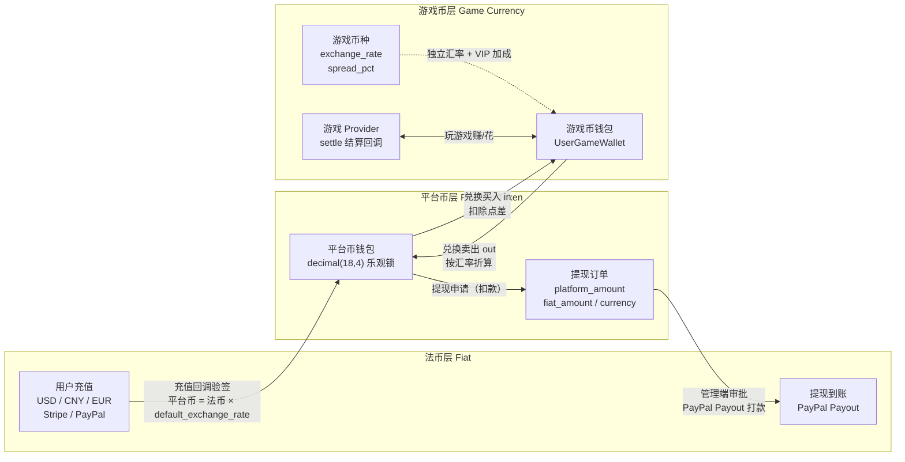
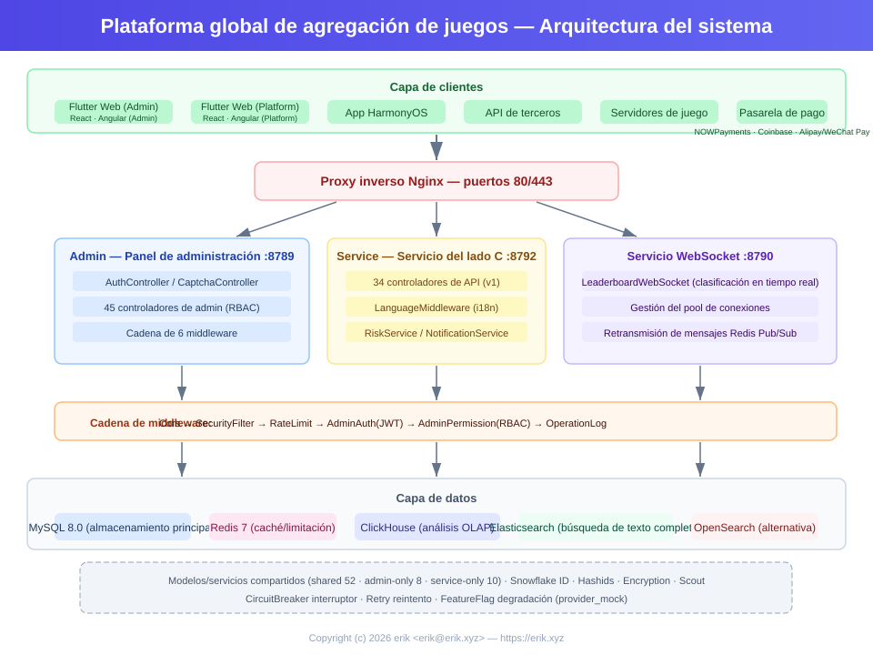
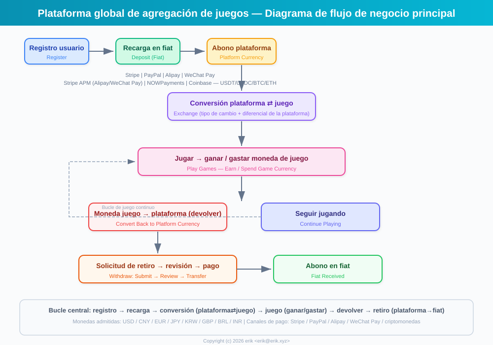
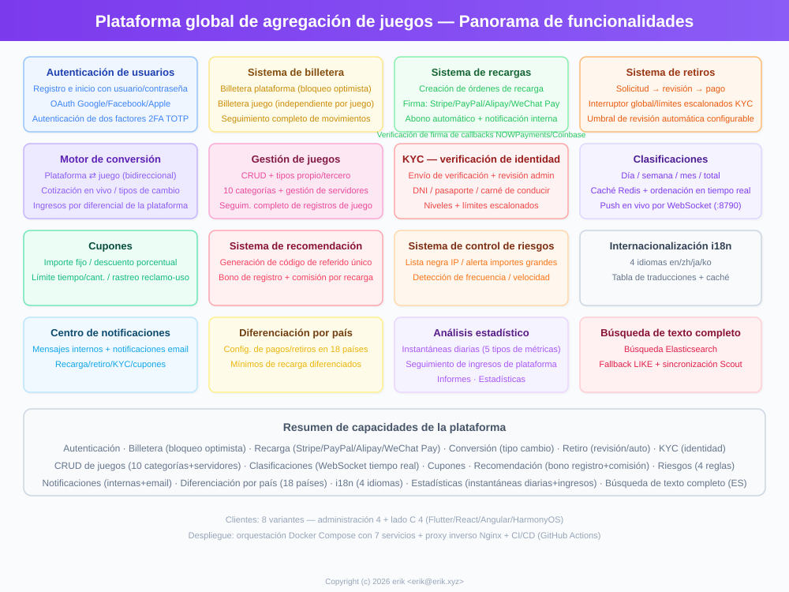
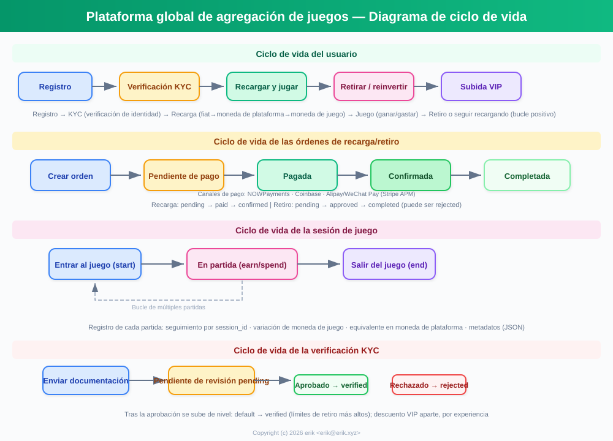
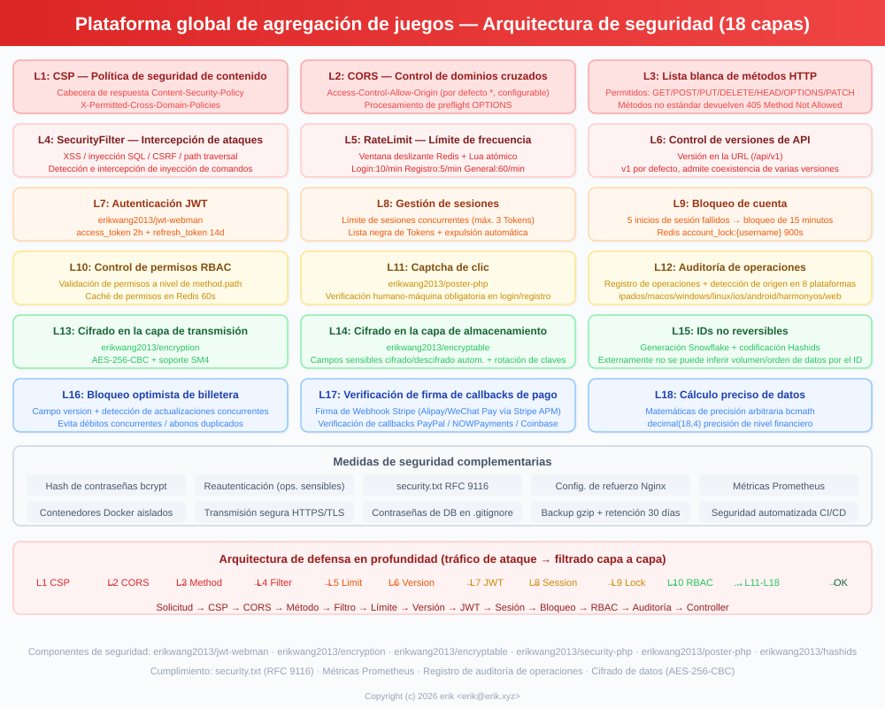
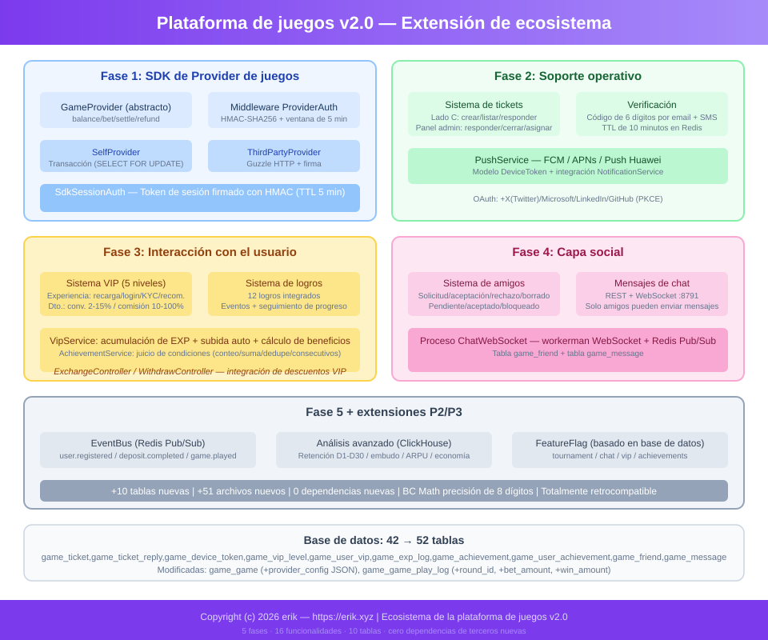

# Plataforma Global de Juegos (Global Game Platform)
<!-- lang-nav -->

Languages: [中文](../../README.md) · [English](README.en.md) · [한국어](README.ko.md) · [Русский](README.ru.md) · [Deutsch](README.de.md) · [Français](README.fr.md) · **Español** · [Português](README.pt.md) · [हिन्दी](README.hi.md) · [العربية](README.ar.md) · [বাংলা](README.bn.md) · [Bahasa Indonesia](README.id.md) · [日本語](README.ja.md)


> Copyright (c) 2026 erik <erik@erik.xyz> — https://erik.xyz

Plataforma global de juegos universal e internacionalizada. Los usuarios se registran, recargan y convierten dinero en moneda de plataforma, juegan y ganan moneda de juego, que puede convertirse de vuelta al monedero y retirarse. El panel de administración ofrece gestión completa de juegos, revisión de retiros, gestión de usuarios y gestión de pagos. Soporta cambio de idioma (inglés/chino).

## Estrategia de versiones

| Versión | Objetivo | Estado |
|------|------|------|
| Versión completa | Paquete completo: rankings, cupones, categorías de juegos, configuración por país, búsqueda ES | Completada |
| Expansión del ecosistema | v2.0: integración de proveedores de juegos, tickets, VIP, logros, social, bus de eventos | Completada |

## Stack tecnológico

### Backend
- PHP 8.3+, webman v2 (workerman/webman)
- MySQL 8.0+ (prefijo de tabla `erik_`, claves primarias BIGINT no autoincrementales)
- Redis (sesiones / caché / límite de tasa)
- ClickHouse (análisis OLAP / cálculo de probabilidades)
- Elasticsearch (búsqueda de texto completo)
- Autenticación JWT + control de permisos RBAC
- Cifrado de datos: AES-256-CBC en la capa de transmisión API + AES-128-ECB en la capa de almacenamiento de base de datos

### Frontend
- Flutter 3.x (estilo Web PC)
- HarmonyOS ArkTS (móvil)
- Diseño responsive (teléfono / tableta / escritorio)
- Internacionalización (i18n): inglés / chino simplificado

### Componentes principales
- `erikwang2013/snowflake-php` — generación de ID global único BIGINT
- `erikwang2013/hashids` — cifrado/descifrado de ID en la capa API
- `erikwang2013/jwt-webman` — autenticación JWT
- `erikwang2013/encryption` — cifrado/descifrado de datos sensibles de API
- `erikwang2013/encryptable` — cifrado/descifrado de campos sensibles en base de datos
- `erikwang2013/webman-scout` — sincronización y consulta de Elasticsearch
- `erikwang2013/season` — banderas de países
- `erikwang2013/security-php` — detección de herramientas de seguridad
- `erikwang2013/poster-php` — verificación aleatoria de operaciones sensibles
- `erikwang2013/clickhouse-php` — conexión a ClickHouse y cálculo de probabilidades

## Estructura del proyecto

```
game-platform-php/
├── admin/                     # Panel de administración (webman v2, puerto 8787)
│   ├── app/admin/controller/  #   Controladores del panel de administración
│   ├── app/middleware/        #   Middleware (Cors/Security/RateLimit/Auth/ProviderAuth)
│   ├── app/provider/          #   Capa de proveedores de juegos
│   ├── app/event/             #   Bus de eventos (EventBus Redis Pub/Sub) (Cors/Security/RateLimit/Auth/Permission/ProviderAuth)
│   ├── app/provider/          #   Capa de proveedores de juegos (Self/ThirdParty/Factory)
│   ├── app/middleware/        #   Middleware (Cors/Security/RateLimit/Auth/ProviderAuth)
│   ├── app/provider/          #   Capa de proveedores de juegos
│   ├── app/event/             #   Bus de eventos (EventBus Redis Pub/Sub) (Cors/Security/RateLimit/Auth/Permission)
│   ├── config/                #   Archivos de configuración
│   ├── database/migrations/   #   Archivos de migración SQL
│   └── apps/flutter/          #   Panel de administración Flutter Web PC
│
├── service/                   # Servicio del lado del usuario (webman v2, puerto 8788)
│   ├── app/api/v1/controller/ #   Controladores de API del lado del usuario
│   ├── app/middleware/        #   Middleware (Cors/Security/RateLimit/Auth/ProviderAuth)
│   ├── app/provider/          #   Capa de proveedores de juegos
│   ├── app/event/             #   Bus de eventos (EventBus Redis Pub/Sub)
│   └── config/                #   Archivos de configuración
│
├── install/                   # Asistente de instalación con un clic
│   ├── index.php              #   Punto de entrada de instalación
│   ├── Installer.php          #   Lógica principal de instalación
│   ├── install.sql            #   SQL combinado de instalación (43 tablas + datos semilla)
│   └── assets/                #   Recursos estáticos
│
├── admin/common/ y service/common/   # Copia de servicios compartidos (DepositLogService etc., pendiente de extracción a capa compartida)
│   └── service/               #   Servicios compartidos (incluye cálculo de probabilidades ClickHouse)
│
├── apps/
│   └── flutter/platform/      # Plataforma de usuarios Flutter Web PC (lado del usuario)
│
├── docs/                      # Documentación del proyecto
│   ├── ARCHITECTURE.md        #   Documento de arquitectura
│   ├── ARCHITECTURE-DESIGN.md #   Documento de diseño de arquitectura
│   ├── FEATURES.md            #   Documento de funciones
│   ├── FEATURE-DESIGN.md      #   Documento de diseño de funciones
│   └── API.md                 #   Documento de API
│
└── admin/docs/superpowers/    # Estándares de desarrollo y planes
    ├── specs/                 #   Especificaciones de diseño
    └── plans/                 #   Planes de implementación
```

## Inicio rápido

### Requisitos del entorno
- PHP 8.1+
- MySQL 8.0+
- Redis 6.0+
- Composer 2.x
- Flutter SDK 3.x (frontend, opcional)

### Opción 1: Asistente de instalación con un clic (recomendado)

```bash
# 1. Iniciar el asistente de instalación
php -S 0.0.0.0:8888 -t install/

# 2. Abrir http://localhost:8888 en el navegador
#    Seguir el asistente: comprobación del entorno → configuración de base de datos → cuenta de administrador → instalación automática

# 3. Instalar dependencias
cd admin && composer install && cd ..
cd service && composer install && cd ..

# 4. Iniciar servicios
cd admin && php start.php start -d && cd ..
cd service && php start.php start -d && cd ..

# 5. Acceder al panel de administración: http://localhost:8787
#    Iniciar sesión con la cuenta de administrador configurada durante la instalación

# 6. Eliminar el directorio de instalación tras completarla (seguridad)
rm -rf install/
```

El asistente de instalación completa automáticamente:
- Comprobación del entorno (versión de PHP, extensiones, permisos de directorio)
- Creación de la base de datos y tablas (SQL combinado, 43 tablas + datos semilla)
- Creación de la cuenta de superadministrador (cifrada con bcrypt)
- Generación automática de claves JWT/cifrado y escritura en el archivo .env
- Generación de install.lock para evitar instalaciones repetidas

### Opción 2: Instalación manual

<details>
<summary>Expandir pasos de instalación manual</summary>

#### 1. Inicialización de la base de datos

```bash
# Importar el SQL combinado con un comando
mysql -u root -e "CREATE DATABASE IF NOT EXISTS game_platform CHARACTER SET utf8mb4 COLLATE utf8mb4_unicode_ci;"
mysql -u root game_platform < install/install.sql
```

#### 2. Configurar variables de entorno

```bash
# Panel de administración
cd admin
cp .env.example .env
# Editar la información de conexión a la base de datos y las claves en .env

# Servicio del lado del usuario
cd ../service
cp .env.example .env
# Editar la información de conexión a la base de datos y las claves en .env
```

#### 3. Iniciar el backend

```bash
cd admin && composer install && php start.php start -d
cd ../service && composer install && php start.php start -d
```

#### 4. Crear el administrador

Es necesario insertar manualmente la cuenta de administrador en la base de datos (la contraseña se cifra con bcrypt).

</details>

### Iniciar el frontend (opcional)

```bash
# Panel de administración (Flutter Web PC)
cd admin/apps/flutter
flutter pub get
flutter run -d chrome

# Plataforma de usuarios (Flutter Web PC)
cd apps/flutter/platform
flutter pub get
flutter run -d chrome
```

### Verificación

```bash
# Probar el panel de administración
curl http://localhost:8787/health

# Probar el servicio del lado del usuario
curl http://localhost:8788/health

# Probar el registro de usuarios
curl -X POST http://localhost:8788/api/auth/register \
  -H "Content-Type: application/json" \
  -d '{"username":"testuser","password":"123456"}'
```

## Características de seguridad

- **18 capas de defensa en profundidad**: detección e intercepción de XSS/inyección SQL/CSRF/path traversal/inyección de comandos
- **Lista blanca de métodos HTTP**: solo se permiten GET/POST/PUT/DELETE/OPTIONS/HEAD
- **Autenticación JWT**: access_token 2 h + refresh_token 14 d, límite de sesiones concurrentes
- **Validación de clave JWT al arrancar**: clave independiente `ADMIN_JWT_SECRET_KEY` en admin y `SERVICE_JWT_SECRET_KEY` en service; si falta o conserva el valor predeterminado, se rechaza el arranque
- **Callbacks de pago fail-closed**: lista blanca de proveedores (solo stripe/paypal) + rechazo si falta la clave, falla la verificación de firma o el timestamp excede el límite + comprobación de montos con bccomp + abono de callbacks transaccional
- **Permisos RBAC**: control de permisos con granularidad method.path, caché Redis de 60 s
- **Captcha de clic**: verificación humana obligatoria en inicio de sesión/registro
- **Segunda confirmación de contraseña**: las operaciones sensibles requieren confirmación de contraseña
- **Cifrado de datos**: AES-256-CBC en la capa de transmisión + AES-128-ECB en la capa de almacenamiento
- **Cifrado de ID**: generación Snowflake + codificación Hashids, no se puede deducir de forma inversa desde el exterior
- **Bloqueo optimista del monedero**: evita débitos concurrentes / abonos duplicados
- **Auditoría de operaciones**: registro completo de operaciones, detección automática de 8 orígenes de plataforma
- **Límite de tasa**: ventana deslizante de Redis, atómica con Lua
- **Cabecera CSP**: Content-Security-Policy contra XSS
- **Seguridad de cuenta**: 5 intentos de inicio de sesión fallidos consecutivos bloquean la cuenta 15 minutos

## Pruebas

```bash
cd admin
phpunit --bootstrap tests/bootstrap.php tests/
```

- PHPUnit 12.x, 116 casos de prueba
- 56 pruebas de lógica de negocio (PlatformTest) + 60 pruebas de infraestructura
- Cobertura: precisión bcmath, cálculo de conversión, tarifas de retiro, límites, gestión de riesgos, cupones, KYC, i18n

## Resumen de capacidades de la plataforma

| Capacidad | Descripción |
|------|------|
| Autenticación de usuarios | Usuario/contraseña + OAuth de 7 plataformas (Google/Facebook/Apple/X(Twitter)/Microsoft/LinkedIn/GitHub) + 2FA TOTP |
| Monedero | Monedero de moneda de plataforma (bloqueo optimista) + monedero de moneda de juego + registro de transacciones |
| Recarga | Creación de pedido + verificación de firma de callbacks de Stripe/PayPal + abono automático |
| Conversión | Moneda de plataforma ⇄ moneda de juego, cotización en tiempo real, beneficio por diferencial |
| Retiro | Solicitud → revisión → pago, interruptor global, límites escalonados KYC + tarifas |
| KYC | Envío y revisión de verificación de identidad, sistema de autenticación de tres niveles |
| Juegos | CRUD + categorías (10) + servidores + seguimiento de registros de juego |
| Búsqueda | Búsqueda de texto completo en Elasticsearch (con respaldo LIKE) |
| Rankings | Clasificación diaria/semanal/mensual/total, caché Redis, push WebSocket en tiempo real (8789) |
| Cupones | Monto fijo + descuento porcentual, límite de tiempo y cantidad, seguimiento de canje y uso |
| Notificaciones | Mensajes internos + correo, notificación automática de recargas/retiros/KYC/cupones |
| Recomendaciones | Código de referido, bonificación de registro, comisión de recarga |
| Gestión de riesgos | Lista negra de IP / alerta de montos grandes / detección de frecuencia y velocidad |
| Internacionalización | 4 idiomas (en-US/zh-CN/ja-JP/ko-KR), tabla de traducciones + caché |
| Configuración por país | Métodos de pago/retiro diferenciados para 8 países, monto mínimo de recarga |
| Estadísticas | Instantáneas diarias (5 tipos de métricas) + seguimiento de ingresos de la plataforma |
| Captcha | Verificación humana por clic (poster-php) |
| Integración de juegos | SDK de proveedores (Self+ThirdParty) + firma HMAC-SHA256 + pasarela de callbacks |
| Tickets | Creación/respuesta en el lado del usuario + gestión/asignación/cierre en el panel de administración |
| VIP | 5 niveles de fidelidad, acumulación de experiencia, descuento de conversión / exención de retiro / bono de tipo de cambio |
| Logros | 12 logros integrados, detección por eventos, seguimiento de progreso |
| Social | Sistema de amigos + mensajería privada WebSocket en tiempo real (puerto 8791), solo entre amigos |
| Torneos | Sistema de campeonatos (interruptor FeatureFlag) + rankings + límite de jugadores |
| Comisiones | Reparto de referidos de dos niveles (tasa de comisión configurable) |
| Cupones | Restricciones de condiciones (min_deposit/first_user/game_id) |
| Eventos | Bus de eventos Redis Pub/Sub + entrega de suscripciones Webhook (7 tipos de eventos) |
| Despliegue | Orquestación de 8 servicios con Docker Compose + proxy inverso Nginx |
| Clientes | Flutter Admin (15 páginas) + Platform (10 páginas) + HarmonyOS (5 páginas) |

## Modelo de negocio

```
Moneda fiduciaria (USD/CNY/EUR...)
  │  Recarga (Stripe/PayPal/Alipay/WeChat)
  ▼
Moneda de plataforma (unificada, precisión decimal(18,4))
  │  Conversión (incluye tipo de cambio + margen de la plataforma)
  ▼
Moneda de juego (independiente por juego, tipo de cambio propio)
  │  Jugar para ganar/gastar
  ▼
Moneda de plataforma ← Convertir de vuelta → Retiro (revisión/automático)
```

## Liquidación multimoneda

La plataforma adopta un sistema de liquidación con tres capas de moneda aisladas, «fiduciaria → moneda de plataforma → moneda de juego»: admite recargas en múltiples monedas fiduciarias (USD/CNY/EUR), cada juego tiene su propia moneda de valoración; todos los cálculos de montos usan aritmética de alta precisión bcmath para eliminar errores de coma flotante.

### Modelo de tres capas de moneda

| Capa | Moneda | Descripción |
|------|------|------|
| Capa fiduciaria | USD / CNY / EUR | Moneda de pago real para recargas/retiros de usuarios, gestionada por Stripe / PayPal |
| Capa de moneda de plataforma | Moneda de plataforma (unificada en toda la plataforma) | Moneda de liquidación interna unificada (decimal(18,4)), bloqueo optimista del monedero contra débitos concurrentes/abonos duplicados |
| Capa de moneda de juego | Moneda independiente por juego | Cada juego tiene su propio `exchange_rate` y margen `spread_pct`, monedero de moneda de juego independiente |

### Rutas de liquidación

- **Liquidación de recargas**: el usuario paga en moneda fiduciaria (verificación de firma de callbacks de Stripe/PayPal, idempotencia anti-duplicados) → conversión a moneda de plataforma según `default_exchange_rate`; el pedido de recarga registra simultáneamente `amount + currency + platform_amount`
- **Liquidación de conversión**: la moneda de plataforma ⇄ moneda de juego se cotiza en tiempo real según el tipo de cambio de la moneda del juego (quote), se deduce `spread_pct` como ingreso por diferencial de la plataforma; los VIP disfrutan de descuento de conversión y bono de tipo de cambio
- **Liquidación de juegos**: el proveedor de juegos ajusta la moneda de juego del usuario mediante el callback `/api/provider/settle` (firma HMAC-SHA256); la sesión de juego con timeout se liquida automáticamente
- **Liquidación de retiros**: débito de moneda de plataforma → generación del pedido de retiro (registra `platform_amount / fiat_amount / currency`) → aprobación del panel de administración → pago PayPal Payout → sincronización del estado del lote hasta completado

### Diagrama de flujo de liquidación



## Diagrama de arquitectura



## Flujo de negocio principal



## Panorama de funciones



## Ciclo de vida



## Arquitectura de seguridad



## Expansión del ecosistema (v2.0)



## Índice de documentación

| Documento | Descripción |
|------|------|
| [Comparación de versiones](../VERSIONS.es.md) | Comparación de funciones de versión básica/estándar/completa |
| [Documento de diseño de arquitectura](../ARCHITECTURE-DESIGN.es.md) | Razones de selección de arquitectura y decisiones de diseño |
| [Documento de arquitectura](../ARCHITECTURE.es.md) | Topología del sistema, arquitectura de módulos, flujo de datos |
| [Documento de diseño de funciones](../FEATURE-DESIGN.es.md) | Modelo de negocio, especificaciones de funciones, diseño de flujos |
| [Documento de funciones](../FEATURES.es.md) | Lista de funciones, descripción de módulos, recorrido del usuario |
| [Documento de API](../API.es.md) | Referencia completa de API (102 interfaces) |
| [Documentación en línea](http://localhost:8788/apidoc/) | Documentación interactiva hg/apidoc (lado del usuario) |
| [Documentación en línea](http://localhost:8787/apidoc/) | Documentación interactiva hg/apidoc (panel de administración) |
| [Instalación de ClickHouse](../CLICKHOUSE_INSTALL.es.md) | Instalación/configuración/migración/verificación de ClickHouse |
| [Documento de integración del SDK de proveedores](../PROVIDER-SDK.es.md) | Guía de integración de juegos de terceros (algoritmo de firma + ejemplos PHP/Go/Python) |
| [Uso de ClickHouse](../CLICKHOUSE_USAGE.es.md) | 4 servicios de API de ClickHouse y panel del backend |
| [Documento de despliegue](../DEPLOYMENT.es.md) | Guía de despliegue (Docker + manual + Nginx + monitorización) |
| [Especificación de diseño](../../admin/docs/superpowers/specs/2026-05-22-game-platform-design.es.md) | Especificación de diseño completa |
| [Plan de implementación](../../admin/docs/superpowers/plans/2026-05-22-game-platform-plan.es.md) | Plan de implementación detallado |

---

## Apoyar el proyecto

Si este proyecto te resulta útil, invita al autor a un café ☕

<p align="center">
  <table align="center" border="0" cellspacing="0" cellpadding="0">
    <tr>
      <td align="center" width="200">
        <br>
        <b>微信支付</b>
      </td>
      <td align="center" width="200">
        <br>
        <b>支付宝</b>
      </td>
    </tr>
  </table>
</p>

### Transferencia bancaria global (Global Bank Transfer)

**Información del beneficiario (Recipient)**

| Elemento | Contenido |
|----|------|
| Nombre del beneficiario (Beneficiary Name) | WANG KEXUN |
| Número de cuenta (Account Number) | 881015918251 |

**Banco beneficiario (Beneficiary Bank)**

| Elemento | Contenido |
|----|------|
| SWIFT Code | AABLHKHHXXX |
| Nombre del banco (Bank Name) | ZA Bank Limited |
| Código del banco (Bank Code) | 387 |
| Dirección del banco (Bank Address) | Core F, Cyberport 3, 100 Cyberport Road, Hong Kong |

**Banco corresponsal de remesas transfronterizas (Correspondent Bank, si se requiere)**

> Ten en cuenta que esta es la información del banco corresponsal (banco intermediario) de las remesas transfronterizas, no la del banco beneficiario. Consulta con tu banco remitente si es necesario proporcionar la información del banco corresponsal.

- **El banco corresponsal para remesas en dólares de Hong Kong, yuanes y dólares estadounidenses es Citibank:**
  - Nombre del banco: Citibank N.A. Hong Kong
  - SWIFT Code：CITIHKHXXXX
  - Código del banco: 006
  - Nombre de la sucursal: Hong Kong Branch
  - Código de sucursal: 391
  - Dirección del banco: Citibank Tower, Citibank Plaza, 3 Garden Road, Central, Hong Kong
- **El banco corresponsal para remesas en otras monedas es BNY Mellon:**
  - Nombre del banco: THE BANK OF NEW YORK MELLON
  - SWIFT Code：IRVTUS3NXXX
  - Dirección del banco: THE BANK OF NEW YORK MELLON, 240 GREENWICH STREET, NEW YORK, United States
