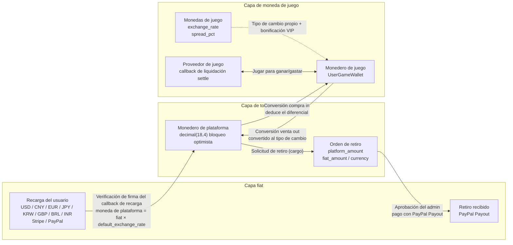

# Plataforma Global de Juegos (Global Game Platform)

## Mascota del proyecto


**Dicey** — Mascota de la plataforma. El dado representa los juegos y la jugabilidad basada en probabilidad, la moneda la economía de la plataforma y las múltiples pasarelas de pago, y el púrpura refleja la marca del panel de administración. Archivo SVG: `docs/mascot.svg`, escalable infinitamente para documentos, logotipos y productos.
<!-- lang-nav -->

Languages: [中文](../../README.md) · [English](README.en.md) · [한국어](README.ko.md) · [Русский](README.ru.md) · [Deutsch](README.de.md) · [Français](README.fr.md) · **Español** · [Português](README.pt.md) · [हिन्दी](README.hi.md) · [العربية](README.ar.md) · [বাংলা](README.bn.md) · [Bahasa Indonesia](README.id.md) · [日本語](README.ja.md)

> Copyright (c) 2026 erik <erik@erik.xyz> — https://erik.xyz

Plataforma global de juegos universal e internacionalizada. Los usuarios se registran, recargan y convierten dinero en moneda de plataforma, juegan y ganan moneda de juego, que puede convertirse de vuelta al monedero y retirarse. El panel de administración ofrece gestión completa de juegos, revisión de retiros, gestión de usuarios y gestión de pagos. Soporta cambio de idioma (inglés/chino).

## Estrategia de versiones

| Versión | Objetivo | Estado |
|------|------|------|
| Versión completa | Paquete completo: rankings, cupones, categorías de juegos, configuración por país, búsqueda ES | Completada |
| Expansión del ecosistema | v2.0: integración de proveedores de juegos, tickets, VIP, logros, social, bus de eventos | Completada |
| v1.3.15-22 (8 versiones) | Conciliación/liquidación, control de riesgos profundo, billetera unificada, motor de actividades, anti-trampas, crecimiento social, Adyen/GrabPay | Completada |

## Stack tecnológico

### Backend
- PHP 8.3+, webman v2 (workerman/webman)
- MySQL 8.0+ (prefijo de tabla `game_`, claves primarias BIGINT no autoincrementales)
- Redis (sesiones / caché / límite de tasa)
- ClickHouse (análisis OLAP / cálculo de probabilidades)
- Elasticsearch (búsqueda de texto completo)
- Autenticación JWT + control de permisos RBAC
- Cifrado de datos: AES-256-CBC en la capa de transmisión API + AES-128-ECB en la capa de almacenamiento de base de datos

### Frontend

Hay dos árboles de directorios de front-end separados, **cada uno llama solo al backend de su propio lado**, sin cruces:

| Árbol de directorios | Rol | Prefijo de petición | Backend | Stack técnico |
|--------|------|---------|---------|--------|
| `apps/*` | **Plataforma de jugador C-end** | `/api/v1/...` | service (8792 por defecto) | Flutter Web / React 19 (Vite) / Angular 21 / HarmonyOS ArkTS |
| `admin/apps/*` | **Consola de administración** | `/admin/v1/...` | admin (8789 por defecto) | Flutter Web / React 19 (Vite) / Angular 21 / HarmonyOS ArkTS |

- Diseño responsive (teléfono / tableta / escritorio)
- Internacionalización (i18n): inglés / chino simplificado

### Componentes principales
- `erikwang2013/snowflake-php` — generación de ID global único BIGINT
- `erikwang2013/hashids` — cifrado/descifrado de ID en la capa API
- `erikwang2013/jwt-webman` — autenticación JWT
- `erikwang2013/encryption` — cifrado/descifrado de datos sensibles de API
- `erikwang2013/encryptable` — cifrado/descifrado de campos sensibles en base de datos
- `erikwang2013/webman-scout` — sincronización y consulta de Elasticsearch
- `erikwang2013/season` — banderas de países
- `erikwang2013/security-php` — detección de herramientas de seguridad
- `erikwang2013/poster-php` — verificación aleatoria de operaciones sensibles
- `erikwang2013/clickhouse-php` — conexión a ClickHouse y cálculo de probabilidades

## Estructura del proyecto

```
game-platform-php/
├── admin/                     # Panel de administración (webman v2, puerto predeterminado 8789, configurable con APP_PORT)
│   ├── app/admin/v1/controller/  #   Controladores del lado admin
│   ├── app/middleware/        #   Middleware (Cors/SecurityFilter/RateLimit/AdminAuth/AdminPermission/OperationLog)
│   ├── app/model/             #   Modelos exclusivos de admin (8; los otros 52 modelos compartidos están en packages/)
│   ├── app/service/           #   Servicios exclusivos de admin (WalletService/WalletScope/RiskSandboxService)
│   ├── app/process/           #   Procesos residentes (Http/Monitor/RiskIpCron)
│   ├── app/provider/          #   Capa de proveedores de juegos (Self/ThirdParty/Factory)
│   ├── app/activity/          #   Motor de actividades (check-in/invitación/tareas diarias)
│   ├── app/event/             #   Bus de eventos (EventBus Redis Pub/Sub)
│   ├── config/                #   Archivos de configuración
│   └── apps/                  #   Front-ends de administración (4 variantes, llaman a /admin/v1 → admin:8789)
│       ├── flutter/           #     Panel de administración Flutter Web PC
│       ├── react/             #     Consola de administración React 19 (Vite)
│       ├── angular/           #     Consola de administración Angular 21
│       └── harmonyos/         #     Consola de administración HarmonyOS ArkTS (.hap, sin pasar por nginx)
│
├── service/                   # Servicio del lado del usuario (webman v2, puerto predeterminado 8792, configurable con APP_PORT)
│   ├── app/api/v1/controller/ #   Controladores de API del lado del usuario
│   ├── app/middleware/        #   Middleware (TraceId/Cors/SecurityFilter/RateLimit/LanguageMiddleware/UserAuth/ProviderAuth/SdkSessionAuth)
│   ├── app/model/             #   Modelos exclusivos de service (10; los otros 52 modelos compartidos están en packages/)
│   ├── app/service/           #   Servicios exclusivos de service (cartera/riesgo/cumplimiento/conciliación/push/logros/antifraude, etc.)
│   ├── app/payment/           #   18 adaptadores de pasarelas de pago (Stripe/PayPal/Adyen/NowPayments/Skrill…) + GatewayFactory
│   ├── app/cdn/               #   Adaptadores CDN de cinco proveedores (Cloudflare/CloudFront/Alibaba/Tencent/Huawei) + CdnFactory
│   ├── app/process/           #   Procesos residentes (Http/Monitor/LeaderboardWS:8790/ChatWS:8791/EventConsumer/EventSubscriber/AntiCheatWorker/GroupSweepWorker/Health)
│   ├── app/provider/          #   Capa de proveedores de juegos
│   ├── app/activity/          #   Motor de actividades
│   ├── app/event/             #   Bus de eventos (EventBus Redis Pub/Sub)
│   └── config/                #   Archivos de configuración
│
├── packages/platform-common/  # Capa compartida: admin y service la importan mediante un repositorio composer path, evitando dos copias
│   ├── src/model/             #   Modelos Eloquent compartidos (52, misma fuente para ambos lados)
│   ├── src/service/           #   Servicios compartidos (DepositLogService / VipService etc., 11 en total, incluye cálculo de probabilidades ClickHouse)
│   ├── src/BcMath.php         #   Aritmética de alta precisión de importes/tasas (envoltorio de bcmath), redondeo, porcentajes
│   ├── src/EncryptionService.php  #   Cifrado/descifrado AES y enmascarado
│   ├── src/CircuitBreaker.php #   Cortacircuitos (además de Retry.php para reintentos)
│   ├── src/HashidsService.php #   Codificación/decodificación de ID de la capa API
│   └── src/SnowflakeService.php   #   ID BIGINT únicos a nivel global
│
├── apps/                      # Front-ends de jugador C-end (4 variantes, llaman a /api/v1 → service:8792)
│   ├── flutter/platform/      #   Plataforma de usuarios Flutter Web PC (lado del usuario)
│   ├── react/                 #   React 19 (Vite) C-end
│   ├── angular/               #   Angular 21 C-end
│   └── harmonyos/             #   HarmonyOS ArkTS C-end (.hap, sin pasar por nginx)
│
├── game/xiaoxiaole/           # Mini-juego integrado «Match-3 Campestre»: TypeScript + Vite + Vitest, motor src/domain + diseño de cuatro niveles + tests/, documentos de diseño en 13 idiomas
│
├── install/                   # Asistente de instalación en un clic + SQL de inicialización de la base de datos
│   ├── index.php              #   Punto de entrada de instalación
│   ├── Installer.php          #   Lógica principal de instalación
│   ├── install.sql            #   SQL combinado de instalación (78 tablas + datos semilla)
│   ├── clickhouse.sql         #   DDL de la base analítica ClickHouse (motor independiente, se importa por separado)
│   ├── test-data.sql          #   Datos de demostración/prueba
│   ├── migrations/            #   Scripts de actualización incremental para bases existentes (*.sql)
│   ├── lang/ + lang.php       #   Traducciones de la interfaz del asistente de instalación (13 idiomas)
│   └── assets/                #   Recursos estáticos
│
├── docs/                      # Documentación del proyecto (todos los textos en 13 idiomas: .md es la fuente en chino y junto a él están las traducciones .{lang}.md)
│   ├── ARCHITECTURE.md        #   Documento de arquitectura
│   ├── ARCHITECTURE-DESIGN.md #   Documento de diseño de arquitectura
│   ├── FEATURES.md            #   Documento de funciones
│   ├── FEATURE-DESIGN.md      #   Documento de diseño de funciones
│   ├── API.md                 #   Documento de API
│   ├── DEPLOYMENT.md          #   Documento de despliegue (Docker/manual/configuración de puertos)
│   ├── PROVIDER-SDK.md        #   Guía de integración de juegos de terceros (algoritmo de firma + ejemplos en PHP/Go/Python)
│   ├── CLICKHOUSE_INSTALL.md  #   Instalar/configurar/migrar/verificar ClickHouse
│   ├── CLICKHOUSE_USAGE.md    #   Las 4 API de servicios de ClickHouse y el panel de administración
│   ├── translations/          #   Las traducciones de este README a 12 idiomas
│   ├── diagrams/              #   SVG de arquitectura/flujo/funciones/ciclo de vida/seguridad/expansión del ecosistema (13 idiomas cada uno)
│   ├── test-reports/          #   Informes de pruebas (php-unit / api / resilience / ui / SUMMARY)
│   └── superpowers/           #   Especificaciones de diseño y planes de implementación de este repositorio (registro histórico)
│
├── scripts/                   # Scripts de operación (comprobación de deriva de modelos / migración de anotaciones apidoc / migración de la semántica de pagos de exchange / verificación de firmas)
├── tests/api/                 # Pruebas automatizadas de la API (run_all.sh)
├── runtime/                   # Directorio de ejecución de webman (logs/pid, generado en tiempo de ejecución)
│
├── docker-compose.yml         # Orquestación de Docker Compose (puertos por defecto desde el .env raíz)
├── nginx.conf.template        # Plantilla de configuración de Nginx (puertos upstream renderizados por envsubst)
├── .env.example               # Plantilla del .env raíz (variables de puertos de Docker, copiar a .env para usar)
└── admin/docs/superpowers/    # Estándares de desarrollo y planes
    ├── specs/                 #   Especificaciones de diseño
    └── plans/                 #   Planes de implementación
```

## Inicio rápido

### Requisitos del entorno
- PHP 8.1+
- MySQL 8.0+
- Redis 6.0+
- Composer 2.x
- Flutter SDK 3.x (frontend, opcional)

### Opción 1: Asistente de instalación con un clic (recomendado)

```bash
# 1. Iniciar el asistente de instalación
php -S 0.0.0.0:8888 -t install/

# 2. Abrir http://localhost:8888 en el navegador
#    Seguir el asistente: comprobación del entorno → configuración de base de datos → cuenta de administrador → instalación automática

# 3. Instalar dependencias
cd admin && composer install && cd ..
cd service && composer install && cd ..

# 4. Iniciar servicios (puertos predeterminados admin 8789 / service 8792, modificables en APP_PORT de cada .env)
cd admin && php start.php start -d && cd ..
cd service && php start.php start -d && cd ..

# 5. Acceder al panel de administración: http://localhost:8789 (puerto predeterminado)
#    Iniciar sesión con la cuenta de administrador configurada durante la instalación

# 6. Eliminar el directorio de instalación tras completarla (seguridad)
rm -rf install/
```

El asistente de instalación completa automáticamente:
- Comprobación del entorno (versión de PHP, extensiones, permisos de directorio)
- Creación de la base de datos y tablas (SQL combinado, 78 tablas + datos semilla)
- Creación de la cuenta de superadministrador (cifrada con bcrypt)
- Generación automática de claves JWT/cifrado y escritura en el archivo .env
- Generación de install.lock para evitar instalaciones repetidas

### Opción 2: Instalación manual

<details>
<summary>Expandir pasos de instalación manual</summary>

#### 1. Inicialización de la base de datos

```bash
# Importar el SQL combinado con un comando
mysql -u root -e "CREATE DATABASE IF NOT EXISTS game-platform CHARACTER SET utf8mb4 COLLATE utf8mb4_unicode_ci;"
mysql -u root game-platform < install/install.sql
```

#### 2. Configurar variables de entorno

```bash
# Panel de administración
cd admin
cp .env.example .env
# Editar la información de conexión a la base de datos y las claves en .env

# Servicio del lado del usuario
cd ../service
cp .env.example .env
# Editar la información de conexión a la base de datos y las claves en .env
```

#### 3. Iniciar el backend

```bash
cd admin && composer install && php start.php start -d
cd ../service && composer install && php start.php start -d
```

#### 4. Crear el administrador

Es necesario insertar manualmente la cuenta de administrador en la base de datos (la contraseña se cifra con bcrypt).

</details>

### Iniciar el frontend (opcional)

En desarrollo cada front-end levanta su propio servidor de desarrollo; este redirige las peticiones al backend correspondiente (véase `proxy.conf.json` / `vite.config.ts` en cada directorio):

```bash
# --- Plataforma de jugador C-end (/api/v1 → service:8792) ---
cd apps/react            && npm install && npm run dev      # http://localhost:5173
cd apps/angular          && npm install && npm start        # http://localhost:4200
cd apps/flutter/platform && flutter pub get && flutter run -d chrome

# --- Consola de administración (/admin/v1 → admin:8789) ---
cd admin/apps/react      && npm install && npm run dev      # http://localhost:5273
cd admin/apps/angular    && npm install && npm start        # http://localhost:4300
cd admin/apps/flutter    && flutter pub get && flutter run -d chrome
```

> Puertos de los servidores de desarrollo de Angular: la consola de administración fija 4300 explícitamente en `angular.json`, mientras que el lado C mantiene el 4200 por defecto de Angular; para ejecutar ambos a la vez, añade `--port` a uno de ellos.
> Los destinos HarmonyOS (`apps/harmonyos`, `admin/apps/harmonyos`) se abren y compilan con DevEco Studio;
> un emulador alcanza el backend anfitrión en `http://10.0.2.2:<port>` (véase la constante al inicio de cada `ApiService.ets`).

### Despliegue del frontend (Docker/Nginx)

El servicio nginx de `docker-compose.yml` monta los artefactos de compilación de cada frontend en el contenedor en modo solo lectura, y `nginx.conf.template` los sirve en las rutas indicadas abajo.
Si un artefacto no se ha compilado, el directorio está vacío: las peticiones a una ruta devuelven 404 y las peticiones al directorio desnudo (p. ej. `/app-react/`) devuelven 403.

| URL | Punto de montaje del artefacto | Comando de compilación |
|-----|-----------|---------|
| `/` | `apps/flutter/platform/build/web` | `flutter build web` |
| `/app-react/` | `apps/react/dist` | `npm run build` (el script incluye `--base=/app-react/`) |
| `/app-angular/` | `apps/angular/dist/game-client-angular/browser` | `npm run build` (el script incluye `--base-href=/app-angular/`) |
| `/admin-panel/` | `admin/public` | Ranura de publicación genérica: copia cualquier artefacto de consola en `admin/public`; si no hay nada, también devuelve 404 (directorio desnudo 403). El artefacto debe compilarse con `--base=/admin-panel/` (en Flutter, `--base-href=/admin-panel/`); de lo contrario sus recursos seguirán apuntando al prefijo original y darán 404. La forma sin barra redirige con 301 a esta dirección; `nginx.conf.template` define `absolute_redirect off`, así que la redirección es un Location relativo y los despliegues en puertos distintos de 80 ya no pierden el puerto |
| `/admin-react/` | `admin/apps/react/dist` | `npm run build` (el script incluye `--base=/admin-react/`) |
| `/admin-angular/` | `admin/apps/angular/dist/game-admin-angular/browser` | `npm run build` (el script incluye `--base-href=/admin-angular/`) |
| `/admin-flutter/` | `admin/apps/flutter/build/web` | `flutter build web --base-href=/admin-flutter/` |

`/admin/` (API) → contenedor admin, `/api/` (API) → contenedor service; el cliente HarmonyOS se distribuye como paquete `.hap` y no pasa por nginx.

### Verificación

```bash
# Probar el panel de administración (puerto predeterminado 8789)
curl http://localhost:8789/health

# Probar el servicio del lado del usuario (puerto predeterminado 8792)
curl http://localhost:8792/health

# Probar el registro de usuarios
curl -X POST http://localhost:8792/api/v1/auth/register \
  -H "Content-Type: application/json" \
  -d '{"username":"testuser","password":"Abcdef12"}'
```

## Características de seguridad

- **18 capas de defensa en profundidad**: detección e intercepción de XSS/inyección SQL/CSRF/path traversal/inyección de comandos
- **Lista blanca de métodos HTTP**: solo se permiten GET/POST/PUT/DELETE/OPTIONS/HEAD
- **Autenticación JWT**: access_token 2 h + refresh_token 14 d, límite de sesiones concurrentes
- **Validación de clave JWT al arrancar**: clave independiente `ADMIN_JWT_SECRET_KEY` en admin y `SERVICE_JWT_SECRET_KEY` en service; si falta o conserva el valor predeterminado, se rechaza el arranque
- **Callbacks de pago fail-closed**: lista blanca de proveedores (solo stripe/paypal) + rechazo si falta la clave, falla la verificación de firma o el timestamp excede el límite + comprobación de montos con bccomp + abono de callbacks transaccional
- **Permisos RBAC**: control de permisos con granularidad method.path, caché Redis de 60 s
- **Captcha de clic**: verificación humana obligatoria en inicio de sesión/registro
- **Segunda confirmación de contraseña**: las operaciones sensibles requieren confirmación de contraseña
- **Cifrado de datos**: AES-256-CBC en la capa de transmisión + AES-128-ECB en la capa de almacenamiento
- **Cifrado de ID**: generación Snowflake + codificación Hashids, no se puede deducir de forma inversa desde el exterior
- **Bloqueo optimista del monedero**: evita débitos concurrentes / abonos duplicados
- **Auditoría de operaciones**: registro completo de operaciones, detección automática de 8 orígenes de plataforma
- **Límite de tasa**: ventana deslizante de Redis, atómica con Lua
- **Cabecera CSP**: Content-Security-Policy contra XSS
- **Seguridad de cuenta**: 5 intentos de inicio de sesión fallidos consecutivos bloquean la cuenta 15 minutos

## Pruebas

Informes de pruebas (almacenados localmente): [docs/test-reports/](../test-reports/)

| Tipo de prueba | Casos/cobertura | Resultado |
|---------|----------|------|
| Pruebas unitarias PHP | medición actual con `phpunit --list-tests`: admin 200 + service 273 casos (el informe `docs/test-reports/php-unit.md` registra la repetición del 09-22 admin 190 + service 273 y la instantánea del 08-27 admin 153 + service 45; el lado admin sigue ampliándose) | service todo pasa (701 aserciones, 3 skipped, 2 warnings + 35 deprecations); admin 437 aserciones, 3 skipped, 1 fallo (`EnvConfigTest` comprueba el `admin/.env` real y echa en falta `REDIS_CLUSTER_NODES`; añadirlo lo pone en verde) |
| Pruebas de los mecanismos de estabilidad | cortacircuitos/reintentos/interruptor de degradación, 15 casos (CircuitBreakerTest/RetryTest/ResilienceMockTest) | todo pasa |
| Pruebas automatizadas de API | 187 endpoints (fuente: `docs/test-reports/api.md`, 2026-08-27); route.php registra actualmente 261 endpoints | 171 pasan / 50 fallan / 4 omitidos (todos los fallos son defectos deterministas, véase el informe) |
| Pruebas de UI de Flutter | 12 casos (inicio de sesión/panel/navegación/cambio de idioma) | todo pasa |
| Go/Rust | no hay código Go/Rust en el repositorio | omitido, registrado |

```bash
# Pruebas unitarias PHP (exportar antes las variables de entorno del secreto JWT)
cd admin && ADMIN_JWT_SECRET_KEY=test-jwt-secret-change-me php vendor/bin/phpunit
cd service && SERVICE_JWT_SECRET_KEY=test-jwt-secret-change-me php vendor/bin/phpunit
# Pruebas automatizadas de API (los servicios deben estar en marcha, véase tests/api/run_all.sh)
bash tests/api/run_all.sh
# Pruebas de UI de Flutter
cd admin/apps/flutter && flutter test --timeout 300s
```

Informes detallados:
- [Informe de pruebas unitarias PHP](../test-reports/php-unit.md)
- [Informe de pruebas de los mecanismos de estabilidad (cortacircuitos/reintentos/degradación)](../test-reports/resilience.md)
- [Informe de pruebas automatizadas de API](../test-reports/api.md)
- [Informe de pruebas de UI de Flutter](../test-reports/ui.md)

## Resumen de capacidades de la plataforma

| Capacidad | Descripción |
|------|------|
| Autenticación de usuarios | Usuario/contraseña + OAuth de 7 plataformas (Google/Facebook/Apple/X(Twitter)/Microsoft/LinkedIn/GitHub) + 2FA TOTP |
| Monedero | Monedero de moneda de plataforma (bloqueo optimista) + monedero de moneda de juego + registro de transacciones |
| Recarga | Creación de pedido + verificación de firma de callbacks de Stripe/PayPal + abono automático |
| Conversión | Moneda de plataforma ⇄ moneda de juego, cotización en tiempo real, beneficio por diferencial |
| Retiro | Solicitud → revisión → pago, interruptor global, límites escalonados KYC + tarifas |
| KYC | Envío y revisión de verificación de identidad, eleva el límite de retiro tras la aprobación |
| Juegos | CRUD + categorías (10) + servidores + seguimiento de registros de juego |
| Búsqueda | Búsqueda de texto completo en Elasticsearch (con respaldo LIKE) |
| Rankings | Clasificación diaria/semanal/mensual/total, caché Redis, push WebSocket en tiempo real (puerto predeterminado 8790, configurable con LEADERBOARD_WS_PORT) |
| CDN | Integración de cinco proveedores (Cloudflare R2 / AWS S3 / Aliyun OSS / Tencent COS / Huawei OBS carga + purga + precarga) + configuración/activación/prueba de conectividad en el panel de administración |
| Cupones | Monto fijo + descuento porcentual, límite de tiempo y cantidad, seguimiento de canje y uso |
| Notificaciones | Mensajes internos + correo, notificación automática de recargas/retiros/KYC/cupones |
| Recomendaciones | Código de referido, bonificación de registro, comisión de recarga |
| Gestión de riesgos | Lista negra de IP / alerta de montos grandes / detección de frecuencia y velocidad |
| Control de riesgos profundo | Huella de dispositivo / reputación de IP / grafo de vínculos de cuentas + motor de reglas + panel de riesgos + AML/KYC/puntuación de confianza |
| Anti-trampas | Recopilación de eventos anti-trampas + estadísticas diarias + revisión manual |
| Conciliación/liquidación | Lotes de conciliación diarios + detalles de diferencias + conciliación de extractos |
| Billetera unificada | WalletScope billetera unificada |
| Motor de actividades | Creación/participación/recompensas de actividades + check-in |
| Crecimiento social | Grupos + seguimiento de enlaces compartidos |
| Pasarelas de pago | Nuevas pasarelas Adyen / GrabPay (L1) |
| Internacionalización | 4 idiomas (en-US/zh-CN/ja-JP/ko-KR), tabla de traducciones + caché |
| Configuración por país | Métodos de pago/retiro diferenciados para 18 países, monto mínimo de recarga |
| Estadísticas | Instantáneas diarias (5 tipos de métricas) + seguimiento de ingresos de la plataforma |
| Captcha | Verificación humana por clic (poster-php) |
| Integración de juegos | SDK de proveedores (Self+ThirdParty) + firma HMAC-SHA256 + pasarela de callbacks |
| Tickets | Creación/respuesta en el lado del usuario + gestión/asignación/cierre en el panel de administración |
| VIP | 5 niveles de fidelidad, acumulación de experiencia, descuento de conversión / exención de retiro / bono de tipo de cambio |
| Logros | 12 logros integrados, detección por eventos, seguimiento de progreso |
| Social | Sistema de amigos + mensajería privada WebSocket en tiempo real (puerto predeterminado 8791, configurable con CHAT_WS_PORT), solo entre amigos |
| Torneos | Sistema de campeonatos (interruptor FeatureFlag) + rankings + límite de jugadores |
| Comisiones | Reparto de referidos de dos niveles (tasa de comisión configurable) |
| Cupones | Restricciones de condiciones (min_deposit/first_user/game_id) |
| Eventos | Bus de eventos Redis Pub/Sub + entrega de suscripciones Webhook (7 tipos de eventos) |
| Despliegue | Orquestación de 7 servicios con Docker Compose (puertos configurados en el .env raíz) + proxy inverso Nginx |
| Clientes | Administración 4 variantes (Flutter/React/Angular/HarmonyOS) + lado C 4 variantes (Flutter/React/Angular/HarmonyOS) |

## Modelo de negocio

```
Moneda fiduciaria (USD/CNY/EUR...)
  │  Recarga (Stripe/PayPal/Alipay/WeChat)
  ▼
Moneda de plataforma (unificada, precisión decimal(18,4))
  │  Conversión (incluye tipo de cambio + margen de la plataforma)
  ▼
Moneda de juego (independiente por juego, tipo de cambio propio)
  │  Jugar para ganar/gastar
  ▼
Moneda de plataforma ← Convertir de vuelta → Retiro (revisión/automático)
```

## Liquidación multimoneda

La plataforma adopta un sistema de liquidación con tres capas de moneda aisladas, «fiduciaria → moneda de plataforma → moneda de juego»: admite recargas en múltiples monedas fiduciarias (USD/CNY/EUR/JPY/KRW/GBP/BRL/INR), cada juego tiene su propia moneda de valoración; todos los cálculos de montos usan aritmética de alta precisión bcmath para eliminar errores de coma flotante.

### Modelo de tres capas de moneda

| Capa | Moneda | Descripción |
|------|------|------|
| Capa fiduciaria | USD / CNY / EUR / JPY / KRW / GBP / BRL / INR | Moneda de pago real para recargas/retiros de usuarios, gestionada por Stripe / PayPal |
| Capa de moneda de plataforma | Moneda de plataforma (unificada en toda la plataforma) | Moneda de liquidación interna unificada (decimal(18,4)), bloqueo optimista del monedero contra débitos concurrentes/abonos duplicados |
| Capa de moneda de juego | Moneda independiente por juego | Cada juego tiene su propio `exchange_rate` y margen `spread_pct`, monedero de moneda de juego independiente |

### Rutas de liquidación

- **Liquidación de recargas**: el usuario paga en moneda fiduciaria (verificación de firma de callbacks de Stripe/PayPal, idempotencia anti-duplicados) → conversión a moneda de plataforma según `default_exchange_rate`; el pedido de recarga registra simultáneamente `amount + currency + platform_amount`
- **Liquidación de conversión**: la moneda de plataforma ⇄ moneda de juego se cotiza en tiempo real según el tipo de cambio de la moneda del juego (quote), se deduce `spread_pct` como ingreso por diferencial de la plataforma; los VIP disfrutan de descuento de conversión y bono de tipo de cambio
- **Liquidación de juegos**: el proveedor de juegos ajusta la moneda de juego del usuario mediante el callback `/api/provider/settle` (firma HMAC-SHA256); la sesión de juego con timeout se liquida automáticamente
- **Liquidación de retiros**: débito de moneda de plataforma → generación del pedido de retiro (registra `platform_amount / fiat_amount / currency`) → aprobación del panel de administración → pago PayPal Payout → sincronización del estado del lote hasta completado

### Diagrama de flujo de liquidación



## Diagrama de arquitectura


## Flujo de negocio principal


## Panorama de funciones


## Ciclo de vida


## Arquitectura de seguridad


## Expansión del ecosistema (v2.0)


## Índice de documentación

| Documento | Descripción |
|------|------|
| [Comparación de versiones](../VERSIONS.es.md) | Comparación de funciones de versión básica/estándar/completa |
| [Documento de diseño de arquitectura](../ARCHITECTURE-DESIGN.es.md) | Razones de selección de arquitectura y decisiones de diseño |
| [Documento de arquitectura](../ARCHITECTURE.es.md) | Topología del sistema, arquitectura de módulos, flujo de datos |
| [Documento de diseño de funciones](../FEATURE-DESIGN.es.md) | Modelo de negocio, especificaciones de funciones, diseño de flujos |
| [Documento de funciones](../FEATURES.es.md) | Lista de funciones, descripción de módulos, recorrido del usuario |
| [Documento de API](../API.es.md) | Referencia completa de API (146 interfaces) |
| [Documentación en línea](http://localhost:8792/apidoc/) | Documentación interactiva erikwang2013/apidoc-php (lado del usuario) |
| [Documentación en línea](http://localhost:8789/apidoc/) | Documentación interactiva erikwang2013/apidoc-php (panel de administración) |
| [Instalación de ClickHouse](../CLICKHOUSE_INSTALL.es.md) | Instalación/configuración/migración/verificación de ClickHouse |
| [Documento de integración del SDK de proveedores](../PROVIDER-SDK.es.md) | Guía de integración de juegos de terceros (algoritmo de firma + ejemplos PHP/Go/Python) |
| [Uso de ClickHouse](../CLICKHOUSE_USAGE.es.md) | 4 servicios de API de ClickHouse y panel del backend |
| [Documento de despliegue](../DEPLOYMENT.es.md) | Guía de despliegue (Docker + manual + Nginx + monitorización) |
| [Especificación de diseño](../../admin/docs/superpowers/specs/2026-05-22-game-platform-design.es.md) | Especificación de diseño completa |
| [Plan de implementación](../../admin/docs/superpowers/plans/2026-05-22-game-platform-plan.es.md) | Plan de implementación detallado |

---

## Apoyar el proyecto

Si este proyecto te resulta útil, invita al autor a un café ☕

<p align="center">
  <table align="center" border="0" cellspacing="0" cellpadding="0">
    <tr>
      <td align="center" width="200">
        <br>
        <b>WeChat Pay</b>
      </td>
      <td align="center" width="200">
        <br>
        <b>Alipay</b>
      </td>
    </tr>
  </table>
</p>

### Transferencia bancaria global (Global Bank Transfer)

**Información del beneficiario (Recipient)**

| Elemento | Contenido |
|----|------|
| Nombre del beneficiario (Beneficiary Name) | WANG KEXUN |
| Número de cuenta (Account Number) | 881015918251 |

**Banco beneficiario (Beneficiary Bank)**

| Elemento | Contenido |
|----|------|
| SWIFT Code | AABLHKHHXXX |
| Nombre del banco (Bank Name) | ZA Bank Limited |
| Código del banco (Bank Code) | 387 |
| Dirección del banco (Bank Address) | Core F, Cyberport 3, 100 Cyberport Road, Hong Kong |

**Banco corresponsal de remesas transfronterizas (Correspondent Bank, si se requiere)**

> Ten en cuenta que esta es la información del banco corresponsal (banco intermediario) de las remesas transfronterizas, no la del banco beneficiario. Consulta con tu banco remitente si es necesario proporcionar la información del banco corresponsal.

- **El banco corresponsal para remesas en dólares de Hong Kong, yuanes y dólares estadounidenses es Citibank:**
  - Nombre del banco: Citibank N.A. Hong Kong
  - SWIFT Code：CITIHKHXXXX
  - Código del banco: 006
  - Nombre de la sucursal: Hong Kong Branch
  - Código de sucursal: 391
  - Dirección del banco: Citibank Tower, Citibank Plaza, 3 Garden Road, Central, Hong Kong
- **El banco corresponsal para remesas en otras monedas es BNY Mellon:**
  - Nombre del banco: THE BANK OF NEW YORK MELLON
  - SWIFT Code：IRVTUS3NXXX
  - Dirección del banco: THE BANK OF NEW YORK MELLON, 240 GREENWICH STREET, NEW YORK, United States

### Donación en criptomonedas (Crypto Donation)

Si este proyecto te resulta útil, escanea el código QR para donar, ¡gracias!

| Red (Network) | Código QR (QR Code) | Dirección de billetera (Wallet Address) |
|---|---|---|
| BNB Smart Chain (BEP20) | [](../coin/1.jpg) | `0x355d429f97511897ccb4e271ec888205f9ab6629` |
| Tron (TRC20) | [](../coin/2.jpg) | `TEdDHWLajt1XvqtPDWmQctdrJaC3pzZZzz` |
| Ethereum (ERC20) | [](../coin/3.jpg) | `0x355d429f97511897ccb4e271ec888205f9ab6629` |
| Aptos | [](../coin/4.jpg) | `0x836e3780edfc3f7b2372b39e2a1a3a5d7adfaccd96c726f21cfde1b50dd68030` |
| Plasma | [](../coin/5.jpg) | `0x355d429f97511897ccb4e271ec888205f9ab6629` |
| Polygon POS | [](../coin/6.jpg) | `0x355d429f97511897ccb4e271ec888205f9ab6629` |
| Solana | [](../coin/7.jpg) | `2hfhboHdmdrYsY25XfQSsEWxq5ip4EQsR7f4AzSRMUyr` |
| The Open Network (TON) | [](../coin/8.jpg) | `UQB9kFQohzmXUir9QSSZq01iwl9aQZIDdBpNmDklljRtCoGK` |
| Arbitrum One | [](../coin/9.jpg) | `0x355d429f97511897ccb4e271ec888205f9ab6629` |
| AVAX C-Chain | [](../coin/10.jpg) | `0x355d429f97511897ccb4e271ec888205f9ab6629` |

