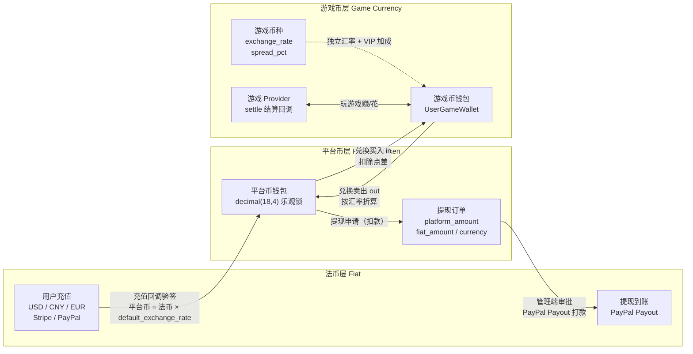
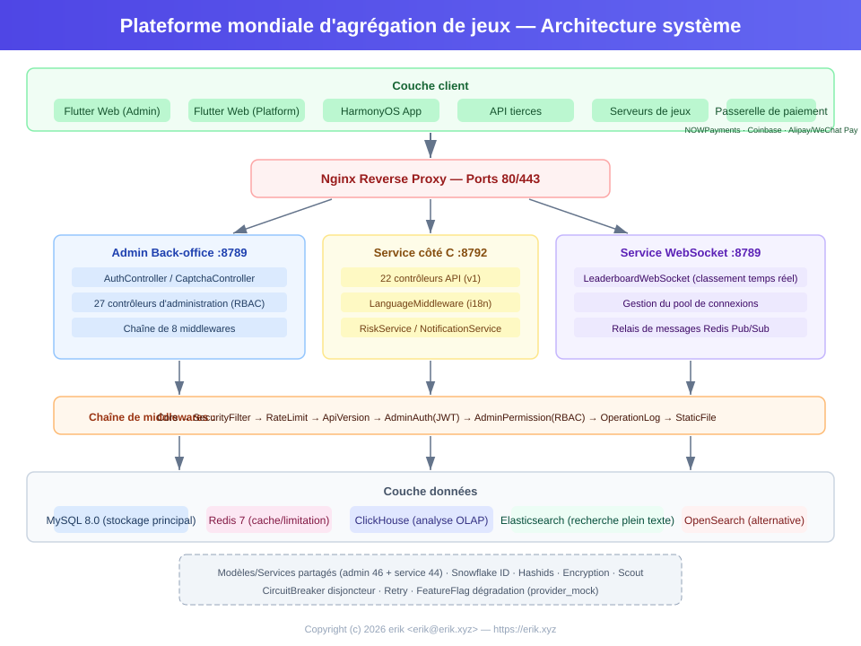
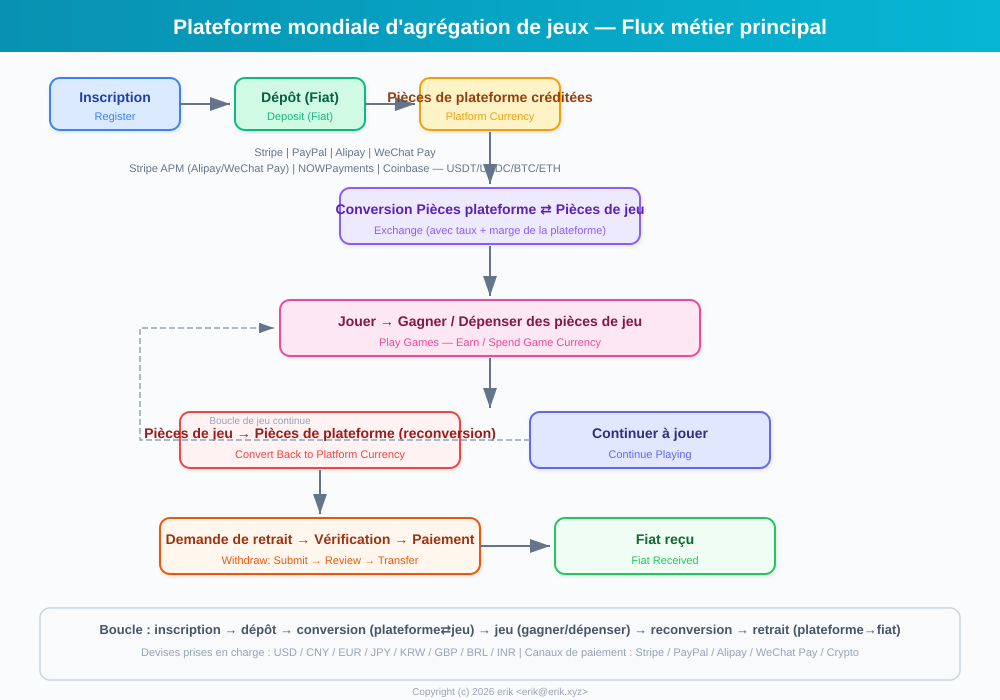
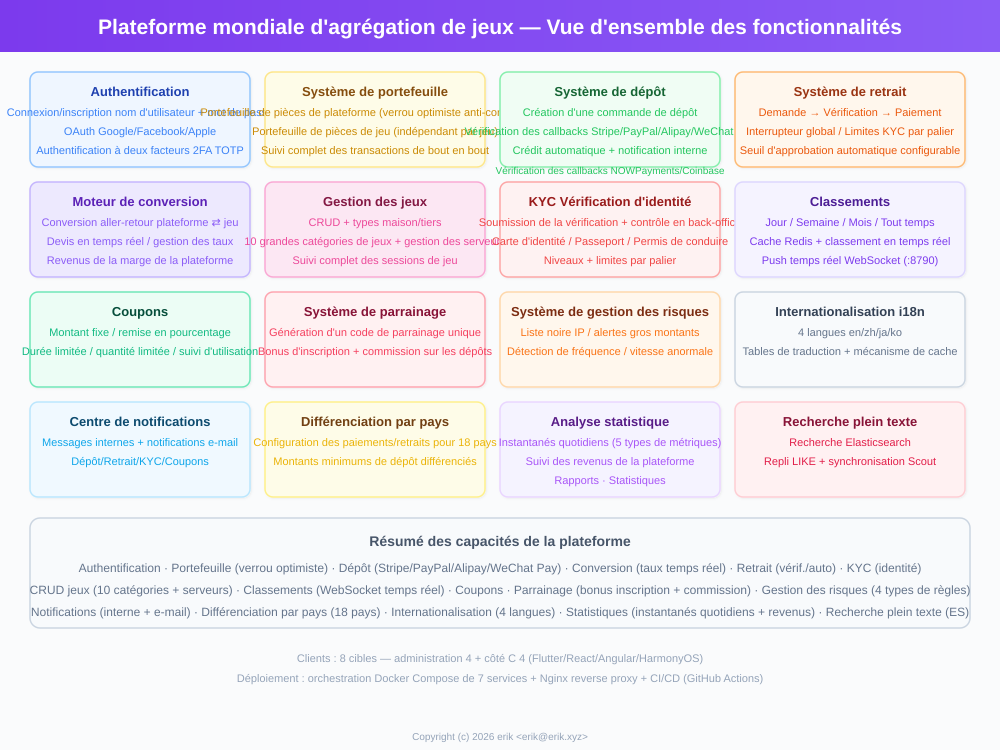
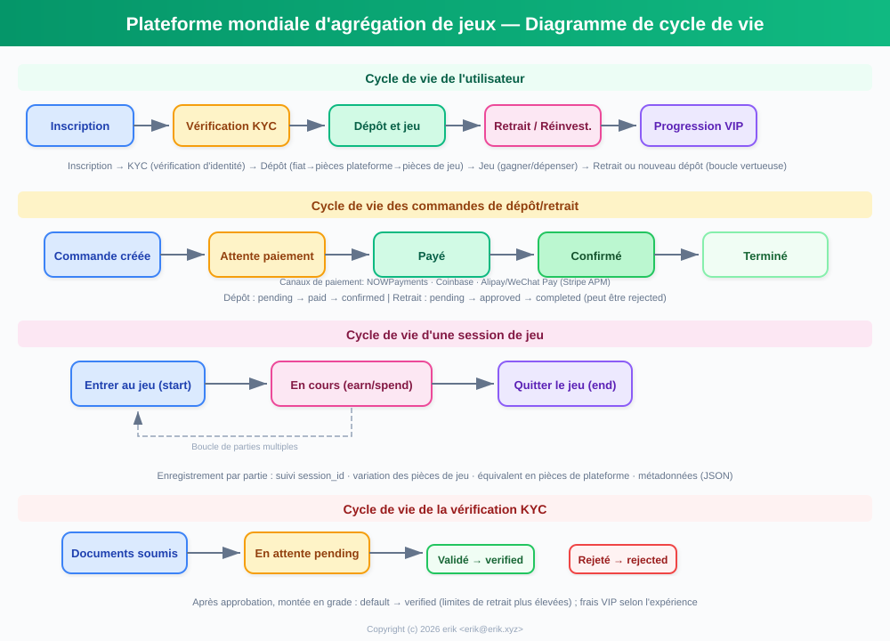
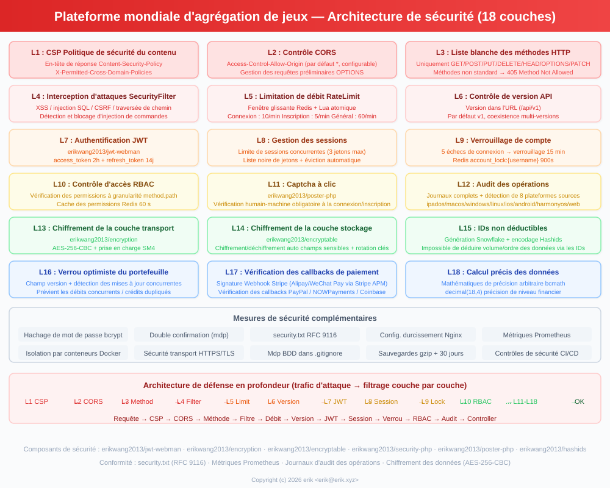
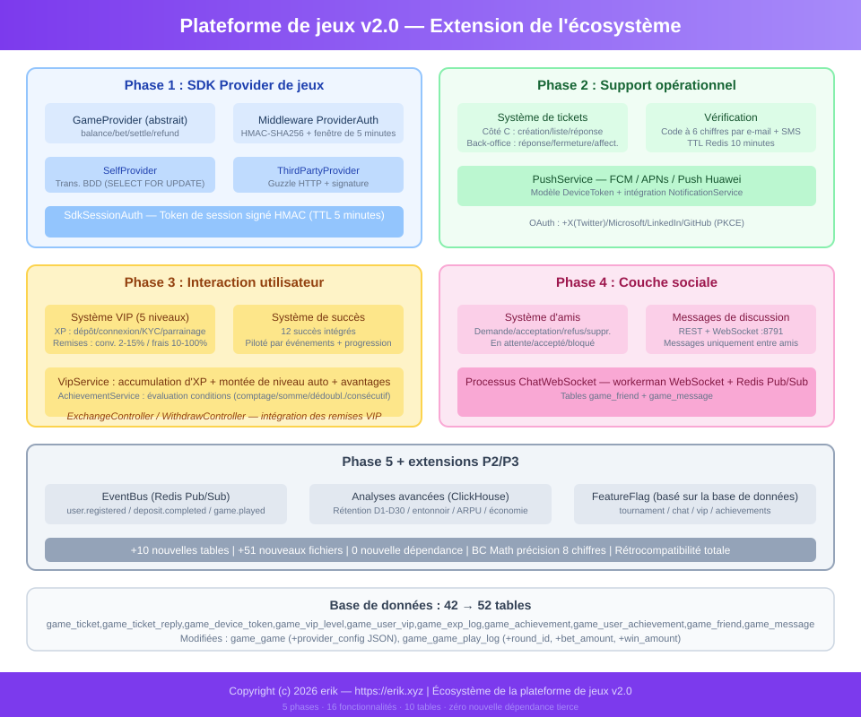

# 全球游戏聚合平台 (Global Game Platform)
<!-- lang-nav -->

Languages: [中文](../../README.md) · [English](README.en.md) · [한국어](README.ko.md) · [Русский](README.ru.md) · [Deutsch](README.de.md) · **Français** · [Español](README.es.md) · [Português](README.pt.md) · [हिन्दी](README.hi.md) · [العربية](README.ar.md) · [বাংলা](README.bn.md) · [Bahasa Indonesia](README.id.md) · [日本語](README.ja.md)


> Copyright (c) 2026 erik <erik@erik.xyz> — https://erik.xyz

Plateforme de jeux mondiale, universelle et internationalisée. Après inscription, l'utilisateur recharge des devises de la plateforme, joue et gagne des devises de jeu, qui peuvent être reconverties dans le portefeuille et retirées. Le backend propose une gestion complète des jeux, la validation des retraits, la gestion des utilisateurs et la gestion des paiements. Bascule multilingue (anglais/chinois).

## Stratégie de versions

| Version | Objectif | Statut |
|------|------|------|
| Version complète | Le tout : classements, coupons, catégories de jeux, configuration par pays, recherche ES | Terminée |
| Extension d'écosystème | v2.0 : intégration des providers de jeux, tickets, VIP, succès, social, bus d'événements | Terminée |

## Pile technologique

### Backend
- PHP 8.3+, webman v2 (workerman/webman)
- MySQL 8.0+ (préfixe de tables `game_`, clés primaires BIGINT non auto-incrémentées)
- Redis (Session / Cache / Limitation de débit)
- ClickHouse (analyse OLAP / calcul de probabilités)
- Elasticsearch (recherche plein texte)
- Authentification JWT + contrôle d'accès RBAC
- Chiffrement des données : AES-256-CBC au niveau transport API + AES-128-ECB au niveau stockage base de données

### Frontend
- Flutter 3.x (style PC Web)
- HarmonyOS ArkTS (mobile)
- Mise en page réactive (Phone / Tablet / Desktop)
- Internationalisation (i18n) : bascule anglais / chinois simplifié

### Composants clés
- `erikwang2013/snowflake-php` — génération d'ID BIGINT uniques globaux
- `erikwang2013/hashids` — chiffrement/déchiffrement des ID au niveau API
- `erikwang2013/jwt-webman` — authentification JWT
- `erikwang2013/encryption` — chiffrement/déchiffrement des données sensibles de l'API
- `erikwang2013/encryptable` — chiffrement/déchiffrement des champs sensibles en base de données
- `erikwang2013/webman-scout` — synchronisation et requêtes Elasticsearch
- `erikwang2013/season` — drapeaux des pays
- `erikwang2013/security-php` — détection par outils de sécurité
- `erikwang2013/poster-php` — vérification aléatoire des opérations sensibles
- `erikwang2013/clickhouse-php` — connexion ClickHouse et calcul de probabilités

## Structure du projet

```
game-platform-php/
├── admin/                     # Backend d'administration (webman v2, port 8787)
│   ├── app/admin/controller/  #   Contrôleurs du panneau d'administration
│   ├── app/middleware/        #   Middlewares (Cors/Security/RateLimit/Auth/ProviderAuth)
│   ├── app/provider/          #   Couche des providers de jeux
│   ├── app/event/             #   Bus d'événements (EventBus Redis Pub/Sub) (Cors/Security/RateLimit/Auth/Permission/ProviderAuth)
│   ├── app/provider/          #   Couche des providers de jeux (Self/ThirdParty/Factory)
│   ├── app/middleware/        #   Middlewares (Cors/Security/RateLimit/Auth/ProviderAuth)
│   ├── app/provider/          #   Couche des providers de jeux
│   ├── app/event/             #   Bus d'événements (EventBus Redis Pub/Sub) (Cors/Security/RateLimit/Auth/Permission)
│   ├── config/                #   Fichiers de configuration
│   ├── install/   #   Fichiers de migration SQL
│   └── apps/flutter/          #   Backend d'administration Flutter Web PC
│
├── service/                   # Backend métier côté client C (webman v2, port 8788)
│   ├── app/api/v1/controller/ #   Contrôleurs API côté C
│   ├── app/middleware/        #   Middlewares (Cors/Security/RateLimit/Auth/ProviderAuth)
│   ├── app/provider/          #   Couche des providers de jeux
│   ├── app/event/             #   Bus d'événements (EventBus Redis Pub/Sub)
│   └── config/                #   Fichiers de configuration
│
├── install/                   # Assistant d'installation en un clic
│   ├── index.php              #   Point d'entrée de l'installation
│   ├── Installer.php          #   Logique principale de l'installation
│   ├── install.sql            #   SQL d'installation fusionné (43 tables + données de seed)
│   └── assets/                #   Ressources statiques
│
├── admin/common/ 与 service/common/   # Une copie des services partagés de chaque côté (DepositLogService etc., en attente d'extraction vers un package partagé)
│   └── service/               #   Services partagés (dont calcul de probabilités ClickHouse)
│
├── apps/
│   └── flutter/platform/      # Plateforme utilisateur Flutter Web PC côté C
│
├── docs/                      # Documentation du projet
│   ├── ARCHITECTURE.md        #   Document d'architecture
│   ├── ARCHITECTURE-DESIGN.md #   Document de conception d'architecture
│   ├── FEATURES.md            #   Document des fonctionnalités
│   ├── FEATURE-DESIGN.md      #   Document de conception fonctionnelle
│   └── API.md                 #   Documentation des interfaces
│
└── admin/docs/superpowers/    # Normes de développement et plans
    ├── specs/                 #   Spécifications de conception
    └── plans/                 #   Plans d'implémentation
```

## Démarrage rapide

### Prérequis
- PHP 8.1+
- MySQL 8.0+
- Redis 6.0+
- Composer 2.x
- Flutter SDK 3.x (frontend, optionnel)

### Méthode 1 : assistant d'installation en un clic (recommandé)

```bash
# 1. Démarrer l'assistant d'installation
php -S 0.0.0.0:8888 -t install/

# 2. Ouvrir http://localhost:8888 dans le navigateur
#    Suivre l'assistant : vérification de l'environnement → configuration de la base de données → compte administrateur → installation automatique

# 3. Installer les dépendances
cd admin && composer install && cd ..
cd service && composer install && cd ..

# 4. Démarrer les services
cd admin && php start.php start -d && cd ..
cd service && php start.php start -d && cd ..

# 5. Accéder au backend d'administration : http://localhost:8787
#    Se connecter avec le compte administrateur défini lors de l'installation

# 6. Supprimer le répertoire d'installation une fois terminé (sécurité)
rm -rf install/
```

L'assistant d'installation effectue automatiquement :
- la vérification de l'environnement (version PHP, extensions, permissions des répertoires) ;
- la création de la base de données et des tables (SQL fusionné, 43 tables + données de seed) ;
- la création du compte super-administrateur (chiffré bcrypt) ;
- la génération automatique des clés JWT/chiffrement et leur écriture dans le fichier .env ;
- la génération de install.lock pour empêcher une réinstallation.

### Méthode 2 : installation manuelle

<details>
<summary>Déplier les étapes d'installation manuelle</summary>

#### 1. Initialisation de la base de données

```bash
# Importer le SQL fusionné en une commande
mysql -u root -e "CREATE DATABASE IF NOT EXISTS game-platform CHARACTER SET utf8mb4 COLLATE utf8mb4_unicode_ci;"
mysql -u root game-platform < install/install.sql
```

#### 2. Configuration des variables d'environnement

```bash
# Backend d'administration
cd admin
cp .env.example .env
# Modifier les informations de connexion et les clés dans .env

# Backend métier côté C
cd ../service
cp .env.example .env
# Modifier les informations de connexion et les clés dans .env
```

#### 3. Démarrage du backend

```bash
cd admin && composer install && php start.php start -d
cd ../service && composer install && php start.php start -d
```

#### 4. Création de l'administrateur

Il faut insérer manuellement le compte administrateur dans la base de données (mot de passe chiffré en bcrypt).

</details>

### Démarrage du frontend (optionnel)

```bash
# Backend d'administration (Flutter Web PC)
cd admin/apps/flutter
flutter pub get
flutter run -d chrome

# Plateforme utilisateur côté C (Flutter Web PC)
cd apps/flutter/platform
flutter pub get
flutter run -d chrome
```

### Vérification

```bash
# Tester le backend d'administration
curl http://localhost:8787/health

# Tester le backend métier côté C
curl http://localhost:8788/health

# Tester l'inscription d'un utilisateur
curl -X POST http://localhost:8788/api/auth/register \
  -H "Content-Type: application/json" \
  -d '{"username":"testuser","password":"123456"}'
```

## Caractéristiques de sécurité

- **Défense en profondeur sur 18 couches** : détection et blocage XSS/injection SQL/CSRF/traversée de chemin/injection de commandes
- **Liste blanche des méthodes HTTP** : seuls GET/POST/PUT/DELETE/OPTIONS/HEAD sont autorisés
- **Authentification JWT** : access_token 2h + refresh_token 14j, limitation des sessions concurrentes
- **Validation des clés JWT au démarrage** : clés indépendantes `ADMIN_JWT_SECRET_KEY` côté admin et `SERVICE_JWT_SECRET_KEY` côté service ; le démarrage est refusé si elles manquent ou restent à leur valeur par défaut
- **Fail-closed des rappels de paiement** : liste blanche des providers (stripe/paypal uniquement) + refus systématique en cas de clé non configurée/échec de vérification de signature/dépassement de l'horodatage + contrôle des montants via bccomp + enregistrement transactionnel des rappels
- **Permissions RBAC** : contrôle d'accès à granularité method.path, cache Redis 60s
- **Captcha cliquable** : vérification homme-machine obligatoire à la connexion/inscription
- **Double confirmation du mot de passe** : saisie du mot de passe requise pour les opérations sensibles
- **Chiffrement des données** : AES-256-CBC au niveau transport + AES-128-ECB au niveau stockage
- **Chiffrement des ID** : génération Snowflake + encodage Hashids, non rétro-déductibles de l'extérieur
- **Verrouillage optimiste du portefeuille** : prévention des débits concurrents / crédits en double
- **Audit des opérations** : journal complet des opérations, détection automatique des 8 sources de plateforme
- **Limitation de débit** : fenêtre glissante Redis, atomique via Lua
- **En-tête CSP** : Content-Security-Policy contre le XSS
- **Sécurité du compte** : 5 échecs de connexion consécutifs → verrouillage 15 minutes

## Tests

```bash
cd admin
phpunit --bootstrap tests/bootstrap.php tests/
```

- PHPUnit 12.x, 116 cas de test
- 56 tests de logique métier (PlatformTest) + 60 tests d'infrastructure
- Couverture : précision bcmath, calcul d'échange, frais de retrait, plafonds, gestion des risques, coupons, KYC, i18n

## Aperçu des capacités de la plateforme

| Capacité | Description |
|------|------|
| Authentification utilisateur | Nom d'utilisateur + mot de passe + OAuth 7 plateformes (Google/Facebook/Apple/X(Twitter)/Microsoft/LinkedIn/GitHub) + 2FA TOTP |
| Portefeuille | Portefeuille de devises de plateforme (verrou optimiste) + portefeuille de devises de jeu + historique des transactions |
| Recharge | Création de commande + vérification des rappels Stripe/PayPal + crédit automatique |
| Échange | Devises de plateforme ⇄ devises de jeu, cotation en temps réel, gain sur l'écart |
| Retrait | Demande → validation → paiement, interrupteur global, plafonds KYC par paliers + frais |
| KYC | Soumission de vérification d'identité + validation, système de certification à trois niveaux |
| Jeux | CRUD + catégories (10) + serveurs + suivi des parties |
| Recherche | Recherche plein texte Elasticsearch (avec repli LIKE) |
| Classements | Quotidien/hebdomadaire/mensuel/général, cache Redis, push temps réel WebSocket (8789) |
| Coupons | Montant fixe + remise proportionnelle, limites de temps et de quantité, suivi d'obtention et d'utilisation |
| Notifications | Messages internes + e-mails, notifications automatiques recharge/retrait/KYC/coupon |
| Parrainage | Code de parrainage, récompense d'inscription, commission sur recharges |
| Gestion des risques | Liste noire IP / alertes gros montants / détection de fréquence / de vitesse |
| Internationalisation | 4 langues (en-US/zh-CN/ja-JP/ko-KR), table de traduction + cache |
| Configuration par pays | Moyens de paiement/retrait différenciés pour 8 pays, montant minimum de recharge |
| Statistiques | Instantanés statistiques quotidiens (5 types de métriques) + suivi des revenus de la plateforme |
| Captcha | Vérification homme-machine cliquable (poster-php) |
| Intégration de jeux | SDK Provider (Self+ThirdParty) + signature HMAC-SHA256 + passerelle de rappels |
| Tickets | Création/réponse côté C + traitement/attribution/fermeture côté admin |
| VIP | 5 niveaux de fidélité, accumulation d'expérience, remise d'échange/exemption de frais de retrait/bonus de taux |
| Succès | 12 succès intégrés, détection pilotée par événements, suivi de progression |
| Social | Système d'amis + messagerie privée temps réel WebSocket (port 8791), seuls les amis peuvent écrire |
| Tournois | Système de tournois (interrupteur FeatureFlag) + classement + plafond de participants |
| Commission | Partage des revenus de parrainage à deux niveaux (taux de commission configurable) |
| Coupons | Restrictions conditionnelles (min_deposit/first_user/game_id) |
| Événements | Bus d'événements Redis Pub/Sub + livraison d'abonnements Webhook (7 types d'événements) |
| Déploiement | Orchestration Docker Compose 8 services + proxy inverse Nginx |
| Clients | Flutter Admin (15 pages) + Platform (10 pages) + HarmonyOS (5 pages) |

## Modèle métier

```
Devise fiduciaire (USD/CNY/EUR...)
  │  Recharge (Stripe/PayPal/Alipay/WeChat)
  ▼
Devises de plateforme (unifiées, précision decimal(18,4))
  │  Échange (taux + écart prélevé par la plateforme)
  ▼
Devises de jeu (indépendantes par jeu, taux indépendants)
  │  Jouer pour gagner/dépenser
  ▼
Devises de plateforme ← reconversion → Retrait (validation/automatique)
```

## Règlement multi-devises

La plateforme adopte un système de règlement à trois niveaux de devises isolés « devise fiduciaire → devises de plateforme → devises de jeu » : recharge dans plusieurs devises fiduciaires (USD/CNY/EUR), chaque jeu disposant de sa propre devise de référence ; tous les calculs de montants utilisent l'arithmétique haute précision bcmath, éliminant les erreurs de virgule flottante.

### Modèle à trois niveaux de devises

| Niveau | Devise | Description |
|------|------|------|
| Niveau fiduciaire | USD / CNY / EUR | Devises de paiement réelles de la recharge/retrait, traitées par Stripe / PayPal |
| Niveau devises de plateforme | Devises de plateforme (unifiées sur toute la plateforme) | Devise de règlement interne unifiée (decimal(18,4)), verrou optimiste du portefeuille contre les débits concurrents / crédits en double |
| Niveau devises de jeu | Devise indépendante par jeu | Taux `exchange_rate` et écart `spread_pct` indépendants par jeu, portefeuille de devises de jeu indépendant |

### Chemins de règlement

- **Règlement de la recharge** : l'utilisateur paie en devise fiduciaire (vérification des rappels Stripe / PayPal, anti-doublon idempotent) → conversion en devises de plateforme selon `default_exchange_rate`, la commande de recharge enregistre simultanément `amount + currency + platform_amount`
- **Règlement de l'échange** : cotation (quote) en temps réel des devises de plateforme ⇄ devises de jeu au taux de la devise du jeu, prélèvement de l'écart `spread_pct` comme gain de la plateforme, les VIP bénéficient de remises d'échange et de bonus de taux
- **Règlement du jeu** : le provider de jeu crédite/débite les devises de jeu de l'utilisateur via le rappel `/api/provider/settle` (signature HMAC-SHA256), règlement automatique à l'expiration de la session de jeu
- **Règlement du retrait** : débit des devises de plateforme → création de la commande de retrait (enregistrement de `platform_amount / fiat_amount / currency`) → approbation côté admin → paiement PayPal Payout → synchronisation du statut du lot jusqu'à complétion

### Schéma du règlement



## Schéma d'architecture



## Processus métier clés



## Panorama des fonctionnalités



## Cycle de vie



## Architecture de sécurité



## Extension d'écosystème (v2.0)



## Index de la documentation

| Document | Description |
|------|------|
| [Comparaison des versions](../VERSIONS.fr.md) | Comparaison des fonctionnalités édition de base/standard/complète |
| [Document de conception d'architecture](../ARCHITECTURE-DESIGN.fr.md) | Justifications des choix d'architecture et décisions de conception |
| [Document d'architecture](../ARCHITECTURE.fr.md) | Topologie du système, architecture des modules, flux de données |
| [Document de conception fonctionnelle](../FEATURE-DESIGN.fr.md) | Modèle métier, spécifications fonctionnelles, conception des processus |
| [Document des fonctionnalités](../FEATURES.fr.md) | Liste des fonctionnalités, description des modules, parcours utilisateur |
| [Documentation des interfaces](../API.fr.md) | Référence API complète (102 interfaces) |
| [Documentation en ligne](http://localhost:8788/apidoc/) | Documentation interactive hg/apidoc (côté C) |
| [Documentation en ligne](http://localhost:8787/apidoc/) | Documentation interactive hg/apidoc (back-end d'administration) |
| [Installation de ClickHouse](../CLICKHOUSE_INSTALL.fr.md) | Installation/configuration/migration/vérification de ClickHouse |
| [Document d'intégration du SDK Provider](../PROVIDER-SDK.fr.md) | Guide d'intégration des jeux tiers (algorithme de signature + exemples PHP/Go/Python) |
| [Utilisation de ClickHouse](../CLICKHOUSE_USAGE.fr.md) | 4 API de services ClickHouse et tableau de bord backend |
| [Document de déploiement](../DEPLOYMENT.fr.md) | Guide de déploiement (Docker + manuel + Nginx + surveillance) |
| [Spécifications de conception](../../admin/docs/superpowers/specs/2026-05-22-game-platform-design.fr.md) | Spécifications de conception complètes |
| [Plan d'implémentation](../../admin/docs/superpowers/plans/2026-05-22-game-platform-plan.fr.md) | Plan d'implémentation détaillé |

---

## Soutenir le projet

Si ce projet vous est utile, n'hésitez pas à offrir un café à l'auteur ☕

<p align="center">
  <table align="center" border="0" cellspacing="0" cellpadding="0">
    <tr>
      <td align="center" width="200">
        <br>
        <b>微信支付</b>
      </td>
      <td align="center" width="200">
        <br>
        <b>支付宝</b>
      </td>
    </tr>
  </table>
</p>

### Virement bancaire mondial (Global Bank Transfer)

**Informations du bénéficiaire (Recipient)**

| Élément | Contenu |
|----|------|
| Nom du bénéficiaire (Beneficiary Name) | WANG KEXUN |
| Numéro de compte (Account Number) | 881015918251 |

**Banque du bénéficiaire (Beneficiary Bank)**

| Élément | Contenu |
|----|------|
| Code SWIFT | AABLHKHHXXX |
| Nom de la banque (Bank Name) | ZA Bank Limited |
| Code banque (Bank Code) | 387 |
| Adresse de la banque (Bank Address) | Core F, Cyberport 3, 100 Cyberport Road, Hong Kong |

**Banque correspondante pour les virements transfrontaliers (Correspondent Bank, si nécessaire)**

> À noter : il s'agit des informations de la banque correspondante (banque intermédiaire) pour les virements transfrontaliers, et non de la banque du bénéficiaire. Veuillez demander à votre banque émettrice si les informations de la banque correspondante sont requises.

- **La banque correspondante pour les virements en dollars de Hong Kong, renminbi et dollars américains est Citibank :**
  - Nom de la banque : Citibank N.A. Hong Kong
  - Code SWIFT : CITIHKHXXXX
  - Code banque : 006
  - Nom de la succursale : Hong Kong Branch
  - Numéro de succursale : 391
  - Adresse de la banque : Citibank Tower, Citibank Plaza, 3 Garden Road, Central, Hong Kong
- **La banque correspondante pour les virements dans d'autres devises est BNY Mellon :**
  - Nom de la banque : THE BANK OF NEW YORK MELLON
  - Code SWIFT : IRVTUS3NXXX
  - Adresse de la banque : THE BANK OF NEW YORK MELLON, 240 GREENWICH STREET, NEW YORK, United States

### Don en cryptomonnaie (Crypto Donation)

Si ce projet vous est utile, scannez le code QR pour faire un don, merci !

| Réseau (Network) | Code QR (QR Code) | Adresse du portefeuille (Wallet Address) |
|---|---|---|
| BNB Smart Chain (BEP20) | [](../coin/1.jpg) | `0x355d429f97511897ccb4e271ec888205f9ab6629` |
| Tron (TRC20) | [](../coin/2.jpg) | `TEdDHWLajt1XvqtPDWmQctdrJaC3pzZZzz` |
| Ethereum (ERC20) | [](../coin/3.jpg) | `0x355d429f97511897ccb4e271ec888205f9ab6629` |
| Aptos | [](../coin/4.jpg) | `0x836e3780edfc3f7b2372b39e2a1a3a5d7adfaccd96c726f21cfde1b50dd68030` |
| Plasma | [](../coin/5.jpg) | `0x355d429f97511897ccb4e271ec888205f9ab6629` |
| Polygon POS | [](../coin/6.jpg) | `0x355d429f97511897ccb4e271ec888205f9ab6629` |
| Solana | [](../coin/7.jpg) | `2hfhboHdmdrYsY25XfQSsEWxq5ip4EQsR7f4AzSRMUyr` |
| The Open Network (TON) | [](../coin/8.jpg) | `UQB9kFQohzmXUir9QSSZq01iwl9aQZIDdBpNmDklljRtCoGK` |
| Arbitrum One | [](../coin/9.jpg) | `0x355d429f97511897ccb4e271ec888205f9ab6629` |
| AVAX C-Chain | [](../coin/10.jpg) | `0x355d429f97511897ccb4e271ec888205f9ab6629` |


## Mascotte du projet


**Dicey** — Mascotte de la plateforme. Le dé représente les jeux et le gameplay basé sur la probabilité, la pièce l'économie de la plateforme et les passerelles de paiement multiples, et le violet reflète l'identité du panneau d'administration. Fichier SVG : `docs/mascot.svg`, redimensionnable à l'infini pour la documentation, les logos et les produits dérivés.
