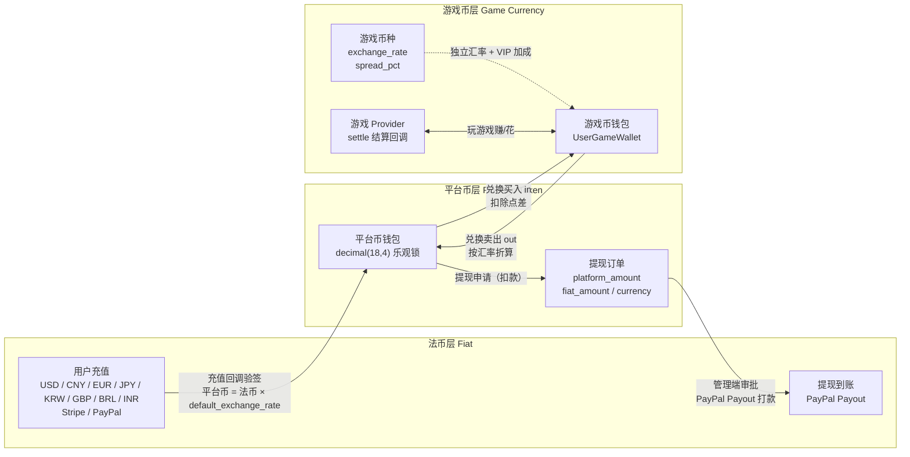

# वैश्विक गेम एग्रीगेशन प्लेटफ़ॉर्म (Global Game Platform)

## प्रोजेक्ट मास्कट


**डाइसी (Dicey)** — प्लेटफ़ॉर्म मास्कट। पासा गेम और संभावना-आधारित गेमप्ले को दर्शाता है, सिक्का प्लेटफ़ॉर्म अर्थव्यवस्था और मल्टी-पेमेंट गेटवे को, और बैंगनी रंग एडमिन ब्रांडिंग को दर्शाता है। SVG फ़ाइल: `docs/mascot.svg`, दस्तावेज़ों, लोगो और सामान के लिए असीमित स्केलेबल।
<!-- lang-nav -->

Languages: [中文](../../README.md) · [English](README.en.md) · [한국어](README.ko.md) · [Русский](README.ru.md) · [Deutsch](README.de.md) · [Français](README.fr.md) · [Español](README.es.md) · [Português](README.pt.md) · **हिन्दी** · [العربية](README.ar.md) · [বাংলা](README.bn.md) · [Bahasa Indonesia](README.id.md) · [日本語](README.ja.md)

> Copyright (c) 2026 erik <erik@erik.xyz> — https://erik.xyz

वैश्विक, अंतरराष्ट्रीय गेम एग्रीगेशन प्लेटफ़ॉर्म। पंजीकरण के बाद उपयोगकर्ता प्लेटफ़ॉर्म पर टॉप-अप करके गेम कॉइन खरीदते हैं, गेम कॉइन से गेम खेलकर अर्जित करते हैं, और गेम कॉइन को वापस वॉलेट में ट्रांसफर करके निकाल सकते हैं। बैकएंड में गेम प्रबंधन, निकासी ऑडिट, उपयोगकर्ता प्रबंधन और भुगतान प्रबंधन की पूर्ण सुविधाएँ उपलब्ध हैं। बहुभाषा स्विचिंग (अंग्रेज़ी/चीनी) का समर्थन करता है।

## संस्करण नीति

| संस्करण | लक्ष्य | स्थिति |
|------|------|------|
| पूर्ण संस्करण | संपूर्ण: लीडरबोर्ड, कूपन, गेम श्रेणियाँ, देश कॉन्फ़िगरेशन, ES खोज | पूर्ण |
| पारिस्थितिकी विस्तार | v2.0: गेम Provider एकीकरण, टिकट, VIP, उपलब्धियाँ, सोशल, इवेंट बस | पूर्ण |
| v1.3.15-22 (8 संस्करण) | समाधान/निपटान, गहन जोखिम नियंत्रण, एकीकृत वॉलेट, गतिविधि इंजन, एंटी-चीट, सोशल ग्रोथ, Adyen/GrabPay | पूर्ण |

## प्रौद्योगिकी स्टैक

### बैकएंड
- PHP 8.3+, webman v2 (workerman/webman)
- MySQL 8.0+ (तालिका उपसर्ग `game_`, BIGINT गैर-ऑटो-इन्क्रीमेंट प्राथमिक कुंजी)
- Redis (सत्र / कैश / दर सीमा)
- ClickHouse (OLAP विश्लेषण / संभाव्यता गणना)
- Elasticsearch (पूर्ण-पाठ खोज)
- JWT प्रमाणीकरण + RBAC अनुमति नियंत्रण
- डेटा एन्क्रिप्शन: API ट्रांसमिशन परत AES-256-CBC + डेटाबेस स्टोरेज परत AES-128-ECB

### फ्रंटएंड

फ़्रंटएंड की दो अलग निर्देशिका-वृक्ष हैं, **हर एक केवल अपनी ओर की बैकएंड कॉल करती है**, कोई क्रॉसओवर नहीं:

| निर्देशिका वृक्ष | भूमिका | अनुरोध उपसर्ग | संबंधित बैकएंड | तकनीकी स्टैक |
|--------|------|---------|---------|--------|
| `apps/*` | **C-छोर खिलाड़ी प्लेटफ़ॉर्म** | `/api/v1/...` | service (डिफ़ॉल्ट 8792) | Flutter Web / React 19 (Vite) / Angular 21 / HarmonyOS ArkTS |
| `admin/apps/*` | **एडमिन कंसोल** | `/admin/v1/...` | admin (डिफ़ॉल्ट 8789) | Flutter Web / React 19 (Vite) / Angular 21 / HarmonyOS ArkTS |

- रिस्पॉन्सिव लेआउट (Phone / Tablet / Desktop)
- अंतर्राष्ट्रीयकरण (i18n): अंग्रेज़ी / सरलीकृत चीनी स्विच

### मुख्य घटक
- `erikwang2013/snowflake-php` — वैश्विक अद्वितीय BIGINT ID जनरेटर
- `erikwang2013/hashids` — API परत ID एन्क्रिप्शन/डिक्रिप्शन
- `erikwang2013/jwt-webman` — JWT प्रमाणीकरण
- `erikwang2013/encryption` — API संवेदनशील डेटा एन्क्रिप्शन/डिक्रिप्शन
- `erikwang2013/encryptable` — डेटाबेस संवेदनशील फ़ील्ड एन्क्रिप्शन/डिक्रिप्शन
- `erikwang2013/webman-scout` — Elasticsearch सिंक और क्वेरी
- `erikwang2013/season` — देश के झंडे
- `erikwang2013/security-php` — सुरक्षा उपकरण जांच
- `erikwang2013/poster-php` — संवेदनशील ऑपरेशन के लिए यादृच्छिक सत्यापन
- `erikwang2013/clickhouse-php` — ClickHouse कनेक्शन और संभाव्यता गणना

## प्रोजेक्ट संरचना

```
game-platform-php/
├── admin/                     # एडमिन बैकएंड (webman v2, डिफ़ॉल्ट पोर्ट 8789, APP_PORT से कॉन्फ़िगर करने योग्य)
│   ├── app/admin/v1/controller/  #   एडमिन-पक्ष के कंट्रोलर
│   ├── app/middleware/        #   मिडलवेयर (Cors/SecurityFilter/RateLimit/AdminAuth/AdminPermission/OperationLog)
│   ├── app/model/             #   केवल admin में मौजूद मॉडल (8; बाकी 52 साझा मॉडल packages/ में)
│   ├── app/service/           #   केवल admin में मौजूद सेवाएँ (WalletService/WalletScope/RiskSandboxService)
│   ├── app/process/           #   स्थायी प्रोसेस (Http/Monitor/RiskIpCron)
│   ├── app/provider/          #   गेम Provider परत (Self/ThirdParty/Factory)
│   ├── app/activity/          #   एक्टिविटी इंजन (चेक-इन/रेफ़रल/दैनिक कार्य)
│   ├── app/event/             #   इवेंट बस (EventBus Redis Pub/Sub)
│   ├── config/                #   कॉन्फ़िगरेशन फ़ाइलें
│   └── apps/                  #   एडमिन फ़्रंटएंड (4 रूप, /admin/v1 → admin:8789 पर कॉल)
│       ├── flutter/           #     Flutter Web PC एडमिन पैनल
│       ├── react/             #     React 19 (Vite) एडमिन कंसोल
│       ├── angular/           #     Angular 21 एडमिन कंसोल
│       └── harmonyos/         #     HarmonyOS ArkTS एडमिन कंसोल (.hap, nginx से नहीं गुज़रता)
│
├── service/                   # C-एंड व्यवसाय सेवा (webman v2, डिफ़ॉल्ट पोर्ट 8792, APP_PORT से कॉन्फ़िगर करने योग्य)
│   ├── app/api/v1/controller/ #   C-छोर API कंट्रोलर
│   ├── app/middleware/        #   मिडलवेयर (TraceId/Cors/SecurityFilter/RateLimit/LanguageMiddleware/UserAuth/ProviderAuth/SdkSessionAuth)
│   ├── app/model/             #   केवल service में मौजूद मॉडल (10; बाकी 52 साझा मॉडल packages/ में)
│   ├── app/service/           #   केवल service में मौजूद सेवाएँ (वॉलेट/जोखिम/अनुपालन/मिलान/पुश/उपलब्धियाँ/एंटी-चीट आदि)
│   ├── app/payment/           #   18 पेमेंट गेटवे अडैप्टर (Stripe/PayPal/Adyen/NowPayments/Skrill…) + GatewayFactory
│   ├── app/cdn/               #   पाँच विक्रेताओं के CDN अडैप्टर (Cloudflare/CloudFront/Alibaba/Tencent/Huawei) + CdnFactory
│   ├── app/process/           #   स्थायी प्रोसेस (Http/Monitor/LeaderboardWS:8790/ChatWS:8791/EventConsumer/EventSubscriber/AntiCheatWorker/GroupSweepWorker/Health)
│   ├── app/provider/          #   गेम Provider परत
│   ├── app/activity/          #   एक्टिविटी इंजन
│   ├── app/event/             #   इवेंट बस (EventBus Redis Pub/Sub)
│   └── config/                #   कॉन्फ़िगरेशन फ़ाइलें
│
├── packages/platform-common/  # साझा परत: admin और service इसे composer path रिपॉज़िटरी से जोड़ते हैं, दो प्रतियाँ न रखने के लिए
│   ├── src/model/             #   साझा Eloquent मॉडल (52, दोनों ओर एक ही स्रोत)
│   ├── src/service/           #   साझा सेवाएँ (DepositLogService / VipService आदि, कुल 11, ClickHouse प्रायिकता गणना सहित)
│   ├── src/BcMath.php         #   राशि/दर की उच्च-परिशुद्धता गणना (bcmath रैपर), राउंडिंग, प्रतिशत
│   ├── src/EncryptionService.php  #   AES एन्क्रिप्शन/डिक्रिप्शन और मास्किंग
│   ├── src/CircuitBreaker.php #   सर्किट ब्रेकर (साथ में Retry.php पुनःप्रयास हेतु)
│   ├── src/HashidsService.php #   API परत का ID एन्कोड/डिकोड
│   └── src/SnowflakeService.php   #   वैश्विक रूप से अद्वितीय BIGINT ID
│
├── apps/                      # C-छोर खिलाड़ी फ़्रंटएंड (4 रूप, /api/v1 → service:8792 पर कॉल)
│   ├── flutter/platform/      #   Flutter Web PC C-छोर उपयोगकर्ता प्लेटफ़ॉर्म
│   ├── react/                 #   React 19 (Vite) C-छोर
│   ├── angular/               #   Angular 21 C-छोर
│   └── harmonyos/             #   HarmonyOS ArkTS C-छोर (.hap, nginx से नहीं गुज़रता)
│
├── game/xiaoxiaole/           # अंतर्निहित मिनी गेम «ग्रामीण मैच-3»: TypeScript + Vite + Vitest, src/domain इंजन + चार स्तरों का डिज़ाइन + tests/, 13 भाषाओं में डिज़ाइन दस्तावेज़
│
├── install/                   # एक-क्लिक इंस्टॉल विज़ार्ड + डेटाबेस आरंभीकरण SQL
│   ├── index.php              #   इंस्टॉलेशन प्रवेश बिंदु
│   ├── Installer.php          #   इंस्टॉलेशन कोर लॉजिक
│   ├── install.sql            #   मर्ज किया गया इंस्टॉल SQL (MySQL पूर्ण: 78 तालिकाएँ + सीड डेटा)
│   ├── clickhouse.sql         #   ClickHouse विश्लेषणात्मक DDL (अलग इंजन, अलग से आयात)
│   ├── test-data.sql          #   डेमो/परीक्षण डेटा
│   ├── migrations/            #   मौजूदा डेटाबेस के लिए इंक्रीमेंटल अपग्रेड स्क्रिप्ट (*.sql)
│   ├── lang/ + lang.php       #   इंस्टॉल विज़ार्ड इंटरफ़ेस अनुवाद (13 भाषाएँ)
│   └── assets/                #   स्थिर संसाधन
│
├── docs/                      # परियोजना दस्तावेज़ (सभी पाठ 13 भाषाओं में: .md चीनी स्रोत है, साथ में .{lang}.md अनुवाद)
│   ├── ARCHITECTURE.md        #   आर्किटेक्चर दस्तावेज़
│   ├── ARCHITECTURE-DESIGN.md #   आर्किटेक्चर डिज़ाइन दस्तावेज़
│   ├── FEATURES.md            #   फ़ीचर दस्तावेज़
│   ├── FEATURE-DESIGN.md      #   फ़ीचर डिज़ाइन दस्तावेज़
│   ├── API.md                 #   API दस्तावेज़
│   ├── DEPLOYMENT.md          #   डिप्लॉयमेंट डॉक्यूमेंट (Docker/मैन्युअल/पोर्ट कॉन्फ़िगरेशन)
│   ├── PROVIDER-SDK.md        #   तृतीय-पक्ष गेम जोड़ने की मार्गदर्शिका (हस्ताक्षर एल्गोरिदम + PHP/Go/Python उदाहरण)
│   ├── CLICKHOUSE_INSTALL.md  #   ClickHouse इंस्टॉल/कॉन्फ़िगर/माइग्रेट/सत्यापन
│   ├── CLICKHOUSE_USAGE.md    #   ClickHouse की 4 सेवा API और एडमिन डैशबोर्ड
│   ├── translations/          #   इस README के 12 भाषाओं में अनुवाद
│   ├── diagrams/              #   आर्किटेक्चर/प्रवाह/फ़ीचर/लाइफ़साइकल/सुरक्षा/पारिस्थितिकी-विस्तार के SVG (प्रत्येक 13 भाषाओं में)
│   ├── test-reports/          #   परीक्षण रिपोर्ट (php-unit / api / resilience / ui / SUMMARY)
│   └── superpowers/           #   इस रिपॉज़िटरी के डिज़ाइन विनिर्देश और कार्यान्वयन योजनाएँ (ऐतिहासिक अभिलेख)
│
├── scripts/                   # ऑप्स स्क्रिप्ट (मॉडल ड्रिफ़्ट जाँच / apidoc एनोटेशन माइग्रेशन / exchange भुगतान अर्थ-माइग्रेशन / हस्ताक्षर सत्यापन)
├── tests/api/                 # API स्वचालित परीक्षण (run_all.sh)
├── runtime/                   # webman रनटाइम निर्देशिका (लॉग/pid, रनटाइम पर बनती है)
│
├── docker-compose.yml         # Docker Compose ऑर्केस्ट्रेशन (डिफ़ॉल्ट पोर्ट रूट .env से)
├── nginx.conf.template        # Nginx कॉन्फ़िगरेशन टेम्पलेट (upstream पोर्ट envsubst से रेंडर)
├── .env.example               # रूट .env टेम्पलेट (Docker पोर्ट वेरिएबल, उपयोग के लिए .env में कॉपी करें)
└── admin/docs/superpowers/    # विकास मानक और योजनाएँ
    ├── specs/                 #   डिज़ाइन विनिर्देश
    └── plans/                 #   कार्यान्वयन योजनाएँ
```

## त्वरित आरंभ

### पर्यावरण आवश्यकताएँ
- PHP 8.1+
- MySQL 8.0+
- Redis 6.0+
- Composer 2.x
- Flutter SDK 3.x (फ्रंटएंड, वैकल्पिक)

### विधि 1: वन-क्लिक इंस्टॉलेशन विज़ार्ड (अनुशंसित)

```bash
# 1. इंस्टॉलेशन विज़ार्ड शुरू करें
php -S 0.0.0.0:8888 -t install/

# 2. ब्राउज़र में http://localhost:8888 खोलें
#    विज़ार्ड के अनुसार पूरा करें: पर्यावरण जांच → डेटाबेस कॉन्फ़िगरेशन → एडमिन खाता सेटअप → स्वचालित इंस्टॉल

# 3. निर्भरताएँ इंस्टॉल करें
cd admin && composer install && cd ..
cd service && composer install && cd ..

# 4. सेवाएँ शुरू करें (डिफ़ॉल्ट पोर्ट admin 8789 / service 8792, संबंधित .env के APP_PORT में बदलें)
cd admin && php start.php start -d && cd ..
cd service && php start.php start -d && cd ..

# 5. एडमिन बैकएंड खोलें: http://localhost:8789 (डिफ़ॉल्ट पोर्ट)
#    इंस्टॉलेशन के समय सेट किए गए एडमिन खाते व पासवर्ड से लॉगिन करें

# 6. इंस्टॉलेशन पूरा होने पर इंस्टॉल निर्देशिका हटाएँ (सुरक्षा)
rm -rf install/
```

इंस्टॉलेशन विज़ार्ड स्वचालित रूप से पूरा करता है:
- पर्यावरण जांच (PHP संस्करण, एक्सटेंशन, निर्देशिका अनुमतियाँ)
- डेटाबेस और तालिकाओं का निर्माण (मर्ज किया गया SQL, 78 तालिकाएँ + सीड डेटा)
- सुपर एडमिन खाता बनाना (bcrypt एन्क्रिप्शन)
- JWT/एन्क्रिप्शन कुंजियाँ स्वचालित रूप से उत्पन्न कर .env फ़ाइल में लिखना
- बार-बार इंस्टॉलेशन रोकने के लिए install.lock बनाना

### विधि 2: मैन्युअल इंस्टॉलेशन

<details>
<summary>मैन्युअल इंस्टॉलेशन चरण विस्तार करें</summary>

#### 1. डेटाबेस आरंभीकरण

```bash
# वन-क्लिक में संयुक्त SQL आयात करें
mysql -u root -e "CREATE DATABASE IF NOT EXISTS game-platform CHARACTER SET utf8mb4 COLLATE utf8mb4_unicode_ci;"
mysql -u root game-platform < install/install.sql
```

#### 2. पर्यावरण चर कॉन्फ़िगर करें

```bash
# एडमिन बैकएंड
cd admin
cp .env.example .env
# .env में डेटाबेस कनेक्शन जानकारी व कुंजी संपादित करें

# C-एंड व्यवसाय सर्वर
cd ../service
cp .env.example .env
# .env में डेटाबेस कनेक्शन जानकारी व कुंजी संपादित करें
```

#### 3. बैकएंड शुरू करें

```bash
cd admin && composer install && php start.php start -d
cd ../service && composer install && php start.php start -d
```

#### 4. एडमिन बनाएं

डेटाबेस में मैन्युअल रूप से एडमिन खाता डालना आवश्यक है (पासवर्ड bcrypt से एन्क्रिप्टेड)।

</details>

### फ्रंटएंड शुरू करना (वैकल्पिक)

डेवलपमेंट में हर फ़्रंटएंड अपना dev सर्वर चलाता है; अनुरोध उसी के द्वारा संबंधित बैकएंड को भेजे जाते हैं (हर निर्देशिका के `proxy.conf.json` / `vite.config.ts` देखें):

```bash
# --- C-छोर खिलाड़ी प्लेटफ़ॉर्म (/api/v1 → service:8792) ---
cd apps/react            && npm install && npm run dev      # http://localhost:5173
cd apps/angular          && npm install && npm start        # http://localhost:4200
cd apps/flutter/platform && flutter pub get && flutter run -d chrome

# --- एडमिन कंसोल (/admin/v1 → admin:8789) ---
cd admin/apps/react      && npm install && npm run dev      # http://localhost:5273
cd admin/apps/angular    && npm install && npm start        # http://localhost:4300
cd admin/apps/flutter    && flutter pub get && flutter run -d chrome
```

> Angular dev सर्वर पोर्ट: एडमिन कंसोल `angular.json` में स्पष्ट रूप से 4300 सेट करता है, जबकि C-छोर Angular का डिफ़ॉल्ट 4200 रखता है; दोनों एक साथ चलाने के लिए किसी एक को `--port` दें।
> HarmonyOS लक्ष्य (`apps/harmonyos`, `admin/apps/harmonyos`) DevEco Studio से खोले और बनाए जाते हैं;
> एमुलेटर होस्ट बैकएंड तक `http://10.0.2.2:<port>` से पहुँचता है (प्रत्येक `ApiService.ets` के शीर्ष पर मौजूद स्थिरांक देखें)।

### फ्रंटएंड डिप्लॉयमेंट (Docker/Nginx)

`docker-compose.yml` की nginx सेवा हर फ्रंटएंड के बिल्ड आर्टिफ़ैक्ट को कंटेनर में रीड-ओनली माउंट करती है, और `nginx.conf.template` उन्हें नीचे दिए पथों पर उपलब्ध कराता है।
आर्टिफ़ैक्ट न बनाया हो तो डायरेक्टरी खाली रहती है: पथ अनुरोध 404 लौटाते हैं, और नंगी डायरेक्टरी का अनुरोध (जैसे `/app-react/`) 403 लौटाता है।

| URL | आर्टिफ़ैक्ट माउंट पॉइंट | बिल्ड कमांड |
|-----|-----------|---------|
| `/` | `apps/flutter/platform/build/web` | `flutter build web` |
| `/app-react/` | `apps/react/dist` | `npm run build` (स्क्रिप्ट में `--base=/app-react/` शामिल है) |
| `/app-angular/` | `apps/angular/dist/game-client-angular/browser` | `npm run build` (स्क्रिप्ट में `--base-href=/app-angular/` शामिल है) |
| `/admin-panel/` | `admin/public` | सामान्य प्लेसमेंट स्लॉट: किसी भी कंसोल का आर्टिफ़ैक्ट `admin/public` में कॉपी करें; न रखा हो तो भी 404 लौटता है (नंगी डायरेक्टरी 403)। ध्यान दें, आर्टिफ़ैक्ट `--base=/admin-panel/` से बना होना चाहिए (Flutter के लिए `--base-href=/admin-panel/`), वरना उसके रिसोर्स अब भी मूल प्रीफ़िक्स की ओर इशारा करेंगे और 404 देंगे। बिना स्लैश वाला रूप यहाँ 301 से रीडायरेक्ट होता है; `nginx.conf.template` में `absolute_redirect off` सेट है, इसलिए यह रीडायरेक्ट सापेक्ष Location है और 80 के अलावा किसी पोर्ट पर डिप्लॉय करने पर पोर्ट नहीं खोता |
| `/admin-react/` | `admin/apps/react/dist` | `npm run build` (स्क्रिप्ट में `--base=/admin-react/` शामिल है) |
| `/admin-angular/` | `admin/apps/angular/dist/game-admin-angular/browser` | `npm run build` (स्क्रिप्ट में `--base-href=/admin-angular/` शामिल है) |
| `/admin-flutter/` | `admin/apps/flutter/build/web` | `flutter build web --base-href=/admin-flutter/` |

`/admin/` (API) → admin कंटेनर, `/api/` (API) → service कंटेनर; HarmonyOS हिस्सा `.hap` पैकेज के रूप में बाँटा जाता है, nginx से नहीं गुज़रता।

### सत्यापन

```bash
# एडमिन बैकएंड का परीक्षण (डिफ़ॉल्ट पोर्ट 8789)
curl http://localhost:8789/health

# C-एंड व्यवसाय का परीक्षण (डिफ़ॉल्ट पोर्ट 8792)
curl http://localhost:8792/health

# उपयोगकर्ता पंजीकरण परीक्षण
curl -X POST http://localhost:8792/api/v1/auth/register \
  -H "Content-Type: application/json" \
  -d '{"username":"testuser","password":"Abcdef12"}'
```

## सुरक्षा विशेषताएँ

- **18 परत गहराई सुरक्षा**: XSS/SQL इंजेक्शन/CSRF/पाथ ट्रैवर्सल/कमांड इंजेक्शन का पता और अवरोधन
- **HTTP मेथड व्हाइटलिस्ट**: केवल GET/POST/PUT/DELETE/OPTIONS/HEAD अनुमत
- **JWT प्रमाणीकरण**: access_token 2h + refresh_token 14d, समवर्ती सत्र सीमा
- **JWT कुंजी स्टार्टअप जांच**: admin पक्ष `ADMIN_JWT_SECRET_KEY`, service पक्ष `SERVICE_JWT_SECRET_KEY` अलग-अलग कुंजियाँ; अनुपस्थित या अभी भी डिफ़ॉल्ट मान होने पर स्टार्टअप अस्वीकार करता है
- **भुगतान कॉलबैक fail-closed**: provider व्हाइटलिस्ट (केवल stripe/paypal) + कुंजी न होने/सिग्नेचर सत्यापन विफल/टाइमस्टैम्प सीमा से अधिक — सभी अस्वीकार + bccomp राशि जांच + कॉलबैक क्रेडिट ट्रांज़ैक्शनल
- **RBAC अनुमतियाँ**: method.path ग्रैन्युलैरिटी पर अनुमति नियंत्रण, Redis 60s कैश
- **क्लिक कैप्चा**: लॉगिन/पंजीकरण पर अनिवार्य मानव-सत्यापन
- **पासवर्ड पुनः पुष्टि**: संवेदनशील ऑपरेशन के लिए पासवर्ड पुष्टि आवश्यक
- **डेटा एन्क्रिप्शन**: ट्रांसमिशन परत AES-256-CBC + स्टोरेज परत AES-128-ECB
- **ID एन्क्रिप्शन**: Snowflake जनरेशन + Hashids एन्कोडिंग, बाह्य रूप से अपरिवर्तनीय
- **वॉलेट ऑप्टिमिस्टिक लॉक**: समवर्ती डेबिट/डुप्लिकेट क्रेडिट रोकता है
- **ऑपरेशन ऑडिट**: पूर्ण ऑपरेशन लॉग, 8 प्लेटफ़ॉर्म स्रोत स्वचालित पहचान
- **दर सीमा**: Redis स्लाइडिंग विंडो, Lua एटॉमिक
- **CSP हेडर**: Content-Security-Policy XSS रोकथाम
- **खाता सुरक्षा**: लगातार 5 असफल लॉगिन पर 15 मिनट लॉक

## परीक्षण

परीक्षण रिपोर्ट (स्थानीय रूप से संग्रहीत): [docs/test-reports/](../test-reports/)

| परीक्षण प्रकार | मामले/कवरेज | परिणाम |
|---------|----------|------|
| PHP यूनिट परीक्षण | वर्तमान मापन `phpunit --list-tests`: admin 200 + service 273 मामले (रिपोर्ट `docs/test-reports/php-unit.md` में 09-22 पुनर्प्रयोग admin 190 + service 273 और 08-27 स्नैपशॉट admin 153 + service 45 दर्ज है; admin पक्ष अभी विस्तारित हो रहा है) | service सभी पास (701 दावे, 3 skipped, 2 warnings + 35 deprecations); admin 437 दावे, 3 skipped, 1 विफलता (`EnvConfigTest` वास्तविक `admin/.env` जाँचता है और `REDIS_CLUSTER_NODES` नहीं मिलता; जोड़ने पर यह हरा हो जाएगा) |
| स्थिरता तंत्र परीक्षण | सर्किट ब्रेकर/पुनःप्रयास/डिग्रेडेशन स्विच, 15 मामले (CircuitBreakerTest/RetryTest/ResilienceMockTest) | सभी पास |
| स्वचालित API परीक्षण | 187 एंडपॉइंट (स्रोत: `docs/test-reports/api.md`, 2026-08-27); route.php वर्तमान में 261 एंडपॉइंट पंजीकृत करता है | 171 पास / 50 विफल / 4 छोड़े गए (सभी विफलताएँ नियतात्मक दोष हैं, रिपोर्ट देखें) |
| Flutter UI परीक्षण | 12 मामले (लॉगिन/डैशबोर्ड/नेविगेशन/भाषा स्विच) | सभी पास |
| Go/Rust | रिपॉज़िटरी में Go/Rust कोड नहीं है | छोड़ा गया, दर्ज |

```bash
# PHP यूनिट परीक्षण (पहले JWT सीक्रेट पर्यावरण चर निर्यात करें)
cd admin && ADMIN_JWT_SECRET_KEY=test-jwt-secret-change-me php vendor/bin/phpunit
cd service && SERVICE_JWT_SECRET_KEY=test-jwt-secret-change-me php vendor/bin/phpunit
# स्वचालित API परीक्षण (सेवाएँ चल रही होनी चाहिए, tests/api/run_all.sh देखें)
bash tests/api/run_all.sh
# Flutter UI परीक्षण
cd admin/apps/flutter && flutter test --timeout 300s
```

विस्तृत रिपोर्ट:
- [PHP यूनिट परीक्षण रिपोर्ट](../test-reports/php-unit.md)
- [स्थिरता तंत्र परीक्षण रिपोर्ट (सर्किट ब्रेकर/पुनःप्रयास/डिग्रेडेशन)](../test-reports/resilience.md)
- [स्वचालित API परीक्षण रिपोर्ट](../test-reports/api.md)
- [Flutter UI परीक्षण रिपोर्ट](../test-reports/ui.md)

## प्लेटफ़ॉर्म क्षमता अवलोकन

| क्षमता | विवरण |
|------|------|
| उपयोगकर्ता प्रमाणीकरण | यूज़रनेम/पासवर्ड + 7 प्लेटफ़ॉर्म OAuth (Google/Facebook/Apple/X(Twitter)/Microsoft/LinkedIn/GitHub) + 2FA TOTP |
| वॉलेट | प्लेटफ़ॉर्म कॉइन वॉलेट (ऑप्टिमिस्टिक लॉक) + गेम कॉइन वॉलेट + ट्रांज़ैक्शन रिकॉर्ड |
| टॉप-अप | ऑर्डर निर्माण + Stripe/PayPal कॉलबैक सिग्नेचर सत्यापन + स्वचालित क्रेडिट |
| विनिमय | प्लेटफ़ॉर्म कॉइन ⇄ गेम कॉइन, रीयल-टाइम कोटेशन, अंतर लाभ |
| निकासी | आवेदन → ऑडिट → भुगतान, वैश्विक स्विच, KYC स्तरीय सीमाएँ + शुल्क |
| KYC | वास्तविक-नाम सत्यापन सबमिशन + ऑडिट, स्वीकृति के बाद निकासी सीमा बढ़ाता है |
| गेम | CRUD + श्रेणियाँ (10 श्रेणियाँ) + सर्वर + गेम रिकॉर्ड ट्रैकिंग |
| खोज | Elasticsearch पूर्ण-पाठ खोज (LIKE फ़ॉलबैक सहित) |
| लीडरबोर्ड | दैनिक/साप्ताहिक/मासिक/कुल बोर्ड, Redis कैश, WebSocket रीयल-टाइम पुश (डिफ़ॉल्ट पोर्ट 8790, LEADERBOARD_WS_PORT से कॉन्फ़िगर करने योग्य) |
| CDN | पाँच प्रदाता एकीकरण (Cloudflare R2 / AWS S3 / Aliyun OSS / Tencent COS / Huawei OBS अपलोड + पर्ज + प्रीलोड) + एडमिन कॉन्फ़िग/टॉगल/कनेक्टिविटी टेस्ट |
| कूपन | निश्चित राशि + प्रतिशत छूट, समय/मात्रा सीमित, क्लेम और उपयोग ट्रैकिंग |
| सूचनाएँ | इन-साइट संदेश + ईमेल, टॉप-अप/निकासी/KYC/कूपन स्वचालित सूचनाएँ |
| रेफ़रल | रेफ़रल कोड, पंजीकरण बोनस, टॉप-अप कमीशन |
| जोखिम नियंत्रण | IP ब्लैकलिस्ट / बड़ी राशि अलर्ट / आवृत्ति / गति जांच |
| गहन जोखिम नियंत्रण | डिवाइस फिंगरप्रिंट / IP प्रतिष्ठा / खाता-लिंक ग्राफ + रूल इंजन + रिस्क डैशबोर्ड + AML/KYC/ट्रस्ट स्कोर |
| एंटी-चीट | एंटी-चीट इवेंट संग्रह + दैनिक आँकड़े + मैनुअल समीक्षा |
| समाधान/निपटान | दैनिक समाधान बैच + अंतर विवरण + स्टेटमेंट समाधान |
| एकीकृत वॉलेट | WalletScope एकीकृत वॉलेट स्कोप |
| गतिविधि इंजन | गतिविधि निर्माण/भागीदारी/पुरस्कार + चेक-इन |
| सोशल ग्रोथ | समूह + शेयर-लिंक ट्रैकिंग |
| भुगतान गेटवे | नए Adyen / GrabPay गेटवे (L1) |
| अंतर्राष्ट्रीयकरण | 4 भाषाएँ (en-US/zh-CN/ja-JP/ko-KR), अनुवाद तालिका + कैश |
| देश कॉन्फ़िगरेशन | 18 देशों के लिए विभेदित भुगतान/निकासी विधियाँ, न्यूनतम टॉप-अप राशि |
| सांख्यिकी | दैनिक स्टेट स्नैपशॉट (5 प्रकार के मेट्रिक्स) + प्लेटफ़ॉर्म आय ट्रैकिंग |
| कैप्चा | क्लिक-प्रकार मानव सत्यापन (poster-php) |
| गेम एकीकरण | Provider SDK (Self+ThirdParty) + HMAC-SHA256 सिग्नेचर + कॉलबैक गेटवे |
| टिकट | C-एंड निर्माण/जवाब + प्रशासनिक हैंडलिंग/असाइनमेंट/बंद |
| VIP | 5 स्तरीय लॉयल्टी, अनुभव संचय, विनिमय छूट/निकासी राहत/विनिमय दर बोनस |
| उपलब्धियाँ | 12 अंतर्निहित उपलब्धियाँ, इवेंट-संचालित पहचान, प्रगति ट्रैकिंग |
| सोशल | मित्र प्रणाली + WebSocket रीयल-टाइम निजी संदेश (डिफ़ॉल्ट पोर्ट 8791, CHAT_WS_PORT से कॉन्फ़िगर करने योग्य), केवल मित्रों को भेजना |
| प्रतियोगिता | टूर्नामेंट प्रणाली (FeatureFlag स्विच) + लीडरबोर्ड + सदस्य सीमा |
| कमीशन | द्वि-स्तरीय रेफ़रल प्रॉफ़िट-शेयरिंग (कॉन्फ़िगर करने योग्य कमीशन दर) |
| कूपन | शर्त सीमाएँ (min_deposit/first_user/game_id) |
| इवेंट | Redis Pub/Sub इवेंट बस + Webhook सब्सक्रिप्शन डिलीवरी (7 प्रकार के इवेंट) |
| डिप्लॉयमेंट | Docker Compose 7 सेवा ऑर्केस्ट्रेशन (पोर्ट रूट .env से कॉन्फ़िगर) + Nginx रिवर्स प्रॉक्सी |
| क्लाइंट | एडमिन 4 रूप (Flutter/React/Angular/HarmonyOS) + C-छोर 4 रूप (Flutter/React/Angular/HarmonyOS) |

## व्यावसायिक मॉडल

```
फ़िएट (USD/CNY/EUR...)
  │  टॉप-अप (Stripe/PayPal/Alipay/WeChat Pay)
  ▼
प्लेटफ़ॉर्म कॉइन (एकीकृत, परिशुद्धता decimal(18,4))
  │  एक्सचेंज (विनिमय दर + प्लेटफ़ॉर्म स्प्रेड सहित)
  ▼
गेम कॉइन (प्रति गेम स्वतंत्र, स्वतंत्र विनिमय दर)
  │  गेम खेलकर कमाएँ/खर्च करें
  ▼
प्लेटफ़ॉर्म कॉइन ← वापस एक्सचेंज → निकासी (समीक्षा/स्वतः)
```

## बहु-मुद्रा निपटान

प्लेटफ़ॉर्म "फ़िएट → प्लेटफ़ॉर्म कॉइन → गेम कॉइन" तीन-परत मुद्रा-पृथक निपटान प्रणाली अपनाता है: USD/CNY/EUR/JPY/KRW/GBP/BRL/INR बहु-फ़िएट टॉप-अप समर्थित है, हर गेम की अपनी स्वतंत्र मूल्य-निर्धारण मुद्रा होती है; राशि गणना में पूरी तरह bcmath उच्च-परिशुद्धता संचालन उपयोग होता है, फ़्लोटिंग-पॉइंट त्रुटि असंभव।

### तीन-परत मुद्रा मॉडल

| परत | मुद्रा | विवरण |
|------|------|------|
| फ़िएट परत | USD / CNY / EUR / JPY / KRW / GBP / BRL / INR | उपयोगकर्ता टॉप-अप/निकासी का वास्तविक भुगतान मुद्रा, Stripe / PayPal द्वारा संसाधित |
| प्लेटफ़ॉर्म कॉइन परत | प्लेटफ़ॉर्म कॉइन (पूरे प्लेटफ़ॉर्म पर समान) | आंतरिक समान निपटान मुद्रा (decimal(18,4)), वॉलेट ऑप्टिमिस्टिक लॉक समवर्ती डेबिट/डुप्लिकेट क्रेडिट रोकता है |
| गेम कॉइन परत | प्रत्येक गेम की स्वतंत्र मुद्रा | प्रत्येक गेम का स्वतंत्र `exchange_rate` विनिमय दर और `spread_pct` स्प्रेड, स्वतंत्र गेम कॉइन वॉलेट |

### निपटान पथ

- **टॉप-अप निपटान**: उपयोगकर्ता फ़िएट से भुगतान करता है (Stripe / PayPal कॉलबैक सिग्नेचर सत्यापन, आइडेम्पोटेंट डुप्लिकेट रोकथाम) → `default_exchange_rate` के अनुसार प्लेटफ़ॉर्म कॉइन में क्रेडिट; टॉप-अप ऑर्डर में एक साथ `amount + currency + platform_amount` दर्ज होता है
- **विनिमय निपटान**: प्लेटफ़ॉर्म कॉइन ⇄ गेम कॉइन गेम मुद्रा विनिमय दर पर रीयल-टाइम कोटेशन (quote), `spread_pct` स्प्रेड प्लेटफ़ॉर्म अंतर लाभ के रूप में काटा जाता है, VIP को विनिमय छूट और दर बोनस मिलता है
- **गेम निपटान**: गेम Provider `/api/provider/settle` कॉलबैक से उपयोगकर्ता गेम कॉइन बढ़ाता/घटाता है (HMAC-SHA256 सिग्नेचर), गेम सत्र समाप्ति पर स्वचालित निपटान
- **निकासी निपटान**: प्लेटफ़ॉर्म कॉइन डेबिट → निकासी ऑर्डर बनता है (`platform_amount / fiat_amount / currency` दर्ज) → प्रशासनिक अनुमोदन → PayPal Payout भुगतान → बैच स्थिति पूर्ण तक सिंक

### निपटान प्रवाह आरेख



## आर्किटेक्चर आरेख


## मुख्य व्यावसायिक प्रवाह


## फ़ीचर अवलोकन


## जीवनचक्र


## सुरक्षा आर्किटेक्चर


## पारिस्थितिकी विस्तार (v2.0)


## दस्तावेज़ सूचकांक

| दस्तावेज़ | विवरण |
|------|------|
| [संस्करण तुलना](../VERSIONS.hi.md) | बेसिक/स्टैंडर्ड/पूर्ण संस्करण फ़ीचर तुलना |
| [आर्किटेक्चर डिज़ाइन दस्तावेज़](../ARCHITECTURE-DESIGN.hi.md) | आर्किटेक्चर चयन कारण और डिज़ाइन निर्णय |
| [आर्किटेक्चर दस्तावेज़](../ARCHITECTURE.hi.md) | सिस्टम टोपोलॉजी, मॉड्यूल आर्किटेक्चर, डेटा प्रवाह |
| [फ़ीचर डिज़ाइन दस्तावेज़](../FEATURE-DESIGN.hi.md) | व्यावसायिक मॉडल, फ़ीचर विनिर्देश, प्रवाह डिज़ाइन |
| [फ़ीचर दस्तावेज़](../FEATURES.hi.md) | फ़ीचर सूची, मॉड्यूल विवरण, उपयोगकर्ता यात्रा |
| [API दस्तावेज़](../API.hi.md) | पूर्ण API संदर्भ (146 इंटरफ़ेस) |
| [ऑनलाइन दस्तावेज़](http://localhost:8792/apidoc/) | erikwang2013/apidoc-php इंटरैक्टिव दस्तावेज़ (C-एंड) |
| [ऑनलाइन दस्तावेज़](http://localhost:8789/apidoc/) | erikwang2013/apidoc-php इंटरैक्टिव दस्तावेज़ (प्रशासन बैकएंड) |
| [ClickHouse इंस्टॉलेशन](../CLICKHOUSE_INSTALL.hi.md) | ClickHouse इंस्टॉलेशन/कॉन्फ़िगरेशन/माइग्रेशन/सत्यापन |
| [Provider SDK एकीकरण दस्तावेज़](../PROVIDER-SDK.hi.md) | तृतीय-पक्ष गेम एकीकरण गाइड (सिग्नेचर एल्गोरिदम + PHP/Go/Python उदाहरण) |
| [ClickHouse उपयोग](../CLICKHOUSE_USAGE.hi.md) | 4 ClickHouse सेवा API और बैकएंड डैशबोर्ड |
| [डिप्लॉयमेंट दस्तावेज़](../DEPLOYMENT.hi.md) | डिप्लॉयमेंट गाइड (Docker + मैन्युअल + Nginx + मॉनिटरिंग) |
| [डिज़ाइन विनिर्देश](../../admin/docs/superpowers/specs/2026-05-22-game-platform-design.hi.md) | पूर्ण डिज़ाइन विनिर्देश |
| [कार्यान्वयन योजना](../../admin/docs/superpowers/plans/2026-05-22-game-platform-plan.hi.md) | विस्तृत कार्यान्वयन योजना |

---

## प्रोजेक्ट को सपोर्ट करें

अगर यह प्रोजेक्ट आपके लिए उपयोगी है, तो लेखक को एक कॉफ़ी ☕ पिलाने का स्वागत है

<p align="center">
  <table align="center" border="0" cellspacing="0" cellpadding="0">
    <tr>
      <td align="center" width="200">
        <br>
        <b>WeChat Pay</b>
      </td>
      <td align="center" width="200">
        <br>
        <b>Alipay</b>
      </td>
    </tr>
  </table>
</p>

### वैश्विक बैंक ट्रांसफर (Global Bank Transfer)

**प्राप्तकर्ता जानकारी (Recipient)**

| आइटम | सामग्री |
|----|------|
| लाभार्थी नाम (Beneficiary Name) | WANG KEXUN |
| खाता संख्या (Account Number) | 881015918251 |

**लाभार्थी बैंक (Beneficiary Bank)**

| आइटम | सामग्री |
|----|------|
| SWIFT Code | AABLHKHHXXX |
| बैंक नाम (Bank Name) | ZA Bank Limited |
| बैंक कोड (Bank Code) | 387 |
| बैंक पता (Bank Address) | Core F, Cyberport 3, 100 Cyberport Road, Hong Kong |

**क्रॉस-बॉर्डर संगत बैंक (Correspondent Bank, यदि आवश्यक हो)**

> कृपया ध्यान दें, यह क्रॉस-बॉर्डर संगत बैंक (मध्यस्थ बैंक) की जानकारी है, लाभार्थी बैंक की नहीं। कृपया अपने रेमिटिंग बैंक से पूछें कि क्या संगत बैंक जानकारी आवश्यक है।

- **HKD, CNY और USD के लिए संगत बैंक Citibank है:**
  - बैंक नाम: Citibank N.A. Hong Kong
  - SWIFT Code: CITIHKHXXXX
  - बैंक कोड: 006
  - शाखा नाम: Hong Kong Branch
  - शाखा कोड: 391
  - बैंक पता: Citibank Tower, Citibank Plaza, 3 Garden Road, Central, Hong Kong
- **अन्य मुद्राओं के लिए संगत बैंक BNY Mellon है:**
  - बैंक नाम: THE BANK OF NEW YORK MELLON
  - SWIFT Code: IRVTUS3NXXX
  - बैंक पता: THE BANK OF NEW YORK MELLON, 240 GREENWICH STREET, NEW YORK, United States

### क्रिप्टो दान (Crypto Donation)

यदि यह प्रोजेक्ट आपके काम आए, तो दान करने के लिए QR कोड स्कैन करें, धन्यवाद!

| नेटवर्क (Network) | QR कोड (QR Code) | वॉलेट पता (Wallet Address) |
|---|---|---|
| BNB Smart Chain (BEP20) | [](../coin/1.jpg) | `0x355d429f97511897ccb4e271ec888205f9ab6629` |
| Tron (TRC20) | [](../coin/2.jpg) | `TEdDHWLajt1XvqtPDWmQctdrJaC3pzZZzz` |
| Ethereum (ERC20) | [](../coin/3.jpg) | `0x355d429f97511897ccb4e271ec888205f9ab6629` |
| Aptos | [](../coin/4.jpg) | `0x836e3780edfc3f7b2372b39e2a1a3a5d7adfaccd96c726f21cfde1b50dd68030` |
| Plasma | [](../coin/5.jpg) | `0x355d429f97511897ccb4e271ec888205f9ab6629` |
| Polygon POS | [](../coin/6.jpg) | `0x355d429f97511897ccb4e271ec888205f9ab6629` |
| Solana | [](../coin/7.jpg) | `2hfhboHdmdrYsY25XfQSsEWxq5ip4EQsR7f4AzSRMUyr` |
| The Open Network (TON) | [](../coin/8.jpg) | `UQB9kFQohzmXUir9QSSZq01iwl9aQZIDdBpNmDklljRtCoGK` |
| Arbitrum One | [](../coin/9.jpg) | `0x355d429f97511897ccb4e271ec888205f9ab6629` |
| AVAX C-Chain | [](../coin/10.jpg) | `0x355d429f97511897ccb4e271ec888205f9ab6629` |

