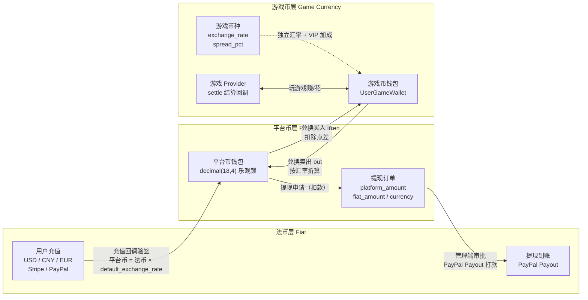
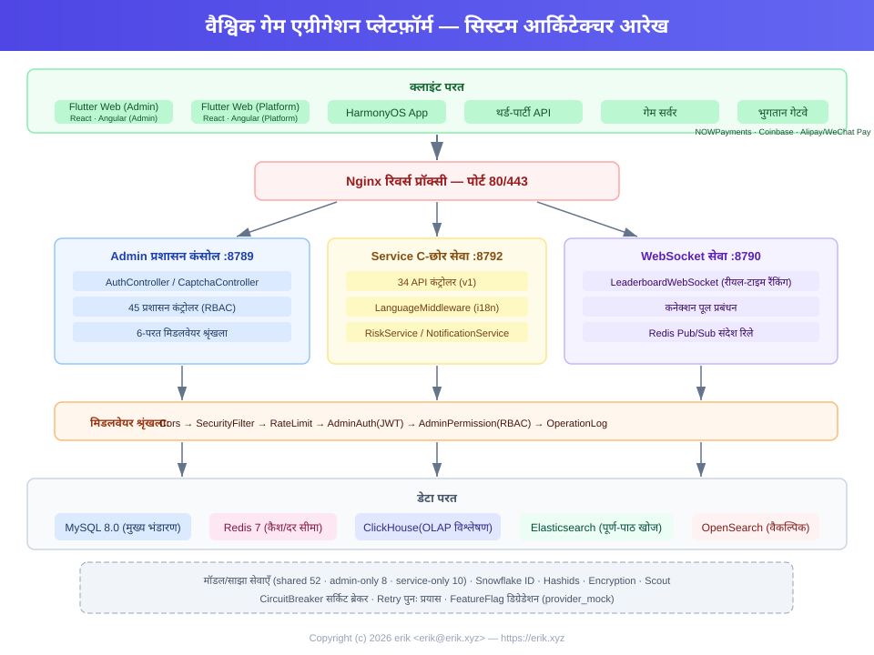
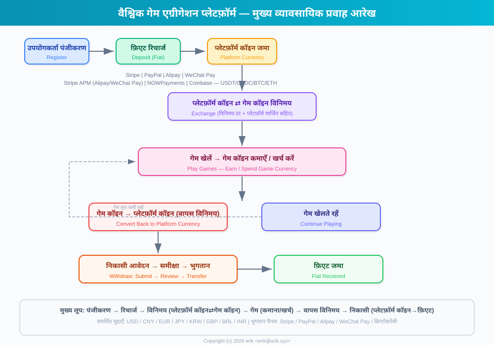
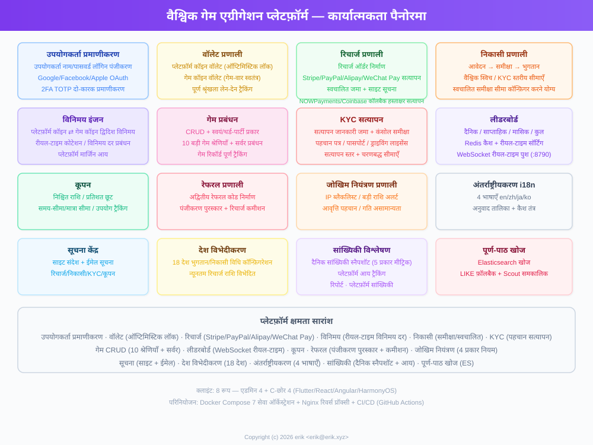
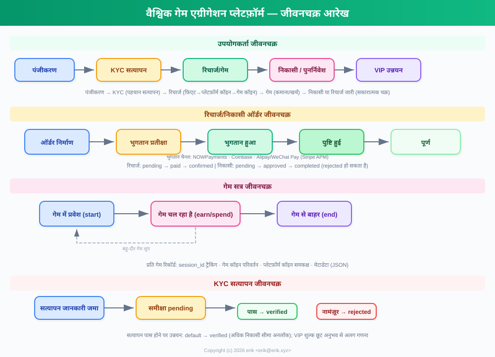
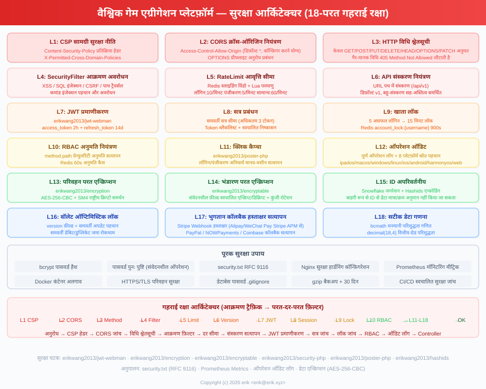
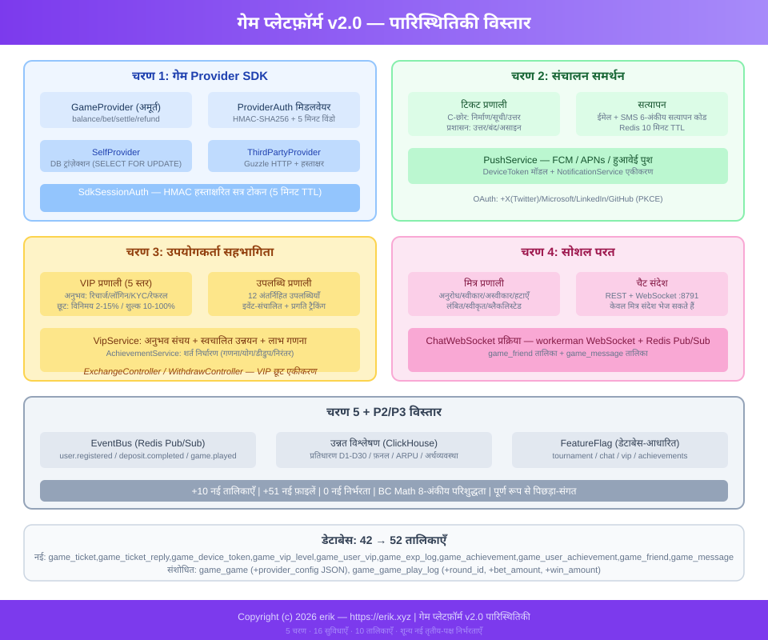

# 全球游戏聚合平台 (Global Game Platform)

## प्रोजेक्ट मास्कट


**डाइसी (Dicey)** — प्लेटफ़ॉर्म मास्कट। पासा गेम और संभावना-आधारित गेमप्ले को दर्शाता है, सिक्का प्लेटफ़ॉर्म अर्थव्यवस्था और मल्टी-पेमेंट गेटवे को, और बैंगनी रंग एडमिन ब्रांडिंग को दर्शाता है। SVG फ़ाइल: `docs/mascot.svg`, दस्तावेज़ों, लोगो और सामान के लिए असीमित स्केलेबल।
<!-- lang-nav -->

Languages: [中文](../../README.md) · [English](README.en.md) · [한국어](README.ko.md) · [Русский](README.ru.md) · [Deutsch](README.de.md) · [Français](README.fr.md) · [Español](README.es.md) · [Português](README.pt.md) · **हिन्दी** · [العربية](README.ar.md) · [বাংলা](README.bn.md) · [Bahasa Indonesia](README.id.md) · [日本語](README.ja.md)

> Copyright (c) 2026 erik <erik@erik.xyz> — https://erik.xyz

वैश्विक, अंतरराष्ट्रीय गेम एग्रीगेशन प्लेटफ़ॉर्म। पंजीकरण के बाद उपयोगकर्ता प्लेटफ़ॉर्म पर टॉप-अप करके गेम कॉइन खरीदते हैं, गेम कॉइन से गेम खेलकर अर्जित करते हैं, और गेम कॉइन को वापस वॉलेट में ट्रांसफर करके निकाल सकते हैं। बैकएंड में गेम प्रबंधन, निकासी ऑडिट, उपयोगकर्ता प्रबंधन और भुगतान प्रबंधन की पूर्ण सुविधाएँ उपलब्ध हैं। बहुभाषा स्विचिंग (अंग्रेज़ी/चीनी) का समर्थन करता है।

## संस्करण नीति

| संस्करण | लक्ष्य | स्थिति |
|------|------|------|
| पूर्ण संस्करण | संपूर्ण: लीडरबोर्ड, कूपन, गेम श्रेणियाँ, देश कॉन्फ़िगरेशन, ES खोज | पूर्ण |
| पारिस्थितिकी विस्तार | v2.0: गेम Provider एकीकरण, टिकट, VIP, उपलब्धियाँ, सोशल, इवेंट बस | पूर्ण |

## प्रौद्योगिकी स्टैक

### बैकएंड
- PHP 8.3+, webman v2 (workerman/webman)
- MySQL 8.0+ (तालिका उपसर्ग `game_`, BIGINT गैर-ऑटो-इन्क्रीमेंट प्राथमिक कुंजी)
- Redis (सत्र / कैश / दर सीमा)
- ClickHouse (OLAP विश्लेषण / संभाव्यता गणना)
- Elasticsearch (पूर्ण-पाठ खोज)
- JWT प्रमाणीकरण + RBAC अनुमति नियंत्रण
- डेटा एन्क्रिप्शन: API ट्रांसमिशन परत AES-256-CBC + डेटाबेस स्टोरेज परत AES-128-ECB

### फ्रंटएंड
- Flutter 3.x (वेब PC शैली)
- HarmonyOS ArkTS (मोबाइल)
- रिस्पॉन्सिव लेआउट (Phone / Tablet / Desktop)
- अंतर्राष्ट्रीयकरण (i18n): अंग्रेज़ी / सरलीकृत चीनी स्विच

### मुख्य घटक
- `erikwang2013/snowflake-php` — वैश्विक अद्वितीय BIGINT ID जनरेटर
- `erikwang2013/hashids` — API परत ID एन्क्रिप्शन/डिक्रिप्शन
- `erikwang2013/jwt-webman` — JWT प्रमाणीकरण
- `erikwang2013/encryption` — API संवेदनशील डेटा एन्क्रिप्शन/डिक्रिप्शन
- `erikwang2013/encryptable` — डेटाबेस संवेदनशील फ़ील्ड एन्क्रिप्शन/डिक्रिप्शन
- `erikwang2013/webman-scout` — Elasticsearch सिंक और क्वेरी
- `erikwang2013/season` — देश के झंडे
- `erikwang2013/security-php` — सुरक्षा उपकरण जांच
- `erikwang2013/poster-php` — संवेदनशील ऑपरेशन के लिए यादृच्छिक सत्यापन
- `erikwang2013/clickhouse-php` — ClickHouse कनेक्शन और संभाव्यता गणना

## प्रोजेक्ट संरचना

```
game-platform-php/
├── admin/                     # 管理后台 (webman v2, 端口 8787)
│   ├── app/admin/controller/  #   管理端控制器
│   ├── app/middleware/        #   中间件 (Cors/Security/RateLimit/Auth/ProviderAuth)
│   ├── app/provider/          #   游戏Provider层
│   ├── app/event/             #   事件总线 (EventBus Redis Pub/Sub) (Cors/Security/RateLimit/Auth/Permission/ProviderAuth)
│   ├── app/provider/          #   游戏Provider层 (Self/ThirdParty/Factory)
│   ├── app/middleware/        #   中间件 (Cors/Security/RateLimit/Auth/ProviderAuth)
│   ├── app/provider/          #   游戏Provider层
│   ├── app/event/             #   事件总线 (EventBus Redis Pub/Sub) (Cors/Security/RateLimit/Auth/Permission)
│   ├── config/                #   配置文件
│   ├── install/   #   SQL 迁移文件
│   └── apps/flutter/          #   Flutter Web PC 管理后台
│
├── service/                   # C端业务端 (webman v2, 端口 8788)
│   ├── app/api/v1/controller/ #   C端 API 控制器
│   ├── app/middleware/        #   中间件 (Cors/Security/RateLimit/Auth/ProviderAuth)
│   ├── app/provider/          #   游戏Provider层
│   ├── app/event/             #   事件总线 (EventBus Redis Pub/Sub)
│   └── config/                #   配置文件
│
├── install/                   # 一键安装向导
│   ├── index.php              #   安装入口
│   ├── Installer.php          #   安装核心逻辑
│   ├── install.sql            #   合并安装 SQL（43张表+种子数据）
│   └── assets/                #   静态资源
│
├── admin/common/ 与 service/common/   # 共享服务各一份 (DepositLogService 等，待抽共享层)
│   └── service/               #   共享服务 (含 ClickHouse 概率计算)
│
├── apps/
│   └── flutter/platform/      # Flutter Web PC C端用户平台
│
├── docs/                      # 项目文档
│   ├── ARCHITECTURE.md        #   架构文档
│   ├── ARCHITECTURE-DESIGN.md #   架构设计文档
│   ├── FEATURES.md            #   功能文档
│   ├── FEATURE-DESIGN.md      #   功能设计文档
│   └── API.md                 #   接口文档
│
└── admin/docs/superpowers/    # 开发规范与计划
    ├── specs/                 #   设计规范
    └── plans/                 #   实现计划
```

## त्वरित आरंभ

### पर्यावरण आवश्यकताएँ
- PHP 8.1+
- MySQL 8.0+
- Redis 6.0+
- Composer 2.x
- Flutter SDK 3.x (फ्रंटएंड, वैकल्पिक)

### विधि 1: वन-क्लिक इंस्टॉलेशन विज़ार्ड (अनुशंसित)

```bash
# 1. 启动安装向导
php -S 0.0.0.0:8888 -t install/

# 2. 浏览器打开 http://localhost:8888
#    按照向导完成：环境检查 → 数据库配置 → 管理员账户设置 → 自动安装

# 3. 安装依赖
cd admin && composer install && cd ..
cd service && composer install && cd ..

# 4. 启动服务
cd admin && php start.php start -d && cd ..
cd service && php start.php start -d && cd ..

# 5. 访问管理后台: http://localhost:8787
#    使用安装时设置的管理员账号密码登录

# 6. 安装完成后删除安装目录（安全）
rm -rf install/
```

इंस्टॉलेशन विज़ार्ड स्वचालित रूप से पूरा करता है:
- पर्यावरण जांच (PHP संस्करण, एक्सटेंशन, निर्देशिका अनुमतियाँ)
- डेटाबेस और तालिकाओं का निर्माण (मर्ज किया गया SQL, 43 तालिकाएँ + सीड डेटा)
- सुपर एडमिन खाता बनाना (bcrypt एन्क्रिप्शन)
- JWT/एन्क्रिप्शन कुंजियाँ स्वचालित रूप से उत्पन्न कर .env फ़ाइल में लिखना
- बार-बार इंस्टॉलेशन रोकने के लिए install.lock बनाना

### विधि 2: मैन्युअल इंस्टॉलेशन

<details>
<summary>मैन्युअल इंस्टॉलेशन चरण विस्तार करें</summary>

#### 1. डेटाबेस आरंभीकरण

```bash
# 一键导入合并 SQL
mysql -u root -e "CREATE DATABASE IF NOT EXISTS game-platform CHARACTER SET utf8mb4 COLLATE utf8mb4_unicode_ci;"
mysql -u root game-platform < install/install.sql
```

#### 2. पर्यावरण चर कॉन्फ़िगर करें

```bash
# 管理后台
cd admin
cp .env.example .env
# 编辑 .env 中的数据库连接信息和密钥

# C端业务端
cd ../service
cp .env.example .env
# 编辑 .env 中的数据库连接信息和密钥
```

#### 3. बैकएंड शुरू करें

```bash
cd admin && composer install && php start.php start -d
cd ../service && composer install && php start.php start -d
```

#### 4. एडमिन बनाएं

डेटाबेस में मैन्युअल रूप से एडमिन खाता डालना आवश्यक है (पासवर्ड bcrypt से एन्क्रिप्टेड)।

</details>

### फ्रंटएंड शुरू करना (वैकल्पिक)

```bash
# 管理后台 (Flutter Web PC)
cd admin/apps/flutter
flutter pub get
flutter run -d chrome

# C端用户平台 (Flutter Web PC)
cd apps/flutter/platform
flutter pub get
flutter run -d chrome
```

### सत्यापन

```bash
# 测试管理后台
curl http://localhost:8787/health

# 测试C端业务
curl http://localhost:8788/health

# 测试用户注册
curl -X POST http://localhost:8788/api/auth/register \
  -H "Content-Type: application/json" \
  -d '{"username":"testuser","password":"123456"}'
```

## सुरक्षा विशेषताएँ

- **18 परत गहराई सुरक्षा**: XSS/SQL इंजेक्शन/CSRF/पाथ ट्रैवर्सल/कमांड इंजेक्शन का पता और अवरोधन
- **HTTP मेथड व्हाइटलिस्ट**: केवल GET/POST/PUT/DELETE/OPTIONS/HEAD अनुमत
- **JWT प्रमाणीकरण**: access_token 2h + refresh_token 14d, समवर्ती सत्र सीमा
- **JWT कुंजी स्टार्टअप जांच**: admin पक्ष `ADMIN_JWT_SECRET_KEY`, service पक्ष `SERVICE_JWT_SECRET_KEY` अलग-अलग कुंजियाँ; अनुपस्थित या अभी भी डिफ़ॉल्ट मान होने पर स्टार्टअप अस्वीकार करता है
- **भुगतान कॉलबैक fail-closed**: provider व्हाइटलिस्ट (केवल stripe/paypal) + कुंजी न होने/सिग्नेचर सत्यापन विफल/टाइमस्टैम्प सीमा से अधिक — सभी अस्वीकार + bccomp राशि जांच + कॉलबैक क्रेडिट ट्रांज़ैक्शनल
- **RBAC अनुमतियाँ**: method.path ग्रैन्युलैरिटी पर अनुमति नियंत्रण, Redis 60s कैश
- **क्लिक कैप्चा**: लॉगिन/पंजीकरण पर अनिवार्य मानव-सत्यापन
- **पासवर्ड पुनः पुष्टि**: संवेदनशील ऑपरेशन के लिए पासवर्ड पुष्टि आवश्यक
- **डेटा एन्क्रिप्शन**: ट्रांसमिशन परत AES-256-CBC + स्टोरेज परत AES-128-ECB
- **ID एन्क्रिप्शन**: Snowflake जनरेशन + Hashids एन्कोडिंग, बाह्य रूप से अपरिवर्तनीय
- **वॉलेट ऑप्टिमिस्टिक लॉक**: समवर्ती डेबिट/डुप्लिकेट क्रेडिट रोकता है
- **ऑपरेशन ऑडिट**: पूर्ण ऑपरेशन लॉग, 8 प्लेटफ़ॉर्म स्रोत स्वचालित पहचान
- **दर सीमा**: Redis स्लाइडिंग विंडो, Lua एटॉमिक
- **CSP हेडर**: Content-Security-Policy XSS रोकथाम
- **खाता सुरक्षा**: लगातार 5 असफल लॉगिन पर 15 मिनट लॉक

## परीक्षण

```bash
cd admin
phpunit --bootstrap tests/bootstrap.php tests/
```

- PHPUnit 12.x, 116 परीक्षण मामले
- 56 व्यावसायिक तर्क परीक्षण (PlatformTest) + 60 इन्फ्रास्ट्रक्चर परीक्षण
- कवरेज: bcmath परिशुद्धता, विनिमय गणना, निकासी शुल्क, सीमाएँ, जोखिम नियंत्रण, कूपन, KYC, i18n

## प्लेटफ़ॉर्म क्षमता अवलोकन

| क्षमता | विवरण |
|------|------|
| उपयोगकर्ता प्रमाणीकरण | यूज़रनेम/पासवर्ड + 7 प्लेटफ़ॉर्म OAuth (Google/Facebook/Apple/X(Twitter)/Microsoft/LinkedIn/GitHub) + 2FA TOTP |
| वॉलेट | प्लेटफ़ॉर्म कॉइन वॉलेट (ऑप्टिमिस्टिक लॉक) + गेम कॉइन वॉलेट + ट्रांज़ैक्शन रिकॉर्ड |
| टॉप-अप | ऑर्डर निर्माण + Stripe/PayPal कॉलबैक सिग्नेचर सत्यापन + स्वचालित क्रेडिट |
| विनिमय | प्लेटफ़ॉर्म कॉइन ⇄ गेम कॉइन, रीयल-टाइम कोटेशन, अंतर लाभ |
| निकासी | आवेदन → ऑडिट → भुगतान, वैश्विक स्विच, KYC स्तरीय सीमाएँ + शुल्क |
| KYC | वास्तविक-नाम सत्यापन सबमिशन + ऑडिट, त्रि-स्तरीय सत्यापन प्रणाली |
| गेम | CRUD + श्रेणियाँ (10 श्रेणियाँ) + सर्वर + गेम रिकॉर्ड ट्रैकिंग |
| खोज | Elasticsearch पूर्ण-पाठ खोज (LIKE फ़ॉलबैक सहित) |
| लीडरबोर्ड | दैनिक/साप्ताहिक/मासिक/कुल बोर्ड, Redis कैश, WebSocket रीयल-टाइम पुश (8789) |
| CDN | पाँच प्रदाता एकीकरण (Cloudflare R2 / AWS S3 / Aliyun OSS / Tencent COS / Huawei OBS अपलोड + पर्ज + प्रीलोड) + एडमिन कॉन्फ़िग/टॉगल/कनेक्टिविटी टेस्ट |
| कूपन | निश्चित राशि + प्रतिशत छूट, समय/मात्रा सीमित, क्लेम और उपयोग ट्रैकिंग |
| सूचनाएँ | इन-साइट संदेश + ईमेल, टॉप-अप/निकासी/KYC/कूपन स्वचालित सूचनाएँ |
| रेफ़रल | रेफ़रल कोड, पंजीकरण बोनस, टॉप-अप कमीशन |
| जोखिम नियंत्रण | IP ब्लैकलिस्ट / बड़ी राशि अलर्ट / आवृत्ति / गति जांच |
| अंतर्राष्ट्रीयकरण | 4 भाषाएँ (en-US/zh-CN/ja-JP/ko-KR), अनुवाद तालिका + कैश |
| देश कॉन्फ़िगरेशन | 8 देशों के लिए विभेदित भुगतान/निकासी विधियाँ, न्यूनतम टॉप-अप राशि |
| सांख्यिकी | दैनिक स्टेट स्नैपशॉट (5 प्रकार के मेट्रिक्स) + प्लेटफ़ॉर्म आय ट्रैकिंग |
| कैप्चा | क्लिक-प्रकार मानव सत्यापन (poster-php) |
| गेम एकीकरण | Provider SDK (Self+ThirdParty) + HMAC-SHA256 सिग्नेचर + कॉलबैक गेटवे |
| टिकट | C-एंड निर्माण/जवाब + प्रशासनिक हैंडलिंग/असाइनमेंट/बंद |
| VIP | 5 स्तरीय लॉयल्टी, अनुभव संचय, विनिमय छूट/निकासी राहत/विनिमय दर बोनस |
| उपलब्धियाँ | 12 अंतर्निहित उपलब्धियाँ, इवेंट-संचालित पहचान, प्रगति ट्रैकिंग |
| सोशल | मित्र प्रणाली + WebSocket रीयल-टाइम निजी संदेश (पोर्ट 8791), केवल मित्रों को भेजना |
| प्रतियोगिता | टूर्नामेंट प्रणाली (FeatureFlag स्विच) + लीडरबोर्ड + सदस्य सीमा |
| कमीशन | द्वि-स्तरीय रेफ़रल प्रॉफ़िट-शेयरिंग (कॉन्फ़िगर करने योग्य कमीशन दर) |
| कूपन | शर्त सीमाएँ (min_deposit/first_user/game_id) |
| इवेंट | Redis Pub/Sub इवेंट बस + Webhook सब्सक्रिप्शन डिलीवरी (7 प्रकार के इवेंट) |
| डिप्लॉयमेंट | Docker Compose 8 सेवा ऑर्केस्ट्रेशन + Nginx रिवर्स प्रॉक्सी |
| क्लाइंट | Flutter Admin (15 पेज) + Platform (10 पेज) + HarmonyOS (5 पेज) |

## व्यावसायिक मॉडल

```
法币 (USD/CNY/EUR...)
  │  充值(Stripe/PayPal/支付宝/微信)
  ▼
平台币 (统一，精度 decimal(18,4))
  │  兑换（含汇率 + 平台抽成差价）
  ▼
游戏币 (每种游戏独立，独立汇率)
  │  玩游戏赚/花
  ▼
平台币 ← 兑回 → 提现（审核/自动）
```

## बहु-मुद्रा निपटान

प्लेटफ़ॉर्म "फ़िएट → प्लेटफ़ॉर्म कॉइन → गेम कॉइन" तीन-परत मुद्रा-पृथक निपटान प्रणाली अपनाता है: USD/CNY/EUR बहु-फ़िएट टॉप-अप समर्थित है, हर गेम की अपनी स्वतंत्र मूल्य-निर्धारण मुद्रा होती है; राशि गणना में पूरी तरह bcmath उच्च-परिशुद्धता संचालन उपयोग होता है, फ़्लोटिंग-पॉइंट त्रुटि असंभव।

### तीन-परत मुद्रा मॉडल

| परत | मुद्रा | विवरण |
|------|------|------|
| फ़िएट परत | USD / CNY / EUR | उपयोगकर्ता टॉप-अप/निकासी का वास्तविक भुगतान मुद्रा, Stripe / PayPal द्वारा संसाधित |
| प्लेटफ़ॉर्म कॉइन परत | प्लेटफ़ॉर्म कॉइन (पूरे प्लेटफ़ॉर्म पर समान) | आंतरिक समान निपटान मुद्रा (decimal(18,4)), वॉलेट ऑप्टिमिस्टिक लॉक समवर्ती डेबिट/डुप्लिकेट क्रेडिट रोकता है |
| गेम कॉइन परत | प्रत्येक गेम की स्वतंत्र मुद्रा | प्रत्येक गेम का स्वतंत्र `exchange_rate` विनिमय दर और `spread_pct` स्प्रेड, स्वतंत्र गेम कॉइन वॉलेट |

### निपटान पथ

- **टॉप-अप निपटान**: उपयोगकर्ता फ़िएट से भुगतान करता है (Stripe / PayPal कॉलबैक सिग्नेचर सत्यापन, आइडेम्पोटेंट डुप्लिकेट रोकथाम) → `default_exchange_rate` के अनुसार प्लेटफ़ॉर्म कॉइन में क्रेडिट; टॉप-अप ऑर्डर में एक साथ `amount + currency + platform_amount` दर्ज होता है
- **विनिमय निपटान**: प्लेटफ़ॉर्म कॉइन ⇄ गेम कॉइन गेम मुद्रा विनिमय दर पर रीयल-टाइम कोटेशन (quote), `spread_pct` स्प्रेड प्लेटफ़ॉर्म अंतर लाभ के रूप में काटा जाता है, VIP को विनिमय छूट और दर बोनस मिलता है
- **गेम निपटान**: गेम Provider `/api/provider/settle` कॉलबैक से उपयोगकर्ता गेम कॉइन बढ़ाता/घटाता है (HMAC-SHA256 सिग्नेचर), गेम सत्र समाप्ति पर स्वचालित निपटान
- **निकासी निपटान**: प्लेटफ़ॉर्म कॉइन डेबिट → निकासी ऑर्डर बनता है (`platform_amount / fiat_amount / currency` दर्ज) → प्रशासनिक अनुमोदन → PayPal Payout भुगतान → बैच स्थिति पूर्ण तक सिंक

### निपटान प्रवाह आरेख



## आर्किटेक्चर आरेख



## मुख्य व्यावसायिक प्रवाह



## फ़ीचर अवलोकन



## जीवनचक्र



## सुरक्षा आर्किटेक्चर



## पारिस्थितिकी विस्तार (v2.0)



## दस्तावेज़ सूचकांक

| दस्तावेज़ | विवरण |
|------|------|
| [版本对比](../VERSIONS.hi.md) | बेसिक/स्टैंडर्ड/पूर्ण संस्करण फ़ीचर तुलना |
| [架构设计文档](../ARCHITECTURE-DESIGN.hi.md) | आर्किटेक्चर चयन कारण और डिज़ाइन निर्णय |
| [架构文档](../ARCHITECTURE.hi.md) | सिस्टम टोपोलॉजी, मॉड्यूल आर्किटेक्चर, डेटा प्रवाह |
| [功能设计文档](../FEATURE-DESIGN.hi.md) | व्यावसायिक मॉडल, फ़ीचर विनिर्देश, प्रवाह डिज़ाइन |
| [功能文档](../FEATURES.hi.md) | फ़ीचर सूची, मॉड्यूल विवरण, उपयोगकर्ता यात्रा |
| [接口文档](../API.hi.md) | पूर्ण API संदर्भ (102 इंटरफ़ेस) |
| [在线文档](http://localhost:8788/apidoc/) | hg/apidoc इंटरैक्टिव दस्तावेज़ (C-एंड) |
| [在线文档](http://localhost:8787/apidoc/) | hg/apidoc इंटरैक्टिव दस्तावेज़ (प्रशासन बैकएंड) |
| [ClickHouse 安装](../CLICKHOUSE_INSTALL.hi.md) | ClickHouse इंस्टॉलेशन/कॉन्फ़िगरेशन/माइग्रेशन/सत्यापन |
| [Provider SDK 接入文档](../PROVIDER-SDK.hi.md) | तृतीय-पक्ष गेम एकीकरण गाइड (सिग्नेचर एल्गोरिदम + PHP/Go/Python उदाहरण) |
| [ClickHouse 使用](../CLICKHOUSE_USAGE.hi.md) | 4 ClickHouse सेवा API और बैकएंड डैशबोर्ड |
| [部署文档](../DEPLOYMENT.hi.md) | डिप्लॉयमेंट गाइड (Docker + मैन्युअल + Nginx + मॉनिटरिंग) |
| [设计规范](../../admin/docs/superpowers/specs/2026-05-22-game-platform-design.hi.md) | पूर्ण डिज़ाइन विनिर्देश |
| [实现计划](../../admin/docs/superpowers/plans/2026-05-22-game-platform-plan.hi.md) | विस्तृत कार्यान्वयन योजना |

---

## प्रोजेक्ट को सपोर्ट करें

अगर यह प्रोजेक्ट आपके लिए उपयोगी है, तो लेखक को एक कॉफ़ी ☕ पिलाने का स्वागत है

<p align="center">
  <table align="center" border="0" cellspacing="0" cellpadding="0">
    <tr>
      <td align="center" width="200">
        <br>
        <b>微信支付</b>
      </td>
      <td align="center" width="200">
        <br>
        <b>支付宝</b>
      </td>
    </tr>
  </table>
</p>

### वैश्विक बैंक ट्रांसफर (Global Bank Transfer)

**प्राप्तकर्ता जानकारी (Recipient)**

| आइटम | सामग्री |
|----|------|
| लाभार्थी नाम (Beneficiary Name) | WANG KEXUN |
| खाता संख्या (Account Number) | 881015918251 |

**लाभार्थी बैंक (Beneficiary Bank)**

| आइटम | सामग्री |
|----|------|
| SWIFT Code | AABLHKHHXXX |
| बैंक नाम (Bank Name) | ZA Bank Limited |
| बैंक कोड (Bank Code) | 387 |
| बैंक पता (Bank Address) | Core F, Cyberport 3, 100 Cyberport Road, Hong Kong |

**क्रॉस-बॉर्डर संगत बैंक (Correspondent Bank, यदि आवश्यक हो)**

> कृपया ध्यान दें, यह क्रॉस-बॉर्डर संगत बैंक (मध्यस्थ बैंक) की जानकारी है, लाभार्थी बैंक की नहीं। कृपया अपने रेमिटिंग बैंक से पूछें कि क्या संगत बैंक जानकारी आवश्यक है।

- **HKD, CNY और USD के लिए संगत बैंक Citibank है:**
  - बैंक नाम: Citibank N.A. Hong Kong
  - SWIFT Code: CITIHKHXXXX
  - बैंक कोड: 006
  - शाखा नाम: Hong Kong Branch
  - शाखा कोड: 391
  - बैंक पता: Citibank Tower, Citibank Plaza, 3 Garden Road, Central, Hong Kong
- **अन्य मुद्राओं के लिए संगत बैंक BNY Mellon है:**
  - बैंक नाम: THE BANK OF NEW YORK MELLON
  - SWIFT Code: IRVTUS3NXXX
  - बैंक पता: THE BANK OF NEW YORK MELLON, 240 GREENWICH STREET, NEW YORK, United States

### क्रिप्टो दान (Crypto Donation)

यदि यह प्रोजेक्ट आपके काम आए, तो दान करने के लिए QR कोड स्कैन करें, धन्यवाद!

| नेटवर्क (Network) | QR कोड (QR Code) | वॉलेट पता (Wallet Address) |
|---|---|---|
| BNB Smart Chain (BEP20) | [](../coin/1.jpg) | `0x355d429f97511897ccb4e271ec888205f9ab6629` |
| Tron (TRC20) | [](../coin/2.jpg) | `TEdDHWLajt1XvqtPDWmQctdrJaC3pzZZzz` |
| Ethereum (ERC20) | [](../coin/3.jpg) | `0x355d429f97511897ccb4e271ec888205f9ab6629` |
| Aptos | [](../coin/4.jpg) | `0x836e3780edfc3f7b2372b39e2a1a3a5d7adfaccd96c726f21cfde1b50dd68030` |
| Plasma | [](../coin/5.jpg) | `0x355d429f97511897ccb4e271ec888205f9ab6629` |
| Polygon POS | [](../coin/6.jpg) | `0x355d429f97511897ccb4e271ec888205f9ab6629` |
| Solana | [](../coin/7.jpg) | `2hfhboHdmdrYsY25XfQSsEWxq5ip4EQsR7f4AzSRMUyr` |
| The Open Network (TON) | [](../coin/8.jpg) | `UQB9kFQohzmXUir9QSSZq01iwl9aQZIDdBpNmDklljRtCoGK` |
| Arbitrum One | [](../coin/9.jpg) | `0x355d429f97511897ccb4e271ec888205f9ab6629` |
| AVAX C-Chain | [](../coin/10.jpg) | `0x355d429f97511897ccb4e271ec888205f9ab6629` |

