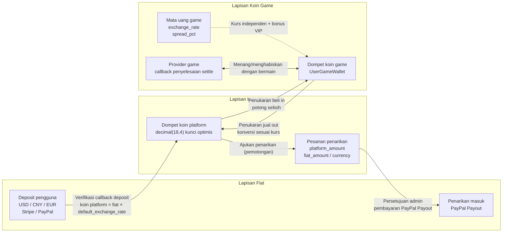
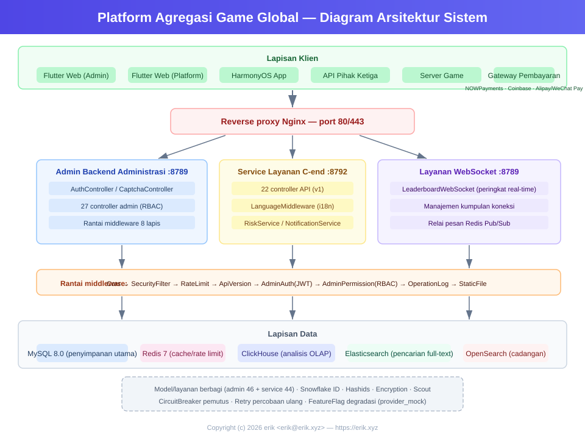
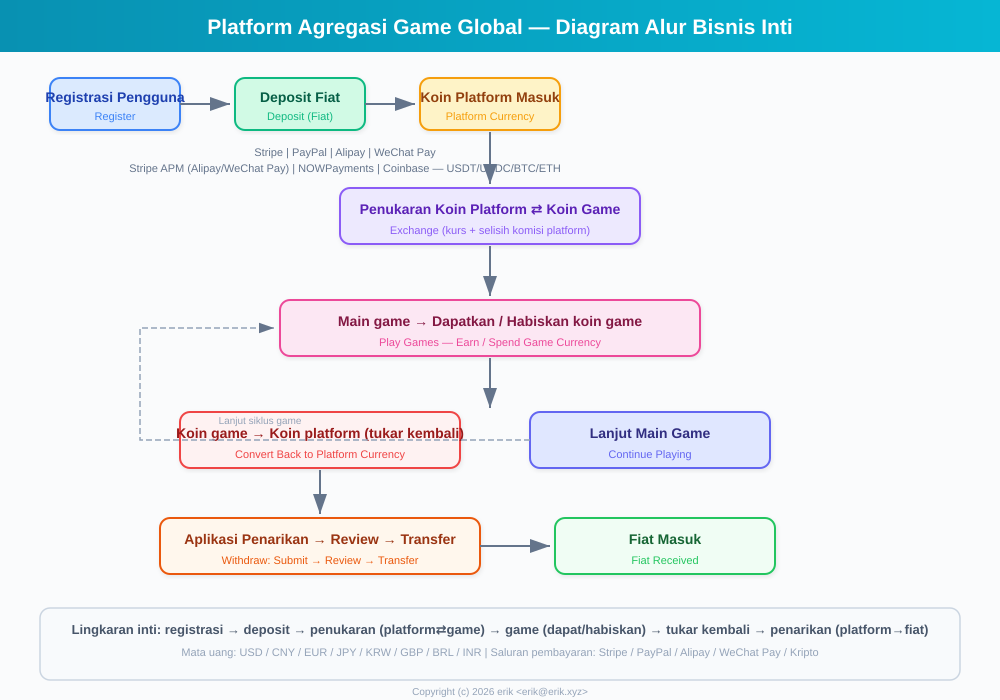
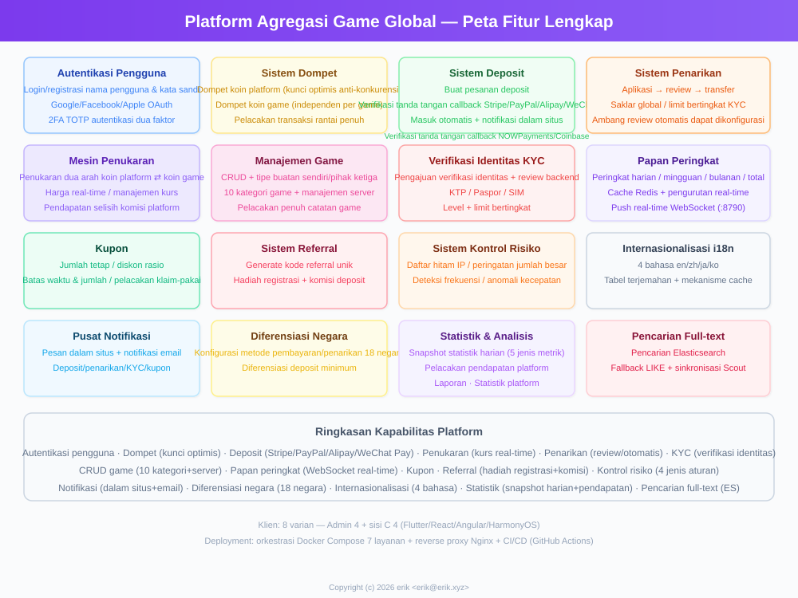
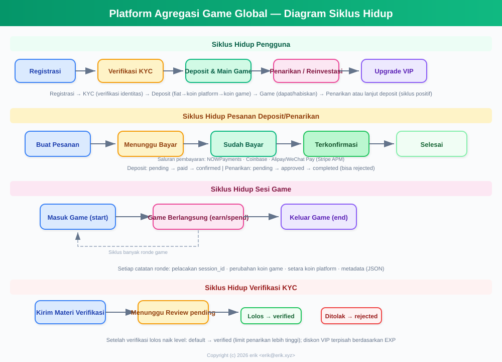
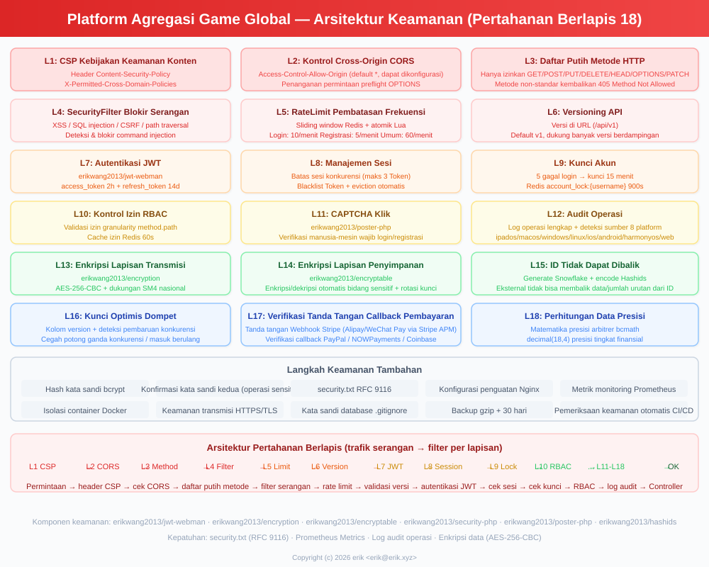
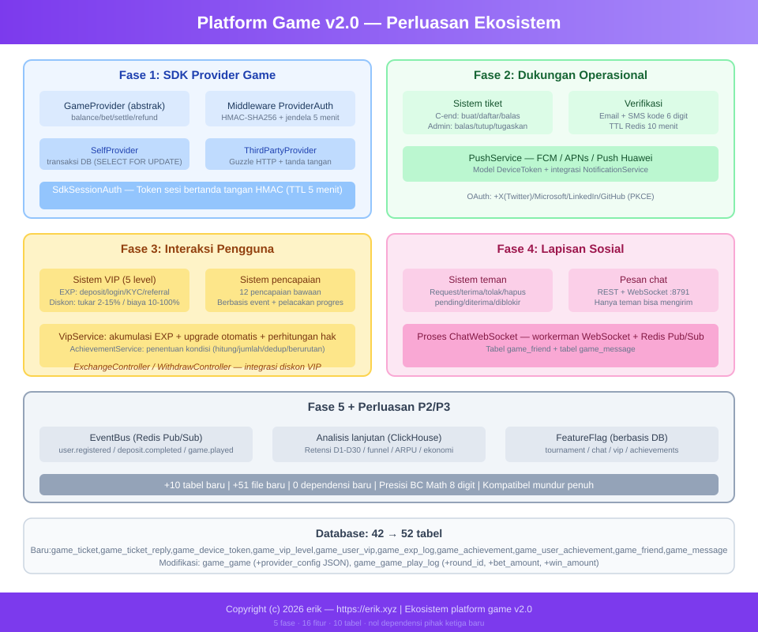

# Platform Agregasi Game Global (Global Game Platform)
<!-- lang-nav -->

Languages: [中文](../../README.md) · [English](README.en.md) · [한국어](README.ko.md) · [Русский](README.ru.md) · [Deutsch](README.de.md) · [Français](README.fr.md) · [Español](README.es.md) · [Português](README.pt.md) · [हिन्दी](README.hi.md) · [العربية](README.ar.md) · [বাংলা](README.bn.md) · **Bahasa Indonesia** · [日本語](README.ja.md)


> Copyright (c) 2026 erik <erik@erik.xyz> — https://erik.xyz

Platform agregasi game global, universal, dan berstandar internasional. Setelah mendaftar, pengguna mengisi saldo untuk menukarnya menjadi koin game, memainkan game untuk mendapatkan koin game, dan koin game dapat ditukar kembali ke dompet untuk ditarik. Backend menyediakan manajemen game lengkap, audit penarikan, manajemen pengguna, dan manajemen pembayaran. Mendukung peralihan multi-bahasa (Inggris/China).

## Strategi Versi

| Versi | Target | Status |
|------|------|------|
| Versi Lengkap | Fitur lengkap: peringkat, kupon, kategori game, konfigurasi negara, pencarian ES | Selesai |
| Ekspansi Ekosistem | v2.0: integrasi Provider game, tiket dukungan, VIP, prestasi, sosial, event bus | Selesai |

## Tumpukan Teknologi

### Backend
- PHP 8.3+, webman v2 (workerman/webman)
- MySQL 8.0+ (prefix tabel `erik_`, primary key BIGINT non-auto-increment)
- Redis (Session / Cache / Rate Limit)
- ClickHouse (Analisis OLAP / Perhitungan probabilitas)
- Elasticsearch (Pencarian teks penuh)
- Autentikasi JWT + kontrol akses RBAC
- Enkripsi data: AES-256-CBC di lapisan transport API + AES-128-ECB di lapisan penyimpanan database

### Frontend
- Flutter 3.x (gaya Web PC)
- HarmonyOS ArkTS (seluler)
- Tata letak responsif (Phone / Tablet / Desktop)
- Internasionalisasi (i18n): peralihan Inggris / China Sederhana

### Komponen Inti
- `erikwang2013/snowflake-php` — generator ID BIGINT unik global
- `erikwang2013/hashids` — enkripsi/dekripsi ID di lapisan API
- `erikwang2013/jwt-webman` — autentikasi JWT
- `erikwang2013/encryption` — enkripsi/dekripsi data sensitif API
- `erikwang2013/encryptable` — enkripsi/dekripsi kolom sensitif database
- `erikwang2013/webman-scout` — sinkronisasi dan kueri Elasticsearch
- `erikwang2013/season` — bendera negara
- `erikwang2013/security-php` — deteksi alat keamanan
- `erikwang2013/poster-php` — verifikasi acak untuk operasi sensitif
- `erikwang2013/clickhouse-php` — koneksi ClickHouse dan perhitungan probabilitas

## Struktur Proyek

```
game-platform-php/
├── admin/                     # Backend administrasi (webman v2, port 8787)
│   ├── app/admin/controller/  #   Kontroler sisi admin
│   ├── app/middleware/        #   Middleware (Cors/Security/RateLimit/Auth/ProviderAuth)
│   ├── app/provider/          #   Lapisan Provider game
│   ├── app/event/             #   Event bus (EventBus Redis Pub/Sub) (Cors/Security/RateLimit/Auth/Permission/ProviderAuth)
│   ├── app/provider/          #   Lapisan Provider game (Self/ThirdParty/Factory)
│   ├── app/middleware/        #   Middleware (Cors/Security/RateLimit/Auth/ProviderAuth)
│   ├── app/provider/          #   Lapisan Provider game
│   ├── app/event/             #   Event bus (EventBus Redis Pub/Sub) (Cors/Security/RateLimit/Auth/Permission)
│   ├── config/                #   File konfigurasi
│   ├── install/   #   File migrasi SQL
│   └── apps/flutter/          #   Backend administrasi Flutter Web PC
│
├── service/                   # Sisi bisnis C (webman v2, port 8788)
│   ├── app/api/v1/controller/ #   Kontroler API C
│   ├── app/middleware/        #   Middleware (Cors/Security/RateLimit/Auth/ProviderAuth)
│   ├── app/provider/          #   Lapisan Provider game
│   ├── app/event/             #   Event bus (EventBus Redis Pub/Sub)
│   └── config/                #   File konfigurasi
│
├── install/                   # Wizard instalasi satu-klik
│   ├── index.php              #   Titik masuk instalasi
│   ├── Installer.php          #   Logika inti instalasi
│   ├── install.sql            #   SQL instalasi gabungan (43 tabel + data seed)
│   └── assets/                #   Aset statis
│
├── admin/common/ dan service/common/   # Salinan layanan bersama masing-masing (DepositLogService dll., menunggu diekstrak ke lapisan bersama)
│   └── service/               #   Layanan bersama (termasuk perhitungan probabilitas ClickHouse)
│
├── apps/
│   └── flutter/platform/      # Platform pengguna C Flutter Web PC
│
├── docs/                      # Dokumentasi proyek
│   ├── ARCHITECTURE.md        #   Dokumen arsitektur
│   ├── ARCHITECTURE-DESIGN.md #   Dokumen desain arsitektur
│   ├── FEATURES.md            #   Dokumen fitur
│   ├── FEATURE-DESIGN.md      #   Dokumen desain fitur
│   └── API.md                 #   Dokumen API
│
└── admin/docs/superpowers/    # Standar dan rencana pengembangan
    ├── specs/                 #   Spesifikasi desain
    └── plans/                 #   Rencana implementasi
```

## Mulai Cepat

### Persyaratan Lingkungan
- PHP 8.1+
- MySQL 8.0+
- Redis 6.0+
- Composer 2.x
- Flutter SDK 3.x (frontend, opsional)

### Cara 1: Wizard Instalasi Satu-Klik (disarankan)

```bash
# 1. Jalankan wizard instalasi
php -S 0.0.0.0:8888 -t install/

# 2. Buka http://localhost:8888 di browser
#    Ikuti wizard: pemeriksaan lingkungan → konfigurasi database → pengaturan akun admin → instalasi otomatis

# 3. Instal dependensi
cd admin && composer install && cd ..
cd service && composer install && cd ..

# 4. Jalankan layanan
cd admin && php start.php start -d && cd ..
cd service && php start.php start -d && cd ..

# 5. Akses backend admin: http://localhost:8787
#    Masuk dengan akun dan kata sandi admin yang diatur saat instalasi

# 6. Hapus direktori instalasi setelah selesai (keamanan)
rm -rf install/
```

Wizard instalasi otomatis menyelesaikan:
- Pemeriksaan lingkungan (versi PHP, ekstensi, izin direktori)
- Membuat database dan tabel data (SQL gabungan, 43 tabel + data seed)
- Membuat akun super admin (terenkripsi bcrypt)
- Secara otomatis menghasilkan kunci JWT/enkripsi dan menuliskannya ke file .env
- Membuat install.lock untuk mencegah instalasi ganda

### Cara 2: Instalasi Manual

<details>
<summary>Buka langkah instalasi manual</summary>

#### 1. Inisialisasi Database

```bash
# Impor SQL gabungan satu-klik
mysql -u root -e "CREATE DATABASE IF NOT EXISTS game_platform CHARACTER SET utf8mb4 COLLATE utf8mb4_unicode_ci;"
mysql -u root game_platform < install/install.sql
```

#### 2. Konfigurasi Variabel Lingkungan

```bash
# Backend administrasi
cd admin
cp .env.example .env
# Edit informasi koneksi database dan kunci di .env

# Sisi bisnis C
cd ../service
cp .env.example .env
# Edit informasi koneksi database dan kunci di .env
```

#### 3. Menjalankan Backend

```bash
cd admin && composer install && php start.php start -d
cd ../service && composer install && php start.php start -d
```

#### 4. Membuat Admin

Perlu menyisipkan akun admin secara manual ke database (kata sandi dienkripsi dengan bcrypt).

</details>

### Menjalankan Frontend (Opsional)

```bash
# Backend administrasi (Flutter Web PC)
cd admin/apps/flutter
flutter pub get
flutter run -d chrome

# Platform pengguna C (Flutter Web PC)
cd apps/flutter/platform
flutter pub get
flutter run -d chrome
```

### Verifikasi

```bash
# Uji backend administrasi
curl http://localhost:8787/health

# Uji bisnis sisi C
curl http://localhost:8788/health

# Uji registrasi pengguna
curl -X POST http://localhost:8788/api/auth/register \
  -H "Content-Type: application/json" \
  -d '{"username":"testuser","password":"123456"}'
```

## Fitur Keamanan

- **18 lapisan pertahanan berlapis**: deteksi & pemblokiran XSS/Injeksi SQL/CSRF/path traversal/injeksi perintah
- **Whitelist metode HTTP**: hanya mengizinkan GET/POST/PUT/DELETE/OPTIONS/HEAD
- **Autentikasi JWT**: access_token 2 jam + refresh_token 14 hari, batasan sesi bersamaan
- **Validasi kunci JWT saat start**: kunci independen `ADMIN_JWT_SECRET_KEY` di sisi admin dan `SERVICE_JWT_SECRET_KEY` di sisi service; menolak start jika kunci hilang atau masih nilai default
- **Callback pembayaran fail-closed**: whitelist provider (hanya stripe/paypal) + tolak jika kunci belum dikonfigurasi/gagal verifikasi tanda tangan/waktu melebihi batas + verifikasi nominal dengan bccomp + kredit callback bersifat transaksional
- **Hak akses RBAC**: kontrol izin granular method.path, cache Redis 60 detik
- **CAPTCHA klik**: verifikasi manusia wajib saat login/registrasi
- **Konfirmasi ulang kata sandi**: operasi sensitif memerlukan konfirmasi kata sandi
- **Enkripsi data**: AES-256-CBC di lapisan transport + AES-128-ECB di lapisan penyimpanan
- **Enkripsi ID**: dihasilkan Snowflake + dienkode Hashids, tidak dapat ditelusuri balik dari luar
- **Kunci optimis dompet**: mencegah pemotongan saldo bersamaan/transfer ganda
- **Audit operasi**: log operasi lengkap, deteksi otomatis 8 sumber platform
- **Rate limit**: jendela geser Redis, atomik dengan Lua
- **Header CSP**: Content-Security-Policy mencegah XSS
- **Keamanan akun**: 5 kali gagal login berturut-turut mengunci akun selama 15 menit

## Pengujian

```bash
cd admin
phpunit --bootstrap tests/bootstrap.php tests/
```

- PHPUnit 12.x, 116 kasus uji
- 56 pengujian logika bisnis (PlatformTest) + 60 pengujian infrastruktur
- Cakupan: presisi bcmath, perhitungan penukaran, biaya penarikan, batas, manajemen risiko, kupon, KYC, i18n

## Ringkasan Kemampuan Platform

| Kemampuan | Deskripsi |
|------|------|
| Autentikasi pengguna | Nama pengguna/kata sandi + OAuth 7 platform (Google/Facebook/Apple/X(Twitter)/Microsoft/LinkedIn/GitHub) + 2FA TOTP |
| Dompet | Dompet koin platform (kunci optimis) + dompet koin game + catatan transaksi |
| Deposit | Membuat pesanan + verifikasi callback Stripe/PayPal + kredit otomatis |
| Penukaran | Koin platform ⇄ koin game, penawaran harga real-time, selisih pendapatan |
| Penarikan | Ajukan→audit→bayar, saklar global, batas berjenjang KYC + biaya |
| KYC | Pengajuan verifikasi identitas + audit, sistem sertifikasi tiga tingkat |
| Game | CRUD + kategori (10 kategori) + server wilayah + pelacakan catatan game |
| Pencarian | Pencarian teks penuh Elasticsearch (dengan fallback LIKE) |
| Peringkat | Harian/mingguan/bulanan/keseluruhan, cache Redis, push real-time WebSocket (8789) |
| Kupon | Jumlah tetap + diskon persentase, terbatas waktu & kuota, pelacakan klaim dan penggunaan |
| Notifikasi | Pesan internal + email, notifikasi otomatis deposit/penarikan/KYC/kupon |
| Referral | Kode referral, bonus pendaftaran, komisi deposit |
| Manajemen risiko | Daftar hitam IP/peringatan nominal besar/deteksi frekuensi/kecepatan |
| Internasionalisasi | 4 bahasa (en-US/zh-CN/ja-JP/ko-KR), tabel terjemahan + cache |
| Konfigurasi negara | Metode pembayaran/penarikan berbeda di 8 negara, jumlah deposit minimum |
| Statistik | Snapshot statistik harian (5 metrik) + pelacakan pendapatan platform |
| CAPTCHA | Verifikasi manusia tipe klik (poster-php) |
| Integrasi game | Provider SDK (Self+ThirdParty) + tanda tangan HMAC-SHA256 + gateway callback |
| Tiket dukungan | Pembuatan/balasan sisi C + penanganan/penugasan/penutupan sisi admin |
| VIP | Loyalitas 5 tingkat, akumulasi poin pengalaman, diskon penukaran/pengurangan penarikan/bonus kurs |
| Prestasi | 12 prestasi bawaan, deteksi berbasis event, pelacakan progres |
| Sosial | Sistem pertemanan + pesan pribadi real-time WebSocket (port 8791), hanya teman yang bisa mengirim |
| Turnamen | Sistem turnamen (saklar FeatureFlag) + peringkat + batas peserta |
| Komisi | Bagi hasil referral dua tingkat (tingkat komisi dapat dikonfigurasi) |
| Kupon | Batasan kondisi (min_deposit/first_user/game_id) |
| Event | Event bus Redis Pub/Sub + pengiriman langganan Webhook (7 jenis event) |
| Deployment | Orkestrasi Docker Compose 8 layanan + proxy balik Nginx |
| Klien | Flutter Admin (15 halaman) + Platform (10 halaman) + HarmonyOS (5 halaman) |

## Model Bisnis

```
Mata uang fiat (USD/CNY/EUR...)
  │  Deposit (Stripe/PayPal/Alipay/WeChat Pay)
  ▼
Koin platform (terpadu, presisi decimal(18,4))
  │  Penukaran (termasuk kurs + selisih komisi platform)
  ▼
Koin game (independen per game, kurs independen)
  │  Menang/menghabiskan dengan bermain
  ▼
Koin platform ← tukar kembali → Penarikan (audit/otomatis)
```

## Penyelesaian Multi-Mata Uang

Platform mengadopsi sistem penyelesaian isolasi mata uang tiga lapis "mata uang fiat → koin platform → koin game": mendukung deposit multi-mata uang fiat USD/CNY/EUR, setiap game memiliki mata uang penetapan harga independen; semua perhitungan nominal menggunakan operasi presisi tinggi bcmath, menghilangkan kesalahan floating point.

### Model Mata Uang Tiga Lapis

| Lapisan | Mata Uang | Deskripsi |
|------|------|------|
| Lapisan fiat | USD / CNY / EUR | Mata uang pembayaran aktual deposit/penarikan pengguna, diproses oleh Stripe / PayPal |
| Lapisan koin platform | Koin platform (terpadu di seluruh platform) | Mata uang penyelesaian internal terpadu (decimal(18,4)), kunci optimis dompet mencegah pemotongan bersamaan/transfer ganda |
| Lapisan koin game | Mata uang independen per game | Setiap game memiliki `exchange_rate` kurs dan `spread_pct` selisih independen, dompet koin game independen |

### Jalur Penyelesaian

- **Penyelesaian deposit**: pengguna membayar dengan mata uang fiat (verifikasi callback Stripe / PayPal, idempoten anti-duplikasi) → dikonversi menjadi koin platform sesuai `default_exchange_rate`, pesanan deposit mencatat `amount + currency + platform_amount` secara bersamaan
- **Penyelesaian penukaran**: koin platform ⇄ koin game, penawaran harga real-time berdasarkan kurs mata uang game (quote), potong `spread_pct` selisih sebagai pendapatan selisih platform, VIP menikmati diskon penukaran dan bonus kurs
- **Penyelesaian game**: Provider game menambah/mengurangi koin game pengguna melalui callback `/api/provider/settle` (tanda tangan HMAC-SHA256), sesi game yang habis masa berlaku diselesaikan otomatis
- **Penyelesaian penarikan**: pemotongan koin platform → membuat pesanan penarikan (mencatat `platform_amount / fiat_amount / currency`) → persetujuan sisi admin → pembayaran PayPal Payout → sinkronisasi status batch hingga selesai

### Diagram Alur Penyelesaian



## Diagram Arsitektur



## Alur Bisnis Inti



## Panorama Fitur



## Siklus Hidup



## Arsitektur Keamanan



## Ekspansi Ekosistem (v2.0)



## Indeks Dokumen

| Dokumen | Deskripsi |
|------|------|
| [Perbandingan versi](../VERSIONS.id.md) | Perbandingan fitur versi dasar/standar/lengkap |
| [Dokumen desain arsitektur](../ARCHITECTURE-DESIGN.id.md) | Alasan pemilihan arsitektur dan keputusan desain |
| [Dokumen arsitektur](../ARCHITECTURE.id.md) | Topologi sistem, arsitektur modul, aliran data |
| [Dokumen desain fitur](../FEATURE-DESIGN.id.md) | Model bisnis, spesifikasi fitur, desain alur |
| [Dokumen fitur](../FEATURES.id.md) | Daftar fitur, deskripsi modul, perjalanan pengguna |
| [Dokumen API](../API.id.md) | Referensi API lengkap (102 endpoint) |
| [Dokumen online](http://localhost:8788/apidoc/) | Dokumentasi interaktif hg/apidoc (sisi C) |
| [Dokumen online](http://localhost:8787/apidoc/) | Dokumentasi interaktif hg/apidoc (backend admin) |
| [Instalasi ClickHouse](../CLICKHOUSE_INSTALL.id.md) | Instalasi/konfigurasi/migrasi/verifikasi ClickHouse |
| [Dokumen integrasi Provider SDK](../PROVIDER-SDK.id.md) | Panduan integrasi game pihak ketiga (algoritma tanda tangan + contoh PHP/Go/Python) |
| [Penggunaan ClickHouse](../CLICKHOUSE_USAGE.id.md) | 4 layanan API ClickHouse dan dasbor backend |
| [Dokumen deployment](../DEPLOYMENT.id.md) | Panduan deployment (Docker + manual + Nginx + monitoring) |
| [Spesifikasi desain](../../admin/docs/superpowers/specs/2026-05-22-game-platform-design.id.md) | Spesifikasi desain lengkap |
| [Rencana implementasi](../../admin/docs/superpowers/plans/2026-05-22-game-platform-plan.id.md) | Rencana implementasi terperinci |

---

## Dukungan Proyek

Jika proyek ini bermanfaat bagi Anda, kami persilakan untuk mentraktir penulis secangkir kopi ☕

<p align="center">
  <table align="center" border="0" cellspacing="0" cellpadding="0">
    <tr>
      <td align="center" width="200">
        <br>
        <b>微信支付</b>
      </td>
      <td align="center" width="200">
        <br>
        <b>支付宝</b>
      </td>
    </tr>
  </table>
</p>

### Transfer Bank Global

**Informasi Penerima**

| Item | Isi |
|----|------|
| Nama Penerima | WANG KEXUN |
| Nomor Rekening | 881015918251 |

**Bank Penerima**

| Item | Isi |
|----|------|
| Kode SWIFT | AABLHKHHXXX |
| Nama Bank | ZA Bank Limited |
| Kode Bank | 387 |
| Alamat Bank | Core F, Cyberport 3, 100 Cyberport Road, Hong Kong |

**Bank Koresponden Transfer Lintas Negara (jika diperlukan)**

> Perlu diperhatikan, ini adalah informasi bank koresponden transfer lintas negara (bank perantara), bukan informasi bank penerima. Silakan tanyakan kepada bank pengirim apakah perlu memberikan informasi bank koresponden transfer lintas negara.

- **Bank koresponden untuk masuknya dolar Hong Kong, RMB, dan dolar AS adalah Citibank:**
  - Nama Bank：Citibank N.A. Hong Kong
  - Kode SWIFT：CITIHKHXXXX
  - Kode Bank：006
  - Nama Cabang：Hong Kong Branch
  - Kode Cabang：391
  - Alamat Bank：Citibank Tower, Citibank Plaza, 3 Garden Road, Central, Hong Kong
- **Bank koresponden untuk mata uang lainnya adalah BNY Mellon:**
  - Nama Bank：THE BANK OF NEW YORK MELLON
  - Kode SWIFT：IRVTUS3NXXX
  - Alamat Bank：THE BANK OF NEW YORK MELLON, 240 GREENWICH STREET, NEW YORK, United States
