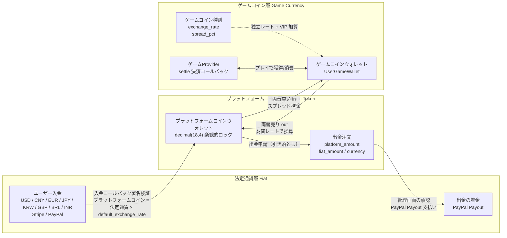

# グローバルゲームアグリゲーションプラットフォーム (Global Game Platform)

## プロジェクトマスコット


**ダイスィー（Dicey）** — プラットフォームのマスコット。サイコロはゲームと確率ベースのゲームプレイを、コインはプラットフォーム経済とマルチ決済ゲートウェイを、紫のメインカラーは管理画面ブランドを表します。SVG ファイル: `docs/mascot.svg`、文書・ロゴ・グッズに無限に拡大可能。
<!-- lang-nav -->

Languages: [中文](../../README.md) · [English](README.en.md) · [한국어](README.ko.md) · [Русский](README.ru.md) · [Deutsch](README.de.md) · [Français](README.fr.md) · [Español](README.es.md) · [Português](README.pt.md) · [हिन्दी](README.hi.md) · [العربية](README.ar.md) · [বাংলা](README.bn.md) · [Bahasa Indonesia](README.id.md) · **日本語**

> Copyright (c) 2026 erik <erik@erik.xyz> — https://erik.xyz

グローバルで国際化されたゲームアグリゲーションプラットフォーム。ユーザーは登録後、プラットフォーム上で入金してゲームコインに交換し、ゲームコインでゲームをプレイして稼ぐことができ、ゲームコインはウォレットに戻して出金することもできます。管理画面では、ゲーム管理・出金審査・ユーザー管理・決済管理の完全な機能を提供します。多言語切り替え（英語/中国語）に対応しています。

## バージョン戦略

| バージョン | 対象 | ステータス |
|------|------|------|
| 完全版 | フルセット：ランキング、クーポン、ゲームカテゴリ、国別設定、ES検索 | 完了 |
| エコシステム拡張 | v2.0：ゲームProvider接続、チケット、VIP、実績、ソーシャル、イベントバス | 完了 |
| v1.3.15-22（8バージョン） | 対帳/決済、リスク管理の深化、統一ウォレット、アクティビティエンジン、アンチチート、ソーシャル成長、Adyen/GrabPay | 完了 |

## 技術スタック

### バックエンド
- PHP 8.3+, webman v2 (workerman/webman)
- MySQL 8.0+ (テーブルプレフィックス `game_`、BIGINT 非オートインクリメント主キー)
- Redis (セッション / キャッシュ / レート制限)
- ClickHouse (OLAP 分析 / 確率計算)
- Elasticsearch (全文検索)
- JWT 認証 + RBAC 権限制御
- データ暗号化：API転送層 AES-256-CBC + データベース保存層 AES-128-ECB

### フロントエンド

フロントエンドは 2 つのディレクトリツリーに分かれ、**それぞれ自分側のバックエンドだけを呼び出し**、互いに交差しません:

| ディレクトリツリー | 位置づけ | リクエスト接頭辞 | 対応バックエンド | 技術スタック |
|--------|------|---------|---------|--------|
| `apps/*` | **C側プレイヤー向け** | `/api/v1/...` | service (既定 8792) | Flutter Web / React 19 (Vite) / Angular 21 / HarmonyOS ArkTS |
| `admin/apps/*` | **管理コンソール** | `/admin/v1/...` | admin (既定 8789) | Flutter Web / React 19 (Vite) / Angular 21 / HarmonyOS ArkTS |

- レスポンシブレイアウト (Phone / Tablet / Desktop)
- 国際化 (i18n)：英語 / 簡体字中国語の切り替え

### コアコンポーネント
- `erikwang2013/snowflake-php` — グローバル一意の BIGINT ID 生成
- `erikwang2013/hashids` — API層のID暗号化・復号
- `erikwang2013/jwt-webman` — JWT 認証
- `erikwang2013/encryption` — APIの機密データ暗号化・復号
- `erikwang2013/encryptable` — データベースの機密フィールド暗号化・復号
- `erikwang2013/webman-scout` — Elasticsearch 同期と検索
- `erikwang2013/season` — 国旗データ
- `erikwang2013/security-php` — セキュリティツール検出
- `erikwang2013/poster-php` — 機密操作のランダム検証
- `erikwang2013/clickhouse-php` — ClickHouse 接続と確率計算

## プロジェクト構成

```
game-platform-php/
├── admin/                     # 管理画面 (webman v2, デフォルトポート 8789, APP_PORT で変更可)
│   ├── app/admin/v1/controller/  #   管理側コントローラ
│   ├── app/middleware/        #   ミドルウェア (Cors/SecurityFilter/RateLimit/AdminAuth/AdminPermission/OperationLog)
│   ├── app/model/             #   admin 専用モデル (8 個、残り 52 個の共有モデルは packages/ にあり)
│   ├── app/service/           #   admin 専用サービス (WalletService/WalletScope/RiskSandboxService)
│   ├── app/process/           #   常駐プロセス (Http/Monitor/RiskIpCron)
│   ├── app/provider/          #   ゲーム Provider 層 (Self/ThirdParty/Factory)
│   ├── app/activity/          #   アクティビティエンジン (チェックイン/招待/デイリータスク)
│   ├── app/event/             #   イベントバス (EventBus Redis Pub/Sub)
│   ├── config/                #   設定ファイル
│   └── apps/                  #   管理画面フロントエンド (4 種、/admin/v1 → admin:8789 を呼び出す)
│       ├── flutter/           #     Flutter Web PC 管理画面
│       ├── react/             #     React 19 (Vite) 管理コンソール
│       ├── angular/           #     Angular 21 管理コンソール
│       └── harmonyos/         #     HarmonyOS ArkTS 管理コンソール (.hap、nginx を経由しない)
│
├── service/                   # C側業務 (webman v2, デフォルトポート 8792, APP_PORT で変更可)
│   ├── app/api/v1/controller/ #   C側 API コントローラー
│   ├── app/middleware/        #   ミドルウェア (TraceId/Cors/SecurityFilter/RateLimit/LanguageMiddleware/UserAuth/ProviderAuth/SdkSessionAuth)
│   ├── app/model/             #   service 専用モデル (10 個、残り 52 個の共有モデルは packages/ にあり)
│   ├── app/service/           #   service 専用サービス (ウォレット/リスク/コンプライアンス/照合/プッシュ/実績/不正対策など)
│   ├── app/payment/           #   18 個の決済ゲートウェイアダプタ (Stripe/PayPal/Adyen/NowPayments/Skrill…) + GatewayFactory
│   ├── app/cdn/               #   5 社の CDN アダプタ (Cloudflare/CloudFront/Alibaba/Tencent/Huawei) + CdnFactory
│   ├── app/process/           #   常駐プロセス (Http/Monitor/LeaderboardWS:8790/ChatWS:8791/EventConsumer/EventSubscriber/AntiCheatWorker/GroupSweepWorker/Health)
│   ├── app/provider/          #   ゲームProvider層
│   ├── app/activity/          #   アクティビティエンジン
│   ├── app/event/             #   イベントバス (EventBus Redis Pub/Sub)
│   └── config/                #   設定ファイル
│
├── packages/platform-common/  # 共有層: admin と service が composer path リポジトリ経由で取り込み、二重のコピーを避ける
│   ├── src/model/             #   共有 Eloquent モデル (52 個、両側で同一ソース)
│   ├── src/service/           #   共有サービス (DepositLogService / VipService など 11 個、ClickHouse 確率計算を含む)
│   ├── src/BcMath.php         #   金額/レートの高精度演算 (bcmath ラッパー)、四捨五入、パーセント
│   ├── src/EncryptionService.php  #   AES 暗号化/復号とマスキング
│   ├── src/CircuitBreaker.php #   サーキットブレーカー (加えて Retry.php による再試行)
│   ├── src/HashidsService.php #   API 層の ID エンコード/デコード
│   └── src/SnowflakeService.php   #   グローバルに一意な BIGINT ID
│
├── apps/                      # C側プレイヤー向けフロントエンド (4 種、/api/v1 → service:8792 を呼び出す)
│   ├── flutter/platform/      #   Flutter Web PC C側ユーザープラットフォーム
│   ├── react/                 #   React 19 (Vite) C側
│   ├── angular/               #   Angular 21 C側
│   └── harmonyos/             #   HarmonyOS ArkTS C側 (.hap、nginx を経由しない)
│
├── game/xiaoxiaole/           # 内蔵ミニゲーム「田园消消乐」: TypeScript + Vite + Vitest、src/domain エンジン + 4 レベル設計 + tests/、13 言語の設計ドキュメント
│
├── install/                   # ワンクリックインストールウィザード + データベース初期化 SQL
│   ├── index.php              #   インストールエントリー
│   ├── Installer.php          #   インストールのコアロジック
│   ├── install.sql            #   統合インストール SQL（78テーブル+シードデータ）
│   ├── clickhouse.sql         #   ClickHouse 分析用 DDL (独立エンジン、個別にインポート)
│   ├── test-data.sql          #   デモ/テストデータ
│   ├── migrations/            #   既存データベース向け増分アップグレードスクリプト (*.sql)
│   ├── lang/ + lang.php       #   インストールウィザード UI の翻訳 (13 言語)
│   └── assets/                #   静的リソース
│
├── docs/                      # プロジェクトドキュメント (本文はすべて 13 言語: .md が中国語の原本で、同ディレクトリに .{lang}.md の翻訳)
│   ├── ARCHITECTURE.md        #   アーキテクチャドキュメント
│   ├── ARCHITECTURE-DESIGN.md #   アーキテクチャ設計ドキュメント
│   ├── FEATURES.md            #   機能ドキュメント
│   ├── FEATURE-DESIGN.md      #   機能設計ドキュメント
│   ├── API.md                 #   API ドキュメント
│   ├── DEPLOYMENT.md          #   デプロイドキュメント（Docker/手動/ポート設定）
│   ├── PROVIDER-SDK.md        #   サードパーティ製ゲーム接続ガイド (署名アルゴリズム + PHP/Go/Python の例)
│   ├── CLICKHOUSE_INSTALL.md  #   ClickHouse のインストール/設定/移行/検証
│   ├── CLICKHOUSE_USAGE.md    #   ClickHouse の 4 つのサービス API と管理ダッシュボード
│   ├── translations/          #   本 README の 12 言語翻訳
│   ├── diagrams/              #   アーキテクチャ/フロー/機能/ライフサイクル/セキュリティ/エコシステム拡張の SVG (各 13 言語)
│   ├── test-reports/          #   テストレポート (php-unit / api / resilience / ui / SUMMARY)
│   └── superpowers/           #   本リポジトリの設計仕様と実装計画 (履歴記録)
│
├── scripts/                   # 運用スクリプト (モデルドリフト検査 / apidoc アノテーション移行 / exchange 出金セマンティクス移行 / 署名検証)
├── tests/api/                 # API 自動テスト (run_all.sh)
├── runtime/                   # webman ランタイムディレクトリ (ログ/pid、実行時に生成)
│
├── docker-compose.yml         # Docker Compose 構成（デフォルトポートはルート .env から）
├── nginx.conf.template        # Nginx 設定テンプレート（upstream ポートは envsubst でレンダリング）
├── .env.example               # ルート .env テンプレート（Docker ポート変数、.env にコピーして使用）
└── admin/docs/superpowers/    # 開発規約と計画
    ├── specs/                 #   設計仕様
    └── plans/                 #   実装計画
```

## クイックスタート

### 環境要件
- PHP 8.1+
- MySQL 8.0+
- Redis 6.0+
- Composer 2.x
- Flutter SDK 3.x (フロントエンド、任意)

### 方法1：ワンクリックインストールウィザード（推奨）

```bash
# 1. インストールウィザードを起動
php -S 0.0.0.0:8888 -t install/

# 2. ブラウザで http://localhost:8888 を開く
#    ウィザードに従って完了：環境チェック → データベース設定 → 管理者アカウント設定 → 自動インストール

# 3. 依存関係をインストール
cd admin && composer install && cd ..
cd service && composer install && cd ..

# 4. サービスを起動（デフォルトポート admin 8789 / service 8792、各自の .env の APP_PORT で変更可）
cd admin && php start.php start -d && cd ..
cd service && php start.php start -d && cd ..

# 5. 管理画面にアクセス: http://localhost:8789（デフォルトポート）
#    インストール時に設定した管理者アカウントのパスワードでログイン

# 6. インストール完了後、インストールディレクトリを削除（セキュリティ）
rm -rf install/
```

インストールウィザードが自動的に実行する内容：
- 環境チェック（PHPバージョン、拡張機能、ディレクトリ権限）
- データベースとテーブルの作成（統合SQL、78テーブル + シードデータ）
- スーパー管理者アカウントの作成（bcrypt 暗号化）
- JWT/暗号化キーの自動生成と .env ファイルへの書き込み
- install.lock を生成して再インストールを防止

### 方法2：手動インストール

<details>
<summary>手動インストール手順を展開</summary>

#### 1. データベース初期化

```bash
# 統合SQLを一括インポート
mysql -u root -e "CREATE DATABASE IF NOT EXISTS game-platform CHARACTER SET utf8mb4 COLLATE utf8mb4_unicode_ci;"
mysql -u root game-platform < install/install.sql
```

#### 2. 環境変数の設定

```bash
# 管理画面
cd admin
cp .env.example .env
# .env 内のデータベース接続情報とキーを編集

# C側業務
cd ../service
cp .env.example .env
# .env 内のデータベース接続情報とキーを編集
```

#### 3. バックエンド起動

```bash
cd admin && composer install && php start.php start -d
cd ../service && composer install && php start.php start -d
```

#### 4. 管理者の作成

管理者アカウントをデータベースに手動で挿入する必要があります（パスワードは bcrypt で暗号化されます）。

</details>

### フロントエンド起動（任意）

開発時は各フロントエンドが自分の dev サーバーを起動し、リクエストは dev サーバーから対応するバックエンドへプロキシされます (各ディレクトリの `proxy.conf.json` / `vite.config.ts` を参照):

```bash
# --- C側プレイヤー向け (/api/v1 → service:8792) ---
cd apps/react            && npm install && npm run dev      # http://localhost:5173
cd apps/angular          && npm install && npm start        # http://localhost:4200
cd apps/flutter/platform && flutter pub get && flutter run -d chrome

# --- 管理コンソール (/admin/v1 → admin:8789) ---
cd admin/apps/react      && npm install && npm run dev      # http://localhost:5273
cd admin/apps/angular    && npm install && npm start        # http://localhost:4300
cd admin/apps/flutter    && flutter pub get && flutter run -d chrome
```

> Angular dev サーバーのポート: 管理コンソールは `angular.json` で明示的に 4300 を設定し、C側は Angular 既定の 4200 のままです。同時に起動する場合はどちらかに `--port` を付けてください。
> HarmonyOS 端 (`apps/harmonyos`、`admin/apps/harmonyos`) は DevEco Studio で開いてビルドします;
> エミュレーターからホストのバックエンドへは `http://10.0.2.2:<port>` で到達します (各 `ApiService.ets` 冒頭の定数を参照)。

### フロントエンドデプロイ（Docker/Nginx）

`docker-compose.yml` の nginx サービスが各フロントエンドのビルド成果物を読み取り専用でコンテナにマウントし、`nginx.conf.template` が以下のパスで配信します。
成果物が未ビルドの場合ディレクトリは空になり、パスへのリクエストは 404、裸のディレクトリへのリクエスト（例 `/app-react/`）は 403 を返します。

| URL | 成果物のマウント先 | ビルドコマンド |
|-----|-----------|---------|
| `/` | `apps/flutter/platform/build/web` | `flutter build web` |
| `/app-react/` | `apps/react/dist` | `npm run build`（スクリプトに `--base=/app-react/` を含む） |
| `/app-angular/` | `apps/angular/dist/game-client-angular/browser` | `npm run build`（スクリプトに `--base-href=/app-angular/` を含む） |
| `/admin-panel/` | `admin/public` | 汎用配置スロット：任意のコンソール成果物を `admin/public` にコピーするだけで配置できます。未配置の場合も同様に 404（裸のディレクトリは 403）。注意：成果物は `--base=/admin-panel/`（Flutter は `--base-href=/admin-panel/`）でビルドする必要があり、そうでないとリソースが元のプレフィックスを指したまま 404 になります。スラッシュなしの形式は本アドレスへ 301 されます。`nginx.conf.template` は `absolute_redirect off` を設定済みのため、この転送は相対 Location となり、80 以外のポートでのデプロイでもポートが失われません |
| `/admin-react/` | `admin/apps/react/dist` | `npm run build`（スクリプトに `--base=/admin-react/` を含む） |
| `/admin-angular/` | `admin/apps/angular/dist/game-admin-angular/browser` | `npm run build`（スクリプトに `--base-href=/admin-angular/` を含む） |
| `/admin-flutter/` | `admin/apps/flutter/build/web` | `flutter build web --base-href=/admin-flutter/` |

`/admin/`（API）→ admin コンテナ、`/api/`（API）→ service コンテナ。HarmonyOS 端は `.hap` パッケージで配布し、nginx を経由しません。

### 動作確認

```bash
# 管理画面のテスト（デフォルトポート 8789）
curl http://localhost:8789/health

# C側業務のテスト（デフォルトポート 8792）
curl http://localhost:8792/health

# ユーザー登録のテスト
curl -X POST http://localhost:8792/api/v1/auth/register \
  -H "Content-Type: application/json" \
  -d '{"username":"testuser","password":"Abcdef12"}'
```

## セキュリティ機能

- **18層の多層防御**：XSS/SQLインジェクション/CSRF/パストラバーサル/コマンドインジェクションの検出・遮断
- **HTTPメソッドホワイトリスト**：GET/POST/PUT/DELETE/OPTIONS/HEAD のみ許可
- **JWT認証**：access_token 2時間 + refresh_token 14日、同時セッション制限
- **JWTキー起動時チェック**：admin側 `ADMIN_JWT_SECRET_KEY`、service側 `SERVICE_JWT_SECRET_KEY` の独立キーを使用し、キーが欠落しているかデフォルト値のままの場合は起動を拒否
- **決済コールバック fail-closed**：provider ホワイトリスト（stripe/paypal のみ）+ キー未設定/署名検証失敗/タイムスタンプ超過は一律拒否 + bccomp による金額照合 + コールバック入金のトランザクション化
- **RBAC権限**：method.path 粒度の権限制御、Redis 60秒キャッシュ
- **クリック型CAPTCHA**：ログイン/登録時に人機検証を強制
- **パスワード再確認**：機密操作にはパスワード入力による確認が必要
- **データ暗号化**：転送層 AES-256-CBC + 保存層 AES-128-ECB
- **ID暗号化**：Snowflake 生成 + Hashids エンコードで外部から逆算不可
- **ウォレット楽観的ロック**：同時引き落とし・重複入金を防止
- **操作監査**：全操作ログ、8プラットフォームの送信元自動検出
- **レート制限**：Redis スライディングウィンドウ、Lua による原子性確保
- **CSPヘッダー**：Content-Security-Policy で XSS を防止
- **アカウントセキュリティ**：ログイン連続5回失敗で15分間ロック

## テスト

テストレポート (ローカル保存): [docs/test-reports/](../test-reports/)

| テスト種別 | ケース/カバレッジ | 結果 |
|---------|----------|------|
| PHP ユニットテスト | 現測 `phpunit --list-tests`: admin 200 + service 273 ケース (レポート `docs/test-reports/php-unit.md` には 09-22 再実行 admin 190 + service 273、08-27 スナップショット admin 153 + service 45 を記載。admin 側はなお拡充中) | service は全通過 (701 アサーション、3 skipped、2 warnings + 35 deprecations)。admin は 437 アサーション、3 skipped、1 件失敗 (`EnvConfigTest` が実 `admin/.env` を検証し `REDIS_CLUSTER_NODES` の欠落を検出。追加すれば緑になる) |
| 安定性メカニズムのテスト | サーキットブレーカー/リトライ/デグレードスイッチ 15 ケース (CircuitBreakerTest/RetryTest/ResilienceMockTest) | すべて通過 |
| API 自動テスト | 187 エンドポイント (出典: `docs/test-reports/api.md`、2026-08-27)。現在の route.php は 261 エンドポイントを登録 | 171 通過 / 50 失敗 / 4 スキップ (失敗はいずれも確定的な不具合。レポート参照) |
| Flutter UI テスト | 12 ケース (ログイン/ダッシュボード/ナビゲーション/言語切替) | すべて通過 |
| Go/Rust | リポジトリに Go/Rust のコードはない | スキップ、記録済み |

```bash
# PHP ユニットテスト (先に JWT シークレットの環境変数をエクスポート)
cd admin && ADMIN_JWT_SECRET_KEY=test-jwt-secret-change-me php vendor/bin/phpunit
cd service && SERVICE_JWT_SECRET_KEY=test-jwt-secret-change-me php vendor/bin/phpunit
# API 自動テスト (サービスが起動している必要があります。tests/api/run_all.sh 参照)
bash tests/api/run_all.sh
# Flutter UI テスト
cd admin/apps/flutter && flutter test --timeout 300s
```

詳細レポート:
- [PHP ユニットテストレポート](../test-reports/php-unit.md)
- [安定性メカニズムのテストレポート (サーキットブレーカー/リトライ/デグレード)](../test-reports/resilience.md)
- [API 自動テストレポート](../test-reports/api.md)
- [Flutter UI テストレポート](../test-reports/ui.md)

## プラットフォーム機能概要

| 機能 | 説明 |
|------|------|
| ユーザー認証 | ユーザー名/パスワード + 7プラットフォーム OAuth (Google/Facebook/Apple/X(Twitter)/Microsoft/LinkedIn/GitHub) + 2FA TOTP |
| ウォレット | プラットフォームコインウォレット(楽観的ロック) + ゲームコインウォレット + 取引履歴 |
| 入金 | 注文作成 + Stripe/PayPal コールバック署名検証 + 自動入金 |
| 両替 | プラットフォームコイン⇄ゲームコイン、リアルタイム見積、スプレッド収益 |
| 出金 | 申請→審査→支払い、グローバルスイッチ、KYC段階別限度額+手数料 |
| KYC | 実名認証の提出+審査、承認後に出金限度額を引き上げ |
| ゲーム | CRUD + カテゴリ(10種) + サーバー区分 + ゲーム記録トラッキング |
| 検索 | Elasticsearch 全文検索(LIKE フォールバック含む) |
| ランキング | 日/週/月/総合ランキング、Redisキャッシュ、WebSocketリアルタイム配信（デフォルトポート 8790、LEADERBOARD_WS_PORT で変更可） |
| CDN | 5社プロバイダー連携 (Cloudflare R2 / AWS S3 / Aliyun OSS / Tencent COS / Huawei OBS アップロード+パージ+プリロード) + 管理画面での設定/有効無効/接続テスト |
| クーポン | 固定額+比率割引、期間・数量限定、獲得・使用の追跡 |
| 通知 | サイト内メッセージ+メール、入金/出金/KYC/クーポンの自動通知 |
| 紹介 | 紹介コード、登録ボーナス、入金コミッション |
| リスク管理 | IPブラックリスト/大口警告/頻度/速度検出 |
| リスク管理の深化 | デバイスフィンガープリント/IPレピュテーション/アカウント関連グラフ + ルールエンジン + リスクダッシュボード + AML/KYC/信頼スコア |
| アンチチート | アンチチートイベント収集 + 日次統計 + 手動レビュー |
| 対帳/決済 | 毎日対帳バッチ + 差異明細 + ステートメント対帳 |
| 統一ウォレット | WalletScope 統一ウォレットスコープ |
| アクティビティエンジン | アクティビティ作成/参加/報酬 + チェックイン |
| ソーシャル成長 | グループ + シェアリンク追跡 |
| 決済ゲートウェイ | 新規 Adyen / GrabPay ゲートウェイ (L1) |
| 国際化 | 4言語(en-US/zh-CN/ja-JP/ko-KR)、翻訳テーブル+キャッシュ |
| 国別設定 | 18カ国別の決済/出金方法、最低入金額 |
| 統計 | 日次統計スナップショット(5種類の指標) + プラットフォーム収益トラッキング |
| キャプチャ | クリック式人機検証(poster-php) |
| ゲーム接続 | Provider SDK (Self+ThirdParty) + HMAC-SHA256 署名 + コールバックゲートウェイ |
| チケット | C側で作成/返信 + 管理画面で処理/割り当て/クローズ |
| VIP | 5段階ロイヤルティ、経験値累積、両替割引/出金手数料減免/レート加算 |
| 実績 | 12個の内蔵実績、イベント駆動検出、進捗トラッキング |
| ソーシャル | 友達システム + WebSocket リアルタイムダイレクトメッセージ（デフォルトポート 8791、CHAT_WS_PORT で変更可）、友達のみ送信可 |
| トーナメント | トーナメントシステム (FeatureFlagスイッチ) + ランキング + 参加人数上限 |
| リベート | 2段階紹介収益分配 (コミッション率設定可能) |
| クーポン | 条件制限 (min_deposit/first_user/game_id) |
| イベント | Redis Pub/Sub イベントバス + Webhookサブスクリプション配信 (7種類のイベント) |
| デプロイ | Docker Compose 7サービス構成（ポートはルート .env で設定） + Nginxリバースプロキシ |
| クライアント | 管理画面 4 種 (Flutter/React/Angular/HarmonyOS) + C側 4 種 (Flutter/React/Angular/HarmonyOS) |

## ビジネスモデル

```
法定通貨 (USD/CNY/EUR...)
  │  入金 (Stripe/PayPal/Alipay/WeChat Pay)
  ▼
プラットフォームコイン (統一、精度 decimal(18,4))
  │  両替（為替レート + プラットフォームのスプレッド込み）
  ▼
ゲームコイン (ゲームごとに独立、独自レート)
  │  プレイで獲得/消費
  ▼
プラットフォームコイン ← 換金 → 出金（審査/自動）
```

## 複数通貨決済

プラットフォームは「法定通貨 → プラットフォームコイン → ゲームコイン」の3層通貨分離型決済体系を採用：USD/CNY/EUR/JPY/KRW/GBP/BRL/INR の複数法定通貨での入金に対応し、各ゲームは独立した計価通貨を持ちます。金額計算は全工程で bcmath 高精度演算を使用し、浮動小数点誤差を排除します。

### 3層通貨モデル

| 層 | 通貨 | 説明 |
|------|------|------|
| 法定通貨層 | USD / CNY / EUR / JPY / KRW / GBP / BRL / INR | ユーザーの入金/出金時の実支払通貨、Stripe / PayPal が処理 |
| プラットフォームコイン層 | プラットフォームコイン（全プラットフォーム統一） | 内部統一決済通貨（decimal(18,4)）、ウォレット楽観的ロックで同時引き落とし/重複入金を防止 |
| ゲームコイン層 | ゲームごとの独立通貨 | ゲームごとに独立した `exchange_rate` レートと `spread_pct` スプレッド、独立したゲームコインウォレット |

### 決済フロー

- **入金決済**：ユーザーが法定通貨で支払い（Stripe / PayPal コールバック署名検証、冪等性による重複防止）→ `default_exchange_rate` に従ってプラットフォームコインに換算して入金、入金注文には `amount + currency + platform_amount` も記録
- **両替決済**：プラットフォームコイン ⇄ ゲームコインをゲーム通貨レートでリアルタイム見積（quote）し、`spread_pct` スプレッドをプラットフォームの差益として控除、VIP は両替割引とレート加算を享受
- **ゲーム決済**：ゲームProviderが `/api/provider/settle` コールバックでユーザーのゲームコインを増減（HMAC-SHA256 署名）、ゲームセッションタイムアウト時に自動決済
- **出金決済**：プラットフォームコイン引き落とし → 出金注文の生成（`platform_amount / fiat_amount / currency` を記録）→ 管理画面の承認 → PayPal Payout による支払い → バッチステータスを完了まで同期

### 決済フロー図



## アーキテクチャ図


## コアビジネスプロセス


## 機能全景


## ライフサイクル


## セキュリティアーキテクチャ


## エコシステム拡張 (v2.0)


## ドキュメント一覧

| ドキュメント | 説明 |
|------|------|
| [バージョン比較](../VERSIONS.ja.md) | ベーシック版/スタンダード版/完全版の機能比較 |
| [アーキテクチャ設計ドキュメント](../ARCHITECTURE-DESIGN.ja.md) | アーキテクチャ選定理由と設計上の決定事項 |
| [アーキテクチャドキュメント](../ARCHITECTURE.ja.md) | システムトポロジー、モジュールアーキテクチャ、データフロー |
| [機能設計ドキュメント](../FEATURE-DESIGN.ja.md) | ビジネスモデル、機能仕様、フロー設計 |
| [機能ドキュメント](../FEATURES.ja.md) | 機能一覧、モジュール説明、ユーザージャーニー |
| [APIドキュメント](../API.ja.md) | 完全な API リファレンス (146 エンドポイント) |
| [オンラインドキュメント](http://localhost:8792/apidoc/) | erikwang2013/apidoc-php インタラクティブドキュメント (C側) |
| [オンラインドキュメント](http://localhost:8789/apidoc/) | erikwang2013/apidoc-php インタラクティブドキュメント (管理画面) |
| [ClickHouse インストール](../CLICKHOUSE_INSTALL.ja.md) | ClickHouse のインストール/設定/移行/検証 |
| [Provider SDK 接続ドキュメント](../PROVIDER-SDK.ja.md) | サードパーティゲーム接続ガイド (署名アルゴリズム+PHP/Go/Pythonサンプル) |
| [ClickHouse 使用方法](../CLICKHOUSE_USAGE.ja.md) | 4つの ClickHouse サービスAPIと管理画面ダッシュボード |
| [デプロイドキュメント](../DEPLOYMENT.ja.md) | デプロイガイド（Docker + 手動 + Nginx + 監視） |
| [設計仕様](../../admin/docs/superpowers/specs/2026-05-22-game-platform-design.ja.md) | 完全な設計仕様 |
| [実装計画](../../admin/docs/superpowers/plans/2026-05-22-game-platform-plan.ja.md) | 詳細な実装計画 |

---

## サポート

このプロジェクトが役に立ったなら、作者にコーヒーを一杯ごちそうしてください ☕

<p align="center">
  <table align="center" border="0" cellspacing="0" cellpadding="0">
    <tr>
      <td align="center" width="200">
        <br>
        <b>微信支付</b>
      </td>
      <td align="center" width="200">
        <br>
        <b>支付宝</b>
      </td>
    </tr>
  </table>
</p>

### グローバル銀行送金（Global Bank Transfer）

**受取人情報（Recipient）**

| 項目 | 内容 |
|----|------|
| 受取人氏名（Beneficiary Name） | WANG KEXUN |
| 受取口座番号（Account Number） | 881015918251 |

**受取銀行（Beneficiary Bank）**

| 項目 | 内容 |
|----|------|
| SWIFT Code | AABLHKHHXXX |
| 銀行名（Bank Name） | ZA Bank Limited |
| 銀行番号（Bank Code） | 387 |
| 銀行所在地（Bank Address） | Core F, Cyberport 3, 100 Cyberport Road, Hong Kong |

**クロスボーダー送金代理銀行（Correspondent Bank、必要な場合）**

> ご注意ください。これはクロスボーダー送金代理銀行（中継銀行）の情報であり、受取銀行の情報ではありません。送金銀行に、クロスボーダー送金代理銀行の情報が必要かどうかお問い合わせください。

- **香港ドル、人民元、米ドルの着金時の中継銀行は Citibank：**
  - 銀行名：Citibank N.A. Hong Kong
  - SWIFT Code：CITIHKHXXXX
  - 銀行番号：006
  - 支店名：Hong Kong Branch
  - 支店番号：391
  - 銀行所在地：Citibank Tower, Citibank Plaza, 3 Garden Road, Central, Hong Kong
- **その他の通貨の着金時の中継銀行は BNY Mellon：**
  - 銀行名：THE BANK OF NEW YORK MELLON
  - SWIFT Code：IRVTUS3NXXX
  - 銀行所在地：THE BANK OF NEW YORK MELLON, 240 GREENWICH STREET, NEW YORK, United States

### 仮想通貨の寄付 (Crypto Donation)

このプロジェクトがお役に立ったら、QRコードをスキャンして寄付してください。ありがとうございます！

| ネットワーク (Network) | QRコード (QR Code) | ウォレットアドレス (Wallet Address) |
|---|---|---|
| BNB Smart Chain (BEP20) | [](../coin/1.jpg) | `0x355d429f97511897ccb4e271ec888205f9ab6629` |
| Tron (TRC20) | [](../coin/2.jpg) | `TEdDHWLajt1XvqtPDWmQctdrJaC3pzZZzz` |
| Ethereum (ERC20) | [](../coin/3.jpg) | `0x355d429f97511897ccb4e271ec888205f9ab6629` |
| Aptos | [](../coin/4.jpg) | `0x836e3780edfc3f7b2372b39e2a1a3a5d7adfaccd96c726f21cfde1b50dd68030` |
| Plasma | [](../coin/5.jpg) | `0x355d429f97511897ccb4e271ec888205f9ab6629` |
| Polygon POS | [](../coin/6.jpg) | `0x355d429f97511897ccb4e271ec888205f9ab6629` |
| Solana | [](../coin/7.jpg) | `2hfhboHdmdrYsY25XfQSsEWxq5ip4EQsR7f4AzSRMUyr` |
| The Open Network (TON) | [](../coin/8.jpg) | `UQB9kFQohzmXUir9QSSZq01iwl9aQZIDdBpNmDklljRtCoGK` |
| Arbitrum One | [](../coin/9.jpg) | `0x355d429f97511897ccb4e271ec888205f9ab6629` |
| AVAX C-Chain | [](../coin/10.jpg) | `0x355d429f97511897ccb4e271ec888205f9ab6629` |

