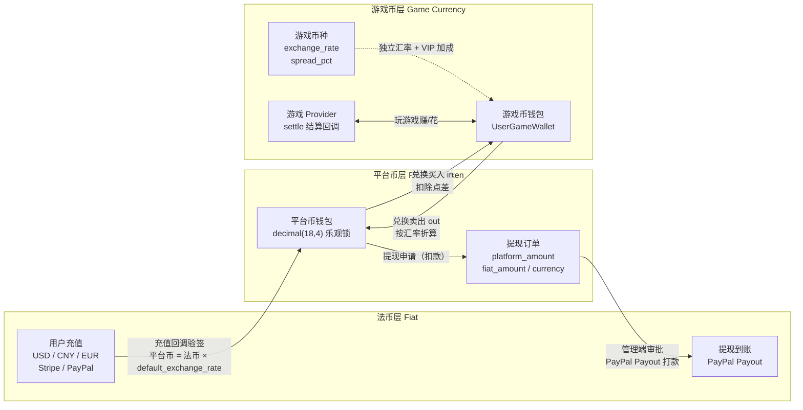
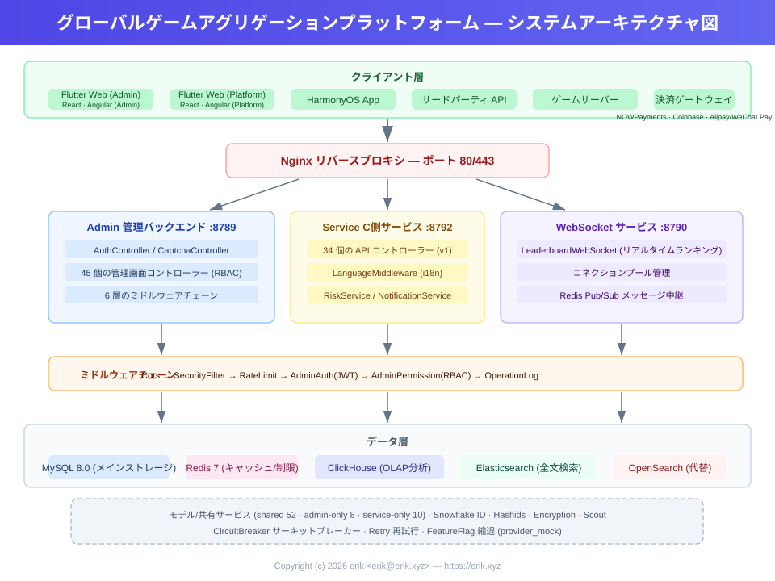
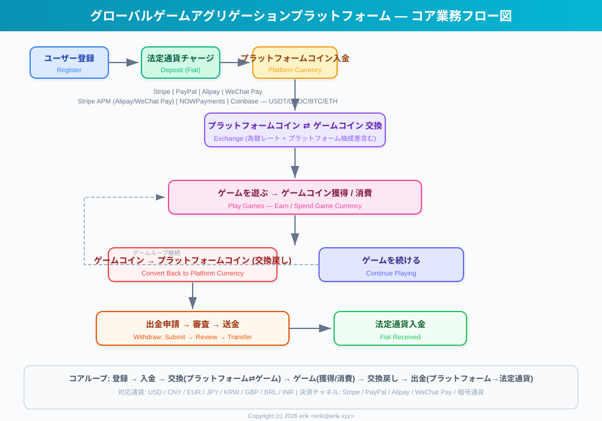
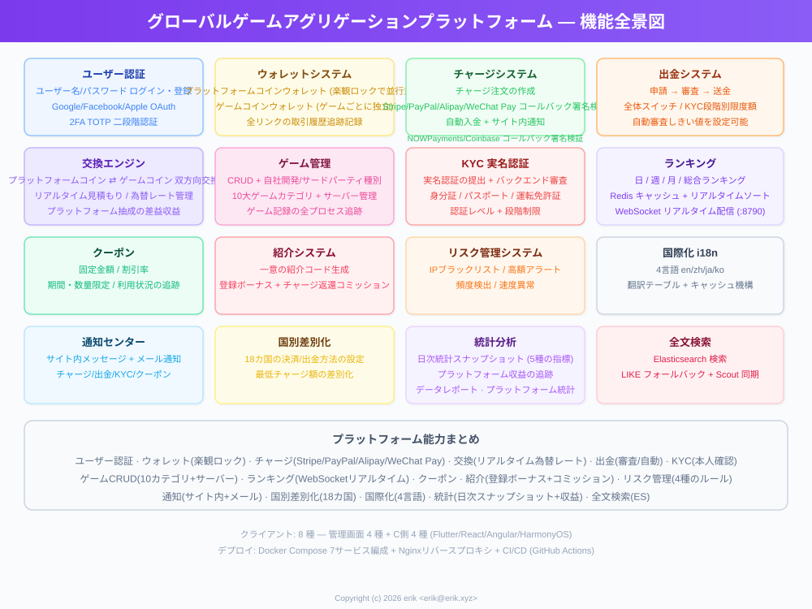
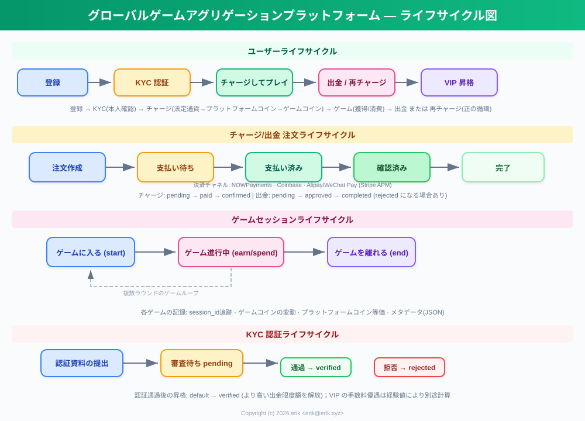
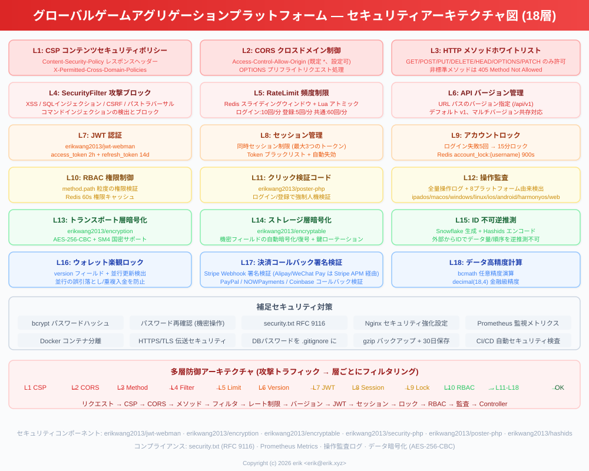
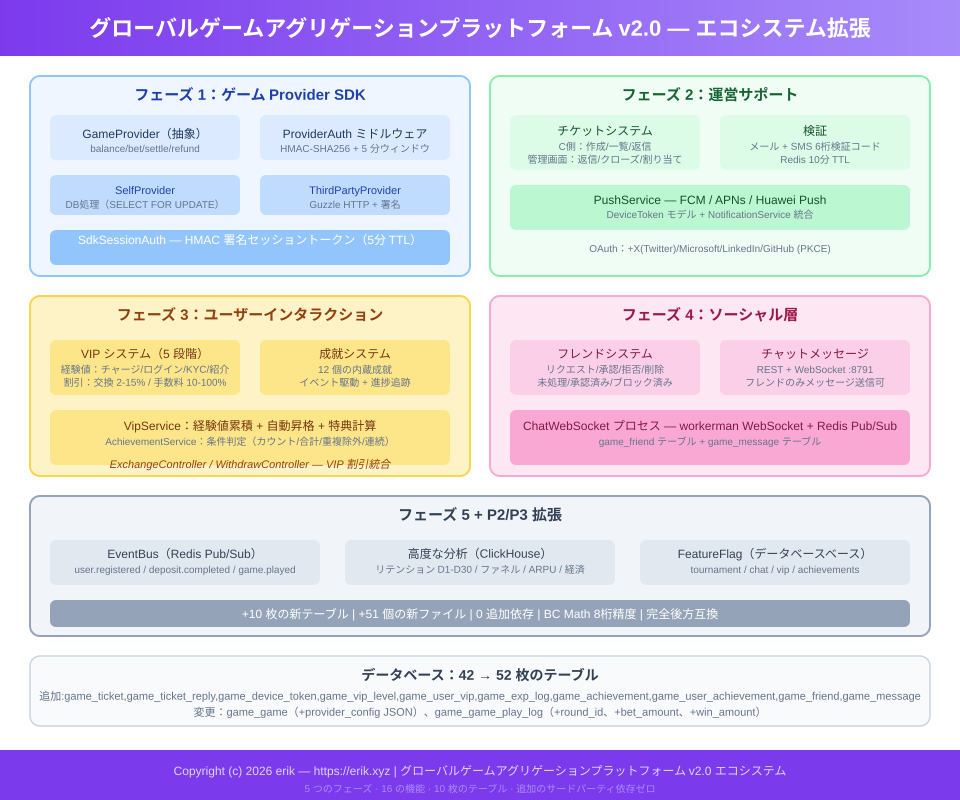

# グローバルゲームアグリゲーションプラットフォーム (Global Game Platform)
<!-- lang-nav -->

Languages: [中文](../../README.md) · [English](README.en.md) · [한국어](README.ko.md) · [Русский](README.ru.md) · [Deutsch](README.de.md) · [Français](README.fr.md) · [Español](README.es.md) · [Português](README.pt.md) · [हिन्दी](README.hi.md) · [العربية](README.ar.md) · [বাংলা](README.bn.md) · [Bahasa Indonesia](README.id.md) · **日本語**


> Copyright (c) 2026 erik <erik@erik.xyz> — https://erik.xyz

グローバルで国際化されたゲームアグリゲーションプラットフォーム。ユーザーは登録後、プラットフォーム上で入金してゲームコインに交換し、ゲームコインでゲームをプレイして稼ぐことができ、ゲームコインはウォレットに戻して出金することもできます。管理画面では、ゲーム管理・出金審査・ユーザー管理・決済管理の完全な機能を提供します。多言語切り替え（英語/中国語）に対応しています。

## バージョン戦略

| バージョン | 対象 | ステータス |
|------|------|------|
| 完全版 | フルセット：ランキング、クーポン、ゲームカテゴリ、国別設定、ES検索 | 完了 |
| エコシステム拡張 | v2.0：ゲームProvider接続、チケット、VIP、実績、ソーシャル、イベントバス | 完了 |

## 技術スタック

### バックエンド
- PHP 8.3+, webman v2 (workerman/webman)
- MySQL 8.0+ (テーブルプレフィックス `erik_`、BIGINT 非オートインクリメント主キー)
- Redis (セッション / キャッシュ / レート制限)
- ClickHouse (OLAP 分析 / 確率計算)
- Elasticsearch (全文検索)
- JWT 認証 + RBAC 権限制御
- データ暗号化：API転送層 AES-256-CBC + データベース保存層 AES-128-ECB

### フロントエンド
- Flutter 3.x (Web PC スタイル)
- HarmonyOS ArkTS (モバイル)
- レスポンシブレイアウト (Phone / Tablet / Desktop)
- 国際化 (i18n)：英語 / 簡体字中国語の切り替え

### コアコンポーネント
- `erikwang2013/snowflake-php` — グローバル一意の BIGINT ID 生成
- `erikwang2013/hashids` — API層のID暗号化・復号
- `erikwang2013/jwt-webman` — JWT 認証
- `erikwang2013/encryption` — APIの機密データ暗号化・復号
- `erikwang2013/encryptable` — データベースの機密フィールド暗号化・復号
- `erikwang2013/webman-scout` — Elasticsearch 同期と検索
- `erikwang2013/season` — 国旗データ
- `erikwang2013/security-php` — セキュリティツール検出
- `erikwang2013/poster-php` — 機密操作のランダム検証
- `erikwang2013/clickhouse-php` — ClickHouse 接続と確率計算

## プロジェクト構成

```
game-platform-php/
├── admin/                     # 管理画面 (webman v2, ポート 8787)
│   ├── app/admin/controller/  #   管理端コントローラー
│   ├── app/middleware/        #   中間ウェア (Cors/Security/RateLimit/Auth/ProviderAuth)
│   ├── app/provider/          #   ゲームProvider層
│   ├── app/event/             #   イベントバス (EventBus Redis Pub/Sub) (Cors/Security/RateLimit/Auth/Permission/ProviderAuth)
│   ├── app/provider/          #   ゲームProvider層 (Self/ThirdParty/Factory)
│   ├── app/middleware/        #   中間ウェア (Cors/Security/RateLimit/Auth/ProviderAuth)
│   ├── app/provider/          #   ゲームProvider層
│   ├── app/event/             #   イベントバス (EventBus Redis Pub/Sub) (Cors/Security/RateLimit/Auth/Permission)
│   ├── config/                #   設定ファイル
│   ├── database/migrations/   #   SQL 移行ファイル
│   └── apps/flutter/          #   Flutter Web PC 管理画面
│
├── service/                   # C端業務端 (webman v2, ポート 8788)
│   ├── app/api/v1/controller/ #   C端 API コントローラー
│   ├── app/middleware/        #   中間ウェア (Cors/Security/RateLimit/Auth/ProviderAuth)
│   ├── app/provider/          #   ゲームProvider層
│   ├── app/event/             #   イベントバス (EventBus Redis Pub/Sub)
│   └── config/                #   設定ファイル
│
├── install/                   # ワンクリックインストールウィザード
│   ├── index.php              #   インストールエントリー
│   ├── Installer.php          #   インストールのコアロジック
│   ├── install.sql            #   統合インストール SQL（43テーブル+シードデータ）
│   └── assets/                #   静的リソース
│
├── admin/common/ と service/common/   # 共有サービスを各1部 (DepositLogService 等、共有層への抽出予定)
│   └── service/               #   共有サービス (ClickHouse 確率計算を含む)
│
├── apps/
│   └── flutter/platform/      # Flutter Web PC C端ユーザープラットフォーム
│
├── docs/                      # プロジェクトドキュメント
│   ├── ARCHITECTURE.md        #   アーキテクチャドキュメント
│   ├── ARCHITECTURE-DESIGN.md #   アーキテクチャ設計ドキュメント
│   ├── FEATURES.md            #   機能ドキュメント
│   ├── FEATURE-DESIGN.md      #   機能設計ドキュメント
│   └── API.md                 #   API ドキュメント
│
└── admin/docs/superpowers/    # 開発規約と計画
    ├── specs/                 #   設計仕様
    └── plans/                 #   実装計画
```

## クイックスタート

### 環境要件
- PHP 8.1+
- MySQL 8.0+
- Redis 6.0+
- Composer 2.x
- Flutter SDK 3.x (フロントエンド、任意)

### 方法1：ワンクリックインストールウィザード（推奨）

```bash
# 1. インストールウィザードを起動
php -S 0.0.0.0:8888 -t install/

# 2. ブラウザで http://localhost:8888 を開く
#    ウィザードに従って完了：環境チェック → データベース設定 → 管理者アカウント設定 → 自動インストール

# 3. 依存関係をインストール
cd admin && composer install && cd ..
cd service && composer install && cd ..

# 4. サービスを起動
cd admin && php start.php start -d && cd ..
cd service && php start.php start -d && cd ..

# 5. 管理画面にアクセス: http://localhost:8787
#    インストール時に設定した管理者アカウントのパスワードでログイン

# 6. インストール完了後、インストールディレクトリを削除（セキュリティ）
rm -rf install/
```

インストールウィザードが自動的に実行する内容：
- 環境チェック（PHPバージョン、拡張機能、ディレクトリ権限）
- データベースとテーブルの作成（統合SQL、43テーブル + シードデータ）
- スーパー管理者アカウントの作成（bcrypt 暗号化）
- JWT/暗号化キーの自動生成と .env ファイルへの書き込み
- install.lock を生成して再インストールを防止

### 方法2：手動インストール

<details>
<summary>手動インストール手順を展開</summary>

#### 1. データベース初期化

```bash
# 統合SQLを一括インポート
mysql -u root -e "CREATE DATABASE IF NOT EXISTS game_platform CHARACTER SET utf8mb4 COLLATE utf8mb4_unicode_ci;"
mysql -u root game_platform < install/install.sql
```

#### 2. 環境変数の設定

```bash
# 管理画面
cd admin
cp .env.example .env
# .env 内のデータベース接続情報とキーを編集

# C端業務端
cd ../service
cp .env.example .env
# .env 内のデータベース接続情報とキーを編集
```

#### 3. バックエンド起動

```bash
cd admin && composer install && php start.php start -d
cd ../service && composer install && php start.php start -d
```

#### 4. 管理者の作成

管理者アカウントをデータベースに手動で挿入する必要があります（パスワードは bcrypt で暗号化されます）。

</details>

### フロントエンド起動（任意）

```bash
# 管理画面 (Flutter Web PC)
cd admin/apps/flutter
flutter pub get
flutter run -d chrome

# C端ユーザープラットフォーム (Flutter Web PC)
cd apps/flutter/platform
flutter pub get
flutter run -d chrome
```

### 動作確認

```bash
# 管理画面のテスト
curl http://localhost:8787/health

# C端業務のテスト
curl http://localhost:8788/health

# ユーザー登録のテスト
curl -X POST http://localhost:8788/api/auth/register \
  -H "Content-Type: application/json" \
  -d '{"username":"testuser","password":"123456"}'
```

## セキュリティ機能

- **18層の多層防御**：XSS/SQLインジェクション/CSRF/パストラバーサル/コマンドインジェクションの検出・遮断
- **HTTPメソッドホワイトリスト**：GET/POST/PUT/DELETE/OPTIONS/HEAD のみ許可
- **JWT認証**：access_token 2時間 + refresh_token 14日、同時セッション制限
- **JWTキー起動時チェック**：admin側 `ADMIN_JWT_SECRET_KEY`、service側 `SERVICE_JWT_SECRET_KEY` の独立キーを使用し、キーが欠落しているかデフォルト値のままの場合は起動を拒否
- **決済コールバック fail-closed**：provider ホワイトリスト（stripe/paypal のみ）+ キー未設定/署名検証失敗/タイムスタンプ超過は一律拒否 + bccomp による金額照合 + コールバック入金のトランザクション化
- **RBAC権限**：method.path 粒度の権限制御、Redis 60秒キャッシュ
- **クリック型CAPTCHA**：ログイン/登録時に人機検証を強制
- **パスワード再確認**：機密操作にはパスワード入力による確認が必要
- **データ暗号化**：転送層 AES-256-CBC + 保存層 AES-128-ECB
- **ID暗号化**：Snowflake 生成 + Hashids エンコードで外部から逆算不可
- **ウォレット楽観的ロック**：同時引き落とし・重複入金を防止
- **操作監査**：全操作ログ、8プラットフォームの送信元自動検出
- **レート制限**：Redis スライディングウィンドウ、Lua による原子性確保
- **CSPヘッダー**：Content-Security-Policy で XSS を防止
- **アカウントセキュリティ**：ログイン連続5回失敗で15分間ロック

## テスト

```bash
cd admin
phpunit --bootstrap tests/bootstrap.php tests/
```

- PHPUnit 12.x、116件のテストケース
- 56件のビジネスロジックテスト (PlatformTest) + 60件のインフラテスト
- 対象範囲：bcmath 精度、両替計算、出金手数料、限度額、リスク管理、クーポン、KYC、i18n

## プラットフォーム機能概要

| 機能 | 説明 |
|------|------|
| ユーザー認証 | ユーザー名/パスワード + 7プラットフォーム OAuth (Google/Facebook/Apple/X(Twitter)/Microsoft/LinkedIn/GitHub) + 2FA TOTP |
| ウォレット | プラットフォームコインウォレット(楽観的ロック) + ゲームコインウォレット + 取引履歴 |
| 入金 | 注文作成 + Stripe/PayPal コールバック署名検証 + 自動入金 |
| 両替 | プラットフォームコイン⇄ゲームコイン、リアルタイム見積、スプレッド収益 |
| 出金 | 申請→審査→支払い、グローバルスイッチ、KYC段階別限度額+手数料 |
| KYC | 実名認証の提出+審査、3段階認証制度 |
| ゲーム | CRUD + カテゴリ(10種) + サーバー区分 + ゲーム記録トラッキング |
| 検索 | Elasticsearch 全文検索(LIKE フォールバック含む) |
| ランキング | 日/週/月/総合ランキング、Redisキャッシュ、WebSocketリアルタイム配信(8789) |
| クーポン | 固定額+比率割引、期間・数量限定、獲得・使用の追跡 |
| 通知 | サイト内メッセージ+メール、入金/出金/KYC/クーポンの自動通知 |
| 紹介 | 紹介コード、登録ボーナス、入金コミッション |
| リスク管理 | IPブラックリスト/大口警告/頻度/速度検出 |
| 国際化 | 4言語(en-US/zh-CN/ja-JP/ko-KR)、翻訳テーブル+キャッシュ |
| 国別設定 | 8カ国別の決済/出金方法、最低入金額 |
| 統計 | 日次統計スナップショット(5種類の指標) + プラットフォーム収益トラッキング |
| キャプチャ | クリック式人機検証(poster-php) |
| ゲーム接続 | Provider SDK (Self+ThirdParty) + HMAC-SHA256 署名 + コールバックゲートウェイ |
| チケット | C端で作成/返信 + 管理端で処理/割り当て/クローズ |
| VIP | 5段階ロイヤルティ、経験値累積、両替割引/出金手数料減免/レート加算 |
| 実績 | 12個の内蔵実績、イベント駆動検出、進捗トラッキング |
| ソーシャル | 友達システム + WebSocket リアルタイムダイレクトメッセージ (ポート8791)、友達のみ送信可 |
| トーナメント | トーナメントシステム (FeatureFlagスイッチ) + ランキング + 参加人数上限 |
| リベート | 2段階紹介収益分配 (コミッション率設定可能) |
| クーポン | 条件制限 (min_deposit/first_user/game_id) |
| イベント | Redis Pub/Sub イベントバス + Webhookサブスクリプション配信 (7種類のイベント) |
| デプロイ | Docker Compose 8サービス構成 + Nginxリバースプロキシ |
| クライアント | Flutter Admin(15ページ) + Platform(10ページ) + HarmonyOS(5ページ) |

## ビジネスモデル

```
法币 (USD/CNY/EUR...)
  │  充值(Stripe/PayPal/支付宝/微信)
  ▼
平台币 (统一，精度 decimal(18,4))
  │  兑换（含汇率 + 平台抽成差价）
  ▼
游戏币 (每种游戏独立，独立汇率)
  │  玩游戏赚/花
  ▼
平台币 ← 兑回 → 提现（审核/自动）
```

## 複数通貨決済

プラットフォームは「法定通貨 → プラットフォームコイン → ゲームコイン」の3層通貨分離型決済体系を採用：USD/CNY/EUR の複数法定通貨での入金に対応し、各ゲームは独立した計価通貨を持ちます。金額計算は全工程で bcmath 高精度演算を使用し、浮動小数点誤差を排除します。

### 3層通貨モデル

| 層 | 通貨 | 説明 |
|------|------|------|
| 法定通貨層 | USD / CNY / EUR | ユーザーの入金/出金時の実支払通貨、Stripe / PayPal が処理 |
| プラットフォームコイン層 | プラットフォームコイン（全プラットフォーム統一） | 内部統一決済通貨（decimal(18,4)）、ウォレット楽観的ロックで同時引き落とし/重複入金を防止 |
| ゲームコイン層 | ゲームごとの独立通貨 | ゲームごとに独立した `exchange_rate` レートと `spread_pct` スプレッド、独立したゲームコインウォレット |

### 決済フロー

- **入金決済**：ユーザーが法定通貨で支払い（Stripe / PayPal コールバック署名検証、冪等性による重複防止）→ `default_exchange_rate` に従ってプラットフォームコインに換算して入金、入金注文には `amount + currency + platform_amount` も記録
- **両替決済**：プラットフォームコイン ⇄ ゲームコインをゲーム通貨レートでリアルタイム見積（quote）し、`spread_pct` スプレッドをプラットフォームの差益として控除、VIP は両替割引とレート加算を享受
- **ゲーム決済**：ゲームProviderが `/api/provider/settle` コールバックでユーザーのゲームコインを増減（HMAC-SHA256 署名）、ゲームセッションタイムアウト時に自動決済
- **出金決済**：プラットフォームコイン引き落とし → 出金注文の生成（`platform_amount / fiat_amount / currency` を記録）→ 管理端の承認 → PayPal Payout による支払い → バッチステータスを完了まで同期

### 決済フロー図



## アーキテクチャ図



## コアビジネスプロセス



## 機能全景



## ライフサイクル



## セキュリティアーキテクチャ



## エコシステム拡張 (v2.0)



## ドキュメント一覧

| ドキュメント | 説明 |
|------|------|
| [バージョン比較](../VERSIONS.ja.md) | ベーシック版/スタンダード版/完全版の機能比較 |
| [アーキテクチャ設計ドキュメント](../ARCHITECTURE-DESIGN.ja.md) | アーキテクチャ選定理由と設計上の決定事項 |
| [アーキテクチャドキュメント](../ARCHITECTURE.ja.md) | システムトポロジー、モジュールアーキテクチャ、データフロー |
| [機能設計ドキュメント](../FEATURE-DESIGN.ja.md) | ビジネスモデル、機能仕様、フロー設計 |
| [機能ドキュメント](../FEATURES.ja.md) | 機能一覧、モジュール説明、ユーザージャーニー |
| [APIドキュメント](../API.ja.md) | 完全な API リファレンス (102 エンドポイント) |
| [オンラインドキュメント](http://localhost:8788/apidoc/) | hg/apidoc インタラクティブドキュメント (C端) |
| [オンラインドキュメント](http://localhost:8787/apidoc/) | hg/apidoc インタラクティブドキュメント (管理画面) |
| [ClickHouse インストール](../CLICKHOUSE_INSTALL.ja.md) | ClickHouse のインストール/設定/移行/検証 |
| [Provider SDK 接続ドキュメント](../PROVIDER-SDK.ja.md) | サードパーティゲーム接続ガイド (署名アルゴリズム+PHP/Go/Pythonサンプル) |
| [ClickHouse 使用方法](../CLICKHOUSE_USAGE.ja.md) | 4つの ClickHouse サービスAPIと管理画面ダッシュボード |
| [デプロイドキュメント](../DEPLOYMENT.ja.md) | デプロイガイド（Docker + 手動 + Nginx + 監視） |
| [設計仕様](../../admin/docs/superpowers/specs/2026-05-22-game-platform-design.ja.md) | 完全な設計仕様 |
| [実装計画](../../admin/docs/superpowers/plans/2026-05-22-game-platform-plan.ja.md) | 詳細な実装計画 |

---

## サポート

このプロジェクトが役に立ったなら、作者にコーヒーを一杯ごちそうしてください ☕

<p align="center">
  <table align="center" border="0" cellspacing="0" cellpadding="0">
    <tr>
      <td align="center" width="200">
        <br>
        <b>微信支付</b>
      </td>
      <td align="center" width="200">
        <br>
        <b>支付宝</b>
      </td>
    </tr>
  </table>
</p>

### グローバル銀行送金（Global Bank Transfer）

**受取人情報（Recipient）**

| 項目 | 内容 |
|----|------|
| 受取人氏名（Beneficiary Name） | WANG KEXUN |
| 受取口座番号（Account Number） | 881015918251 |

**受取銀行（Beneficiary Bank）**

| 項目 | 内容 |
|----|------|
| SWIFT Code | AABLHKHHXXX |
| 銀行名（Bank Name） | ZA Bank Limited |
| 銀行番号（Bank Code） | 387 |
| 銀行所在地（Bank Address） | Core F, Cyberport 3, 100 Cyberport Road, Hong Kong |

**クロスボーダー送金代理銀行（Correspondent Bank、必要な場合）**

> ご注意ください。これはクロスボーダー送金代理銀行（中継銀行）の情報であり、受取銀行の情報ではありません。送金銀行に、クロスボーダー送金代理銀行の情報が必要かどうかお問い合わせください。

- **香港ドル、人民元、米ドルの着金時の中継銀行は Citibank：**
  - 銀行名：Citibank N.A. Hong Kong
  - SWIFT Code：CITIHKHXXXX
  - 銀行番号：006
  - 支店名：Hong Kong Branch
  - 支店番号：391
  - 銀行所在地：Citibank Tower, Citibank Plaza, 3 Garden Road, Central, Hong Kong
- **その他の通貨の着金時の中継銀行は BNY Mellon：**
  - 銀行名：THE BANK OF NEW YORK MELLON
  - SWIFT Code：IRVTUS3NXXX
  - 銀行所在地：THE BANK OF NEW YORK MELLON, 240 GREENWICH STREET, NEW YORK, United States
