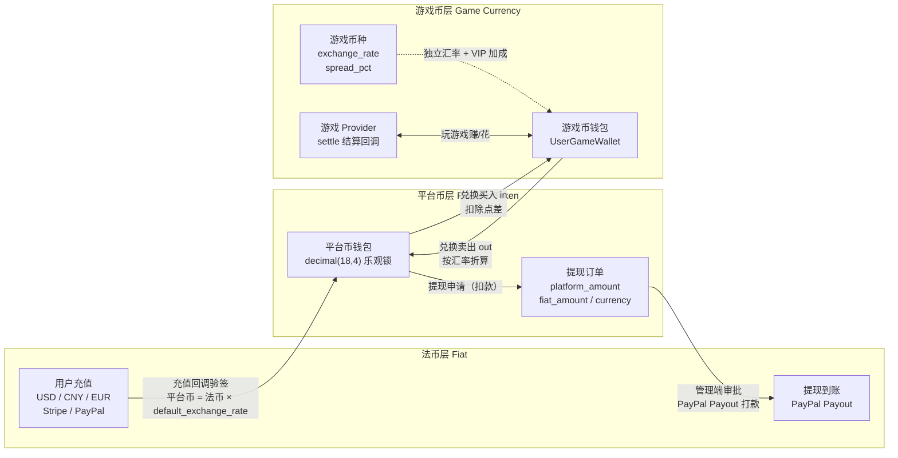
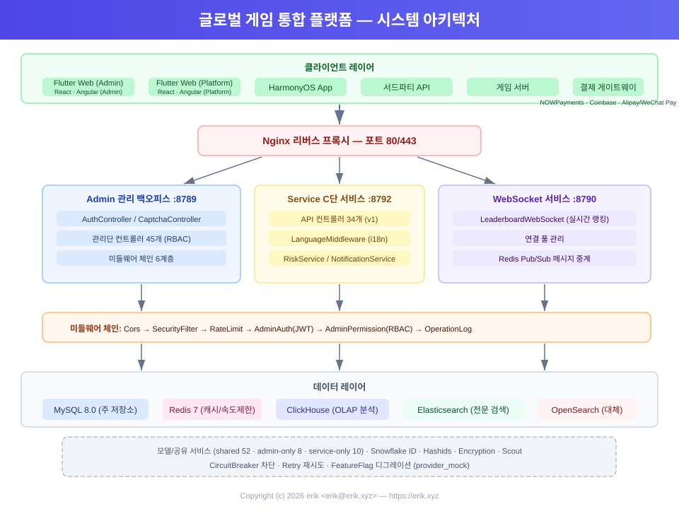
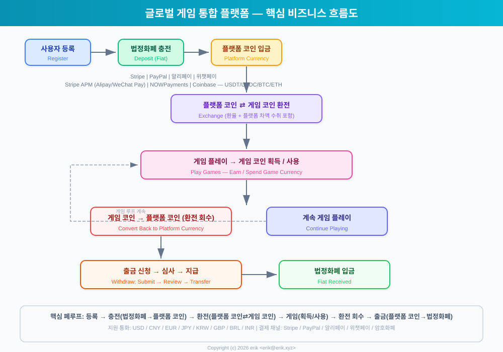
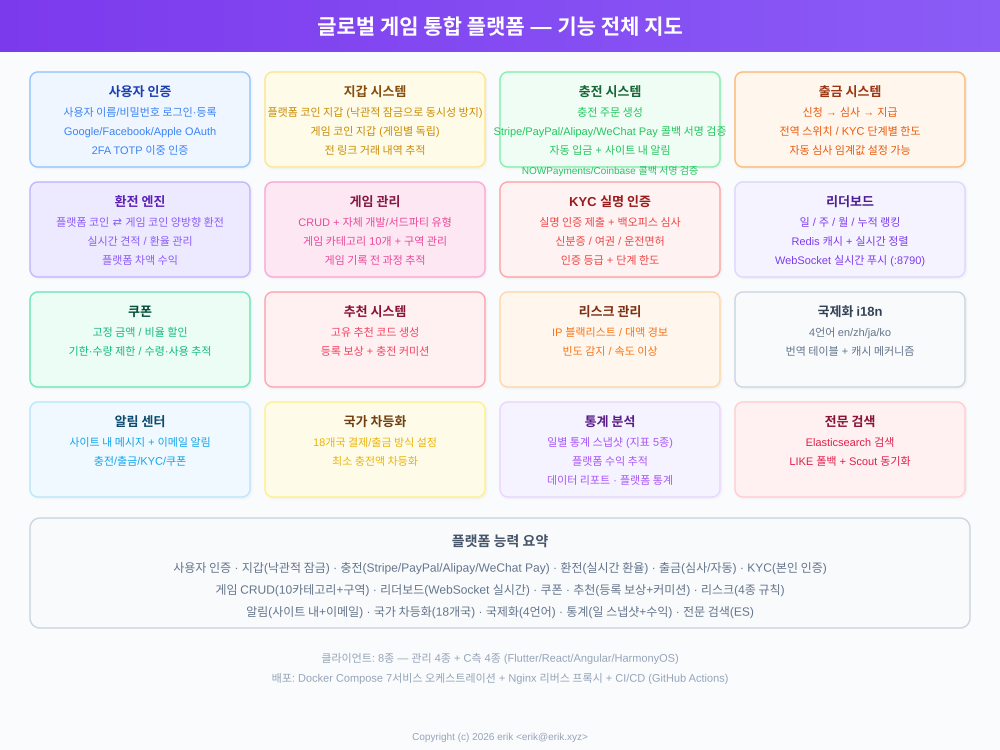
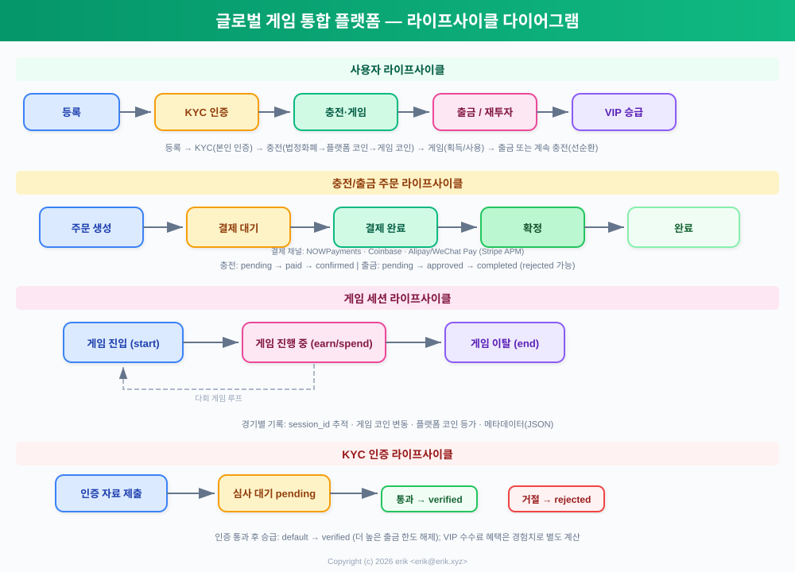
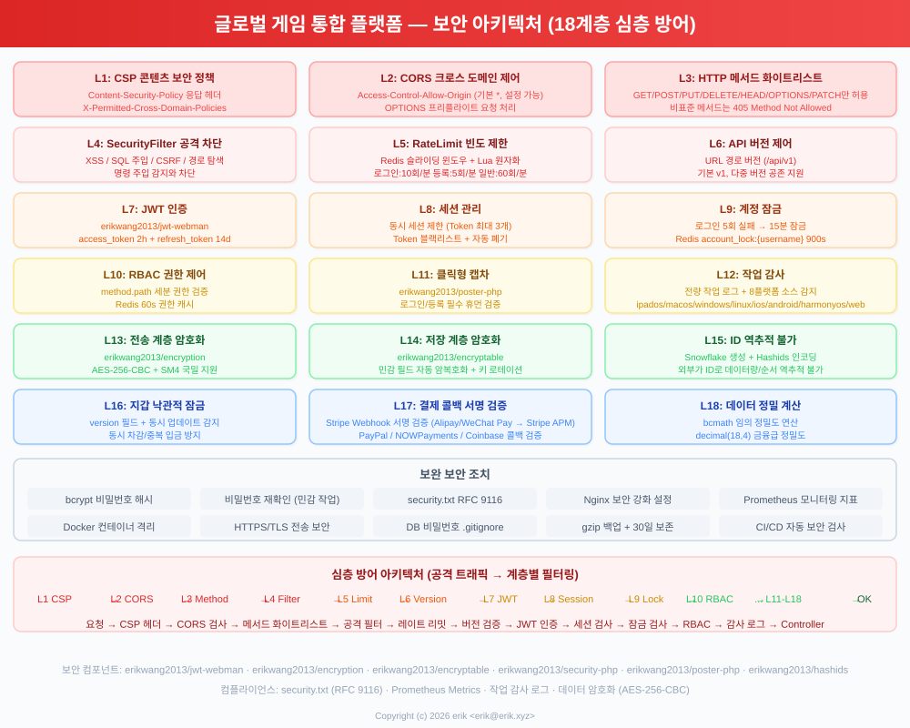
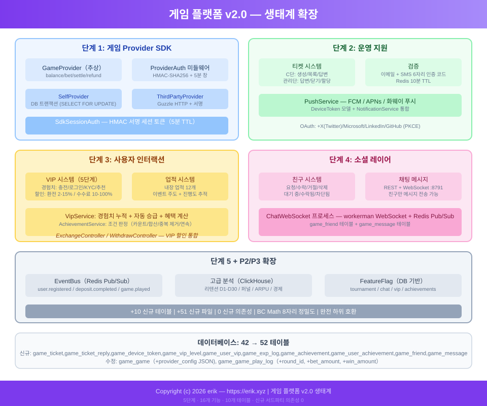

# 全球游戏聚合平台 (Global Game Platform)
<!-- lang-nav -->

Languages: [中文](../../README.md) · [English](README.en.md) · **한국어** · [Русский](README.ru.md) · [Deutsch](README.de.md) · [Français](README.fr.md) · [Español](README.es.md) · [Português](README.pt.md) · [हिन्दी](README.hi.md) · [العربية](README.ar.md) · [বাংলা](README.bn.md) · [Bahasa Indonesia](README.id.md) · [日本語](README.ja.md)


> Copyright (c) 2026 erik <erik@erik.xyz> — https://erik.xyz

전 세계에서 사용할 수 있는 국제화 게임 통합 플랫폼입니다. 사용자가 가입한 후 플랫폼에 충전하여 게임 코인으로 환전하고, 게임 코인으로 게임을 즐기며 게임 코인을 획득할 수 있으며, 게임 코인은 다시 지갑으로 환전하여 출금할 수 있습니다. 관리 백엔드는 완전한 게임 관리, 출금 심사, 사용자 관리 및 결제 관리 기능을 제공합니다. 다국어 전환(영어/중국어)을 지원합니다.

## 버전 정책

| 버전 | 목표 | 상태 |
|------|------|------|
| 전체 버전 | 완전체: 랭킹, 쿠폰, 게임 분류, 국가 설정, ES 검색 | 완료 |
| 생태계 확장 | v2.0: 게임 Provider 연동, 티켓, VIP, 업적, 소셜, 이벤트 버스 | 완료 |

## 기술 스택

### 백엔드
- PHP 8.3+, webman v2 (workerman/webman)
- MySQL 8.0+ (테이블 접두사 `erik_`, BIGINT 비자동증가 기본키)
- Redis (Session / 캐시 / 속도 제한)
- ClickHouse (OLAP 분석 / 확률 계산)
- Elasticsearch (전문 검색)
- JWT 인증 + RBAC 권한 제어
- 데이터 암호화: API 전송 계층 AES-256-CBC + 데이터베이스 저장 계층 AES-128-ECB

### 프론트엔드
- Flutter 3.x (Web PC 스타일)
- HarmonyOS ArkTS (모바일)
- 반응형 레이아웃 (Phone / Tablet / Desktop)
- 국제화 (i18n): 영어 / 중국어 간체 전환

### 핵심 컴포넌트
- `erikwang2013/snowflake-php` — 전역 고유 BIGINT ID 생성
- `erikwang2013/hashids` — API 계층 ID 암복호화
- `erikwang2013/jwt-webman` — JWT 인증
- `erikwang2013/encryption` — API 민감 데이터 암복호화
- `erikwang2013/encryptable` — 데이터베이스 민감 필드 암복호화
- `erikwang2013/webman-scout` — Elasticsearch 동기화 및 검색
- `erikwang2013/season` — 국가 국기
- `erikwang2013/security-php` — 보안 도구 감지
- `erikwang2013/poster-php` — 민감 작업 무작위 검증
- `erikwang2013/clickhouse-php` — ClickHouse 연결 및 확률 계산

## 프로젝트 구조

```
game-platform-php/
├── admin/                     # 관리 백엔드 (webman v2, 포트 8787)
│   ├── app/admin/controller/  #   관리자 컨트롤러
│   ├── app/middleware/        #   미들웨어 (Cors/Security/RateLimit/Auth/ProviderAuth)
│   ├── app/provider/          #   게임 Provider 계층
│   ├── app/event/             #   이벤트 버스 (EventBus Redis Pub/Sub) (Cors/Security/RateLimit/Auth/Permission/ProviderAuth)
│   ├── app/provider/          #   게임 Provider 계층 (Self/ThirdParty/Factory)
│   ├── app/middleware/        #   미들웨어 (Cors/Security/RateLimit/Auth/ProviderAuth)
│   ├── app/provider/          #   게임 Provider 계층
│   ├── app/event/             #   이벤트 버스 (EventBus Redis Pub/Sub) (Cors/Security/RateLimit/Auth/Permission)
│   ├── config/                #   설정 파일
│   ├── database/migrations/   #   SQL 마이그레이션 파일
│   └── apps/flutter/          #   Flutter Web PC 관리 백엔드
│
├── service/                   # C측 비즈니스 서버 (webman v2, 포트 8788)
│   ├── app/api/v1/controller/ #   C측 API 컨트롤러
│   ├── app/middleware/        #   미들웨어 (Cors/Security/RateLimit/Auth/ProviderAuth)
│   ├── app/provider/          #   게임 Provider 계층
│   ├── app/event/             #   이벤트 버스 (EventBus Redis Pub/Sub)
│   └── config/                #   설정 파일
│
├── install/                   # 원클릭 설치 마법사
│   ├── index.php              #   설치 진입점
│   ├── Installer.php          #   설치 핵심 로직
│   ├── install.sql            #   통합 설치 SQL（43개 테이블 + 시드 데이터）
│   └── assets/                #   정적 리소스
│
├── admin/common/ 와 service/common/   # 공유 서비스 각각 1부 (DepositLogService 등, 공유 계층 추출 예정)
│   └── service/               #   공유 서비스 (ClickHouse 확률 계산 포함)
│
├── apps/
│   └── flutter/platform/      # Flutter Web PC C측 사용자 플랫폼
│
├── docs/                      # 프로젝트 문서
│   ├── ARCHITECTURE.md        #   아키텍처 문서
│   ├── ARCHITECTURE-DESIGN.md #   아키텍처 설계 문서
│   ├── FEATURES.md            #   기능 문서
│   ├── FEATURE-DESIGN.md      #   기능 설계 문서
│   └── API.md                 #   API 문서
│
└── admin/docs/superpowers/    # 개발 규범 및 계획
    ├── specs/                 #   설계 규범
    └── plans/                 #   구현 계획
```

## 빠른 시작

### 환경 요구사항
- PHP 8.1+
- MySQL 8.0+
- Redis 6.0+
- Composer 2.x
- Flutter SDK 3.x (프론트엔드, 선택)

### 방법 1: 원클릭 설치 마법사 (권장)

```bash
# 1. 설치 마법사 시작
php -S 0.0.0.0:8888 -t install/

# 2. 브라우저에서 http://localhost:8888 열기
#    마법사 안내에 따라: 환경 점검 → 데이터베이스 설정 → 관리자 계정 설정 → 자동 설치

# 3. 의존성 설치
cd admin && composer install && cd ..
cd service && composer install && cd ..

# 4. 서비스 시작
cd admin && php start.php start -d && cd ..
cd service && php start.php start -d && cd ..

# 5. 관리 백엔드 접속: http://localhost:8787
#    설치 시 설정한 관리자 계정/비밀번호로 로그인

# 6. 설치 완료 후 설치 디렉터리 삭제 (보안)
rm -rf install/
```

설치 마법사가 자동으로 수행하는 작업:
- 환경 점검 (PHP 버전, 확장, 디렉터리 권한)
- 데이터베이스 및 테이블 생성 (통합 SQL, 43개 테이블 + 시드 데이터)
- 슈퍼 관리자 계정 생성 (bcrypt 암호화)
- JWT/암호화 키 자동 생성 및 .env 파일에 기록
- install.lock 생성으로 중복 설치 방지

### 방법 2: 수동 설치

<details>
<summary>수동 설치 단계 펼치기</summary>

#### 1. 데이터베이스 초기화

```bash
# 통합 SQL 원클릭 임포트
mysql -u root -e "CREATE DATABASE IF NOT EXISTS game_platform CHARACTER SET utf8mb4 COLLATE utf8mb4_unicode_ci;"
mysql -u root game_platform < install/install.sql
```

#### 2. 환경 변수 설정

```bash
# 관리 백엔드
cd admin
cp .env.example .env
# .env의 데이터베이스 연결 정보와 키 편집

# C측 비즈니스 서버
cd ../service
cp .env.example .env
# .env의 데이터베이스 연결 정보와 키 편집
```

#### 3. 백엔드 시작

```bash
cd admin && composer install && php start.php start -d
cd ../service && composer install && php start.php start -d
```

#### 4. 관리자 생성

데이터베이스에 관리자 계정을 직접 삽입해야 합니다 (비밀번호는 bcrypt로 암호화).

</details>

### 프론트엔드 시작 (선택)

```bash
# 관리 백엔드 (Flutter Web PC)
cd admin/apps/flutter
flutter pub get
flutter run -d chrome

# C측 사용자 플랫폼 (Flutter Web PC)
cd apps/flutter/platform
flutter pub get
flutter run -d chrome
```

### 검증

```bash
# 관리 백엔드 테스트
curl http://localhost:8787/health

# C측 비즈니스 테스트
curl http://localhost:8788/health

# 사용자 가입 테스트
curl -X POST http://localhost:8788/api/auth/register \
  -H "Content-Type: application/json" \
  -d '{"username":"testuser","password":"123456"}'
```

## 보안 기능

- **18계층 심층 방어**: XSS/SQL 인젝션/CSRF/경로 탐색/명령 인젝션 감지 차단
- **HTTP 메서드 화이트리스트**: GET/POST/PUT/DELETE/OPTIONS/HEAD만 허용
- **JWT 인증**: access_token 2시간 + refresh_token 14일, 동시 세션 제한
- **JWT 키 시작 검증**: admin 측 `ADMIN_JWT_SECRET_KEY`, service 측 `SERVICE_JWT_SECRET_KEY` 독립 키, 누락되거나 기본값이면 시작 거부
- **결제 콜백 fail-closed**: provider 화이트리스트 (stripe/paypal만) + 키 미설정/서명 검증 실패/타임스탬프 초과는 모두 거부 + bccomp 금액 대조 + 콜백 입금 트랜잭션 처리
- **RBAC 권한**: method.path 단위 권한 제어, Redis 60초 캐시
- **클릭 캡차**: 로그인/가입 시 필수 사람-기계 검증
- **비밀번호 2차 확인**: 민감 작업 시 비밀번호 입력 확인
- **데이터 암호화**: 전송 계층 AES-256-CBC + 저장 계층 AES-128-ECB
- **ID 암호화**: Snowflake 생성 + Hashids 인코딩, 외부에서 역추적 불가
- **지갑 낙관적 잠금**: 동시 출금/중복 입금 방지
- **작업 감사**: 전체 작업 로그, 8개 플랫폼 출처 자동 감지
- **속도 제한**: Redis 슬라이딩 윈도우, Lua 원자화
- **CSP 헤더**: Content-Security-Policy로 XSS 방지
- **계정 보안**: 연속 5회 로그인 실패 시 15분 잠금

## 테스트

```bash
cd admin
phpunit --bootstrap tests/bootstrap.php tests/
```

- PHPUnit 12.x, 116개 테스트 케이스
- 56개 비즈니스 로직 테스트 (PlatformTest) + 60개 인프라 테스트
- 커버리지: bcmath 정밀도, 환전 계산, 출금 수수료, 한도, 리스크 관리, 쿠폰, KYC, i18n

## 플랫폼 기능 개요

| 기능 | 설명 |
|------|------|
| 사용자 인증 | 아이디/비밀번호 + 7개 플랫폼 OAuth (Google/Facebook/Apple/X(Twitter)/Microsoft/LinkedIn/GitHub) + 2FA TOTP |
| 지갑 | 플랫폼 코인 지갑(낙관적 잠금) + 게임 코인 지갑 + 거래 내역 기록 |
| 충전 | 주문 생성 + Stripe/PayPal 콜백 서명 검증 + 자동 입금 |
| 환전 | 플랫폼 코인⇄게임 코인, 실시간 견적, 차액 수익 |
| 출금 | 신청→심사→송금, 전역 스위치, KYC 단계별 한도+수수료 |
| KYC | 실명 인증 제출+심사, 3단계 인증 체계 |
| 게임 | CRUD + 분류(10종) + 서버 + 게임 기록 추적 |
| 검색 | Elasticsearch 전문 검색(LIKE 폴백 포함) |
| 랭킹 | 일/주/월/전체 랭킹, Redis 캐시, WebSocket 실시간 푸시(8789) |
| 쿠폰 | 고정 금액+비율 할인, 기간/수량 한정, 사용 추적 |
| 알림 | 사이트 내 메시지+이메일, 충전/출금/KYC/쿠폰 자동 알림 |
| 추천 | 추천 코드, 가입 보상, 충전 수수료 리베이트 |
| 리스크 관리 | IP 블랙리스트/대금 경고/빈도/속도 감지 |
| 국제화 | 4개 언어(en-US/zh-CN/ja-JP/ko-KR), 번역 테이블+캐시 |
| 국가 설정 | 8개국 차등 결제/출금 방식, 최소 충전액 |
| 통계 | 일일 통계 스냅샷(5종 지표) + 플랫폼 수익 추적 |
| 캡차 | 클릭식 사람-기계 검증(poster-php) |
| 게임 연동 | Provider SDK (Self+ThirdParty) + HMAC-SHA256 서명 + 콜백 게이트웨이 |
| 티켓 | C측 생성/답변 + 관리측 처리/배정/종료 |
| VIP | 5단계 충성도, 경험치 누적, 환전 할인/출금 감면/환율 가산 |
| 업적 | 12개 내장 업적, 이벤트 기반 감지, 진행 추적 |
| 소셜 | 친구 시스템 + WebSocket 실시간 쪽지 (포트 8791), 친구만 발송 가능 |
| 대회 | 토너먼트 시스템 (FeatureFlag 스위치) + 랭킹 + 인원 상한 |
| 리베이트 | 2단계 추천 수익 배분 (커미션율 설정 가능) |
| 쿠폰 | 조건 제한 (min_deposit/first_user/game_id) |
| 이벤트 | Redis Pub/Sub 이벤트 버스 + Webhook 구독 전달 (7종 이벤트) |
| 배포 | Docker Compose 8개 서비스 오케스트레이션 + Nginx 리버스 프록시 |
| 클라이언트 | Flutter Admin(15페이지) + Platform(10페이지) + HarmonyOS(5페이지) |

## 비즈니스 모델

```
법정화폐 (USD/CNY/EUR...)
  │  충전(Stripe/PayPal/알리페이/위챗페이)
  ▼
플랫폼 코인 (통일, 정밀도 decimal(18,4))
  │  환전 (환율 + 플랫폼 수수료 차액 포함)
  ▼
게임 코인 (게임마다 독립, 독립 환율)
  │  게임으로 획득/사용
  ▼
플랫폼 코인 ← 환전 → 출금 (심사/자동)
```

## 다중 통화 정산

플랫폼은 「법정화폐 → 플랫폼 코인 → 게임 코인」 3계층 통화 분리 정산 체계를 채택합니다: USD/CNY/EUR 다중 법정화폐 충전을 지원하며, 각 게임은 독립적인 결제 통화를 보유합니다. 금액 계산은 전 과정에서 bcmath 고정밀 연산을 사용하여 부동소수점 오차를 방지합니다.

### 3계층 통화 모델

| 계층 | 통화 | 설명 |
|------|------|------|
| 법정화폐 계층 | USD / CNY / EUR | 사용자 충전/출금의 실제 결제 통화, Stripe / PayPal이 처리 |
| 플랫폼 코인 계층 | 플랫폼 코인 (전 플랫폼 통일) | 내부 통일 정산 통화 (decimal(18,4)), 지갑 낙관적 잠금으로 동시 출금/중복 입금 방지 |
| 게임 코인 계층 | 게임마다 독립 통화 | 게임마다 독립 `exchange_rate` 환율과 `spread_pct` 스프레드, 독립 게임 코인 지갑 |

### 정산 경로

- **충전 정산**: 사용자가 법정화폐로 결제 (Stripe / PayPal 콜백 서명 검증, 멱등성 방지) → `default_exchange_rate`에 따라 플랫폼 코인 입금, 충전 주문에 `amount + currency + platform_amount` 동시 기록
- **환전 정산**: 플랫폼 코인 ⇄ 게임 코인을 게임 통화 환율로 실시간 견적(quote), `spread_pct` 스프레드를 플랫폼 차액 수익으로 차감, VIP는 환전 할인과 환율 가산 혜택
- **게임 정산**: 게임 Provider가 `/api/provider/settle` 콜백으로 사용자 게임 코인 증감 (HMAC-SHA256 서명), 게임 세션 타임아웃 시 자동 정산
- **출금 정산**: 플랫폼 코인 차감 → 출금 주문 생성 (`platform_amount / fiat_amount / currency` 기록) → 관리측 승인 → PayPal Payout 송금 → 배치 상태 완료로 동기화

### 정산 흐름도



## 아키텍처 다이어그램



## 핵심 비즈니스 흐름



## 기능 전체 보기



## 라이프사이클



## 보안 아키텍처



## 생태계 확장 (v2.0)



## 문서 색인

| 문서 | 설명 |
|------|------|
| [버전 비교](../VERSIONS.ko.md) | 기본/표준/전체 버전 기능 비교 |
| [아키텍처 설계 문서](../ARCHITECTURE-DESIGN.ko.md) | 아키텍처 선정 이유와 설계 결정 |
| [아키텍처 문서](../ARCHITECTURE.ko.md) | 시스템 토폴로지, 모듈 아키텍처, 데이터 흐름 |
| [기능 설계 문서](../FEATURE-DESIGN.ko.md) | 비즈니스 모델, 기능 사양, 프로세스 설계 |
| [기능 문서](../FEATURES.ko.md) | 기능 목록, 모듈 설명, 사용자 여정 |
| [API 문서](../API.ko.md) | 전체 API 레퍼런스 (102개 인터페이스) |
| [온라인 문서](http://localhost:8788/apidoc/) | hg/apidoc 인터랙티브 문서 (C측) |
| [온라인 문서](http://localhost:8787/apidoc/) | hg/apidoc 인터랙티브 문서 (관리 백엔드) |
| [ClickHouse 설치](../CLICKHOUSE_INSTALL.ko.md) | ClickHouse 설치/설정/마이그레이션/검증 |
| [Provider SDK 연동 문서](../PROVIDER-SDK.ko.md) | 제3자 게임 연동 가이드 (서명 알고리즘+PHP/Go/Python 예제) |
| [ClickHouse 사용](../CLICKHOUSE_USAGE.ko.md) | 4개 ClickHouse 서비스 API와 백엔드 대시보드 |
| [배포 문서](../DEPLOYMENT.ko.md) | 배포 가이드 (Docker + 수동 + Nginx + 모니터링) |
| [설계 규범](../../admin/docs/superpowers/specs/2026-05-22-game-platform-design.ko.md) | 전체 설계 규범 |
| [구현 계획](../../admin/docs/superpowers/plans/2026-05-22-game-platform-plan.ko.md) | 상세 구현 계획 |

---

## 프로젝트 지원

이 프로젝트가 도움이 되었다면 작성자에게 커피 한 잔을 선물해 주세요 ☕

<p align="center">
  <table align="center" border="0" cellspacing="0" cellpadding="0">
    <tr>
      <td align="center" width="200">
        <br>
        <b>위챗페이</b>
      </td>
      <td align="center" width="200">
        <br>
        <b>알리페이</b>
      </td>
    </tr>
  </table>
</p>

### 글로벌 송금 (Global Bank Transfer)

**수취인 정보 (Recipient)**

| 항목 | 내용 |
|----|------|
| 수취인 이름 (Beneficiary Name) | WANG KEXUN |
| 수취 계좌번호 (Account Number) | 881015918251 |

**수취 은행 (Beneficiary Bank)**

| 항목 | 내용 |
|----|------|
| SWIFT Code | AABLHKHHXXX |
| 은행 이름 (Bank Name) | ZA Bank Limited |
| 은행 코드 (Bank Code) | 387 |
| 은행 주소 (Bank Address) | Core F, Cyberport 3, 100 Cyberport Road, Hong Kong |

**해외 송금 중개 은행 (Correspondent Bank, 필요한 경우)**

> 참고: 이 정보는 해외 송금 중개 은행(중계 은행) 정보이며, 수취 은행 정보가 아닙니다. 송금 은행에 중개 은행 정보가 필요한지 문의하시기 바랍니다.

- **홍콩달러, 위안화 및 달러 입금 시 중개 은행은 Citibank입니다:**
  - 은행 이름: Citibank N.A. Hong Kong
  - SWIFT Code: CITIHKHXXXX
  - 은행 코드: 006
  - 지점 이름: Hong Kong Branch
  - 지점 번호: 391
  - 은행 주소: Citibank Tower, Citibank Plaza, 3 Garden Road, Central, Hong Kong
- **기타 통화 입금 시 중개 은행은 BNY Mellon입니다:**
  - 은행 이름: THE BANK OF NEW YORK MELLON
  - SWIFT Code: IRVTUS3NXXX
  - 은행 주소: THE BANK OF NEW YORK MELLON, 240 GREENWICH STREET, NEW YORK, United States
