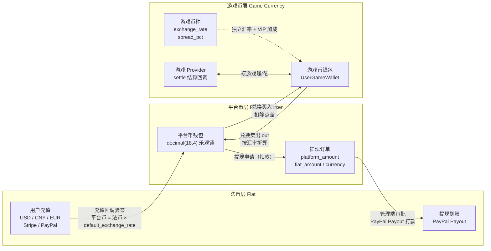
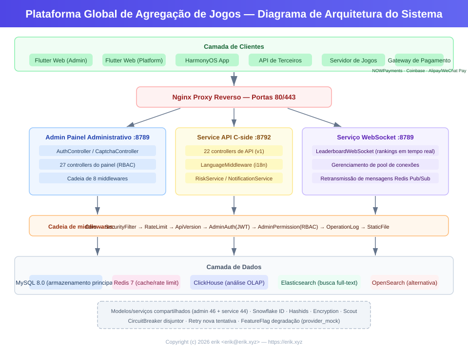
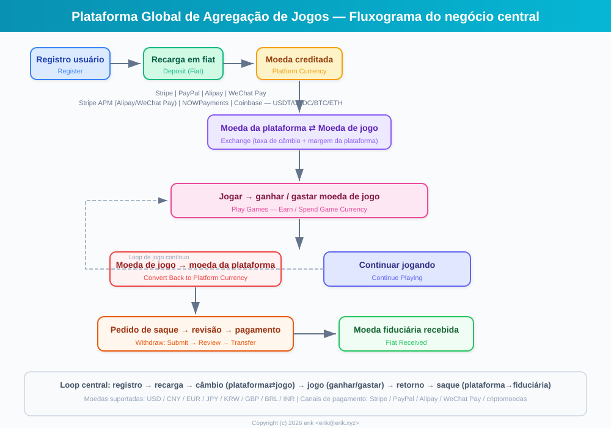
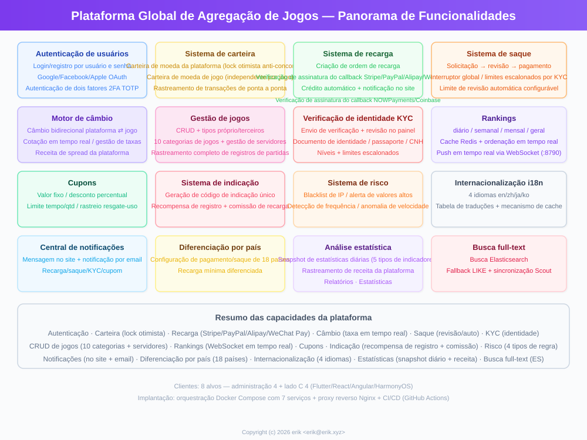
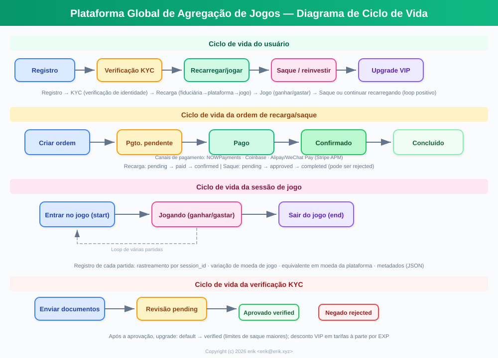
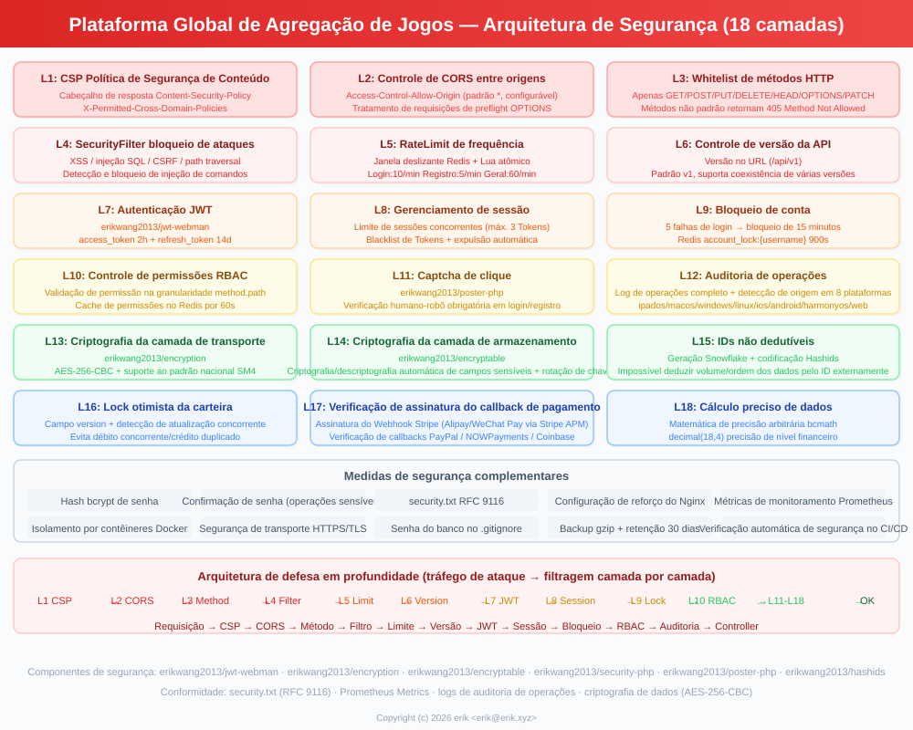
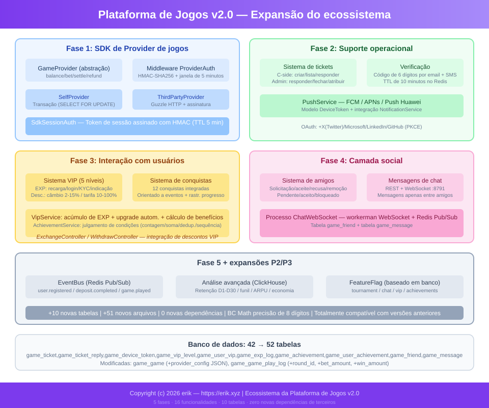

# Plataforma Global de Agregação de Jogos (Global Game Platform)
<!-- lang-nav -->

Languages: [中文](../../README.md) · [English](README.en.md) · [한국어](README.ko.md) · [Русский](README.ru.md) · [Deutsch](README.de.md) · [Français](README.fr.md) · [Español](README.es.md) · **Português** · [हिन्दी](README.hi.md) · [العربية](README.ar.md) · [বাংলা](README.bn.md) · [Bahasa Indonesia](README.id.md) · [日本語](README.ja.md)


> Copyright (c) 2026 erik <erik@erik.xyz> — https://erik.xyz

Plataforma de agregação de jogos global, universal e internacionalizada. Após o registro, os usuários recarregam saldo na plataforma para trocar por moedas de jogo, usam as moedas para jogar e ganhar mais moedas, e podem converter as moedas de volta para a carteira e sacar. O painel administrativo oferece gerenciamento completo de jogos, revisão de saques, gerenciamento de usuários e gerenciamento de pagamentos. Suporte a troca de idioma (inglês/chines).

## Estratégia de versões

| Versão | Objetivo | Status |
|------|------|------|
| Versão completa | Corpo completo: rankings, cupons, categorias de jogos, configuração de países, busca ES | Concluída |
| Expansão do ecossistema | v2.0: integração de Providers de jogos, tickets de suporte, VIP, conquistas, social, barramento de eventos | Concluída |

## Stack tecnológica

### Backend
- PHP 8.3+, webman v2 (workerman/webman)
- MySQL 8.0+ (prefixo de tabela `erik_`, chave primária BIGINT não auto-incrementável)
- Redis (Session / cache / rate limit)
- ClickHouse (análise OLAP / cálculo de probabilidades)
- Elasticsearch (busca em texto completo)
- Autenticação JWT + controle de permissão RBAC
- Criptografia de dados: AES-256-CBC na camada de transporte da API + AES-128-ECB na camada de armazenamento do banco de dados

### Frontend
- Flutter 3.x (estilo Web PC)
- HarmonyOS ArkTS (dispositivos móveis)
- Layout responsivo (Phone / Tablet / Desktop)
- Internacionalização (i18n): troca entre inglês / chinês simplificado

### Componentes principais
- `erikwang2013/snowflake-php` — geração de IDs BIGINT globalmente únicos
- `erikwang2013/hashids` — criptografia/descriptografia de IDs na camada de API
- `erikwang2013/jwt-webman` — autenticação JWT
- `erikwang2013/encryption` — criptografia/descriptografia de dados sensíveis da API
- `erikwang2013/encryptable` — criptografia/descriptografia de campos sensíveis do banco de dados
- `erikwang2013/webman-scout` — sincronização e consulta no Elasticsearch
- `erikwang2013/season` — bandeiras de países
- `erikwang2013/security-php` — detecção de ferramentas de segurança
- `erikwang2013/poster-php` — verificação aleatória para operações sensíveis
- `erikwang2013/clickhouse-php` — conexão ClickHouse e cálculo de probabilidades

## Estrutura do projeto

```
game-platform-php/
├── admin/                     # Painel administrativo (webman v2, porta 8787)
│   ├── app/admin/controller/  #   Controladores do painel administrativo
│   ├── app/middleware/        #   Middlewares (Cors/Security/RateLimit/Auth/ProviderAuth)
│   ├── app/provider/          #   Camada de Providers de jogos
│   ├── app/event/             #   Barramento de eventos (EventBus Redis Pub/Sub) (Cors/Security/RateLimit/Auth/Permission/ProviderAuth)
│   ├── app/provider/          #   Camada de Providers de jogos (Self/ThirdParty/Factory)
│   ├── app/middleware/        #   Middlewares (Cors/Security/RateLimit/Auth/ProviderAuth)
│   ├── app/provider/          #   Camada de Providers de jogos
│   ├── app/event/             #   Barramento de eventos (EventBus Redis Pub/Sub) (Cors/Security/RateLimit/Auth/Permission)
│   ├── config/                #   Arquivos de configuração
│   ├── database/migrations/   #   Arquivos de migração SQL
│   └── apps/flutter/          #   Painel administrativo Flutter Web PC
│
├── service/                   # Serviço de negócios do lado C (webman v2, porta 8788)
│   ├── app/api/v1/controller/ #   Controladores da API do lado C
│   ├── app/middleware/        #   Middlewares (Cors/Security/RateLimit/Auth/ProviderAuth)
│   ├── app/provider/          #   Camada de Providers de jogos
│   ├── app/event/             #   Barramento de eventos (EventBus Redis Pub/Sub)
│   └── config/                #   Arquivos de configuração
│
├── install/                   # Assistente de instalação com um clique
│   ├── index.php              #   Ponto de entrada da instalação
│   ├── Installer.php          #   Lógica principal de instalação
│   ├── install.sql            #   SQL de instalação combinado (43 tabelas + dados iniciais)
│   └── assets/                #   Recursos estáticos
│
├── admin/common/ 与 service/common/   # Uma cópia dos serviços compartilhados em cada um (DepositLogService etc., aguardando extração para camada compartilhada)
│   └── service/               #   Serviços compartilhados (inclui cálculo de probabilidades no ClickHouse)
│
├── apps/
│   └── flutter/platform/      # Plataforma de usuários do lado C em Flutter Web PC
│
├── docs/                      # Documentação do projeto
│   ├── ARCHITECTURE.md        #   Documento de arquitetura
│   ├── ARCHITECTURE-DESIGN.md #   Documento de design de arquitetura
│   ├── FEATURES.md            #   Documento de funcionalidades
│   ├── FEATURE-DESIGN.md      #   Documento de design de funcionalidades
│   └── API.md                 #   Documento de interfaces
│
└── admin/docs/superpowers/    # Padrões de desenvolvimento e planos
    ├── specs/                 #   Especificações de design
    └── plans/                 #   Planos de implementação
```

## Início rápido

### Requisitos de ambiente
- PHP 8.1+
- MySQL 8.0+
- Redis 6.0+
- Composer 2.x
- Flutter SDK 3.x (frontend, opcional)

### Opção 1: Assistente de instalação com um clique (recomendado)

```bash
# 1. Iniciar o assistente de instalação
php -S 0.0.0.0:8888 -t install/

# 2. Abrir http://localhost:8888 no navegador
#    Seguir o assistente: verificação do ambiente → configuração do banco de dados → definição da conta de administrador → instalação automática

# 3. Instalar dependências
cd admin && composer install && cd ..
cd service && composer install && cd ..

# 4. Iniciar os serviços
cd admin && php start.php start -d && cd ..
cd service && php start.php start -d && cd ..

# 5. Acessar o painel administrativo: http://localhost:8787
#    Fazer login com a conta de administrador definida na instalação

# 6. Após a instalação, excluir o diretório de instalação (segurança)
rm -rf install/
```

O assistente de instalação conclui automaticamente:
- Verificação do ambiente (versão do PHP, extensões, permissões de diretório)
- Criação do banco de dados e das tabelas (SQL combinado, 43 tabelas + dados iniciais)
- Criação da conta de superadministrador (criptografia bcrypt)
- Geração automática das chaves JWT/criptografia e gravação no arquivo .env
- Geração do install.lock para evitar instalação duplicada

### Opção 2: Instalação manual

<details>
<summary>Expandir etapas de instalação manual</summary>

#### 1. Inicialização do banco de dados

```bash
# Importar o SQL combinado com um clique
mysql -u root -e "CREATE DATABASE IF NOT EXISTS game_platform CHARACTER SET utf8mb4 COLLATE utf8mb4_unicode_ci;"
mysql -u root game_platform < install/install.sql
```

#### 2. Configurar variáveis de ambiente

```bash
# Painel administrativo
cd admin
cp .env.example .env
# Editar as informações de conexão do banco de dados e as chaves no .env

# Serviço de negócios do lado C
cd ../service
cp .env.example .env
# Editar as informações de conexão do banco de dados e as chaves no .env
```

#### 3. Inicialização do backend

```bash
cd admin && composer install && php start.php start -d
cd ../service && composer install && php start.php start -d
```

#### 4. Criar o administrador

É necessário inserir manualmente a conta de administrador no banco de dados (senha criptografada com bcrypt).

</details>

### Início do frontend (opcional)

```bash
# Painel administrativo (Flutter Web PC)
cd admin/apps/flutter
flutter pub get
flutter run -d chrome

# Plataforma de usuários do lado C (Flutter Web PC)
cd apps/flutter/platform
flutter pub get
flutter run -d chrome
```

### Verificação

```bash
# Testar o painel administrativo
curl http://localhost:8787/health

# Testar o serviço do lado C
curl http://localhost:8788/health

# Testar o registro de usuário
curl -X POST http://localhost:8788/api/auth/register \
  -H "Content-Type: application/json" \
  -d '{"username":"testuser","password":"123456"}'
```

## Recursos de segurança

- **Defesa em profundidade em 18 camadas**: detecção e bloqueio de XSS/injeção SQL/CSRF/traversal de caminho/injeção de comandos
- **Lista branca de métodos HTTP**: apenas GET/POST/PUT/DELETE/OPTIONS/HEAD
- **Autenticação JWT**: access_token 2h + refresh_token 14d, com limite de sessões concorrentes
- **Validação de chaves JWT na inicialização**: `ADMIN_JWT_SECRET_KEY` no lado admin e `SERVICE_JWT_SECRET_KEY` no lado service como chaves independentes; a inicialização é recusada se ausentes ou ainda com o valor padrão
- **Callbacks de pagamento fail-closed**: lista branca de providers (apenas stripe/paypal) + rejeição de chave não configurada/falha de verificação de assinatura/timestamp fora do limite + conferência de valores com bccomp + creditação de callbacks transacional
- **Permissões RBAC**: controle de permissão em granularidade method.path, cache Redis de 60s
- **CAPTCHA de clique**: verificação obrigatória de humano no login/registro
- **Confirmação de senha**: operações sensíveis exigem confirmação de senha
- **Criptografia de dados**: AES-256-CBC na camada de transporte + AES-128-ECB na camada de armazenamento
- **Criptografia de IDs**: geração com Snowflake + codificação com Hashids, sem possibilidade de engenharia reversa externa
- **Lock otimista da carteira**: evita débitos concorrentes/creditamento duplicado
- **Auditoria de operações**: log completo de operações, detecção automática da origem em 8 plataformas
- **Rate limit**: janela deslizante em Redis, atomização com Lua
- **Cabeçalho CSP**: Content-Security-Policy contra XSS
- **Segurança de conta**: bloqueio de 15 minutos após 5 falhas consecutivas de login

## Testes

```bash
cd admin
phpunit --bootstrap tests/bootstrap.php tests/
```

- PHPUnit 12.x, 116 casos de teste
- 56 testes de lógica de negócio (PlatformTest) + 60 testes de infraestrutura
- Cobertura: precisão bcmath, cálculo de troca, taxas de saque, limites, gerenciamento de risco, cupons, KYC, i18n

## Visão geral das capacidades da plataforma

| Capacidade | Descrição |
|------|------|
| Autenticação de usuário | Usuário/senha + OAuth de 7 plataformas (Google/Facebook/Apple/X(Twitter)/Microsoft/LinkedIn/GitHub) + 2FA TOTP |
| Carteira | Carteira de moedas da plataforma (lock otimista) + carteira de moedas de jogo + registro de transações |
| Recarga | Criação de pedido + verificação de assinatura dos callbacks Stripe/PayPal + creditamento automático |
| Troca | Moeda da plataforma ⇄ moeda de jogo, cotação em tempo real, receita de spread |
| Saque | Solicitação → revisão → pagamento, chave global, limites escalonados por KYC + taxas |
| KYC | Envio e revisão de verificação de identidade, sistema de certificação em três níveis |
| Jogos | CRUD + categorias (10 tipos) + servidores/regiões + rastreamento de registros de jogo |
| Busca | Busca em texto completo no Elasticsearch (com fallback LIKE) |
| Rankings | Diário/semanal/mensal/geral, cache Redis, push em tempo real via WebSocket (8789) |
| Cupons | Valor fixo + desconto percentual, limite de tempo e quantidade, rastreamento de uso |
| Notificações | Mensagens internas + e-mail, notificações automáticas de recarga/saque/KYC/cupons |
| Indicação | Código de indicação, bônus de registro, comissão de recarga |
| Gerenciamento de risco | Lista negra de IP/alerta de valores altos/detecção de frequência e velocidade |
| Internacionalização | 4 idiomas (en-US/zh-CN/ja-JP/ko-KR), tabelas de tradução + cache |
| Configuração de países | Formas de pagamento/saque diferenciadas em 8 países, valor mínimo de recarga |
| Estatísticas | Snapshot de estatísticas diárias (5 tipos de métricas) + rastreamento de receita da plataforma |
| Captcha | Verificação de humano por clique (poster-php) |
| Integração de jogos | Provider SDK (Self+ThirdParty) + assinatura HMAC-SHA256 + gateway de callbacks |
| Tickets | Criação/resposta no lado C + tratamento/atribuição/fechamento no painel administrativo |
| VIP | Lealdade em 5 níveis, acúmulo de pontos de experiência, desconto em trocas/redução de saque/bônus de câmbio |
| Conquistas | 12 conquistas integradas, detecção orientada a eventos, rastreamento de progresso |
| Social | Sistema de amigos + mensagens privadas em tempo real via WebSocket (porta 8791), apenas amigos podem enviar |
| Torneios | Sistema de campeonatos (controlado por FeatureFlag) + ranking + limite de participantes |
| Comissão | Participação de lucros em dois níveis de indicação (taxa de comissão configurável) |
| Cupons | Restrições de condição (min_deposit/first_user/game_id) |
| Eventos | Barramento de eventos Redis Pub/Sub + entrega por assinatura Webhook (7 tipos de eventos) |
| Deploy | Orquestração Docker Compose com 8 serviços + proxy reverso Nginx |
| Clientes | Flutter Admin (15 páginas) + Platform (10 páginas) + HarmonyOS (5 páginas) |

## Modelo de negócio

```
Moeda fiduciária (USD/CNY/EUR...)
  │  Recarga (Stripe/PayPal/Alipay/WeChat)
  ▼
Moeda da plataforma (unificada, precisão decimal(18,4))
  │  Troca (inclui taxa de câmbio + spread de comissão da plataforma)
  ▼
Moeda de jogo (independente por jogo, taxa de câmbio própria)
  │  Ganha/gasta jogando
  ▼
Moeda da plataforma ← conversão de volta → Saque (revisão/automático)
```

## Liquidação em múltiplas moedas

A plataforma adota um sistema de liquidação de três camadas de moedas isoladas — "moeda fiduciária → moeda da plataforma → moeda de jogo": suporta recarga em múltiplas moedas fiduciárias (USD/CNY/EUR), e cada jogo possui sua própria moeda de faturamento; todos os cálculos de valores usam aritmética de alta precisão com bcmath, eliminando erros de ponto flutuante.

### Modelo de três camadas de moedas

| Camada | Moeda | Descrição |
|------|------|------|
| Camada fiduciária | USD / CNY / EUR | Moeda de pagamento real do usuário para recarga/saque, processada por Stripe / PayPal |
| Camada da moeda da plataforma | Moeda da plataforma (unificada em toda a plataforma) | Moeda interna de liquidação unificada (decimal(18,4)), lock otimista da carteira contra débitos concorrentes/creditamento duplicado |
| Camada da moeda de jogo | Moeda independente por jogo | Cada jogo possui `exchange_rate` (taxa de câmbio) e `spread_pct` (spread) próprios, com carteira de moeda de jogo independente |

### Caminhos de liquidação

- **Liquidação de recarga**: o usuário paga em moeda fiduciária (verificação de assinatura dos callbacks Stripe / PayPal, proteção de idempotência) → conversão para moeda da plataforma conforme `default_exchange_rate` e creditamento; o pedido de recarga registra simultaneamente `amount + currency + platform_amount`
- **Liquidação de troca**: cotação em tempo real da moeda da plataforma ⇄ moeda de jogo conforme a taxa de câmbio da moeda do jogo (quote), deduzindo `spread_pct` como receita de spread da plataforma; VIP usufrui de desconto em trocas e bônus de câmbio
- **Liquidação de jogo**: o Provider do jogo incrementa/decrementa a moeda de jogo do usuário via callback `/api/provider/settle` (assinatura HMAC-SHA256); sessões de jogo expiradas são liquidadas automaticamente
- **Liquidação de saque**: débito da moeda da plataforma → geração do pedido de saque (registro de `platform_amount / fiat_amount / currency`) → aprovação no painel administrativo → pagamento via PayPal Payout → sincronização do status do lote até a conclusão

### Fluxograma de liquidação



## Diagrama de arquitetura



## Principais fluxos de negócio



## Panorama de funcionalidades



## Ciclo de vida



## Arquitetura de segurança



## Expansão do ecossistema (v2.0)



## Índice de documentação

| Documento | Descrição |
|------|------|
| [Comparação de versões](../VERSIONS.pt.md) | Comparação de funcionalidades entre versão básica/padrão/completa |
| [Documento de design de arquitetura](../ARCHITECTURE-DESIGN.pt.md) | Razões de escolha da arquitetura e decisões de design |
| [Documento de arquitetura](../ARCHITECTURE.pt.md) | Topologia do sistema, arquitetura de módulos, fluxo de dados |
| [Documento de design de funcionalidades](../FEATURE-DESIGN.pt.md) | Modelo de negócio, especificações de funcionalidades, design de fluxos |
| [Documento de funcionalidades](../FEATURES.pt.md) | Lista de funcionalidades, descrição de módulos, jornada do usuário |
| [Documento de interfaces](../API.pt.md) | Referência completa da API (102 interfaces) |
| [Documentação online](http://localhost:8788/apidoc/) | Documentação interativa hg/apidoc (lado C) |
| [Documentação online](http://localhost:8787/apidoc/) | Documentação interativa hg/apidoc (painel administrativo) |
| [Instalação do ClickHouse](../CLICKHOUSE_INSTALL.pt.md) | Instalação/configuração/migração/validação do ClickHouse |
| [Documentação de integração do Provider SDK](../PROVIDER-SDK.pt.md) | Guia de integração de jogos de terceiros (algoritmo de assinatura + exemplos PHP/Go/Python) |
| [Uso do ClickHouse](../CLICKHOUSE_USAGE.pt.md) | 4 serviços de API do ClickHouse e painéis administrativos |
| [Documento de deploy](../DEPLOYMENT.pt.md) | Guia de deploy (Docker + manual + Nginx + monitoramento) |
| [Especificação de design](../../admin/docs/superpowers/specs/2026-05-22-game-platform-design.pt.md) | Especificação completa de design |
| [Plano de implementação](../../admin/docs/superpowers/plans/2026-05-22-game-platform-plan.pt.md) | Plano detalhado de implementação |

---

## Apoie o projeto

Se este projeto foi útil para você, convide o autor para um café ☕

<p align="center">
  <table align="center" border="0" cellspacing="0" cellpadding="0">
    <tr>
      <td align="center" width="200">
        <br>
        <b>微信支付</b>
      </td>
      <td align="center" width="200">
        <br>
        <b>支付宝</b>
      </td>
    </tr>
  </table>
</p>

### Transferência bancária global (Global Bank Transfer)

**Informações do beneficiário (Recipient)**

| Item | Conteúdo |
|----|------|
| Nome do beneficiário (Beneficiary Name) | WANG KEXUN |
| Número da conta (Account Number) | 881015918251 |

**Banco do beneficiário (Beneficiary Bank)**

| Item | Conteúdo |
|----|------|
| SWIFT Code | AABLHKHHXXX |
| Nome do banco (Bank Name) | ZA Bank Limited |
| Código do banco (Bank Code) | 387 |
| Endereço do banco (Bank Address) | Core F, Cyberport 3, 100 Cyberport Road, Hong Kong |

**Banco correspondente para remessas transfronteiriças (Correspondent Bank, se necessário)**

> Atenção: estas são as informações do banco correspondente (banco intermediário) para remessas transfronteiriças, e não as do banco do beneficiário. Consulte o banco emissor da remessa sobre a necessidade de fornecer as informações do banco correspondente.

- **Para remessas em dólares de Hong Kong, renminbi e dólares americanos, o banco correspondente é o Citibank:**
  - Nome do banco: Citibank N.A. Hong Kong
  - SWIFT Code: CITIHKHXXXX
  - Código do banco: 006
  - Nome da agência: Hong Kong Branch
  - Código da agência: 391
  - Endereço do banco: Citibank Tower, Citibank Plaza, 3 Garden Road, Central, Hong Kong
- **Para remessas em outras moedas, o banco correspondente é o BNY Mellon:**
  - Nome do banco: THE BANK OF NEW YORK MELLON
  - SWIFT Code: IRVTUS3NXXX
  - Endereço do banco: THE BANK OF NEW YORK MELLON, 240 GREENWICH STREET, NEW YORK, United States
