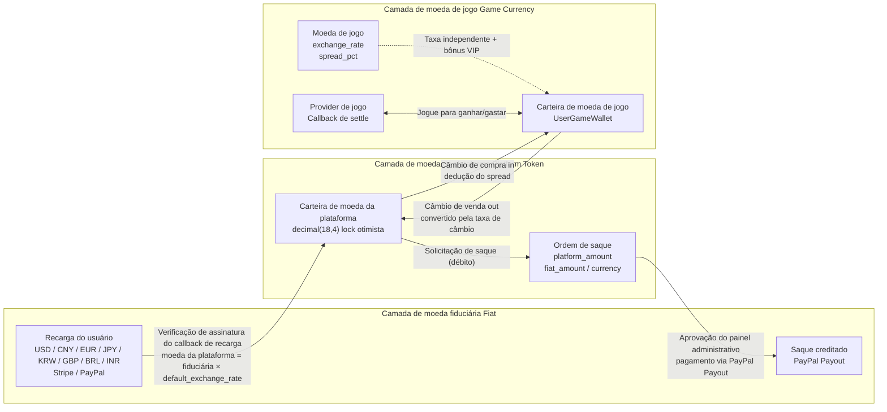

# Plataforma Global de Agregação de Jogos (Global Game Platform)

## Mascote do projeto


**Dicey** — Mascote da plataforma. O dado representa os jogos e a jogabilidade baseada em probabilidade, a moeda a economia da plataforma e os múltiplos gateways de pagamento, e o roxo reflete a marca do painel administrativo. Arquivo SVG: `docs/mascot.svg`, escalável infinitamente para documentação, logotipos e produtos.
<!-- lang-nav -->

Languages: [中文](../../README.md) · [English](README.en.md) · [한국어](README.ko.md) · [Русский](README.ru.md) · [Deutsch](README.de.md) · [Français](README.fr.md) · [Español](README.es.md) · **Português** · [हिन्दी](README.hi.md) · [العربية](README.ar.md) · [বাংলা](README.bn.md) · [Bahasa Indonesia](README.id.md) · [日本語](README.ja.md)

> Copyright (c) 2026 erik <erik@erik.xyz> — https://erik.xyz

Plataforma de agregação de jogos global, universal e internacionalizada. Após o registro, os usuários recarregam saldo na plataforma para trocar por moedas de jogo, usam as moedas para jogar e ganhar mais moedas, e podem converter as moedas de volta para a carteira e sacar. O painel administrativo oferece gerenciamento completo de jogos, revisão de saques, gerenciamento de usuários e gerenciamento de pagamentos. Suporte a troca de idioma (inglês/chines).

## Estratégia de versões

| Versão | Objetivo | Status |
|------|------|------|
| Versão completa | Corpo completo: rankings, cupons, categorias de jogos, configuração de países, busca ES | Concluída |
| Expansão do ecossistema | v2.0: integração de Providers de jogos, tickets de suporte, VIP, conquistas, social, barramento de eventos | Concluída |
| v1.3.15-22 (8 versões) | Conciliação/liquidação, controle de risco aprofundado, carteira unificada, motor de atividades, anti-cheat, crescimento social, Adyen/GrabPay | Concluída |

## Stack tecnológica

### Backend
- PHP 8.3+, webman v2 (workerman/webman)
- MySQL 8.0+ (prefixo de tabela `game_`, chave primária BIGINT não auto-incrementável)
- Redis (Session / cache / rate limit)
- ClickHouse (análise OLAP / cálculo de probabilidades)
- Elasticsearch (busca em texto completo)
- Autenticação JWT + controle de permissão RBAC
- Criptografia de dados: AES-256-CBC na camada de transporte da API + AES-128-ECB na camada de armazenamento do banco de dados

### Frontend

Há duas árvores de diretórios de front-end separadas, **cada uma chama apenas o backend do seu próprio lado**, sem cruzamento:

| Árvore de diretórios | Papel | Prefixo da requisição | Backend | Stack técnica |
|--------|------|---------|---------|--------|
| `apps/*` | **Plataforma do jogador C-end** | `/api/v1/...` | service (8792 por padrão) | Flutter Web / React 19 (Vite) / Angular 21 / HarmonyOS ArkTS |
| `admin/apps/*` | **Console de administração** | `/admin/v1/...` | admin (8789 por padrão) | Flutter Web / React 19 (Vite) / Angular 21 / HarmonyOS ArkTS |

- Layout responsivo (Phone / Tablet / Desktop)
- Internacionalização (i18n): troca entre inglês / chinês simplificado

### Componentes principais
- `erikwang2013/snowflake-php` — geração de IDs BIGINT globalmente únicos
- `erikwang2013/hashids` — criptografia/descriptografia de IDs na camada de API
- `erikwang2013/jwt-webman` — autenticação JWT
- `erikwang2013/encryption` — criptografia/descriptografia de dados sensíveis da API
- `erikwang2013/encryptable` — criptografia/descriptografia de campos sensíveis do banco de dados
- `erikwang2013/webman-scout` — sincronização e consulta no Elasticsearch
- `erikwang2013/season` — bandeiras de países
- `erikwang2013/security-php` — detecção de ferramentas de segurança
- `erikwang2013/poster-php` — verificação aleatória para operações sensíveis
- `erikwang2013/clickhouse-php` — conexão ClickHouse e cálculo de probabilidades

## Estrutura do projeto

```
game-platform-php/
├── admin/                     # Painel administrativo (webman v2, porta padrão 8789, configurável via APP_PORT)
│   ├── app/admin/v1/controller/  #   Controladores do lado admin
│   ├── app/middleware/        #   Middleware (Cors/SecurityFilter/RateLimit/AdminAuth/AdminPermission/OperationLog)
│   ├── app/model/             #   Modelos exclusivos do admin (8; os outros 52 modelos compartilhados ficam em packages/)
│   ├── app/service/           #   Serviços exclusivos do admin (WalletService/WalletScope/RiskSandboxService)
│   ├── app/process/           #   Processos residentes (Http/Monitor/RiskIpCron)
│   ├── app/provider/          #   Camada de providers de jogos (Self/ThirdParty/Factory)
│   ├── app/activity/          #   Motor de atividades (check-in/convite/tarefas diárias)
│   ├── app/event/             #   Barramento de eventos (EventBus Redis Pub/Sub)
│   ├── config/                #   Arquivos de configuração
│   └── apps/                  #   Front-ends de administração (4 alvos, chamam /admin/v1 → admin:8789)
│       ├── flutter/           #     Painel administrativo Flutter Web PC
│       ├── react/             #     Console de administração React 19 (Vite)
│       ├── angular/           #     Console de administração Angular 21
│       └── harmonyos/         #     Console de administração HarmonyOS ArkTS (.hap, sem passar pelo nginx)
│
├── service/                   # Serviço de negócios do lado C (webman v2, porta padrão 8792, configurável via APP_PORT)
│   ├── app/api/v1/controller/ #   Controladores da API do lado C
│   ├── app/middleware/        #   Middleware (TraceId/Cors/SecurityFilter/RateLimit/LanguageMiddleware/UserAuth/ProviderAuth/SdkSessionAuth)
│   ├── app/model/             #   Modelos exclusivos do service (10; os outros 52 modelos compartilhados ficam em packages/)
│   ├── app/service/           #   Serviços exclusivos do service (carteira/risco/conformidade/conciliação/push/conquistas/antifraude etc.)
│   ├── app/payment/           #   18 adaptadores de gateways de pagamento (Stripe/PayPal/Adyen/NowPayments/Skrill…) + GatewayFactory
│   ├── app/cdn/               #   Adaptadores de CDN de cinco fornecedores (Cloudflare/CloudFront/Alibaba/Tencent/Huawei) + CdnFactory
│   ├── app/process/           #   Processos residentes (Http/Monitor/LeaderboardWS:8790/ChatWS:8791/EventConsumer/EventSubscriber/AntiCheatWorker/GroupSweepWorker/Health)
│   ├── app/provider/          #   Camada de Providers de jogos
│   ├── app/activity/          #   Motor de atividades
│   ├── app/event/             #   Barramento de eventos (EventBus Redis Pub/Sub)
│   └── config/                #   Arquivos de configuração
│
├── packages/platform-common/  # Camada compartilhada: admin e service a importam via repositório composer path, evitando duas cópias
│   ├── src/model/             #   Modelos Eloquent compartilhados (52, mesma origem para os dois lados)
│   ├── src/service/           #   Serviços compartilhados (DepositLogService / VipService etc., 11 no total, inclui cálculo de probabilidades no ClickHouse)
│   ├── src/BcMath.php         #   Aritmética de alta precisão de valores/taxas (wrapper de bcmath), arredondamento, percentuais
│   ├── src/EncryptionService.php  #   Criptografia/descriptografia AES e mascaramento
│   ├── src/CircuitBreaker.php #   Disjuntor (além de Retry.php para retentativas)
│   ├── src/HashidsService.php #   Codificação/decodificação de ID da camada de API
│   └── src/SnowflakeService.php   #   IDs BIGINT globalmente únicos
│
├── apps/                      # Front-ends do jogador C-end (4 alvos, chamam /api/v1 → service:8792)
│   ├── flutter/platform/      #   Plataforma de usuários do lado C em Flutter Web PC
│   ├── react/                 #   React 19 (Vite) C-end
│   ├── angular/               #   Angular 21 C-end
│   └── harmonyos/             #   HarmonyOS ArkTS C-end (.hap, sem passar pelo nginx)
│
├── game/xiaoxiaole/           # Mini-jogo embutido «Match-3 Rural»: TypeScript + Vite + Vitest, motor src/domain + design de quatro fases + tests/, documentos de design em 13 idiomas
│
├── install/                   # Assistente de instalação em um clique + SQL de inicialização do banco
│   ├── index.php              #   Ponto de entrada da instalação
│   ├── Installer.php          #   Lógica principal de instalação
│   ├── install.sql            #   SQL de instalação combinado (78 tabelas + dados iniciais)
│   ├── clickhouse.sql         #   DDL do banco analítico ClickHouse (motor separado, importado à parte)
│   ├── test-data.sql          #   Dados de demonstração/teste
│   ├── migrations/            #   Scripts de upgrade incremental para bancos existentes (*.sql)
│   ├── lang/ + lang.php       #   Traduções da interface do assistente de instalação (13 idiomas)
│   └── assets/                #   Recursos estáticos
│
├── docs/                      # Documentação do projeto (todos os textos em 13 idiomas: .md é a fonte em chinês e ao lado há as traduções .{lang}.md)
│   ├── ARCHITECTURE.md        #   Documento de arquitetura
│   ├── ARCHITECTURE-DESIGN.md #   Documento de design de arquitetura
│   ├── FEATURES.md            #   Documento de funcionalidades
│   ├── FEATURE-DESIGN.md      #   Documento de design de funcionalidades
│   ├── API.md                 #   Documento de interfaces
│   ├── DEPLOYMENT.md          #   Documento de deploy (Docker/manual/configuração de portas)
│   ├── PROVIDER-SDK.md        #   Guia de integração de jogos de terceiros (algoritmo de assinatura + exemplos em PHP/Go/Python)
│   ├── CLICKHOUSE_INSTALL.md  #   Instalar/configurar/migrar/verificar o ClickHouse
│   ├── CLICKHOUSE_USAGE.md    #   As 4 APIs de serviço do ClickHouse e o painel administrativo
│   ├── translations/          #   As traduções deste README em 12 idiomas
│   ├── diagrams/              #   SVGs de arquitetura/fluxo/funcionalidades/ciclo de vida/segurança/expansão do ecossistema (13 idiomas cada)
│   ├── test-reports/          #   Relatórios de teste (php-unit / api / resilience / ui / SUMMARY)
│   └── superpowers/           #   Especificações de design e planos de implementação deste repositório (registro histórico)
│
├── scripts/                   # Scripts de operação (verificação de deriva de modelos / migração de anotações apidoc / migração da semântica de repasses do exchange / verificação de assinatura)
├── tests/api/                 # Testes automatizados da API (run_all.sh)
├── runtime/                   # Diretório de execução do webman (logs/pid, gerado em tempo de execução)
│
├── docker-compose.yml         # Orquestração Docker Compose (portas padrão do .env raiz)
├── nginx.conf.template        # Modelo de configuração do Nginx (portas upstream renderizadas por envsubst)
├── .env.example               # Modelo do .env raiz (variáveis de portas Docker, copie para .env para usar)
└── admin/docs/superpowers/    # Padrões de desenvolvimento e planos
    ├── specs/                 #   Especificações de design
    └── plans/                 #   Planos de implementação
```

## Início rápido

### Requisitos de ambiente
- PHP 8.1+
- MySQL 8.0+
- Redis 6.0+
- Composer 2.x
- Flutter SDK 3.x (frontend, opcional)

### Opção 1: Assistente de instalação com um clique (recomendado)

```bash
# 1. Iniciar o assistente de instalação
php -S 0.0.0.0:8888 -t install/

# 2. Abrir http://localhost:8888 no navegador
#    Seguir o assistente: verificação do ambiente → configuração do banco de dados → definição da conta de administrador → instalação automática

# 3. Instalar dependências
cd admin && composer install && cd ..
cd service && composer install && cd ..

# 4. Iniciar os serviços (portas padrão admin 8789 / service 8792, alteráveis no APP_PORT de cada .env)
cd admin && php start.php start -d && cd ..
cd service && php start.php start -d && cd ..

# 5. Acessar o painel administrativo: http://localhost:8789 (porta padrão)
#    Fazer login com a conta de administrador definida na instalação

# 6. Após a instalação, excluir o diretório de instalação (segurança)
rm -rf install/
```

O assistente de instalação conclui automaticamente:
- Verificação do ambiente (versão do PHP, extensões, permissões de diretório)
- Criação do banco de dados e das tabelas (SQL combinado, 78 tabelas + dados iniciais)
- Criação da conta de superadministrador (criptografia bcrypt)
- Geração automática das chaves JWT/criptografia e gravação no arquivo .env
- Geração do install.lock para evitar instalação duplicada

### Opção 2: Instalação manual

<details>
<summary>Expandir etapas de instalação manual</summary>

#### 1. Inicialização do banco de dados

```bash
# Importar o SQL combinado com um clique
mysql -u root -e "CREATE DATABASE IF NOT EXISTS game-platform CHARACTER SET utf8mb4 COLLATE utf8mb4_unicode_ci;"
mysql -u root game-platform < install/install.sql
```

#### 2. Configurar variáveis de ambiente

```bash
# Painel administrativo
cd admin
cp .env.example .env
# Editar as informações de conexão do banco de dados e as chaves no .env

# Serviço de negócios do lado C
cd ../service
cp .env.example .env
# Editar as informações de conexão do banco de dados e as chaves no .env
```

#### 3. Inicialização do backend

```bash
cd admin && composer install && php start.php start -d
cd ../service && composer install && php start.php start -d
```

#### 4. Criar o administrador

É necessário inserir manualmente a conta de administrador no banco de dados (senha criptografada com bcrypt).

</details>

### Início do frontend (opcional)

Em desenvolvimento cada front-end sobe o seu próprio servidor de dev; as requisições são encaminhadas por ele ao backend correspondente (ver `proxy.conf.json` / `vite.config.ts` em cada diretório):

```bash
# --- Plataforma do jogador C-end (/api/v1 → service:8792) ---
cd apps/react            && npm install && npm run dev      # http://localhost:5173
cd apps/angular          && npm install && npm start        # http://localhost:4200
cd apps/flutter/platform && flutter pub get && flutter run -d chrome

# --- Console de administração (/admin/v1 → admin:8789) ---
cd admin/apps/react      && npm install && npm run dev      # http://localhost:5273
cd admin/apps/angular    && npm install && npm start        # http://localhost:4300
cd admin/apps/flutter    && flutter pub get && flutter run -d chrome
```

> Portas dos servidores de dev do Angular: o console de administração fixa 4300 explicitamente no `angular.json`, enquanto o lado C mantém o 4200 padrão do Angular; para rodar os dois ao mesmo tempo, adicione `--port` a um deles.
> Os alvos HarmonyOS (`apps/harmonyos`, `admin/apps/harmonyos`) são abertos e compilados no DevEco Studio;
> um emulador acessa o backend do host em `http://10.0.2.2:<port>` (ver a constante no topo de cada `ApiService.ets`).

### Implantação do frontend (Docker/Nginx)

O serviço nginx do `docker-compose.yml` monta os artefatos de build de cada frontend no contêiner em modo somente leitura, e o `nginx.conf.template` os serve nos caminhos abaixo.
Se o artefato não foi compilado, o diretório fica vazio: requisições a um caminho retornam 404 e requisições ao diretório puro (por exemplo `/app-react/`) retornam 403.

| URL | Ponto de montagem do artefato | Comando de build |
|-----|-----------|---------|
| `/` | `apps/flutter/platform/build/web` | `flutter build web` |
| `/app-react/` | `apps/react/dist` | `npm run build` (o script inclui `--base=/app-react/`) |
| `/app-angular/` | `apps/angular/dist/game-client-angular/browser` | `npm run build` (o script inclui `--base-href=/app-angular/`) |
| `/admin-panel/` | `admin/public` | Slot genérico de publicação: copie qualquer artefato de console para `admin/public`; se não houver nada, também retorna 404 (diretório puro 403). O artefato deve ser compilado com `--base=/admin-panel/` (no Flutter, `--base-href=/admin-panel/`), caso contrário seus recursos continuam apontando para o prefixo original e retornam 404. A forma sem barra redireciona com 301 para este endereço; o `nginx.conf.template` define `absolute_redirect off`, então o redirecionamento é um Location relativo e implantações em portas diferentes de 80 não perdem mais a porta |
| `/admin-react/` | `admin/apps/react/dist` | `npm run build` (o script inclui `--base=/admin-react/`) |
| `/admin-angular/` | `admin/apps/angular/dist/game-admin-angular/browser` | `npm run build` (o script inclui `--base-href=/admin-angular/`) |
| `/admin-flutter/` | `admin/apps/flutter/build/web` | `flutter build web --base-href=/admin-flutter/` |

`/admin/` (API) → contêiner admin, `/api/` (API) → contêiner service; o cliente HarmonyOS é distribuído como pacote `.hap` e não passa pelo nginx.

### Verificação

```bash
# Testar o painel administrativo (porta padrão 8789)
curl http://localhost:8789/health

# Testar o serviço do lado C (porta padrão 8792)
curl http://localhost:8792/health

# Testar o registro de usuário
curl -X POST http://localhost:8792/api/v1/auth/register \
  -H "Content-Type: application/json" \
  -d '{"username":"testuser","password":"Abcdef12"}'
```

## Recursos de segurança

- **Defesa em profundidade em 18 camadas**: detecção e bloqueio de XSS/injeção SQL/CSRF/traversal de caminho/injeção de comandos
- **Lista branca de métodos HTTP**: apenas GET/POST/PUT/DELETE/OPTIONS/HEAD
- **Autenticação JWT**: access_token 2h + refresh_token 14d, com limite de sessões concorrentes
- **Validação de chaves JWT na inicialização**: `ADMIN_JWT_SECRET_KEY` no lado admin e `SERVICE_JWT_SECRET_KEY` no lado service como chaves independentes; a inicialização é recusada se ausentes ou ainda com o valor padrão
- **Callbacks de pagamento fail-closed**: lista branca de providers (apenas stripe/paypal) + rejeição de chave não configurada/falha de verificação de assinatura/timestamp fora do limite + conferência de valores com bccomp + creditação de callbacks transacional
- **Permissões RBAC**: controle de permissão em granularidade method.path, cache Redis de 60s
- **CAPTCHA de clique**: verificação obrigatória de humano no login/registro
- **Confirmação de senha**: operações sensíveis exigem confirmação de senha
- **Criptografia de dados**: AES-256-CBC na camada de transporte + AES-128-ECB na camada de armazenamento
- **Criptografia de IDs**: geração com Snowflake + codificação com Hashids, sem possibilidade de engenharia reversa externa
- **Lock otimista da carteira**: evita débitos concorrentes/creditamento duplicado
- **Auditoria de operações**: log completo de operações, detecção automática da origem em 8 plataformas
- **Rate limit**: janela deslizante em Redis, atomização com Lua
- **Cabeçalho CSP**: Content-Security-Policy contra XSS
- **Segurança de conta**: bloqueio de 15 minutos após 5 falhas consecutivas de login

## Testes

Relatórios de teste (armazenados localmente): [docs/test-reports/](../test-reports/)

| Tipo de teste | Casos/cobertura | Resultado |
|---------|----------|------|
| Testes unitários PHP | medição atual com `phpunit --list-tests`: admin 200 + service 273 casos (o relatório `docs/test-reports/php-unit.md` registra a repetição de 09-22 admin 190 + service 273 e o snapshot de 08-27 admin 153 + service 45; o lado admin ainda está em ampliação) | service tudo passa (701 asserções, 3 skipped, 2 warnings + 35 deprecations); admin 437 asserções, 3 skipped, 1 falha (`EnvConfigTest` verifica o `admin/.env` real e sente falta de `REDIS_CLUSTER_NODES`; adicioná-lo deixa o teste verde) |
| Testes dos mecanismos de estabilidade | disjuntor/retentativa/interruptor de degradação, 15 casos (CircuitBreakerTest/RetryTest/ResilienceMockTest) | tudo passa |
| Testes automatizados de API | 187 endpoints (fonte: `docs/test-reports/api.md`, 2026-08-27); o route.php registra atualmente 261 endpoints | 171 passam / 50 falham / 4 ignorados (todas as falhas são defeitos determinísticos, ver o relatório) |
| Testes de UI do Flutter | 12 casos (login/painel/navegação/troca de idioma) | tudo passa |
| Go/Rust | não há código Go/Rust no repositório | ignorado, registrado |

```bash
# Testes unitários PHP (exportar antes as variáveis de ambiente do segredo JWT)
cd admin && ADMIN_JWT_SECRET_KEY=test-jwt-secret-change-me php vendor/bin/phpunit
cd service && SERVICE_JWT_SECRET_KEY=test-jwt-secret-change-me php vendor/bin/phpunit
# Testes automatizados de API (os serviços precisam estar rodando, ver tests/api/run_all.sh)
bash tests/api/run_all.sh
# Testes de UI do Flutter
cd admin/apps/flutter && flutter test --timeout 300s
```

Relatórios detalhados:
- [Relatório de testes unitários PHP](../test-reports/php-unit.md)
- [Relatório de testes dos mecanismos de estabilidade (disjuntor/retentativa/degradação)](../test-reports/resilience.md)
- [Relatório de testes automatizados de API](../test-reports/api.md)
- [Relatório de testes de UI do Flutter](../test-reports/ui.md)

## Visão geral das capacidades da plataforma

| Capacidade | Descrição |
|------|------|
| Autenticação de usuário | Usuário/senha + OAuth de 7 plataformas (Google/Facebook/Apple/X(Twitter)/Microsoft/LinkedIn/GitHub) + 2FA TOTP |
| Carteira | Carteira de moedas da plataforma (lock otimista) + carteira de moedas de jogo + registro de transações |
| Recarga | Criação de pedido + verificação de assinatura dos callbacks Stripe/PayPal + creditamento automático |
| Troca | Moeda da plataforma ⇄ moeda de jogo, cotação em tempo real, receita de spread |
| Saque | Solicitação → revisão → pagamento, chave global, limites escalonados por KYC + taxas |
| KYC | Envio e revisão de verificação de identidade, eleva o limite de saque após aprovação |
| Jogos | CRUD + categorias (10 tipos) + servidores/regiões + rastreamento de registros de jogo |
| Busca | Busca em texto completo no Elasticsearch (com fallback LIKE) |
| Rankings | Diário/semanal/mensal/geral, cache Redis, push em tempo real via WebSocket (porta padrão 8790, configurável via LEADERBOARD_WS_PORT) |
| CDN | Integração com cinco provedores (Cloudflare R2 / AWS S3 / Aliyun OSS / Tencent COS / Huawei OBS upload + purge + preload) + configuração/ativação/teste de conectividade no admin |
| Cupons | Valor fixo + desconto percentual, limite de tempo e quantidade, rastreamento de uso |
| Notificações | Mensagens internas + e-mail, notificações automáticas de recarga/saque/KYC/cupons |
| Indicação | Código de indicação, bônus de registro, comissão de recarga |
| Gerenciamento de risco | Lista negra de IP/alerta de valores altos/detecção de frequência e velocidade |
| Controle de risco aprofundado | Impressão digital do dispositivo / reputação de IP / grafo de vínculos de contas + mecanismo de regras + painel de risco + AML/KYC/pontuação de confiança |
| Anti-cheat | Coleta de eventos anti-cheat + estatísticas diárias + revisão manual |
| Conciliação/liquidação | Lotes de conciliação diários + detalhes de diferenças + conciliação de extratos |
| Carteira unificada | WalletScope carteira unificada |
| Motor de atividades | Criação/participação/recompensas de atividades + check-in |
| Crescimento social | Grupos + rastreamento de links de compartilhamento |
| Gateways de pagamento | Novos gateways Adyen / GrabPay (L1) |
| Internacionalização | 4 idiomas (en-US/zh-CN/ja-JP/ko-KR), tabelas de tradução + cache |
| Configuração de países | Formas de pagamento/saque diferenciadas em 18 países, valor mínimo de recarga |
| Estatísticas | Snapshot de estatísticas diárias (5 tipos de métricas) + rastreamento de receita da plataforma |
| Captcha | Verificação de humano por clique (poster-php) |
| Integração de jogos | Provider SDK (Self+ThirdParty) + assinatura HMAC-SHA256 + gateway de callbacks |
| Tickets | Criação/resposta no lado C + tratamento/atribuição/fechamento no painel administrativo |
| VIP | Lealdade em 5 níveis, acúmulo de pontos de experiência, desconto em trocas/redução de saque/bônus de câmbio |
| Conquistas | 12 conquistas integradas, detecção orientada a eventos, rastreamento de progresso |
| Social | Sistema de amigos + mensagens privadas em tempo real via WebSocket (porta padrão 8791, configurável via CHAT_WS_PORT), apenas amigos podem enviar |
| Torneios | Sistema de campeonatos (controlado por FeatureFlag) + ranking + limite de participantes |
| Comissão | Participação de lucros em dois níveis de indicação (taxa de comissão configurável) |
| Cupons | Restrições de condição (min_deposit/first_user/game_id) |
| Eventos | Barramento de eventos Redis Pub/Sub + entrega por assinatura Webhook (7 tipos de eventos) |
| Deploy | Orquestração Docker Compose com 7 serviços (portas configuradas no .env raiz) + proxy reverso Nginx |
| Clientes | Administração 4 alvos (Flutter/React/Angular/HarmonyOS) + lado C 4 alvos (Flutter/React/Angular/HarmonyOS) |

## Modelo de negócio

```
Moeda fiduciária (USD/CNY/EUR...)
  │  Recarga (Stripe/PayPal/Alipay/WeChat)
  ▼
Moeda da plataforma (unificada, precisão decimal(18,4))
  │  Troca (inclui taxa de câmbio + spread de comissão da plataforma)
  ▼
Moeda de jogo (independente por jogo, taxa de câmbio própria)
  │  Ganha/gasta jogando
  ▼
Moeda da plataforma ← conversão de volta → Saque (revisão/automático)
```

## Liquidação em múltiplas moedas

A plataforma adota um sistema de liquidação de três camadas de moedas isoladas — "moeda fiduciária → moeda da plataforma → moeda de jogo": suporta recarga em múltiplas moedas fiduciárias (USD/CNY/EUR/JPY/KRW/GBP/BRL/INR), e cada jogo possui sua própria moeda de faturamento; todos os cálculos de valores usam aritmética de alta precisão com bcmath, eliminando erros de ponto flutuante.

### Modelo de três camadas de moedas

| Camada | Moeda | Descrição |
|------|------|------|
| Camada fiduciária | USD / CNY / EUR / JPY / KRW / GBP / BRL / INR | Moeda de pagamento real do usuário para recarga/saque, processada por Stripe / PayPal |
| Camada da moeda da plataforma | Moeda da plataforma (unificada em toda a plataforma) | Moeda interna de liquidação unificada (decimal(18,4)), lock otimista da carteira contra débitos concorrentes/creditamento duplicado |
| Camada da moeda de jogo | Moeda independente por jogo | Cada jogo possui `exchange_rate` (taxa de câmbio) e `spread_pct` (spread) próprios, com carteira de moeda de jogo independente |

### Caminhos de liquidação

- **Liquidação de recarga**: o usuário paga em moeda fiduciária (verificação de assinatura dos callbacks Stripe / PayPal, proteção de idempotência) → conversão para moeda da plataforma conforme `default_exchange_rate` e creditamento; o pedido de recarga registra simultaneamente `amount + currency + platform_amount`
- **Liquidação de troca**: cotação em tempo real da moeda da plataforma ⇄ moeda de jogo conforme a taxa de câmbio da moeda do jogo (quote), deduzindo `spread_pct` como receita de spread da plataforma; VIP usufrui de desconto em trocas e bônus de câmbio
- **Liquidação de jogo**: o Provider do jogo incrementa/decrementa a moeda de jogo do usuário via callback `/api/provider/settle` (assinatura HMAC-SHA256); sessões de jogo expiradas são liquidadas automaticamente
- **Liquidação de saque**: débito da moeda da plataforma → geração do pedido de saque (registro de `platform_amount / fiat_amount / currency`) → aprovação no painel administrativo → pagamento via PayPal Payout → sincronização do status do lote até a conclusão

### Fluxograma de liquidação



## Diagrama de arquitetura


## Principais fluxos de negócio


## Panorama de funcionalidades


## Ciclo de vida


## Arquitetura de segurança


## Expansão do ecossistema (v2.0)


## Índice de documentação

| Documento | Descrição |
|------|------|
| [Comparação de versões](../VERSIONS.pt.md) | Comparação de funcionalidades entre versão básica/padrão/completa |
| [Documento de design de arquitetura](../ARCHITECTURE-DESIGN.pt.md) | Razões de escolha da arquitetura e decisões de design |
| [Documento de arquitetura](../ARCHITECTURE.pt.md) | Topologia do sistema, arquitetura de módulos, fluxo de dados |
| [Documento de design de funcionalidades](../FEATURE-DESIGN.pt.md) | Modelo de negócio, especificações de funcionalidades, design de fluxos |
| [Documento de funcionalidades](../FEATURES.pt.md) | Lista de funcionalidades, descrição de módulos, jornada do usuário |
| [Documento de interfaces](../API.pt.md) | Referência completa da API (146 interfaces) |
| [Documentação online](http://localhost:8792/apidoc/) | Documentação interativa erikwang2013/apidoc-php (lado C) |
| [Documentação online](http://localhost:8789/apidoc/) | Documentação interativa erikwang2013/apidoc-php (painel administrativo) |
| [Instalação do ClickHouse](../CLICKHOUSE_INSTALL.pt.md) | Instalação/configuração/migração/validação do ClickHouse |
| [Documentação de integração do Provider SDK](../PROVIDER-SDK.pt.md) | Guia de integração de jogos de terceiros (algoritmo de assinatura + exemplos PHP/Go/Python) |
| [Uso do ClickHouse](../CLICKHOUSE_USAGE.pt.md) | 4 serviços de API do ClickHouse e painéis administrativos |
| [Documento de deploy](../DEPLOYMENT.pt.md) | Guia de deploy (Docker + manual + Nginx + monitoramento) |
| [Especificação de design](../../admin/docs/superpowers/specs/2026-05-22-game-platform-design.pt.md) | Especificação completa de design |
| [Plano de implementação](../../admin/docs/superpowers/plans/2026-05-22-game-platform-plan.pt.md) | Plano detalhado de implementação |

---

## Apoie o projeto

Se este projeto foi útil para você, convide o autor para um café ☕

<p align="center">
  <table align="center" border="0" cellspacing="0" cellpadding="0">
    <tr>
      <td align="center" width="200">
        <br>
        <b>WeChat Pay</b>
      </td>
      <td align="center" width="200">
        <br>
        <b>Alipay</b>
      </td>
    </tr>
  </table>
</p>

### Transferência bancária global (Global Bank Transfer)

**Informações do beneficiário (Recipient)**

| Item | Conteúdo |
|----|------|
| Nome do beneficiário (Beneficiary Name) | WANG KEXUN |
| Número da conta (Account Number) | 881015918251 |

**Banco do beneficiário (Beneficiary Bank)**

| Item | Conteúdo |
|----|------|
| SWIFT Code | AABLHKHHXXX |
| Nome do banco (Bank Name) | ZA Bank Limited |
| Código do banco (Bank Code) | 387 |
| Endereço do banco (Bank Address) | Core F, Cyberport 3, 100 Cyberport Road, Hong Kong |

**Banco correspondente para remessas transfronteiriças (Correspondent Bank, se necessário)**

> Atenção: estas são as informações do banco correspondente (banco intermediário) para remessas transfronteiriças, e não as do banco do beneficiário. Consulte o banco emissor da remessa sobre a necessidade de fornecer as informações do banco correspondente.

- **Para remessas em dólares de Hong Kong, renminbi e dólares americanos, o banco correspondente é o Citibank:**
  - Nome do banco: Citibank N.A. Hong Kong
  - SWIFT Code: CITIHKHXXXX
  - Código do banco: 006
  - Nome da agência: Hong Kong Branch
  - Código da agência: 391
  - Endereço do banco: Citibank Tower, Citibank Plaza, 3 Garden Road, Central, Hong Kong
- **Para remessas em outras moedas, o banco correspondente é o BNY Mellon:**
  - Nome do banco: THE BANK OF NEW YORK MELLON
  - SWIFT Code: IRVTUS3NXXX
  - Endereço do banco: THE BANK OF NEW YORK MELLON, 240 GREENWICH STREET, NEW YORK, United States

### Doação em criptomoedas (Crypto Donation)

Se este projeto ajudar você, escaneie o código QR para doar, obrigado!

| Rede (Network) | Código QR (QR Code) | Endereço da carteira (Wallet Address) |
|---|---|---|
| BNB Smart Chain (BEP20) | [](../coin/1.jpg) | `0x355d429f97511897ccb4e271ec888205f9ab6629` |
| Tron (TRC20) | [](../coin/2.jpg) | `TEdDHWLajt1XvqtPDWmQctdrJaC3pzZZzz` |
| Ethereum (ERC20) | [](../coin/3.jpg) | `0x355d429f97511897ccb4e271ec888205f9ab6629` |
| Aptos | [](../coin/4.jpg) | `0x836e3780edfc3f7b2372b39e2a1a3a5d7adfaccd96c726f21cfde1b50dd68030` |
| Plasma | [](../coin/5.jpg) | `0x355d429f97511897ccb4e271ec888205f9ab6629` |
| Polygon POS | [](../coin/6.jpg) | `0x355d429f97511897ccb4e271ec888205f9ab6629` |
| Solana | [](../coin/7.jpg) | `2hfhboHdmdrYsY25XfQSsEWxq5ip4EQsR7f4AzSRMUyr` |
| The Open Network (TON) | [](../coin/8.jpg) | `UQB9kFQohzmXUir9QSSZq01iwl9aQZIDdBpNmDklljRtCoGK` |
| Arbitrum One | [](../coin/9.jpg) | `0x355d429f97511897ccb4e271ec888205f9ab6629` |
| AVAX C-Chain | [](../coin/10.jpg) | `0x355d429f97511897ccb4e271ec888205f9ab6629` |

