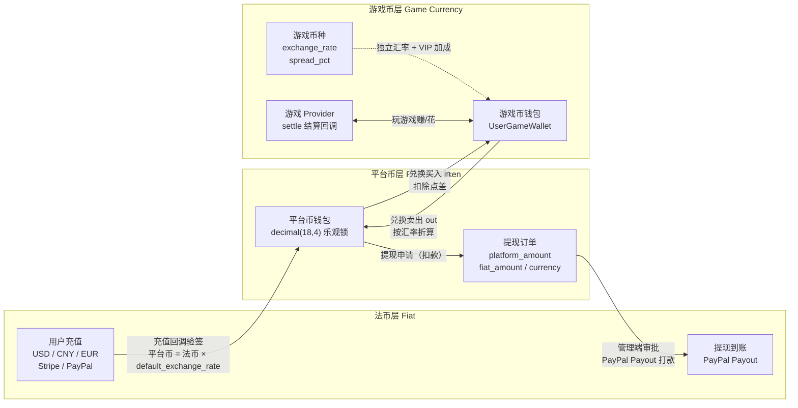
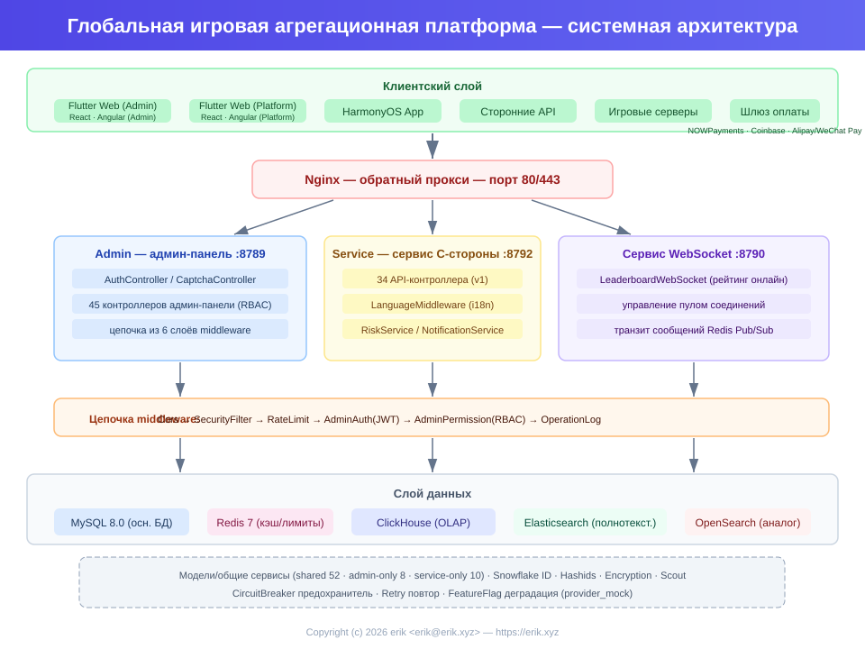
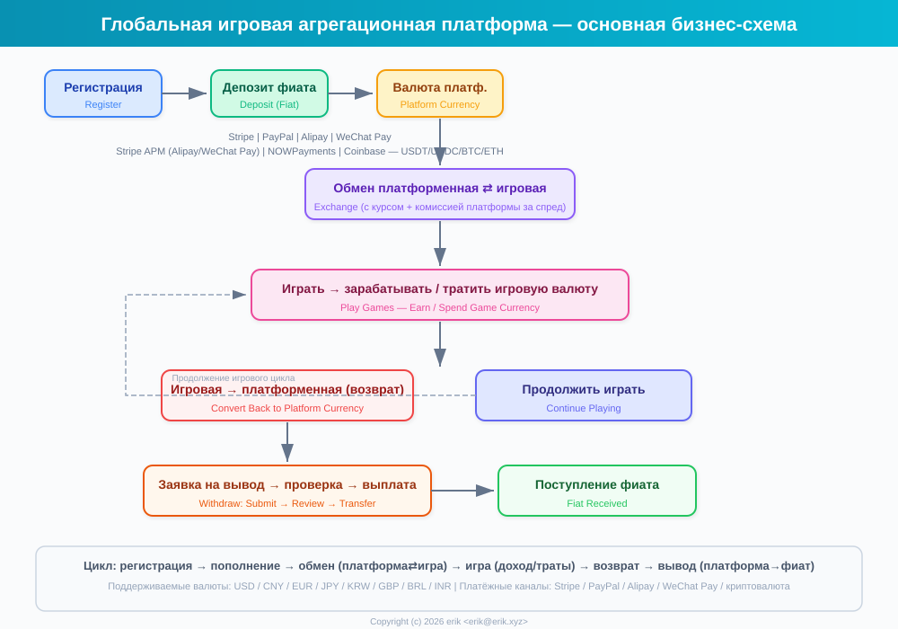
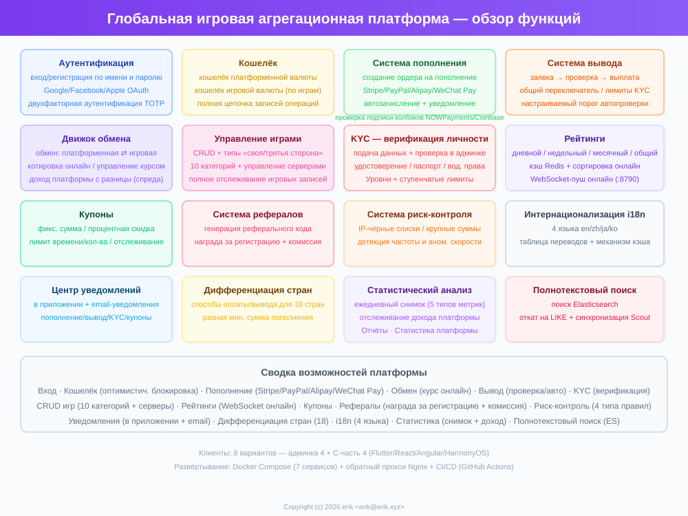
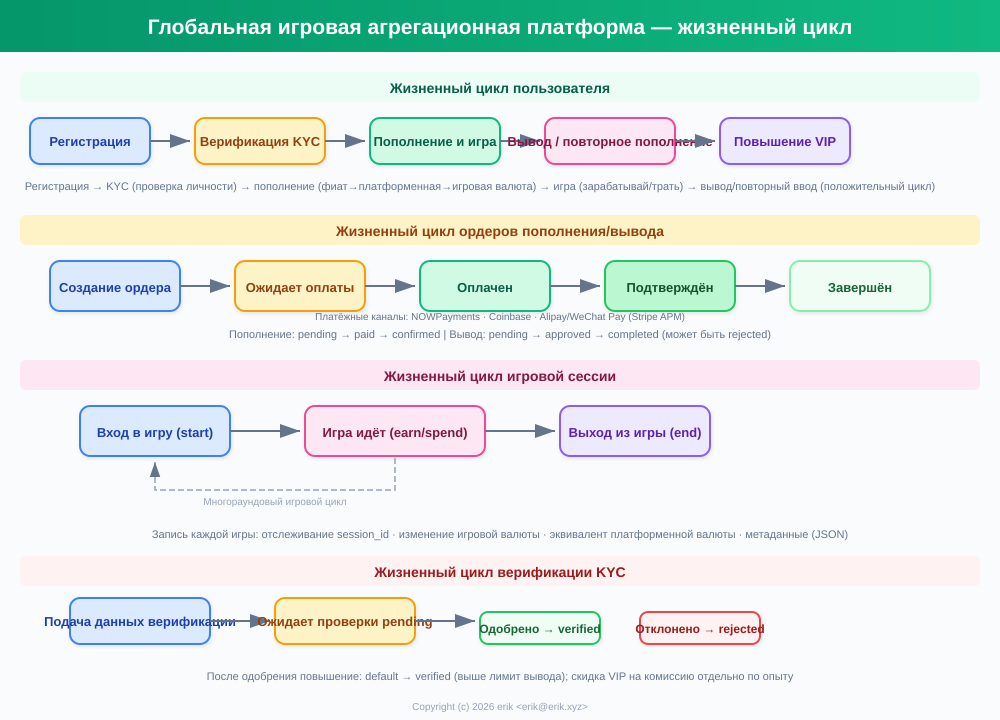
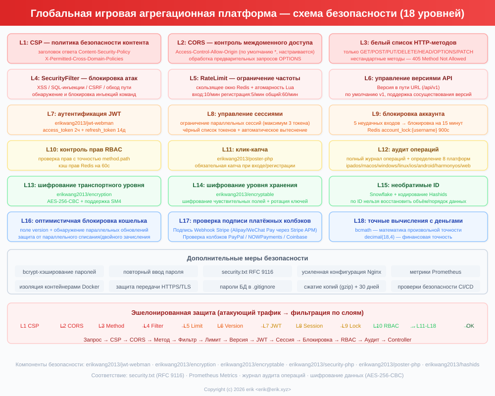
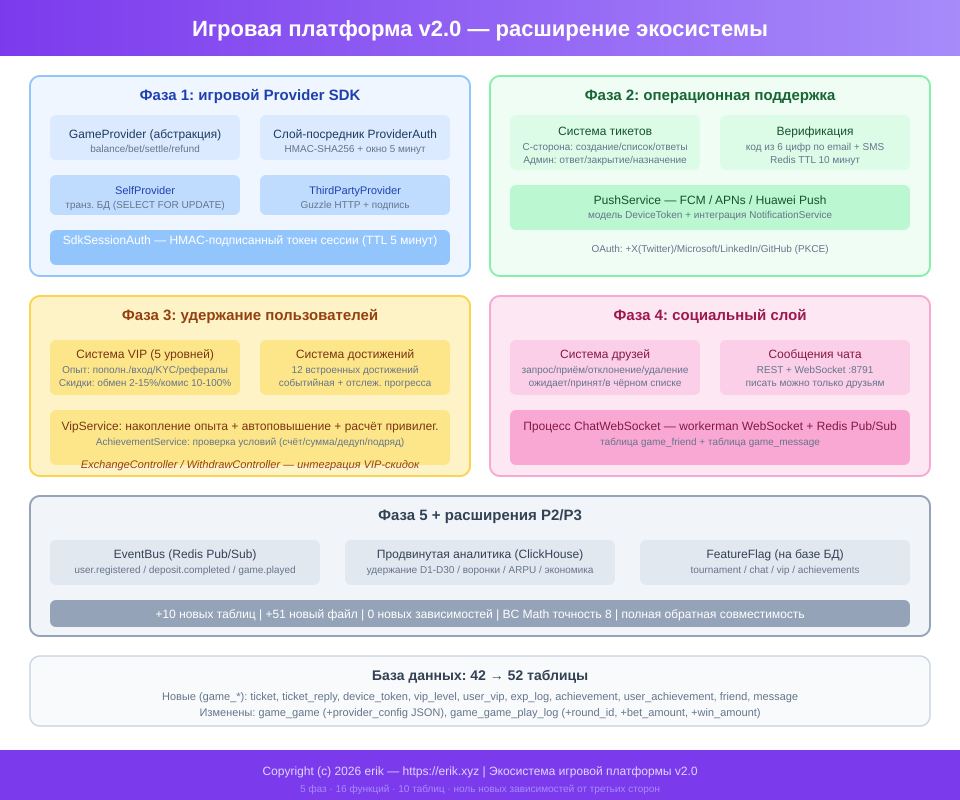

# Глобальная игровая агрегационная платформа (Global Game Platform)
<!-- lang-nav -->

Languages: [中文](../../README.md) · [English](README.en.md) · [한국어](README.ko.md) · **Русский** · [Deutsch](README.de.md) · [Français](README.fr.md) · [Español](README.es.md) · [Português](README.pt.md) · [हिन्दी](README.hi.md) · [العربية](README.ar.md) · [বাংলা](README.bn.md) · [Bahasa Indonesia](README.id.md) · [日本語](README.ja.md)


> Copyright (c) 2026 erik <erik@erik.xyz> — https://erik.xyz

Глобальная, интернациональная игровая агрегационная платформа. После регистрации пользователь пополняет счет и обменивает деньги на игровую валюту, играет в игры и зарабатывает игровую валюту, которую можно перевести обратно в кошелек и вывести. Административная панель предоставляет полный набор функций: управление играми, проверка выводов, управление пользователями и управление платежами. Поддерживается переключение языков (английский/китайский).

## Стратегия версий

| Версия | Цель | Статус |
|------|------|------|
| Полная версия | Полный функционал: рейтинги, купоны, категории игр, настройка стран, ES-поиск | Готово |
| Экосистемное расширение | v2.0: подключение игровых провайдеров, тикеты, VIP, достижения, соцсеть, шина событий | Готово |

## Технологический стек

### Бэкенд
- PHP 8.3+, webman v2 (workerman/webman)
- MySQL 8.0+ (префикс таблиц `game_`, BIGINT неавтоинкрементные первичные ключи)
- Redis (Session / кэш / ограничение частоты запросов)
- ClickHouse (OLAP-аналитика / вычисление вероятностей)
- Elasticsearch (полнотекстовый поиск)
- JWT-аутентификация + RBAC-контроль доступа
- Шифрование данных: AES-256-CBC на транспортном уровне API + AES-128-ECB на уровне хранения в БД

### Фронтенд
- Flutter 3.x (Web в стиле PC)
- HarmonyOS ArkTS (мобильная версия)
- Адаптивная верстка (Phone / Tablet / Desktop)
- Интернационализация (i18n): английский / упрощенный китайский

### Ключевые компоненты
- `erikwang2013/snowflake-php` — генерация глобально уникальных BIGINT ID
- `erikwang2013/hashids` — шифрование/дешифрование ID на уровне API
- `erikwang2013/jwt-webman` — JWT-аутентификация
- `erikwang2013/encryption` — шифрование чувствительных данных API
- `erikwang2013/encryptable` — шифрование чувствительных полей БД
- `erikwang2013/webman-scout` — синхронизация и поиск в Elasticsearch
- `erikwang2013/season` — флаги стран
- `erikwang2013/security-php` — инструменты обнаружения угроз безопасности
- `erikwang2013/poster-php` — случайная проверка чувствительных операций
- `erikwang2013/clickhouse-php` — подключение ClickHouse и вычисление вероятностей

## Структура проекта

```
game-platform-php/
├── admin/                     # Административная панель (webman v2, порт 8787)
│   ├── app/admin/controller/  #   Контроллеры панели
│   ├── app/middleware/        #   Промежуточное ПО (Cors/Security/RateLimit/Auth/ProviderAuth)
│   ├── app/provider/          #   Слой игровых провайдеров
│   ├── app/event/             #   Шина событий (EventBus Redis Pub/Sub) (Cors/Security/RateLimit/Auth/Permission/ProviderAuth)
│   ├── app/provider/          #   Слой игровых провайдеров (Self/ThirdParty/Factory)
│   ├── app/middleware/        #   Промежуточное ПО (Cors/Security/RateLimit/Auth/ProviderAuth)
│   ├── app/provider/          #   Слой игровых провайдеров
│   ├── app/event/             #   Шина событий (EventBus Redis Pub/Sub) (Cors/Security/RateLimit/Auth/Permission)
│   ├── config/                #   Файлы конфигурации
│   ├── install/   #   SQL-миграции
│   └── apps/flutter/          #   Flutter Web PC административная панель
│
├── service/                   # C-бизнес (webman v2, порт 8788)
│   ├── app/api/v1/controller/ #   API-контроллеры C-стороны
│   ├── app/middleware/        #   Промежуточное ПО (Cors/Security/RateLimit/Auth/ProviderAuth)
│   ├── app/provider/          #   Слой игровых провайдеров
│   ├── app/event/             #   Шина событий (EventBus Redis Pub/Sub)
│   └── config/                #   Файлы конфигурации
│
├── install/                   # Мастер установки в один клик
│   ├── index.php              #   Точка входа установки
│   ├── Installer.php          #   Основная логика установки
│   ├── install.sql            #   Объединенный SQL установки (43 таблицы + стартовые данные)
│   └── assets/                #   Статические ресурсы
│
├── admin/common/ 与 service/common/   # Общие сервисы в каждой части (DepositLogService и др., ожидают выделения в общий слой)
│   └── service/               #   Общие сервисы (включая вычисление вероятностей в ClickHouse)
│
├── apps/
│   └── flutter/platform/      # Flutter Web PC пользовательская платформа C-стороны
│
├── docs/                      # Документация проекта
│   ├── ARCHITECTURE.md        #   Документ по архитектуре
│   ├── ARCHITECTURE-DESIGN.md #   Документ по проектированию архитектуры
│   ├── FEATURES.md            #   Документ по функциям
│   ├── FEATURE-DESIGN.md      #   Документ по проектированию функций
│   └── API.md                 #   Документация по API
│
└── admin/docs/superpowers/    # Стандарты разработки и планы
    ├── specs/                 #   Спецификации дизайна
    └── plans/                 #   Планы реализации
```

## Быстрый старт

### Требования к окружению
- PHP 8.1+
- MySQL 8.0+
- Redis 6.0+
- Composer 2.x
- Flutter SDK 3.x (фронтенд, опционально)

### Способ 1: мастер установки в один клик (рекомендуется)

```bash
# 1. Запустите мастер установки
php -S 0.0.0.0:8888 -t install/

# 2. Откройте в браузере http://localhost:8888
#    Пройдите по шагам мастера: проверка окружения → настройка БД → создание аккаунта администратора → автоматическая установка

# 3. Установите зависимости
cd admin && composer install && cd ..
cd service && composer install && cd ..

# 4. Запустите сервисы
cd admin && php start.php start -d && cd ..
cd service && php start.php start -d && cd ..

# 5. Откройте админ-панель: http://localhost:8787
#    Войдите с логином и паролем администратора, заданными при установке

# 6. После установки удалите каталог установки (безопасность)
rm -rf install/
```

Мастер установки автоматически выполнит:
- Проверку окружения (версия PHP, расширения, права на каталоги)
- Создание базы данных и таблиц (объединенный SQL, 43 таблицы + стартовые данные)
- Создание аккаунта супер-администратора (шифрование bcrypt)
- Автоматическую генерацию JWT/ключей шифрования и запись в файл .env
- Создание install.lock для предотвращения повторной установки

### Способ 2: ручная установка

<details>
<summary>Развернуть шаги ручной установки</summary>

#### 1. Инициализация базы данных

```bash
# Импорт объединенного SQL одним махом
mysql -u root -e "CREATE DATABASE IF NOT EXISTS game-platform CHARACTER SET utf8mb4 COLLATE utf8mb4_unicode_ci;"
mysql -u root game-platform < install/install.sql
```

#### 2. Настройка переменных окружения

```bash
# Административная панель
cd admin
cp .env.example .env
# Отредактируйте в .env параметры подключения к БД и ключи

# C-бизнес
cd ../service
cp .env.example .env
# Отредактируйте в .env параметры подключения к БД и ключи
```

#### 3. Запуск бэкенда

```bash
cd admin && composer install && php start.php start -d
cd ../service && composer install && php start.php start -d
```

#### 4. Создание администратора

Необходимо вручную вставить аккаунт администратора в базу данных (пароль шифруется с помощью bcrypt).

</details>

### Запуск фронтенда (опционально)

```bash
# Административная панель (Flutter Web PC)
cd admin/apps/flutter
flutter pub get
flutter run -d chrome

# Пользовательская платформа C-стороны (Flutter Web PC)
cd apps/flutter/platform
flutter pub get
flutter run -d chrome
```

### Проверка

```bash
# Проверка админ-панели
curl http://localhost:8787/health

# Проверка C-бизнеса
curl http://localhost:8788/health

# Проверка регистрации пользователя
curl -X POST http://localhost:8788/api/auth/register \
  -H "Content-Type: application/json" \
  -d '{"username":"testuser","password":"123456"}'
```

## Функции безопасности

- **18 уровней эшелонированной обороны**: обнаружение и блокировка XSS/SQL-инъекций/CSRF/обхода пути/инъекций команд
- **Белый список HTTP-методов**: разрешены только GET/POST/PUT/DELETE/OPTIONS/HEAD
- **JWT-аутентификация**: access_token 2 ч + refresh_token 14 дней, ограничение параллельных сессий
- **Проверка JWT-ключей при запуске**: у admin — `ADMIN_JWT_SECRET_KEY`, у service — `SERVICE_JWT_SECRET_KEY`, отдельные ключи; при отсутствии или оставшемся значении по умолчанию запуск отклоняется
- **Платежные callback'и fail-closed**: белый список провайдеров (только stripe/paypal) + отклонение при отсутствии ключа/неудачной проверке подписи/выходе временной метки за пределы + сверка сумм через bccomp + транзакционное зачисление по callback'у
- **RBAC-права**: контроль доступа с гранулярностью method.path, кэш в Redis 60 с
- **Клик-капча**: обязательная человеко-машинная проверка при входе/регистрации
- **Второе подтверждение пароля**: чувствительные операции требуют ввода пароля
- **Шифрование данных**: AES-256-CBC на транспортном уровне + AES-128-ECB на уровне хранения
- **Шифрование ID**: генерация Snowflake + кодирование Hashids, необратимо для внешнего мира
- **Оптимистичные блокировки кошелька**: защита от параллельного списания/повторного зачисления
- **Аудит операций**: полный журнал операций, автоматическое определение 8 платформ-источников
- **Ограничение частоты**: Redis скользящее окно, атомарность через Lua
- **CSP-заголовок**: Content-Security-Policy против XSS
- **Безопасность аккаунта**: блокировка на 15 минут после 5 неудачных входов подряд

## Тестирование

```bash
cd admin
phpunit --bootstrap tests/bootstrap.php tests/
```

- PHPUnit 12.x, 116 тестовых случаев
- 56 тестов бизнес-логики (PlatformTest) + 60 тестов инфраструктуры
- Покрытие: точность bcmath, расчет обмена, комиссии за вывод, лимиты, риск-контроль, купоны, KYC, i18n

## Обзор возможностей платформы

| Возможность | Описание |
|------|------|
| Аутентификация пользователей | Имя/пароль + OAuth 7 платформ (Google/Facebook/Apple/X(Twitter)/Microsoft/LinkedIn/GitHub) + 2FA TOTP |
| Кошелек | Кошелек платформенных монет (оптимистичная блокировка) + кошелек игровой валюты + журнал операций |
| Пополнение | Создание заказа + проверка подписи callback'ов Stripe/PayPal + автоматическое зачисление |
| Обмен | Платформенные монеты ⇄ игровая валюта, котировки в реальном времени, доход со спреда |
| Вывод | Заявка→проверка→выплата, глобальный переключатель, KYC-ступенчатые лимиты + комиссии |
| KYC | Подача и проверка верификации личности, трехуровневая система |
| Игры | CRUD + категории (10 категорий) + серверы + отслеживание игровых записей |
| Поиск | Полнотекстовый поиск Elasticsearch (с откатом на LIKE) |
| Рейтинги | Дневной/недельный/месячный/общий, кэш Redis, push в реальном времени по WebSocket (8789) |
| Купоны | Фиксированная сумма + процентная скидка, ограничение по времени и количеству, отслеживание выдачи и использования |
| Уведомления | Внутренние сообщения + email, автоуведомления о пополнении/выводе/KYC/купонах |
| Реферальная система | Реферальный код, бонус за регистрацию, комиссия с пополнений |
| Риск-контроль | Черный список IP/предупреждения о крупных суммах/проверка частоты/скорости |
| Интернационализация | 4 языка (en-US/zh-CN/ja-JP/ko-KR), таблицы переводов + кэш |
| Настройка стран | 8 стран с разными способами оплаты/вывода, минимальными суммами пополнения |
| Статистика | Ежедневные снимки (5 типов метрик) + отслеживание дохода платформы |
| Капча | Клик-капча человеко-машинной проверки (poster-php) |
| Подключение игр | Provider SDK (Self+ThirdParty) + подпись HMAC-SHA256 + шлюз callback'ов |
| Тикеты | Создание/ответ с C-стороны + обработка/назначение/закрытие в админ-панели |
| VIP | 5 уровней лояльности, накопление опыта, скидки на обмен/снижение комиссий за вывод/бонус к курсу |
| Достижения | 12 встроенных достижений, обнаружение на основе событий, отслеживание прогресса |
| Соцсеть | Система друзей + личные сообщения в реальном времени по WebSocket (порт 8791), отправка только друзьям |
| Турниры | Система турниров (переключатель FeatureFlag) + рейтинг + лимит участников |
| Реферальные выплаты | Двухуровневое распределение прибыли (настраиваемые ставки комиссии) |
| Купоны | Ограничения по условиям (min_deposit/first_user/game_id) |
| События | Шина событий Redis Pub/Sub + доставка Webhook-подписок (7 типов событий) |
| Деплой | Оркестрация Docker Compose из 8 сервисов + обратный прокси Nginx |
| Клиенты | Flutter Admin (15 страниц) + Platform (10 страниц) + HarmonyOS (5 страниц) |

## Бизнес-модель

```
Фиат (USD/CNY/EUR...)
  │  Пополнение (Stripe/PayPal/Alipay/WeChat Pay)
  ▼
Платформенные монеты (единые, точность decimal(18,4))
  │  Обмен (включая курс + комиссию платформы со спреда)
  ▼
Игровая валюта (у каждой игры своя, свой курс)
  │  Заработок/трата в играх
  ▼
Платформенные монеты ← обмен обратно → Вывод (проверка/автоматически)
```

## Мультивалютные расчеты

Платформа использует трехуровневую валютную изоляцию «фиат → платформенные монеты → игровая валюта»: поддерживается пополнение в нескольких фиатных валютах (USD/CNY/EUR), у каждой игры своя расчетная валюта; все денежные расчеты выполняются с высокой точностью через bcmath, исключая ошибки с плавающей точкой.

### Трехуровневая валютная модель

| Уровень | Валюта | Описание |
|------|------|------|
| Фиатный уровень | USD / CNY / EUR | Реальная платежная валюта пополнений/выводов пользователя, обрабатывается Stripe / PayPal |
| Уровень платформенных монет | Платформенные монеты (единые на всю платформу) | Единая внутренняя расчетная валюта (decimal(18,4)), оптимистичные блокировки кошелька против параллельного списания/повторного зачисления |
| Уровень игровой валюты | У каждой игры своя валюта | У каждой игры свой курс `exchange_rate` и спред `spread_pct`, отдельный кошелек игровой валюты |

### Пути расчетов

- **Пополнение**: пользователь платит в фиате (проверка подписи callback'ов Stripe / PayPal, идемпотентность) → конвертация в платформенные монеты по `default_exchange_rate`, в заказе пополнения фиксируются `amount + currency + platform_amount`
- **Расчет обмена**: платформенные монеты ⇄ игровая валюта по курсу игровой валюты в реальном времени (quote), вычитается спред `spread_pct` как доход платформы со спреда, VIP получает скидки на обмен и бонус к курсу
- **Игровые расчеты**: игровой провайдер через callback `/api/provider/settle` начисляет/списывает игровую валюту (подпись HMAC-SHA256), сессия игры при таймауте рассчитывается автоматически
- **Расчет вывода**: списание платформенных монет → создание заказа на вывод (фиксируются `platform_amount / fiat_amount / currency`) → одобрение в админ-панели → выплата PayPal Payout → синхронизация статуса партии до завершения

### Схема расчетов



## Архитектура



## Ключевые бизнес-процессы



## Обзор функций



## Жизненный цикл



## Архитектура безопасности



## Экосистемное расширение (v2.0)



## Индекс документации

| Документ | Описание |
|------|------|
| [Сравнение версий](../VERSIONS.ru.md) | Сравнение функций базовой/стандартной/полной версий |
| [Проектирование архитектуры](../ARCHITECTURE-DESIGN.ru.md) | Обоснование выбора архитектуры и проектные решения |
| [Архитектура](../ARCHITECTURE.ru.md) | Топология системы, модульная архитектура, потоки данных |
| [Проектирование функций](../FEATURE-DESIGN.ru.md) | Бизнес-модели, функциональные спецификации, проектирование процессов |
| [Функции](../FEATURES.ru.md) | Перечень функций, описание модулей, пользовательские сценарии |
| [API](../API.ru.md) | Полный справочник API (102 интерфейса) |
| [Онлайн-документация](http://localhost:8788/apidoc/) | Интерактивная документация hg/apidoc (C-сторона) |
| [Онлайн-документация](http://localhost:8787/apidoc/) | Интерактивная документация hg/apidoc (админ-панель) |
| [Установка ClickHouse](../CLICKHOUSE_INSTALL.ru.md) | Установка/настройка/миграция/проверка ClickHouse |
| [Документация Provider SDK](../PROVIDER-SDK.ru.md) | Руководство по подключению сторонних игр (алгоритм подписи + примеры PHP/Go/Python) |
| [Использование ClickHouse](../CLICKHOUSE_USAGE.ru.md) | 4 сервисных API ClickHouse и панель в админке |
| [Деплой](../DEPLOYMENT.ru.md) | Руководство по развертыванию (Docker + вручную + Nginx + мониторинг) |
| [Спецификация дизайна](../../admin/docs/superpowers/specs/2026-05-22-game-platform-design.ru.md) | Полная спецификация дизайна |
| [План реализации](../../admin/docs/superpowers/plans/2026-05-22-game-platform-plan.ru.md) | Подробный план реализации |

---

## Поддержка проекта

Если этот проект вам помог, угостите автора чашечкой кофе ☕

<p align="center">
  <table align="center" border="0" cellspacing="0" cellpadding="0">
    <tr>
      <td align="center" width="200">
        <br>
        <b>微信支付</b>
      </td>
      <td align="center" width="200">
        <br>
        <b>支付宝</b>
      </td>
    </tr>
  </table>
</p>

### Глобальный банковский перевод (Global Bank Transfer)

**Получатель (Recipient)**

| Поле | Содержание |
|----|------|
| Имя получателя (Beneficiary Name) | WANG KEXUN |
| Номер счета (Account Number) | 881015918251 |

**Банк получателя (Beneficiary Bank)**

| Поле | Содержание |
|----|------|
| SWIFT Code | AABLHKHHXXX |
| Название банка (Bank Name) | ZA Bank Limited |
| Код банка (Bank Code) | 387 |
| Адрес банка (Bank Address) | Core F, Cyberport 3, 100 Cyberport Road, Hong Kong |

**Банк-корреспондент для трансграничных переводов (Correspondent Bank, при необходимости)**

> Обратите внимание: это информация о банке-корреспонденте (банке-посреднике) для трансграничных переводов, а не о банке получателя. Уточните в банке отправителя, требуется ли предоставить информацию о банке-корреспонденте.

- **Для переводов в гонконгских долларах, юанях и долларах США банк-корреспондент — Citibank:**
  - Название банка: Citibank N.A. Hong Kong
  - SWIFT Code: CITIHKHXXXX
  - Код банка: 006
  - Название отделения: Hong Kong Branch
  - Код отделения: 391
  - Адрес банка: Citibank Tower, Citibank Plaza, 3 Garden Road, Central, Hong Kong
- **Для переводов в других валютах банк-корреспондент — BNY Mellon:**
  - Название банка: THE BANK OF NEW YORK MELLON
  - SWIFT Code: IRVTUS3NXXX
  - Адрес банка: THE BANK OF NEW YORK MELLON, 240 GREENWICH STREET, NEW YORK, United States

### Пожертвование в криптовалюте (Crypto Donation)

Если этот проект помог вам, отсканируйте QR-код, чтобы сделать пожертвование, спасибо!

| Сеть (Network) | QR-код (QR Code) | Адрес кошелька (Wallet Address) |
|---|---|---|
| BNB Smart Chain (BEP20) | [](../coin/1.jpg) | `0x355d429f97511897ccb4e271ec888205f9ab6629` |
| Tron (TRC20) | [](../coin/2.jpg) | `TEdDHWLajt1XvqtPDWmQctdrJaC3pzZZzz` |
| Ethereum (ERC20) | [](../coin/3.jpg) | `0x355d429f97511897ccb4e271ec888205f9ab6629` |
| Aptos | [](../coin/4.jpg) | `0x836e3780edfc3f7b2372b39e2a1a3a5d7adfaccd96c726f21cfde1b50dd68030` |
| Plasma | [](../coin/5.jpg) | `0x355d429f97511897ccb4e271ec888205f9ab6629` |
| Polygon POS | [](../coin/6.jpg) | `0x355d429f97511897ccb4e271ec888205f9ab6629` |
| Solana | [](../coin/7.jpg) | `2hfhboHdmdrYsY25XfQSsEWxq5ip4EQsR7f4AzSRMUyr` |
| The Open Network (TON) | [](../coin/8.jpg) | `UQB9kFQohzmXUir9QSSZq01iwl9aQZIDdBpNmDklljRtCoGK` |
| Arbitrum One | [](../coin/9.jpg) | `0x355d429f97511897ccb4e271ec888205f9ab6629` |
| AVAX C-Chain | [](../coin/10.jpg) | `0x355d429f97511897ccb4e271ec888205f9ab6629` |

